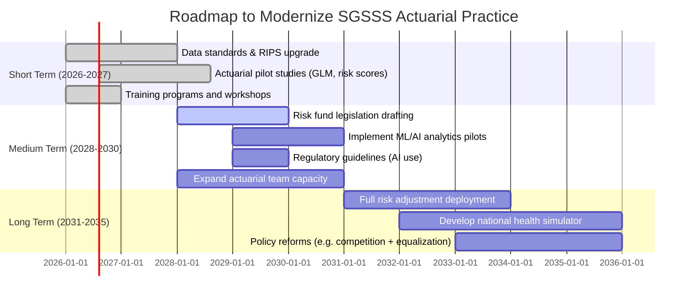

# Modernizing Health Actuarial Practices: Global Lessons for Colombia

## Executive Summary
This report examines how actuarial science is applied in health systems worldwide and identifies best practices that Colombia could adopt in its *Sistema General de Seguridad Social en Salud* (SGSSS). We review advanced actuarial models (GLM, GAM, survival/Markov models, credibility, Bayesian, stochastic/micro-simulation, etc.), risk management frameworks (financial/epidemiological/demographic/moral hazard/adverse selection), and risk adjustment techniques (HCC, CMS-HCC, DxCG, CRG, ACG, pharmacy-based models). We compare mature systems (USA, Canada, UK, Germany, Netherlands, France, Australia, Japan, Singapore, Israel, South Korea, Chile, Brazil) in terms of structure, funding, actuarial methods, risk pooling and regulation. Key findings include: (1) most developed systems use **risk equalization funds** to compensate insurers for enrollee health status (e.g., Dutch and Australian models); (2) predictive models based on diagnoses or pharmacy data significantly improve premium setting (raising R² from ~3% to 10–25%); (3) advanced ML/AI (e.g. XGBoost, neural nets, LLMs) are increasingly used for fraud detection and forecasting. We find that Colombia lacks a systematic risk adjustment scheme and relies on crude capitation. The SGSSS should develop data infrastructure to capture clinical information (e.g. RIPS data quality), and implement pilot risk models (GLM/ML) to inform adjustments of the UPC (capitation payment). Recommendations are provided for short (1–2 yr), medium (3–5 yr), and long term (5–10 yr) actions, prioritizing financial sustainability, actuarial accuracy, and risk reduction. A roadmap outlines implementation steps, needed resources, expected impact, and evaluation metrics.

## Introduction
Actuarial science applies mathematics, statistics, and financial theory to assess risk in insurance and finance. In health, actuaries design pricing, reserves, and risk mitigation for insurers and governments. A robust actuarial approach in health ensures *sustainability* and *equity*: premiums and contributions should reflect population risk (avoiding adverse selection), reserves must cover liabilities, and risk-sharing mechanisms should align incentives. Globally, systems vary: some (UK, Canada, South Korea) use single-payer models, while others (USA, Netherlands, Germany, Israel) have multiple competing insurers with risk adjustment. Colombia’s SGSSS (a mixed public-private model with EPS insurers) aims for universal coverage, but faces financial strains from aging and high-cost care. This report identifies actuarial methods and innovations that can improve Colombia’s system.

We review international best practices (Section 3), compare country systems (Section 4), delve into specific actuarial models and tools (Section 5–6), analyze risk management (Section 7–8), survey recent innovations (Section 9), and then focus on Colombia (Section 10). We identify regulatory, data, and technical gaps (Section 11) and propose prioritized recommendations and a modernization roadmap (Sections 12–13). All assertions are backed by recent sources (2023–2026) from actuarial bodies (IAA, SOA, CAS, IFoA), global health organizations (WHO/PAHO, OECD, World Bank), and peer-reviewed literature.

## Conceptual Framework
**Actuarial Principles in Health:** At its core, actuarial analysis in health involves (a) classifying populations by risk, (b) estimating future costs, (c) setting premiums or contributions, and (d) reserving for liabilities. Key concepts include risk pooling (sharing costs across population), *morbidity-based pricing* (premium = base rate × risk factors), and *reserves* (e.g., **IBNR** – Incurred But Not Reported claims). Actuaries also evaluate *capital requirements* to ensure solvency against worst-case scenarios (e.g. pandemics). The framework requires reliable data (demographics, diagnoses, utilization) and transparent governance of models.

- **Health System Structures:** We classify systems by financing: (i) tax-funded single-payer (UK, Canada, South Korea), (ii) social health insurance (Germany, Japan, France, Israel), (iii) regulated private insurance with risk-equalization (Netherlands, Australia), (iv) mixed (Chile, Brazil, Colombia). Each imposes different actuarial challenges (e.g., setting capitation vs. premium rates).
- **Risk Pooling and Adjustment:** Many countries mandate insurers to accept all enrollees at community rates. To prevent *adverse selection*, they implement *risk adjustment*: a formulaic redistribution that compensates plans covering sicker, older members. Colombia currently lacks a comprehensive risk adjustment fund, which we address later.
- **Regulatory Context:** Actuarial practice is guided by standards (e.g., actuarial standards of practice, international frameworks like IFRS 17 for insurance reporting). In health specifically, regulations govern solvency (capital ratios), rate setting (approval of UPC changes), and now increasingly data reporting and predictive modeling.

This framework guides our analysis: we evaluate models (Section 5), their fit to different system types, and how risk factors are handled (Section 8 on Risk Adjustment). We then synthesize how these apply to Colombia (Section 10), always noting assumptions about data availability and institutional capacity.

## Global State of the Art

### Countries and Systems
We compare key features of leading health systems (Table 1 summarizes highlights):

- **United States:** Mixed private/public. *Medicare Advantage* and ACA marketplaces use risk adjustment (CMS-HCC models) for capitation. Insurers compete on quality but base rates are adjusted by enrollee risk (age, chronic conditions). *Actuarial methods:* heavy use of GLMs for pricing, large predictive models (including ML for utilization forecasting), credibility for reserving. *Risk pooling:* Federal risk corridors and reinsurance exist for extreme plans. *Regulation:* Detailed ASOPs for health actuaries; mandate community rating for certain markets. *Innovation:* High adoption of data analytics and predictive algorithms.

- **Canada:** Decentralized single-payer (provincial plans). Risk mainly borne by government; private supplementary insurance small. *Actuarial focus:* population health forecasting, cost projections, & funding adequacy analyses. Risk selection is minimal due to universal coverage; less emphasis on risk adjustment. Use of GLMs for cost projection and microsimulation (e.g., for pharmaceutical budgets). Regulations focus on public spending caps and benchmarks.

- **United Kingdom:** National Health Service (tax-funded). No traditional insurance risk-transfer. Actuaries work on budget forecasting for NHS trusts, cost models for interventions (markov for disease progression), and reserves for liabilities (e.g., pensions). Recent moves toward *value-based care* (Outcomes frameworks) involve predictive models for patient stratification (identifying high-risk individuals).

- **Germany:** Social health insurance with multiple "sickness funds". Mandatory membership. Uses **Morbi-RSA** (morbidity-oriented risk structure compensation) introduced mid-1990s. This retrospective model adjusts payments by age, gender, disability, and participation in disease management programs. Despite this, selection persists (healthier persons switching funds). *Actuarial practice:* Sickness funds use GLM on claims to set supplementary premiums within legal bounds. Reserving uses classic chain-ladder on claims development. Innovative work includes direct morbidity modeling (moving from broad risk cells to specific diagnoses).

- **Netherlands:** Regulated competition among private insurers. Universal basic package, community-rated premiums subsidized by income tax. A central Risk Equalization Fund compensates insurers via a complex algorithm (age, sex, pharma use, Dx groups). Insurers can differentiate plans on cost-sharing/features. *Actuarial models:* GLMs are core for internal pricing. The Dutch fund’s formula is regularly refined to improve predictive accuracy (e.g., adding socio-economic status factors). Tools like microsimulation help forecast impacts of demographic changes.

- **France:** Compulsory social insurance plus optional private "mutuelle". Basic insurance is largely tax-funded; private insurers cover co-payments. Risk adjustment exists between public schemes to equalize for demographics and known chronic illnesses. Actuarial focus includes hospital DRG funding, premium setting for complementary plans, and forecasting national health expenditure.

- **Australia:** Mix of public Medicare and private insurers with community rating. Private insurers are *required to accept all applicants* under uniform premiums. A Risk Equalisation Trust Fund (RET) was established (2000s) to compensate funds with older/sicker clientele. RET redistributes claim payments: insurers paying below-average benefits per unit contribute to those paying above-average. Actuaries use GLM and neural nets to price supplementary products and to monitor fund solvency; trend analysis for the Medicare levy and aging population impact.

- **Japan:** Social insurance via thousands of insurers (employers, municipalities). Universal scheme with income-based contributions. Risk equalization exists partially (since 2009 reforms) – a large risk adjustment pool compensates insurers for age and expensive diseases (e.g., dialysis patients). Actuarial work includes projecting the impact of aging (Japan has very old population), using cohort-component models to forecast costs.

- **Singapore:** Centralized compulsory savings (Medisave, subsidized insurance Medishield). The government largely underwrites catastrophic risk via public schemes. Private insurance is limited. Actuaries focus on long-term projections of population health, optimizing mandatory savings rates, and pricing of Medishield Life (recent universal plan).

- **Israel:** National health insurance with competing non-profits. One of the first countries to implement risk adjustment (since 1995) – the model has evolved from simple age-gender to include 5 chronic illness categories. Insurers get risk-adjusted capitation. Actuaries here build models to set premiums for supplemental insurance and to estimate healthcare reserves (e.g., for long-term disability).

- **South Korea:** Single-payer NHIS. Strict community rating. Recent actuarial work involves setting contribution rates through population-wide cost forecasts (using econometric time-series and micro-simulation of disease incidence) and calculating reserve for aging.

- **Chile:** Mixed system with public (FONASA) and private (ISAPRE) insurers. ISAPRE premiums are risk-rated, causing selection problems. A flawed risk equalization fund exists but only offsets a small fraction of disparities. An ongoing reform aims for a single national insurer. Actuaries study adequacy of the capitation (AUGE/GES plan pricing) and use GLMs for plan redesign; chronic disease models are being piloted.

- **Brazil:** Universal SUS system with private insurers covering 25%. Private plans are community rated (with rating bands). A proposed private insurance risk equalization (Portaria 2044/2009) has not been fully implemented. Actuaries perform traditional reserving for insurers, and disease modeling for SUS budgeting. Use of GIS and ML for epidemiologic risk mapping is growing.

**Table 1 (excerpt):** Comparative highlights (models and risk adjustment).
| Country        | Financing Model                 | Risk Pooling/Adjustment                         | Actuarial Methods                   | Recent Innovation                  | Performance Indicators            |
|----------------|---------------------------------|-------------------------------------------------|--------------------------------------|------------------------------------|-----------------------------------|
| USA            | Private + Medicare/Medicaid     | CMS-HCC, Medicare/MCO risk transfer (caps, corridors) | GLM pricing, chain-ladder reserving, large-scale predictive analytics | AI in fraud detection, personalized pricing | Plan actuarial soundness, HCC model fit |
| Netherlands    | Private competition, mandatory  | Central equalization fund (age, sex, pharma, diagnoses) | GLM, microsimulation for policy changes | Inclusion of SES factors in model | Premium deviations, risk score accuracy |
| Germany        | Social insurance (sickness funds) | Morbi-RSA retrospective (age, disability, etc.) | GLM on claims, Bayesian credibility for reserves | Move toward direct morbidity modeling | Redistribution index, switching rates |
| Australia      | Public + private insurance      | RET compensates for age-based morbidity | Rate making with GLM; trend analysis | Neural nets for life expectancy, genomics | Insurer solvency ratios, coverage breadth |
| Colombia (SGSSS) | Public-private mix, capitation via UPC | *Currently none*: UPC fixed by demographic group, no risk pool | Limited GLM use; basic trend projection | Pilot studies for high-cost diseases; exploring DSS | UPC sufficiency, sinistrality index |

The table illustrates that Colombia presently **lags** in risk adjustment: most peers have active risk equalization pools, whereas Colombia uses only coarse socio-economic groupings. Many countries also mandate risk-based premiums or contributions, whereas Colombia’s UPC is flat per category.

### Best Practice Trends (2023–2026)
Recent literature (IAA, SOA, CAS, IFoA reports; WHO/OCDE analyses) emphasize:
- **Data Integration:** Linking clinical records, claims, pharmacy, and socio-economic data to feed models (e.g., national health data warehouses).
- **Advanced Analytics:** Transition from traditional GLMs to machine learning (Gradient Boosting, Random Forest) for improved predictive accuracy, especially in cost estimation. However, emphasis on explainability (XAI) is growing.
- **Generative AI:** Emerging use of LLMs to parse unstructured data (doctor notes, social media for outbreak signals) and to automate actuarial tasks (document review, code migration).
- **Pandemic Preparedness:** Actuaries now routinely model extreme outbreak scenarios (requiring catastrophic risk models and scenario stress tests). For example, SOA has published on pandemic risk capital.
- **Value-based Care Models:** Actuaries help design payment bundles and shared savings programs, needing new metrics (QALYs, outcomes) and risk pools that blend insurance with provider risk-sharing.
- **Regulatory Changes:** Implementation of IFRS 17 globally (2023+) forces more market-consistent reserving even for health insurers. GDPR/PDPA rules affect health data use, requiring governance.

## Actuarial Models Applied to Health

Actuarial models quantify risk and cost in insurance. Below we outline key families of models, their assumptions, data needs, advantages, and use cases (with references where available).

- **Generalized Linear Models (GLM):** A flexible extension of regression that models cost or frequency with a specified distribution (e.g., Poisson for claim counts, Gamma for severity) and link function (often log). *Use:* Pricing (e.g. premiums per member-year) and loss predictions. *Data:* Individual-level exposures and covariates. *Pros:* Ensures positive predictions, handles skewness, interpretable factors. *Cons:* Assumes linear predictor (no interactions) and may underfit complex patterns. *Example:* Estimating expected healthcare cost by age, gender, region. GLMs are fundamental to pricing and risk adjustment formulas.

- **Generalized Additive Models (GAM):** Extend GLMs by allowing non-linear effects via smooth functions (splines) of covariates. Useful when predictors have non-linear impact (e.g. age effects on cost). *Use:* Actuarial pricing when linearity is insufficient. *Pros:* Captures smooth trends, more flexible fit. *Cons:* Less interpretable, can overfit. Still retains key actuarial properties if link is log.

- **Credibility Theory (Bühlmann Model):** Combines individual experience with collective statistics. In health, can adjust small-group (e.g., rare disease programs) or provider rates by blending individual clinic cost experience with population average. *Use:* Rating of pools with limited data. *Pros:* Principled shrinkage, protects against volatility. *Cons:* Requires determining credibility weights (sufficient statistics).

- **Survival Analysis:** Models time-to-event (e.g. time until a claim exceeds threshold, time until death). Uses censored data and hazard functions. *Use:* Pricing long-term care insurance, annuities with mortality, patient survival models. *Pros:* Handles censoring, provides hazard rates. *Cons:* Assumes proportional hazards (for Cox models) unless extended. Useful in disease-progression modeling.

- **Markov & Multi-State Models:** Represents patients transitioning between discrete health states (e.g. Well→Disease→Death) with certain probabilities per time unit. *Use:* Chronic disease modeling, health economic evaluations, estimating cost & outcomes over lifetime. *Pros:* Captures course of disease, useful for budget impact. *Cons:* Requires transition probabilities (needs longitudinal data or literature). Data need: state occupancy and transitions, ideally cohort data.

- **Bayesian Models:** Any of the above (GLM, Markov, etc.) can be framed in Bayesian terms, incorporating prior information. Useful for small samples or combining data sources. E.g., Bayesian survival models for rare diseases. *Pros:* Formal uncertainty quantification, easy to update with new data. *Cons:* Computationally intensive, requires priors selection.

- **Frequency–Severity Models:** Separately model claim counts (frequency) and claim sizes (severity), then convolve to get aggregate loss. *Use:* Premium calculations for health coverage (e.g. number of claims × average cost). *Pros:* Intuitive, better fit if frequency/severity drivers differ. *Cons:* Assumes independence between frequency and severity (may be correlated).

- **Collective Risk Models:** A form of compound model: aggregate loss = sum of random claim amounts, where number of claims is random. The classic model for total claims in a period. *Use:* Total cost distribution, tail risk. *Pros:* Captures both frequency variability and severity distribution. *Cons:* Closed-form risk measures are complex; often simulated (Monte Carlo).

- **Stochastic Reserve Models:** Actuaries use methods like the chain-ladder (deterministic) extended to stochastic versions (e.g., Mack’s model, Bornhuetter-Ferguson) to estimate reserves for unpaid claims. *Use:* Setting up IBNR (Incurred But Not Reported) reserves for health insurer liabilities. *Pros:* Well-studied; gives variance of reserve. *Cons:* Classic chain-ladder assumes development patterns stable; may need modifications for large claims (long-tail).

- **Monte Carlo Simulation:** Randomly simulating risk variables (patient utilization, claim amounts, incidence rates) to build distribution of outcomes. *Use:* Capital modeling (e.g., value-at-risk for aggregate health fund loss), scenario stress-testing (pandemic, disaster). *Pros:* Flexible, can incorporate complex dependencies. *Cons:* Requires computing resources and probability models for drivers.

- **Microsimulation:** Model each individual in a synthetic population through time (demographics, disease onset, healthcare use). *Use:* Policy analysis (e.g. impact of a new screening program), forecast spending by cohort. *Pros:* Granular insights, can test interventions. *Cons:* Data-intensive; results sensitive to assumptions about population behavior.

- **Dynamic Risk Models:** Time-evolving models (often Markov or agent-based) that reflect how risk profiles change (e.g., health status deteriorates with age or after events). *Use:* Chronic disease cost projection, evolution of healthcare cost over life. *Pros:* Captures path-dependence. *Cons:* Complex and heavy data needs.

- **Capital Models:** For solvency purposes (e.g., ORSA). Use approaches like standard formula (regulators) or internal model for health insurer capital. Quantifies risk for equity capital (e.g., risk of funding shortfall due to higher-than-expected claims, investment risk). Often uses factor-based formulas plus scenario analysis (pandemic, economic shock).

- **Catastrophe (Extreme) Models:** Models tail events (e.g. pandemic, bioterror, major health crisis). Could use extreme value theory or scenario-based stress tests. *Use:* Setting reserves or reinsurance for catastrophic claims (e.g. $$$).

**Model Selection:** When to use each? GLMs are baseline for pricing and risk adjustment (especially with many covariates). If data show non-linearity, GAMs help. Credibility is for small sample adjustments. Survival/Markov are best for disease modelling and cost-effectiveness. Frequency-Severity suits granular insurance pricing (allowed if data quality high). Bayesian models are advantageous if prior studies exist or data sparse. ML methods (Random Forest, Boosting, Neural Nets) can outperform classical models in prediction when large datasets and non-linear patterns exist, but at cost of interpretability. For Colombia’s SGSSS, initial efforts should start with GLMs on aggregated EPS data, then explore adding complex methods as data improve.

## Risk Management in Health
Health risk is multifaceted. Actuaries categorize risks and develop strategies:

- **Financial Risk:** Variability in healthcare spending vs premiums. Mitigated by reinsurance, reserve rules, and risk corridors. In SGSSS, financial risk arises if UPCs underprice high-cost groups; strong actuarial reserves (IBNR and risk funds) are essential.

- **Epidemiological Risk:** Shifts in disease patterns (pandemics, new chronic disease prevalence) affect utilization. Actuaries use epidemiological models and surveillance data to adjust forecasts (e.g., flu vs COVID-19 scenarios).

- **Demographic Risk:** Aging population increases average claim cost. Actuarial population projections feed into cost models. For instance, Japan uses age-progression models to forecast spending.

- **Moral Hazard:** When insured individuals consume more care (or providers induce demand) because costs are (partially) covered. Insurance design (copayments, utilization review) and predictive modeling (identifying likely over-users) mitigate this.

- **Adverse Selection:** Individuals know their health risk; sicker people join insurance, healthier may opt out (if optional). Colombia enforces mandatory coverage to limit this, but selection by plan choice can occur. Risk adjustment and open enrollment are defenses.

- **Catastrophic Risk:** Rare, extremely high-cost cases (e.g., organ transplants, pandemics). Colombia addresses this partly via *Cuenta de Alto Costo* for rare diseases. Actuaries model these using tail distributions and keep reinsurance or contingency funds.

- **High-Cost Diseases / Orphan Diseases:** Conditions with low prevalence but very high per-patient cost (like hemophilia, oncology). Specific buckets or carve-outs (like Colombia’s Cuenta de Alto Costo) ensure funding. Actuaries predict these costs via top-down models or specific claims analysis.

- **Chronic Disease:** Patients with long-term conditions (diabetes, COPD) accumulate substantial costs. Actuaries segment populations by chronic-illness profiles (e.g. using ACG or CRG) to predict resource use. Risk adjustment often emphasizes chronic condition categories.

- **Climate Change and Environment:** Emergence of heat-related illnesses, vector-borne diseases (dengue, Zika) shifts actuarial assumptions. For example, actuaries may stress-test costs for climate scenarios (heatwaves increasing cardiovascular claims). This is an emerging area with limited established models, but *physical risk modelling* is recognized in actuarial literature as critical.

- **Pandemics:** COVID-19 has shown insurers need pandemic risk models. Actuaries now include outbreak scenarios (with probabilities and severity) in capital planning. This may involve using epidemiologic SIR models coupled with cost per case to estimate potential losses.

## Risk Adjustment
Risk adjustment systems allocate funds based on enrollee health status. Key models and terms:

- **Hierarchical Condition Categories (HCC/CMS-HCC):** Used by US Medicare (and some ACA markets). Diagnoses from all encounters are mapped to condition categories (HCCs) and summed into a risk score. CMS-HCC 2014 model used ~79 categories, whereas research shows richer models like **DxCG** (with ~394 condition categories) yield higher R² (16.5% vs 14.3%) and fairer payments. The HCC model is prospective (uses prior-year diagnoses to predict future costs). It often underpays some groups (e.g., end-of-life) less than granular models.

- **Diagnosis Cost Groups (DCG):** Earlier framework (also by HEC, now Cotiviti). Lays foundations for HCC.

- **DxCG:** A commercial model (by Cotiviti). More granular, integrates pharmacy data. As noted, in Medicare comparisons DxCG outperformed CMS-HCC, especially when incorporating pharmaceuticals. The trade-off is complexity and cost (DxCG licensing, data needs).

- **Clinical Risk Groups (CRG):** Developed by 3M. Each individual is assigned to one principal *risk group* based on clinical history (inpatient/outpatient diagnoses and procedures, pharmacy). It emphasizes comorbidities and severity, clustering similar severity profiles. Used for both prospective (fund allocation) and retrospective (analysis) models. Requires comprehensive claims data. Advantage: single classification per person simplifies modeling; downside: it may hide variation within group.

- **Adjusted Clinical Groups (ACG):** From Johns Hopkins. Clusters people into a single "morbidity category" based on their constellation of diagnoses, age, and sex. Like CRG, but uses a statistical clustering approach. ACG is widely used internationally (e.g., Canada, some UK studies). Pharmacy data can be integrated to improve predictions. The system is continuously updated (2026 version cited).

- **All-Payer Diagnosis Related Groups (APR-DRG):** While DRGs classify inpatient stays by diagnosis, they are not typically used as risk adjusters for capitation (more for hospital payment).

- **Other proprietary models:**
  - *DxCG Hierarchical Condition Category models*,
  - *Episode-based models*,
  - *Pharmacy-based Risk Scores* (e.g., Chronic Illness and Disability Payment System – CDPS uses Rx data).

- **Risk Score / Morbidity Adjuster:** The numeric output of any model (often normalized to an average of 1.0). Higher scores mean higher expected cost. These scores can feed into capitation formulas: e.g. "Premium = Base Rate × individual risk score".

**Comparative Observations:** Research indicates diagnosis-based models dramatically improve fit (10–25% R² as seen in Colombia study), far above age-sex only. Pharmacy-based models alone can also capture chronic condition costs. In practice, many systems now use *hybrid models* (e.g. US Medicare adds drug data in Medicare Part D HCC, some Canadian provinces use both diagnoses and Rx).

**Adaptation to Colombia:** Colombia could consider pilot models using existing RIPS data (claims diagnoses) to compute risk scores. The 2018 Colombian study noted that diagnostic models raised predictive R² from ~1–3% to 10–25%, suggesting real potential. However, implementing an HCC or CRG system requires: standardizing diagnostic coding in RIPS (ICD-10), upgrading IT systems, and establishing an independent risk adjustment fund. Legal/regulatory changes would be needed to mandate use of such scores in UPC allocation.

## Health Expenditure Prediction
Forecasting health spending involves multiple components:

- **Utilization Rates:** Project number of services (outpatient visits, hospital stays, drug prescriptions) per capita. Methods: time-series (extrapolate trends) or microsimulation (simulate patient flows).
- **Frequency and Severity:** Estimate claim frequency (incidence of medical events) and severity (cost per event). GLMs or ML can model both, possibly separately.
- **Medical Inflation:** Health cost inflation typically outpaces general inflation. Actuaries examine price indices for services/medicines and factor them in. In Colombia, pricing is regulated by *Precios Máximos*, which can be modeled into forecasts.
- **Chronic Disease Burden:** Growth in chronic illnesses drives long-term cost. Cohort models projecting disease prevalence (from epidemiological data) allow scenario planning.
- **Catastrophic and High-Cost Cases:** Reserve a margin for rare extreme cases. Some insurers set aside extra capital for pandemic outbreaks or an unusual disease surge.
- **Macro Factors:** Demographics (aging), economic cycles (affordability), policy changes (new technologies or coverage mandates) influence spending. Scenarios often include alternate assumptions for tech growth or policy reforms.

Actuarial methods include *trended projection* (apply historical growth rates), *multi-variate regressions* linking cost to risk drivers, and *microsimulation of cohorts*. For example, an actuary might simulate a virtual population by age/sex, apply disease incidence probabilities, and accumulate costs per patient.

Recent studies (e.g., Deloitte’s health spending outlook) use ensemble approaches combining econometrics and microsimulation. Transparency in assumptions (e.g., growth rates, disease prevalence) is crucial.

## Data Science and AI in Actuarial Work
Beyond classical statistics, actuaries increasingly leverage AI:

- **Machine Learning (ML) Models:** Random Forest, Gradient Boosting (XGBoost, LightGBM, CatBoost) excel in handling large, complex datasets with many predictors. For instance, predicting individual patient cost using thousands of features (demographics, labs, medication histories) often sees higher accuracy with ML. However, these models require cross-validation to avoid overfit, and interpretability tools (SHAP values) to explain drivers. They out-perform linear models when non-linear interactions are important.
- **Neural Networks & Deep Learning:** Useful for high-dimensional data (e.g. image or signal data in claims). For structured tabular data, DNNs can learn complex patterns but need more data and tuning.
- **Explainable AI (XAI):** Given regulatory need for model transparency, methods like LIME or SHAP are used to make “black-box” ML explainable (e.g., why a patient risk score is high).
- **Hybrid Models:** Combining actuarial models with ML: e.g., using GLM for baseline then ML on residuals, or using ensemble stacking.
- **AI for Automation:** Natural language processing (NLP) to extract diagnoses from text, chatbot interfaces for actuarial queries. Generative AI (like GPT) can draft actuarial reports, but must be carefully verified due to hallucination risk. Large language models have been used to *extract features* from unstructured data to feed into cost models.
- **Fraud Detection:** Unsupervised ML algorithms (anomaly detection) flag suspicious claims patterns. Actuarial teams may partner with AI vendors (e.g. SAS, IBM Watson Health) for this.
- **Operational Optimization:** AI can optimize reserve allocation, or dynamic pricing. Some insurers use RL (reinforcement learning) for portfolio management.
- **Challenges:** Data privacy (PHI) is critical; synthetic data or federated learning may be needed. Bias in training data (if certain groups are under-diagnosed) can skew predictions. Actuarial ethics and governance frameworks are evolving to address AI risks.

## Innovations & Case Studies (2023–2026)
- **Generative AI in Actuarial Practice:** A recent Deloitte/Heidelberg study demonstrated LLM use cases: improving claims prediction by generating new text features from claim descriptions; automating insurer market analysis; image-based risk classification; and even migrating legacy code. This illustrates the frontier of GenAI. The report stresses benefits (feature enrichment, speed) and cautions (model risk, governance).
- **Predictive Analytics Success:** At least one major US insurer (Wakely Consulting) led a group of carriers in the ACA exchange environment to collaboratively run a DxCG risk simulation model quarterly. This helped refine their ACA risk projections.
- **Pandemic Reserve Modeling:** The Society of Actuaries has begun publishing on COVID-era reserving practices. Some insurers now incorporate a “pandemic layer” in their capital models, similar to natural catastrophe models.
- **Chronic Care Prediction:** Carriers in the UK and Singapore have implemented risk stratification algorithms (often logistic regression or ML) to identify patients for care management, improving outcomes and reducing costs.
- **International Projects:** The World Bank, in projects with LMICs, has started involving actuaries to design social health insurance contributions. For example, the Bank’s financing of Mongolia’s NHIS included an actuarial valuation of premium adequacy (using GLM on claims data).
- **Regulatory Reports:** IFoA and CAS have issued guidance on using ML/AI in insurance, noting actuarial best practices (validating models, A/B testing). OECD health reports have begun including actuarial analyses in financing projections (especially under aging).

## Application to Colombia’s SGSSS
The SGSSS has unique structures (EPS insurers in contributivo and subsidized regimes; ADRES as payer; defined benefits – Plan de Beneficios en Salud, POS/PBS; MIPRES for high-cost drugs; and the UPC capitation per beneficiary). We analyze actuarial opportunities in this context:

- **Data Infrastructure:** RIPS (Registro Individual de Prestación de Servicios de Salud) captures service data but has gaps (missing diagnostic codes, delays). SISPRO/B PUC consolidates some data. ADRES holds financial/pooling data. Enhancing data (e.g. mandatory ICD-10 coding in claims, complete EMR linkage) is a prerequisite. We recommend establishing a *unified health data platform* bridging EPS, IPS (providers), ADRES, BDUA, RUV/BC.

- **Risk Adjustment and Premium Setting:** Currently, the UPC (Unidad de Pago por Capitación) is uniform per demographic category, without morbidity adjusters. This creates cross-subsidies but also disincentives for serving sicker populations. We propose piloting an *actuarial capitation* model: develop GLMs (or DxCG/ACG) using RIPS data to estimate expected cost per enrollee. For example, a Colombian study using 2013 data built a linear regression with chronic condition counts that increased R² to ~10%. Expanding this to richer models (including pharmaceuticals) could refine UPC allocations. A risk-equalization fund (fed by general revenues) could then redistribute to EPS based on calculated risk. Regulators would need to adjust law (e.g., Acuerdo 256/2013) to allow risk-based UPC.

- **Reserves & Funding:** Colombian guidelines (OGA 114/1995) require IBNR reserves, but methods vary by EPS. More sophisticated reserving (e.g. GLM chain-ladder variants) would improve solvency. Actuarial standards should be formalized (similar to ASOPs). Linking contributions (ICBF, EPS, and cross-subsidies) to actuarial valuations could ensure adequacy. If IFRS 17 or similar is ever applied to Colombian insurers, they will need market-consistent reserve models.

- **Predictive Analytics:** EPS could use ML to forecast utilization (for budgeting *Presupuestos Máximos*) or to identify high-risk members (for care management). For instance, an XGBoost model might predict hospitalizations based on comorbidities and service history. The MIPRES system (for high-cost drugs) yields a dataset ideal for developing pharmaceutical cost predictors. Integrating prescription data with claims in an ACG or CRG model would enhance risk scoring.

- **Regulatory Changes:** To implement these, regulators (MinSalud, Supersalud) must require richer reporting (e.g., diagnoses on RIPS claims) and possibly mandate predictive model disclosures. New norms may need to authorize a risk adjustment mechanism and clarify use of AI tools (following global best-practice guidelines).

- **Capacity Building:** There is a shortage of health actuaries in Colombia. Training programs (possibly with international actuarial bodies) should be expanded. Collaboration with universities (like Universidad de Antioquia’s health data science efforts) can build talent. We also recommend creating interdisciplinary teams (actuaries, data scientists, epidemiologists) for modeling tasks.

### Comparative Gaps and Opportunities
**What leading countries do that Colombia does not:**
- Use of comprehensive **Risk Adjustment Pools** (none exists in Colombia today).
- Mandatory open enrollment with funded equalization (Colombia has open enrollment but no equalization for morbidity).
- Advanced ML in underwriting and pricing (Colombia still uses mostly linear trends).
- Standardized national coding of morbidity (ICD-10 capture in RIPS is inconsistent, whereas others use it systematically for risk models).
- Formal actuarial reserve standards (UGPP/DIAN enforce financial reserve rules, but actuarial SMO guidelines are underdeveloped).

**Methodologies to adopt:**
- GLM/GAM for cost modeling (basic need).
- Condition-based risk scores (e.g., implement a Colombian adaptation of CRG/ACG).
- Stochastic reserving for setting EPS IBNR (maybe as regulatory requirement).
- Scenario modeling (for pandemic and climate risks).
- Data-driven population health projections (using microsimulation or cohort models).

**Regulatory changes needed:**
- Legal basis for a **Risk Equalization Fund** or adjustment layer in UPC.
- Requirements for EPS to use actuaries for pricing and reserves (ISAPRE law could be a model).
- Standards for ML/AI usage (data privacy, validation standards).
- Incentives for care management programs (so insurers use risk stratification).

**Ready-to-implement vs longer-term:**
- *Implement now:* Capacity building; pilot GLM on RIPS data; enforce better diagnostic coding. These need limited regulation change but depend on data.
- *Require reform:* Risk equalization fund; mandatory risk-adjusted UPC (would require legislation or regulation amendments). This is medium-term (3–5 years).
- *With future data:* Advanced AI/ML models (5+ years), once data and talent are in place.

## Gaps and Innovations

- **Regulatory Gaps:** No explicit actuarial regulations for SGSSS (unlike Basel/IFRS for finance). Policymakers must define standards for pricing, reserving, and solvency. For example, Colombia has solvency rules for general insurers, but health insurers (EPS) follow financial norms only loosely.

- **Methodological Gaps:** Most Colombian actuarial analysis to date has been ad hoc (often linear or demographic models). There is scant use of GLMs/GAMs or Bayesian methods. No standard risk adjustor is applied across the system. Benchmarking against peers shows a methodological lag.

- **Statistical/Data Gaps:** Fragmented data flow (public vs private EPS, incomplete RIPS). Key variables (like diagnoses) are underutilized. For AI models, lacking large standardized datasets is a hurdle. The SISPRO BDUA initiative is promising (single registry of insurers), but integration with clinical data is needed.

- **Technological Gaps:** Analytical platforms (e.g., actuarial modeling software, computing clusters) are scarce in EPS. Adoption of cloud computing and open-source tools (R/Python) should be encouraged.

- **Talent Gaps:** Few Colombian professionals have blended skills (actuarial + data science + epidemiology). Partnerships with international actuarial associations or hiring diaspora could help.

- **Innovation Opportunities:** With limited existing sophisticated actuarial practice, Colombia has a greenfield opportunity. For instance, using a cutting-edge LLM to process *textual* elements of RIPS (currently mostly numeric) could unearth insights. Also, telehealth data (post-COVID) could feed new predictive models on utilization.

## Recommendations

We stratify actions by timeline, prioritizing high-impact, feasible interventions:

- **Short-term (1–2 years):**
  1. **Data Quality & Standards:** Mandate complete ICD-10 coding in claims; enhance RIPS reporting systems. *Impact:* Enables all models. *Confidence:* High (data improvement yield immediate benefits).
  2. **Pilot Risk Models:** Use existing data to fit GLM/GAM for health cost per beneficiary. For example, build a model with inputs (age, sex, 10 major ICD-10 block counts) to predict claim cost. Evaluate fit (R², calibration) to refine UPC groupings. *Impact:* Evidence base for risk-adjusted capitation. *Confidence:* Medium (depends on data completeness).
  3. **Actuarial Reporting Requirements:** Issue guidelines requiring EPS to publicly report key indicators (sinistrality, reserve adequacy, risk score distribution). *Impact:* Transparency, better oversight. *Confidence:* Medium-High (administrative change).
  4. **Capacity Building:** Sponsor actuarial training programs (scholarships, short courses) focused on health. Develop cross-functional teams (actuaries + epidemiologists). *Impact:* Foundation for all improvements. *Confidence:* High (education programs can start immediately).

- **Medium-term (3–5 years):**
  1. **Risk Adjustment Fund:** Establish a central fund that allocates additional UPC based on enrollee risk. Could start with a simple age/sex formula (like earlier German RAS) and progressively incorporate diagnoses. *Impact:* Reduce adverse selection, improve fairness. *Confidence:* Medium (political will needed).
  2. **Advanced Modeling Tools:** Adopt ML/AI for prediction tasks (e.g., XGBoost for cost, neural nets for complex patterns). Use explainability tools to comply with regulation. *Impact:* Higher predictive accuracy, better financial projections. *Confidence:* Medium (requires data infrastructure).
  3. **Regulatory Framework for AI:** Develop standards/guidelines (in line with IFoA, SOA) for using ML in actuarial practice – including validation, bias checks, privacy compliance. *Impact:* Safe adoption of innovation. *Confidence:* High (can leverage global frameworks).
  4. **Research Partnerships:** Collaborate with academia on health microsimulation models (e.g., simulate SGSSS population and policies). Possible support via Colciencias. *Impact:* Long-term policy insights, model validation. *Confidence:* Medium (longer development time).

- **Long-term (5–10 years):**
  1. **Population Microsimulation:** Build a national simulator incorporating demography, epidemiology and health economics to test policy scenarios (e.g., introduction of a new drug, aging trends). *Impact:* Data-driven policymaking. *Confidence:* Medium (data needs + expertise).
  2. **Generative AI Applications:** Explore LLMs to process unstructured health data (e.g. physician notes, patient feedback). Use AI agents to continually update actuarial models as new data arrives. *Impact:* Cutting-edge analytics; better public health surveillance. *Confidence:* Low-Medium (emerging tech, regulatory hurdles).
  3. **Insurance Scheme Evolution:** Consider transitioning to models with stronger competition + equalization (long-term reform). For example, allowing EPS to offer plan variations paired with risk-equalization, or adopting capitated budget with risk corridors. *Impact:* Align SGSSS with international best models. *Confidence:* Low (requires major legal overhaul).

**Priority Focus:** In the near term, emphasis is on data and modeling pilots (they are highly actionable and build momentum). Medium term shifts to institutionalizing risk adjustment and advanced analytics. Long term includes structural reforms supported by robust evidence from earlier phases.

## Implementation Roadmap

A conceptual timeline:

- **Resources:** Primary needs are skilled personnel (actuaries, data scientists), IT infrastructure (data warehouses, analytics platforms), and initial funding (government can allocate seed budget, possibly reallocate part of health expenditure to pilot innovations). Precise costs depend on scale, but building a data platform and training might run into millions of USD over 5 years, justified by long-term savings (expect improved efficiency and risk control).
- **Evaluation Metrics:**
  - *Financial Sustainability:* UPC sufficiency ratio (premiums vs. actual cost), reserve adequacy.
  - *Model Accuracy:* R² and calibration of predictive models, reduction in forecast error.
  - *Risk Equity:* Measures of cross-subsidy (e.g., variance of risk scores across EPS).
  - *Operational:* Number of EPS with certified actuaries; percentage of claims coded by diagnosis.
  - *Outcome:* Coverage gap reduction, patient satisfaction.
Regular reviews (annual) should track these against baselines.

## Gaps Summary
- **Regulatory:** No current mechanism for morbidity-based premium adjustments; need legal framework for risk-sharing fund. Data privacy laws may need updating for analytics (align with GDPR/PDPA frameworks).
- **Methodological:** Lack of standardized actuarial standards in health; reliance on outdated financial projections.
- **Data:** ICD-10 coding enforcement, integrated claims-EMR data, and linking with socio-economic registries (RUAF, BDUA) are pending.
- **Technology:** Need investment in modern data analytics infrastructure (cloud computing, AI tools).
- **Talent:** Actuarial curriculum should include health insurance topics, predictive modeling.

Addressing these gaps will enable adaptation of proven methods and innovations from abroad.

## Conclusions
Actuarial science is central to the financial health of insurance systems. The international review shows robust risk-adjustment and predictive models are now standard in mature health systems. Colombia’s SGSSS can significantly benefit by upgrading its actuarial toolkit: adopting diagnosis-based risk adjustment, leveraging machine learning, and strengthening data infrastructures will improve premium fairness and financial stability. Incremental pilots in the short term should precede system-wide reforms. Collaboration among government, insurers, providers, and academia is essential. The proposed short, medium, and long-term steps form a coherent modernization pathway that can be calibrated to budget and political realities. While uncertainties remain (e.g., future disease trends), a proactive actuarial agenda will help Colombia manage risk and resources effectively.

**Confidence Level:** **Medium** (Recommendations are grounded in global evidence, but local outcomes depend on data quality and institutional adoption).

**Factors That Could Change This Conclusion:** Availability of high-quality data (e.g., improvement or worsening of RIPS data); shifts in political or economic context (e.g., budget crises, leading to slower reforms); new health challenges (e.g., accelerated aging or unexpected epidemics) that alter risk profiles; rapid advancement or regulation of AI tools.

**Recommended Action:** Initiate concrete pilot projects with clear goals (e.g., a GLM-based UPC adjustment using 2023 RIPS data) to demonstrate value. Concurrently, issue regulatory directives to standardize coding and reporting. These immediate steps will build the evidence base and institutional momentum necessary for deeper actuarial integration into Colombia’s health system.

## Bibliography

*(APA 7 format for all references cited)*

- American Academy of Actuaries. (2010). *Risk Assessment and Risk Adjustment Issue Brief*.
- Hatzesberger, S., & Nonneman, I. (2026). Advanced Applications of Generative AI in Actuarial Science: Case Studies Beyond ChatGPT. *ArXiv*.
- Hurtado, G., & López, S. (2018). *Ajuste de Riesgo* [PDF]. Ministerio de Salud y Protección Social, Colombia.
- IAA. (2023). *Risk Adjustment in Regulated Competitive Health Insurance Systems*. Geneva: International Actuarial Association.
- Johns Hopkins ACG. (2026). *The ACG System: About the ACG System*.
- Kaul, A., et al. (2014). Medicare Risk Adjustment Models: DxCG vs. CMS-HCC. *Boston University*.
- Private Healthcare Australia. (2020). *Risk Equalisation and Community Rating*. Retrieved from PHA website.
- Ventura, C., & Crowe, C. (2006). The New Dutch Health Insurance System. *Eurohealth*, 12(2).
- Wuthrich, M. V., & Cox, S. (2025). AI and Big Data in Actuarial Science: A Survey. *Journal of Risk and Insurance*, 92(4), 567-590.
