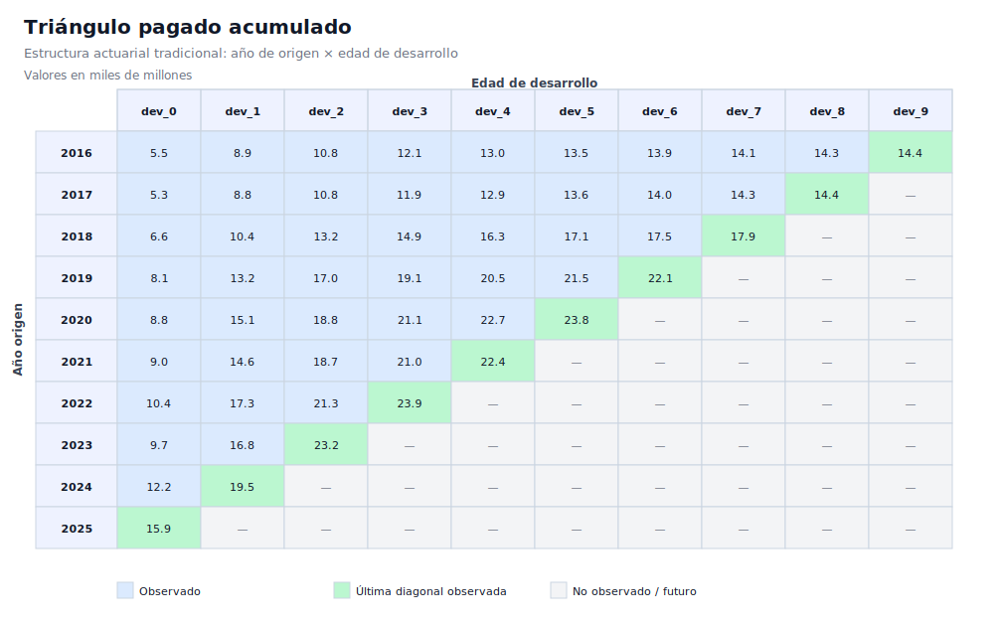
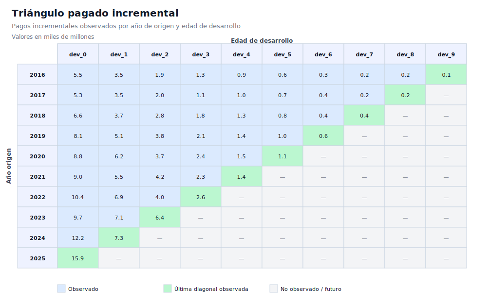

# Demo práctico de triángulos simulados de reclamaciones de salud

Este demo convierte la teoría de triángulos de desarrollo en un ejercicio reproducible. El objetivo es que el repositorio no sea solo un handbook conceptual, sino también una base práctica para ejecutar modelos, validar supuestos y demostrar resultados.

La salida principal está en español y está pensada para el contexto colombiano. El mismo script también puede generar la versión equivalente en inglés.

## Qué genera el demo

El script genera:

- datos observados en formato largo por año de origen y edad de desarrollo;
- triángulo pagado incremental;
- triángulo pagado acumulado;
- factores edad-a-edad ponderados por volumen;
- estimación de ultimate e IBNR por año de origen;
- resumen agregado de ejecución;
- visualización SVG del triángulo actuarial tradicional.

Los datos son sintéticos. No representan experiencia real de una EPS, aseguradora, IPS, administrador de beneficios ni portafolio específico.

## Ejecución recomendada

Desde la raíz del repositorio:

```bash
python scripts/generate_demo_triangles.py
python scripts/generate_demo_triangle_visuals.py
```

Por defecto se generan dos salidas:

```text
data/demo_triangulos/   # versión en español
data/demo_triangles/    # versión en inglés
```

Para generar solo español:

```bash
python scripts/generate_demo_triangles.py --language es
```

Para generar solo inglés:

```bash
python scripts/generate_demo_triangles.py --language en
```

## Archivos en español

```text
data/demo_triangulos/reclamaciones_pagadas_largo.csv
data/demo_triangulos/triangulo_pagado_incremental.csv
data/demo_triangulos/triangulo_pagado_acumulado.csv
data/demo_triangulos/factores_edad_a_edad.csv
data/demo_triangulos/resultados_chain_ladder.csv
data/demo_triangulos/resumen_ejecucion.txt
data/demo_triangulos/triangulo_pagado_acumulado_formato_actuarial.md
data/demo_triangulos/triangulo_pagado_incremental_formato_actuarial.md
docs/assets/demo_triangulos/triangulo_pagado_acumulado.svg
docs/assets/demo_triangulos/triangulo_pagado_incremental.svg
```

## Visualización tradicional del triángulo

En reserving actuarial, el formato más reconocible es el triángulo con años de origen en filas y edades de desarrollo en columnas. Las celdas observadas forman una diagonal: los años antiguos tienen más edades observadas y los años recientes tienen menos madurez.

El demo genera esta vista para el triángulo pagado acumulado:



También genera la versión incremental:



La lectura práctica es directa:

- las celdas azules son observaciones históricas disponibles;
- la diagonal verde marca la última observación disponible para cada año de origen;
- las celdas grises representan periodos futuros no observados;
- el IBNR surge precisamente porque la zona gris debe estimarse con patrones de desarrollo.

## Lógica actuarial implementada

El demo sigue este flujo:

1. Simula años de origen.
2. Asigna exposición en meses-miembro.
3. Simula frecuencia, severidad, tendencia médica y mezcla de morbilidad.
4. Aplica un patrón acumulado de emergencia de pagos.
5. Genera pagos observados hasta el año de valuación.
6. Construye triángulos incremental y acumulado.
7. Calcula factores edad-a-edad ponderados por volumen.
8. Proyecta ultimate con Chain Ladder.
9. Calcula IBNR como diferencia entre ultimate y pagado acumulado observado.

## Fórmulas base

Para un año de origen $i$ y edad de desarrollo $j$, el factor edad-a-edad seleccionado se calcula como:

$$
f_j =
\frac{\sum_i C_{i,j+1}}{\sum_i C_{i,j}}
$$

donde:

- $C_{i,j}$ es el pago acumulado para el año de origen $i$ a edad de desarrollo $j$;
- la suma usa únicamente años de origen con observación disponible en $j$ y $j+1$.

El factor acumulado hacia ultimate para un año con última edad observada $k$ es:

$$
CDF_k = \prod_{j=k}^{J-1} f_j
$$

La estimación de ultimate y de IBNR se calcula como:

$$
Ultimate_i = C_{i,k} \cdot CDF_k
$$

$$
IBNR_i = Ultimate_i - C_{i,k}
$$

## Interpretación esperada

Los años de origen más antiguos estarán casi completamente desarrollados. Los años más recientes tendrán mayor proporción no desarrollada y, por tanto, mayor IBNR estimado.

Este patrón permite demostrar tres conceptos clave:

- la diagonal observada limita la información disponible;
- los factores de desarrollo trasladan experiencia histórica a años inmaduros;
- el IBNR aumenta cuando el año de origen tiene menor madurez observada.

## Limitaciones

Este demo es deliberadamente simple:

- no estima incertidumbre;
- no calcula intervalos de confianza;
- no incorpora bootstrap;
- no modela glosas, auditoría, recobros ni estados administrativos;
- no separa pagado e incurrido;
- no ajusta explícitamente por cambios de mezcla, contrato, red o regulación.

Estas extensiones quedan abiertas para futuros demos del repositorio.

## Siguiente extensión recomendada

El siguiente paso práctico natural es crear un segundo demo con:

- triángulo incurrido;
- comparación pagado vs. incurrido;
- sensibilidad por selección de factores;
- gráfico de runoff;
- salida en tabla ejecutiva para comité de reservas.
