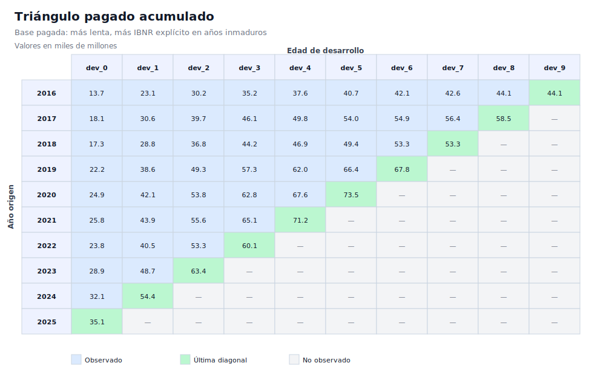
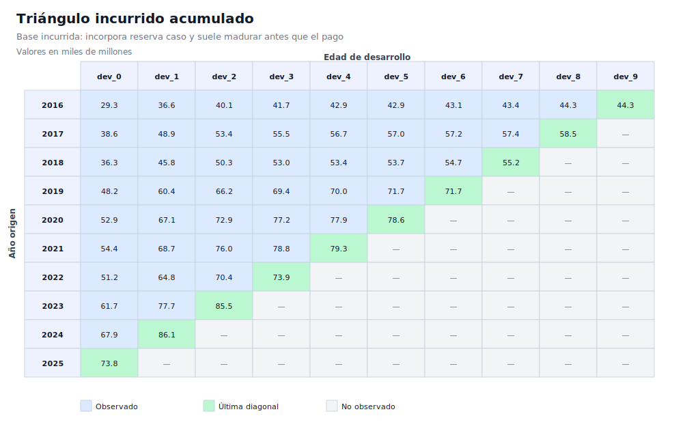
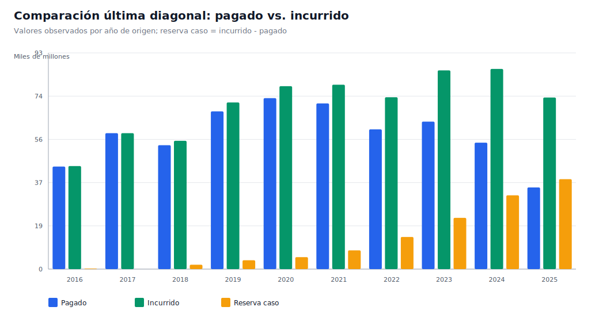

# Demo práctico de triángulos pagados vs. incurridos en salud

Este demo extiende el primer ejercicio de triángulos pagados. El objetivo es mostrar una diferencia operativa central en reserving de salud: una base pagada suele emerger más lentamente, mientras que una base incurrida incorpora reserva caso a caso y puede dar una señal más temprana del costo último.

Los datos son sintéticos y están diseñados para docencia, validación técnica y demostración reproducible. No representan experiencia real de una EPS, aseguradora, IPS, administrador de beneficios ni portafolio específico.

## Qué genera el demo

El script genera:

- datos observados en formato largo;
- triángulo pagado acumulado;
- triángulo incurrido acumulado;
- triángulo de reserva caso observada;
- factores edad-a-edad sobre base pagada;
- factores edad-a-edad sobre base incurrida;
- comparación Chain Ladder entre ultimate pagado e incurrido;
- visualizaciones SVG para explicar la estructura triangular y la última diagonal.

## Ejecución recomendada

Desde la raíz del repositorio:

```bash
python scripts/generate_demo_paid_incurred.py
```

Por defecto se generan dos salidas:

```text
data/demo_pagado_incurrido/   # versión en español
data/demo_paid_incurred/      # versión en inglés
```

Para generar solo español:

```bash
python scripts/generate_demo_paid_incurred.py --language es
```

Para generar solo inglés:

```bash
python scripts/generate_demo_paid_incurred.py --language en
```

## Archivos en español

```text
data/demo_pagado_incurrido/reclamaciones_pagadas_incurridas_largo.csv
data/demo_pagado_incurrido/triangulo_pagado_acumulado.csv
data/demo_pagado_incurrido/triangulo_incurrido_acumulado.csv
data/demo_pagado_incurrido/triangulo_reserva_caso.csv
data/demo_pagado_incurrido/factores_pagado.csv
data/demo_pagado_incurrido/factores_incurrido.csv
data/demo_pagado_incurrido/resultados_comparacion_chain_ladder.csv
data/demo_pagado_incurrido/resumen_ejecucion.txt
docs/assets/demo_pagado_incurrido/triangulo_pagado_acumulado.svg
docs/assets/demo_pagado_incurrido/triangulo_incurrido_acumulado.svg
docs/assets/demo_pagado_incurrido/comparacion_ultima_diagonal.svg
```

## Triángulo pagado acumulado

La base pagada refleja únicamente pagos realizados. En salud, esta señal puede ser lenta por tiempos de radicación, auditoría, conciliación, glosas, autorización y ciclo operativo de pagos.



## Triángulo incurrido acumulado

La base incurrida combina pagos más reserva caso. Por eso suele reconocer antes parte del costo esperado, aunque también puede incorporar sesgos de suficiencia o prudencia en la reserva caso a caso.



## Comparación de la última diagonal

La última diagonal permite comparar, para cada año de origen, cuánto se ha observado bajo base pagada e incurrida. La diferencia entre incurrido y pagado es la reserva caso observada.



## Lógica actuarial implementada

El demo sigue este flujo:

1. Simula años de origen y exposición en meses-miembro.
2. Simula un ultimate sintético por año de origen.
3. Aplica un patrón de emergencia pagada.
4. Aplica un patrón de emergencia incurrida más acelerado.
5. Calcula reserva caso como incurrido acumulado menos pagado acumulado.
6. Construye triángulos pagados, incurridos y de reserva caso.
7. Calcula factores edad-a-edad separados para base pagada e incurrida.
8. Proyecta ultimate e IBNR con Chain Ladder en ambas bases.
9. Compara el no pagado total bajo base incurrida contra el IBNR sobre base pagada.

## Fórmulas base

Para una edad de desarrollo \(j\), el factor edad-a-edad se calcula como:

$$
f_j =
\frac{\sum_i C_{i,j+1}}{\sum_i C_{i,j}}
$$

donde \(C\) puede ser el triángulo pagado o el triángulo incurrido.

La reserva caso observada para el año de origen \(i\) y edad \(j\) se calcula como:

$$
ReservaCaso_{i,j} = Incurrido_{i,j} - Pagado_{i,j}
$$

El no pagado total sobre base incurrida se descompone como:

$$
NoPagado_i =
ReservaCaso_i + IBNR^{incurrido}_i
$$

## Interpretación esperada

El demo debe mostrar que:

- el triángulo pagado produce una estimación explícita de IBNR más alta en años inmaduros;
- el triángulo incurrido reduce parte de esa brecha porque ya incluye reserva caso;
- la reserva caso no elimina el IBNR, solo cambia la forma en que se distribuye el no pagado;
- comparar ambas bases ayuda a detectar señales de suficiencia, rezago operativo o cambios en práctica de reserving.

## Limitaciones

Este demo es deliberadamente simple:

- no estima incertidumbre;
- no separa tipos de servicio médico;
- no modela glosas ni reversos administrativos;
- no incorpora recobros ni recuperación de terceros;
- no calibra supuestos con experiencia real;
- no evalúa suficiencia contable o regulatoria.

Estas extensiones pueden agregarse en demos posteriores.

