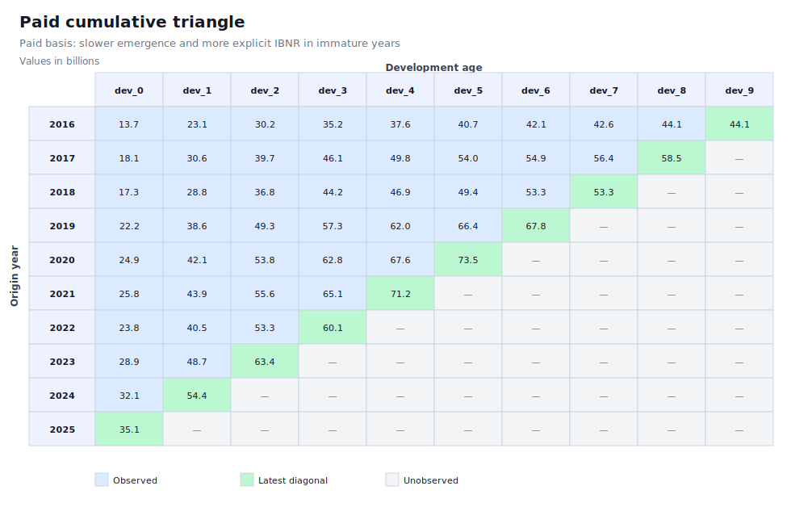
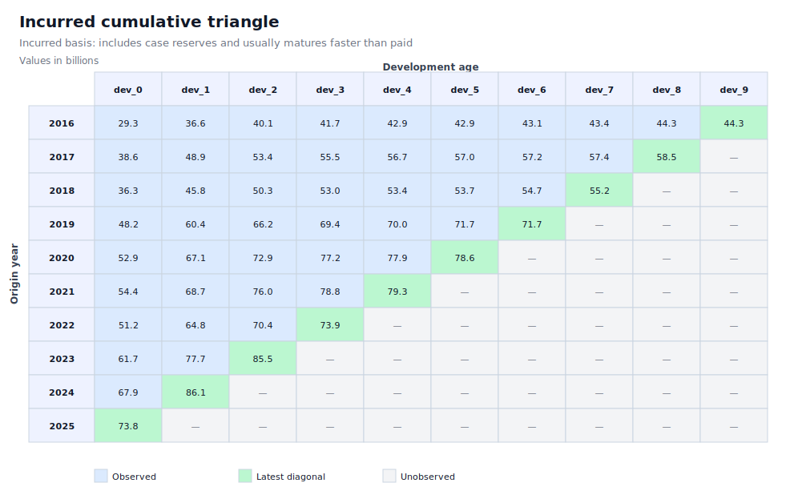
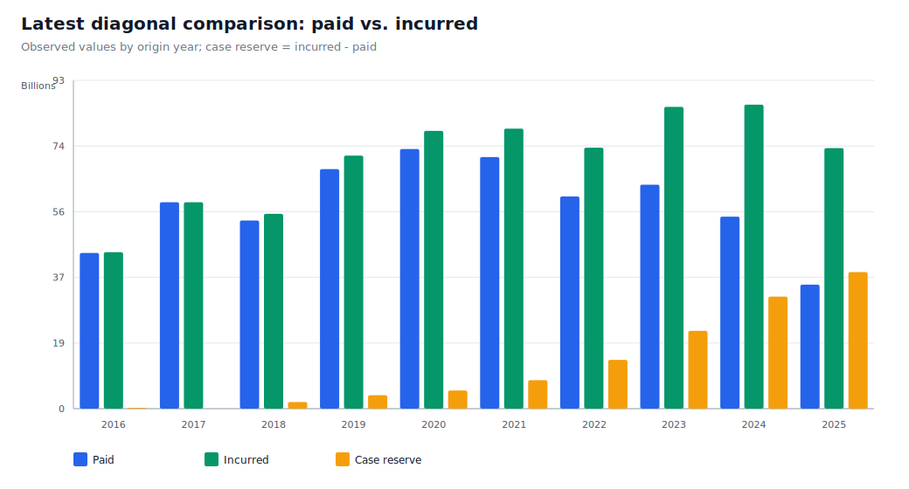

# Practical demo of paid vs. incurred health triangles

This demo extends the first paid triangle exercise. The goal is to show a central operational distinction in health reserving: paid data usually emerges more slowly, while incurred data includes case reserves and can provide an earlier signal of ultimate cost.

The data are synthetic and designed for teaching, technical validation, and reproducible demonstration. They do not represent real experience from any insurer, EPS, provider, benefit administrator, or specific portfolio.

## What the demo generates

The script generates:

- observed long-format data;
- cumulative paid triangle;
- cumulative incurred triangle;
- observed case reserve triangle;
- age-to-age factors on paid basis;
- age-to-age factors on incurred basis;
- Chain Ladder comparison of paid and incurred ultimate estimates;
- SVG visualizations explaining the triangular structure and latest diagonal.

## Recommended execution

From the repository root:

```bash
python scripts/generate_demo_paid_incurred.py
```

By default, two outputs are generated:

```text
data/demo_pagado_incurrido/   # Spanish version
data/demo_paid_incurred/      # English version
```

To generate only Spanish:

```bash
python scripts/generate_demo_paid_incurred.py --language es
```

To generate only English:

```bash
python scripts/generate_demo_paid_incurred.py --language en
```

## English output files

```text
data/demo_paid_incurred/paid_incurred_claims_long.csv
data/demo_paid_incurred/paid_cumulative_triangle.csv
data/demo_paid_incurred/incurred_cumulative_triangle.csv
data/demo_paid_incurred/case_reserve_triangle.csv
data/demo_paid_incurred/paid_age_to_age_factors.csv
data/demo_paid_incurred/incurred_age_to_age_factors.csv
data/demo_paid_incurred/chain_ladder_comparison_results.csv
data/demo_paid_incurred/run_summary.txt
docs/assets/demo_paid_incurred/paid_cumulative_triangle.svg
docs/assets/demo_paid_incurred/incurred_cumulative_triangle.svg
docs/assets/demo_paid_incurred/latest_diagonal_comparison.svg
```

## Cumulative paid triangle

The paid basis reflects payments actually made. In health insurance, this signal may be slow because of submission delays, audit, reconciliation, denials, authorization, and operational payment cycles.



## Cumulative incurred triangle

The incurred basis combines paid amounts plus case reserves. It therefore often recognizes part of expected cost earlier, but it may also reflect adequacy or conservatism biases in case reserving.



## Latest diagonal comparison

The latest diagonal compares, for each origin year, how much has been observed on paid and incurred bases. The difference between incurred and paid is the observed case reserve.



## Actuarial logic

The demo follows this flow:

1. Simulate origin years and exposure in member-months.
2. Simulate a synthetic ultimate by origin year.
3. Apply a paid emergence pattern.
4. Apply a faster incurred emergence pattern.
5. Calculate case reserve as cumulative incurred minus cumulative paid.
6. Build paid, incurred, and case reserve triangles.
7. Calculate separate age-to-age factors for paid and incurred bases.
8. Project ultimate and IBNR with Chain Ladder on both bases.
9. Compare total unpaid on incurred basis against paid-basis IBNR.

## Core formulas

For development age \(j\), the age-to-age factor is:

$$
f_j =
\frac{\sum_i C_{i,j+1}}{\sum_i C_{i,j}}
$$

where \(C\) can be the paid triangle or the incurred triangle.

Observed case reserve for origin year \(i\) and age \(j\) is:

$$
CaseReserve_{i,j} = Incurred_{i,j} - Paid_{i,j}
$$

Total unpaid on incurred basis is decomposed as:

$$
Unpaid_i =
CaseReserve_i + IBNR^{incurred}_i
$$

## Expected interpretation

The demo should show that:

- the paid triangle produces a larger explicit IBNR estimate for immature years;
- the incurred triangle narrows part of that gap because it already includes case reserves;
- case reserves do not eliminate IBNR; they change how unpaid amounts are split;
- comparing both bases helps identify reserving adequacy, operational lag, or changes in reserving practice.

## Limitations

This demo is intentionally simple:

- it does not estimate uncertainty;
- it does not segment medical service categories;
- it does not model denials or administrative reversals;
- it does not include recoveries or third-party reimbursement;
- it does not calibrate assumptions to real experience;
- it does not evaluate accounting or regulatory sufficiency.

These extensions can be added in later demos.

