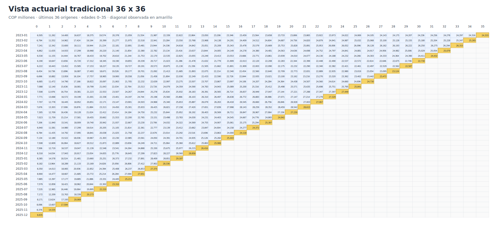
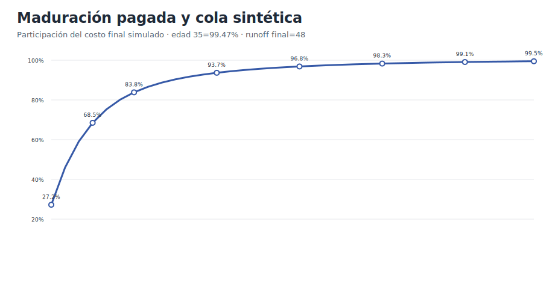
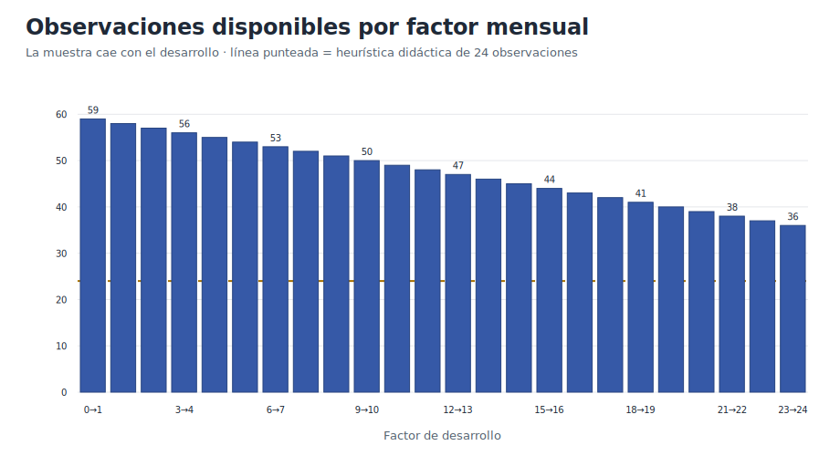

# Demo 3 · Triángulos mensuales de reclamaciones pagadas de salud

Este demo lleva la estructura tradicional del triángulo actuarial a una periodicidad mensual. Genera datos sintéticos de reclamaciones pagadas, construye triángulos incrementales y acumulados, selecciona factores edad-a-edad mensuales y estima ultimate e IBNR mediante Chain Ladder.

!!! info "Configuración base"
    El ejemplo utiliza **60 meses de origen** —cinco años— y edades de desarrollo **0–24 meses**. Así, el enlace más largo, 23→24, conserva 36 observaciones completas.

## 1. Por qué 60 meses de origen y 24 de desarrollo

No existe un número universal de meses que garantice la adecuación de Chain Ladder. Los estándares actuariales exigen que los datos, el periodo de experiencia, el runout, el método y sus supuestos sean apropiados para el propósito y las características de desarrollo; no prescriben una combinación fija como 60/24.

Para este demo, 60/24 es un punto de partida práctico porque:

- cinco años permiten observar varias repeticiones de la estacionalidad anual;
- 24 meses capturan una cola razonable para reclamaciones de salud de maduración rápida o media;
- 36 meses de origen quedan completamente desarrollados;
- cada factor mensual tiene al menos 36 observaciones en la configuración predeterminada;
- el volumen visual sigue siendo manejable y permite auditar la diagonal observada.

La elección real debe hacerse por segmento. Reclamaciones de alto costo, litigiosas, con glosas prolongadas, cobros tardíos o procesos operativos inestables pueden requerir **36 meses o más**, un factor de cola o una metodología complementaria.

## 2. Estructura del triángulo tradicional

Las filas son meses de ocurrencia y las columnas son meses de desarrollo. La diagonal amarilla contiene la última observación disponible de cada mes de origen; las celdas vacías son pagos futuros por estimar.



La edad de desarrollo se calcula como la diferencia de meses calendario entre el mes de pago y el mes de origen:

```text
mes_desarrollo = 12 × (año_pago − año_origen) + mes_pago − mes_origen
```

## 3. Curva de maduración

El generador conoce el ultimate sintético y puede medir cuánto se ha pagado acumuladamente en cada edad. La curva permite verificar si 24 meses es un horizonte razonablemente maduro para el patrón simulado.



En producción, esta revisión debe realizarse por población, cobertura, prestador, modelo de pago y tipo de reclamación. Una curva total puede ocultar colas materiales en segmentos pequeños.

## 4. Suficiencia por factor

La información disponible disminuye a medida que aumenta la edad de desarrollo. Por eso no basta con contar 60 filas: debe revisarse cuántas observaciones soportan cada factor.



La línea de 24 observaciones es una **heurística didáctica del demo**, no un estándar actuarial. El archivo `diagnostico_suficiencia.csv` hace explícita esta distinción.

## 5. Archivos generados

La salida en español se encuentra en `data/demo_triangulos_mensuales/`:

| Archivo | Contenido |
|---|---|
| `reclamaciones_pagadas_mensuales_largo.csv` | Celdas observadas en formato largo |
| `triangulo_pagado_mensual_incremental.csv` | Pagos del mes por origen y desarrollo |
| `triangulo_pagado_mensual_acumulado.csv` | Pagos acumulados en formato actuarial |
| `factores_mensuales_edad_a_edad.csv` | Factores, CDF, dispersión y conteos |
| `resultados_chain_ladder_mensual.csv` | Ultimate, IBNR y error contra la verdad simulada |
| `diagnostico_suficiencia.csv` | Controles de historia, horizonte y observaciones |
| `resumen_ejecucion.txt` | Resumen de parámetros y resultados |

Los archivos equivalentes en inglés se generan en `data/demo_monthly_triangles/`.

## 6. Ejecución

Desde la raíz del repositorio:

```bash
python scripts/generate_demo_monthly_triangles.py
```

Solo español:

```bash
python scripts/generate_demo_monthly_triangles.py --language es
```

La valuación y la semilla son configurables:

```bash
python scripts/generate_demo_monthly_triangles.py \
  --valuation-month 2025-12 \
  --origin-months 60 \
  --development-months 24 \
  --seed 20260714
```

El horizonte distinto de 24 meses se rechaza deliberadamente: antes de cambiarlo deben ajustarse el patrón de maduración, los controles y la documentación. Esto evita presentar una extensión mecánica como si estuviera validada.

## 7. Controles reproducibles

El generador detiene la ejecución si no se cumplen las siguientes reconciliaciones:

- 60 meses de origen en la configuración predeterminada;
- 1.200 celdas observadas;
- suma de incrementales igual al acumulado en cada celda;
- suma de incrementales completos igual al ultimate simulado;
- conteo del factor más largo igual al número de orígenes completos;
- salidas determinísticas para la misma semilla.

Para validar todo el repositorio:

```bash
python tests/test_demo_monthly_triangles.py
rm -rf site
python scripts/audit_docs.py
python scripts/preflight_release.py
python -m mkdocs build --strict
```

## 8. Antes de utilizar la técnica con datos reales

1. Definir con precisión la fecha de ocurrencia y la fecha de pago.
2. Separar cambios de cobertura, población, red, tarifas y operación.
3. Evaluar estacionalidad y tendencia médica en el eje calendario.
4. Revisar cada ratio individual, no solo el promedio ponderado.
5. Excluir o segmentar meses atípicos con justificación documentada.
6. Comprobar estabilidad con ventanas móviles y backtesting.
7. Estimar una cola cuando 24 meses no sea suficientemente maduro.
8. Conciliar el resultado con contabilidad, exposición y sistemas de reclamaciones.

!!! warning "Uso profesional"
    Los datos son completamente sintéticos. La configuración 60/24, el umbral de 24 observaciones y los resultados del demo son educativos; no constituyen una metodología prescrita ni reemplazan el juicio actuarial documentado.

## 9. Referencias relacionadas

- [Construcción de triángulos](../part-01-foundations/02-triangle-construction.md)
- [Factores edad-a-edad](../part-01-foundations/05-age-to-age-development-factors.md)
- [Método Chain Ladder](../part-02-classical-reserving/06-chain-ladder-method.md)
- [Diagnósticos de Chain Ladder](../part-02-classical-reserving/07-chain-ladder-diagnostics.md)
- [Ciclo de vida y rezagos operativos](../part-06-health-specific/22-health-claim-lifecycle-and-operational-lags.md)
- [Tendencia médica, estacionalidad y choques](../part-06-health-specific/24-health-medical-trend-seasonality-and-shocks.md)
- [Bibliografía y evidencia](../bibliography.md)
