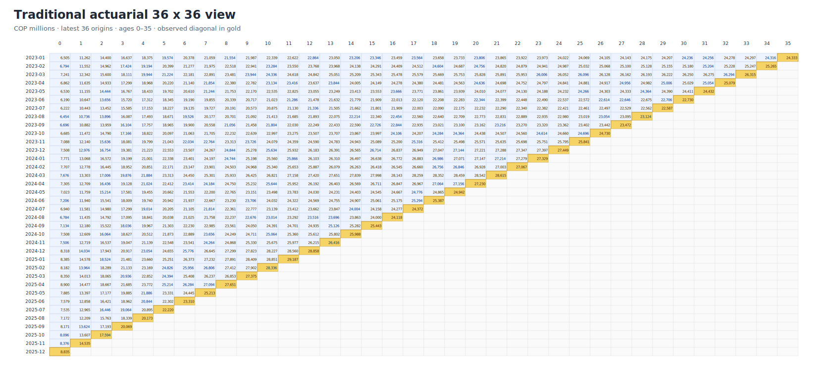
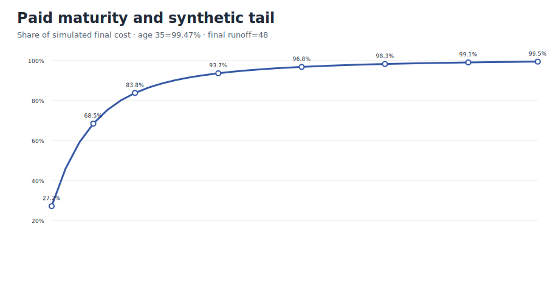
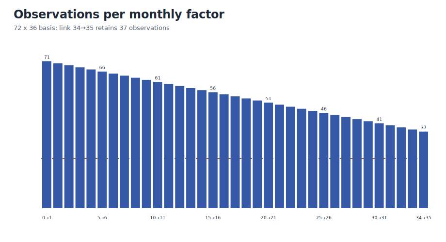

# Demo 3 · Monthly health paid-claims triangles

r2 distinguishes the **72×36 estimation basis**, the **traditional 36×36 display**, and the synthetic full runoff through age 48. A 36×36 triangle is familiar, but at one valuation date it contributes only one observation to link 34→35. The 72-origin basis retains 37 observations for that link.

!!! warning "Precise result name"
    A paid-only aggregate triangle supports an **estimated unpaid claim liability**. It does not split pure IBNR, RBNS and IBNER without report dates, case reserves/incurred data and claim status.



The visible projection ends at age 35. The generator knows synthetic runoff through age 48 and applies the explicit tail

$$
f_{35\rightarrow48}=C_{48}^{simulated}/C_{35}^{simulated}\approx1.00524958.
$$

Without a supported tail, the result should be called **projected cumulative at terminal age**, not final cost.



For origin $i$:

$$
\widehat{L}_{i,unpaid}=\widehat{C}_{i,35}\times f_{35\rightarrow48}-P_{i,k}.
$$

No zero floor is imposed. Negative residuals remain visible for review.

## Data needed beyond a paid triangle

More realistic work should add report/notice date, case reserve or reported incurred, claim status and reopenings, exposure and an independent prior, homogeneous segmentation, gross/net and recoveries, large-claim flags, later runoff and documented operational changes. These fields determine what can be identified and how credible the selected pattern is.



## r2 files

| File | Meaning |
|---|---|
| `monthly_paid_cumulative_triangle.csv` | full 72×36 estimation basis |
| `traditional_36x36_view.csv` | latest 36 origins for presentation |
| `monthly_age_to_age_factors.csv` | factors to age 35 and counts |
| `unpaid_claim_liability_projection_results.csv` | terminal projection, tail, final cost and unpaid liability |
| `monthly_bornhuetter_ferguson_prior.csv` | synthetic prior for Demo 6 |

Run with:

```bash
python scripts/generate_demo_monthly_triangles.py --language en
```

This is synthetic educational evidence, not a booked reserve or a universal recommendation to use 72×36.
