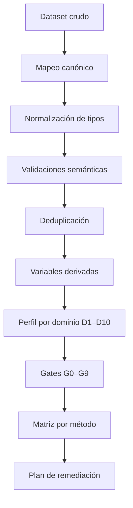

# Demo de preparación de datos para metodologías de reserving

> **Archivo propuesto:** `docs/examples/04-demo-preparacion-datos.md`

## Resumen

Este demo muestra cómo evaluar si un dataset operativo de seguros de salud está preparado para aplicar métodos de reserving. El flujo utiliza:

- nombres canónicos en español;
- alias opcionales en inglés;
- mapeo explícito de columnas;
- controles de fechas, importes e identificadores;
- deduplicación con reglas de negocio;
- evaluación de gates G0–G9;
- matriz de elegibilidad por método;
- plan de remediación de datos.

El objetivo no es producir una reserva. El primer resultado es una respuesta más básica y necesaria:

> **¿Qué métodos pueden utilizarse de forma defendible con la información disponible, cuáles deben bloquearse y qué datos permitirían ampliar el benchmark?**

---

## 1. Objetivos del demo

Al finalizar, el lector podrá:

1. mapear columnas operativas a nombres canónicos;
2. distinguir presencia de una columna de validez semántica;
3. detectar duplicados técnicos y movimientos económicos legítimos;
4. construir variables temporales de origen, calendario y desarrollo;
5. evaluar gates de elegibilidad;
6. producir una matriz por método;
7. priorizar datos faltantes;
8. adaptar el proceso a un dataset real.

---

## 2. Archivos utilizados

El demo asume la siguiente estructura:

```text
config/
└── diccionario_datos_canonico.yml

docs/
├── repository-governance/
│   ├── marco-preparacion-datos-metodologias-parte-1.md
│   └── marco-preparacion-datos-metodologias-parte-2.md
└── examples/
    └── 04-demo-preparacion-datos.md
```

Dependencias opcionales para ejecutar el ejemplo en Python:

```bash
python -m pip install pandas pyyaml
```

---

## 3. Escenario

Una aseguradora recibe dos archivos mensuales con movimientos de reclamaciones. Ambos contienen las mismas transacciones porque uno corresponde al extracto operativo y el otro a una copia enviada al equipo actuarial.

Las columnas originales son:

| Columna original | Significado declarado |
|---|---|
| `Periodo Servicio` | mes de prestación |
| `Periodo` | mes de pago |
| `COSTO` | importe del movimiento |
| `FRECUENCIA` | número de servicios |
| `factura` | identificador de factura |
| `Folio` | identificador de línea |
| `Componente` | tipo de movimiento |
| `archivo_origen` | archivo fuente |
| `segmento` | segmento actuarial |

Antes de usar el dataset se deben resolver cuatro riesgos:

1. `Periodo` podría ser contabilización, no pago;
2. `COSTO` podría mezclar pagos, reversos y glosas;
3. las filas de ambos archivos podrían estar duplicadas;
4. la historia disponible podría ser insuficiente para estimar factores de desarrollo.

---

## 4. Flujo del demo



---

## 5. Dataset de ejemplo

El ejemplo genera un archivo con movimientos duplicados deliberadamente.

```python
from pathlib import Path

import pandas as pd


def crear_datos_demo(ruta: str = "datos_demo_preparacion.csv") -> Path:
    movimientos = [
        {
            "Periodo Servicio": "2026-01-01",
            "Periodo": "2026-01-01",
            "COSTO": 120000.0,
            "FRECUENCIA": 1,
            "factura": "FAC-001",
            "Folio": "01",
            "Componente": "PAGO",
            "archivo_origen": "extracto_operativo.csv",
            "segmento": "AMBULATORIO",
        },
        {
            "Periodo Servicio": "2026-01-01",
            "Periodo": "2026-02-01",
            "COSTO": 80000.0,
            "FRECUENCIA": 1,
            "factura": "FAC-001",
            "Folio": "02",
            "Componente": "PAGO",
            "archivo_origen": "extracto_operativo.csv",
            "segmento": "AMBULATORIO",
        },
        {
            "Periodo Servicio": "2026-01-01",
            "Periodo": "2026-03-01",
            "COSTO": -10000.0,
            "FRECUENCIA": 0,
            "factura": "FAC-001",
            "Folio": "03",
            "Componente": "REVERSO",
            "archivo_origen": "extracto_operativo.csv",
            "segmento": "AMBULATORIO",
        },
        {
            "Periodo Servicio": "2026-02-01",
            "Periodo": "2026-02-01",
            "COSTO": 250000.0,
            "FRECUENCIA": 2,
            "factura": "FAC-002",
            "Folio": "01",
            "Componente": "PAGO",
            "archivo_origen": "extracto_operativo.csv",
            "segmento": "HOSPITALARIO",
        },
        {
            "Periodo Servicio": "2026-02-01",
            "Periodo": "2026-03-01",
            "COSTO": 90000.0,
            "FRECUENCIA": 1,
            "factura": "FAC-003",
            "Folio": "01",
            "Componente": "PAGO",
            "archivo_origen": "extracto_operativo.csv",
            "segmento": "AMBULATORIO",
        },
        {
            "Periodo Servicio": "2026-03-01",
            "Periodo": "2026-03-01",
            "COSTO": 400000.0,
            "FRECUENCIA": 1,
            "factura": "FAC-004",
            "Folio": "01",
            "Componente": "PAGO",
            "archivo_origen": "extracto_operativo.csv",
            "segmento": "HOSPITALARIO",
        },
    ]

    copia = []
    for fila in movimientos:
        duplicada = fila.copy()
        duplicada["archivo_origen"] = "copia_actuarial.csv"
        copia.append(duplicada)

    datos = pd.DataFrame(movimientos + copia)
    ruta_salida = Path(ruta)
    datos.to_csv(ruta_salida, index=False, encoding="utf-8")
    return ruta_salida
```

El archivo contiene 12 filas físicas, pero solo seis movimientos económicos únicos.

---

## 6. Mapeo canónico

### 6.1 Mapeo explícito

```python
MAPEO_COLUMNAS = {
    "Periodo Servicio": "fecha_servicio",
    "Periodo": "fecha_pago",
    "COSTO": "costo_pagado",
    "FRECUENCIA": "conteo_servicios",
    "factura": "id_factura",
    "Folio": "id_folio",
    "Componente": "tipo_movimiento",
    "archivo_origen": "archivo_fuente",
    "segmento": "segmento",
}
```

### 6.2 Confirmaciones de negocio requeridas

El mapeo no debe aprobarse solo por similitud del nombre.

| Columna | Confirmación necesaria |
|---|---|
| `Periodo` | corresponde a desembolso, no contabilización |
| `COSTO` | representa movimientos pagados incrementales |
| `Componente` | distingue pagos, reversos y recuperaciones |
| `FRECUENCIA` | cuenta servicios, no reclamaciones |

Una alternativa conservadora consiste en mapear primero a nombres neutrales:

```text
Periodo -> fecha_calendario
COSTO -> importe_movimiento
```

y promoverlos a `fecha_pago` y `costo_pagado` únicamente después de la validación semántica.

---

## 7. Normalización y construcción de identificadores

```python
from __future__ import annotations

import hashlib

import pandas as pd
import yaml


def cargar_diccionario(
    ruta: str = "../../config/diccionario_datos_canonico.yml",
) -> dict:
    with open(ruta, "r", encoding="utf-8") as archivo:
        return yaml.safe_load(archivo)


def normalizar_datos(
    datos: pd.DataFrame,
    mapeo: dict[str, str],
    fecha_valoracion: str,
) -> pd.DataFrame:
    faltantes = sorted(set(mapeo) - set(datos.columns))
    if faltantes:
        raise ValueError(
            "No se encontraron las columnas de origen: "
            + ", ".join(faltantes)
        )

    salida = datos.rename(columns=mapeo).copy()

    for columna in ["fecha_servicio", "fecha_pago"]:
        salida[columna] = pd.to_datetime(
            salida[columna],
            errors="coerce",
        )

    salida["fecha_valoracion"] = pd.Timestamp(fecha_valoracion)
    salida["costo_pagado"] = pd.to_numeric(
        salida["costo_pagado"],
        errors="coerce",
    )
    salida["conteo_servicios"] = pd.to_numeric(
        salida["conteo_servicios"],
        errors="coerce",
    ).fillna(0)

    salida["tipo_movimiento"] = (
        salida["tipo_movimiento"]
        .astype("string")
        .str.strip()
        .str.upper()
    )

    salida["id_movimiento_economico"] = salida.apply(
        construir_id_movimiento,
        axis=1,
    )
    return salida


def construir_id_movimiento(fila: pd.Series) -> str:
    componentes = [
        str(fila.get("id_factura", "")),
        str(fila.get("id_folio", "")),
        str(fila.get("fecha_servicio", "")),
        str(fila.get("fecha_pago", "")),
        str(fila.get("costo_pagado", "")),
        str(fila.get("tipo_movimiento", "")),
    ]
    texto = "|".join(componentes)
    return hashlib.sha256(texto.encode("utf-8")).hexdigest()
```

### 7.1 Por qué `archivo_fuente` no entra en la llave económica

Si se incluyera `archivo_fuente`, las dos copias serían consideradas movimientos diferentes. La llave económica debe representar el evento, no el contenedor técnico.

---

## 8. Validaciones iniciales

```python
def validar_fechas(datos: pd.DataFrame) -> dict[str, int]:
    return {
        "fechas_servicio_nulas": int(
            datos["fecha_servicio"].isna().sum()
        ),
        "fechas_pago_nulas": int(
            datos["fecha_pago"].isna().sum()
        ),
        "rezagos_negativos": int(
            (datos["fecha_pago"] < datos["fecha_servicio"]).sum()
        ),
        "pagos_posteriores_valoracion": int(
            (datos["fecha_pago"] > datos["fecha_valoracion"]).sum()
        ),
    }


def validar_importes(datos: pd.DataFrame) -> dict[str, int]:
    negativos_sin_clasificar = (
        (datos["costo_pagado"] < 0)
        & ~datos["tipo_movimiento"].isin(
            ["REVERSO", "RECUPERACION", "GLOSA"]
        )
    )

    return {
        "importes_nulos": int(datos["costo_pagado"].isna().sum()),
        "importes_negativos": int((datos["costo_pagado"] < 0).sum()),
        "negativos_sin_clasificar": int(
            negativos_sin_clasificar.sum()
        ),
    }


def validar_duplicados(datos: pd.DataFrame) -> dict[str, float]:
    duplicados = datos.duplicated(
        subset=["id_movimiento_economico"],
        keep=False,
    )
    numero_duplicados = int(duplicados.sum())
    tasa = numero_duplicados / len(datos) if len(datos) else 0.0

    return {
        "filas_fisicas": int(len(datos)),
        "filas_en_grupos_duplicados": numero_duplicados,
        "tasa_filas_en_grupos_duplicados": round(tasa, 4),
        "movimientos_economicos_unicos": int(
            datos["id_movimiento_economico"].nunique()
        ),
    }
```

---

## 9. Deduplicación

```python
def deduplicar_movimientos(datos: pd.DataFrame) -> pd.DataFrame:
    prioridad_fuente = {
        "extracto_operativo.csv": 1,
        "copia_actuarial.csv": 2,
    }

    salida = datos.copy()
    salida["prioridad_fuente"] = (
        salida["archivo_fuente"]
        .map(prioridad_fuente)
        .fillna(999)
    )

    salida = (
        salida
        .sort_values(
            ["id_movimiento_economico", "prioridad_fuente"]
        )
        .drop_duplicates(
            subset=["id_movimiento_economico"],
            keep="first",
        )
        .drop(columns=["prioridad_fuente"])
        .reset_index(drop=True)
    )
    return salida
```

!!! warning "Advertencia"
    Esta regla es válida solo porque se confirmó que ambas fuentes contienen copias exactas. En datos reales, una fila adicional podría ser un pago parcial, ajuste o reverso legítimo.

---

## 10. Variables derivadas

```python
def agregar_variables_temporales(
    datos: pd.DataFrame,
) -> pd.DataFrame:
    salida = datos.copy()

    salida["periodo_origen"] = (
        salida["fecha_servicio"]
        .dt.to_period("M")
        .dt.to_timestamp()
    )
    salida["periodo_calendario"] = (
        salida["fecha_pago"]
        .dt.to_period("M")
        .dt.to_timestamp()
    )

    salida["edad_desarrollo"] = (
        12
        * (
            salida["periodo_calendario"].dt.year
            - salida["periodo_origen"].dt.year
        )
        + (
            salida["periodo_calendario"].dt.month
            - salida["periodo_origen"].dt.month
        )
    )

    salida["importe_incremental"] = salida["costo_pagado"]
    salida["indicador_rezago_valido"] = (
        salida["edad_desarrollo"] >= 0
    )
    return salida
```

La fórmula mensual utilizada es:

\[
d
=
12(año_c-año_o)+(mes_c-mes_o).
\]

---

## 11. Construcción del triángulo descriptivo

```python
def construir_triangulo_incremental(
    datos: pd.DataFrame,
) -> pd.DataFrame:
    return (
        datos
        .pivot_table(
            index="periodo_origen",
            columns="edad_desarrollo",
            values="importe_incremental",
            aggfunc="sum",
            fill_value=0.0,
        )
        .sort_index()
        .sort_index(axis=1)
    )
```

Este triángulo es **descriptivo**. Su construcción no implica que Chain Ladder sea elegible.

---

## 12. Perfil básico de datos

```python
def construir_perfil(datos: pd.DataFrame) -> dict:
    periodos_origen = datos["periodo_origen"].dropna().nunique()
    horizonte = (
        int(datos["edad_desarrollo"].max())
        if datos["edad_desarrollo"].notna().any()
        else 0
    )

    return {
        "numero_filas": int(len(datos)),
        "numero_periodos_origen": int(periodos_origen),
        "horizonte_desarrollo": horizonte,
        "fecha_minima_servicio": str(
            datos["fecha_servicio"].min().date()
        ),
        "fecha_maxima_servicio": str(
            datos["fecha_servicio"].max().date()
        ),
        "importe_total": float(datos["costo_pagado"].sum()),
        "numero_facturas": int(datos["id_factura"].nunique()),
        "numero_segmentos": int(datos["segmento"].nunique()),
        "tiene_exposicion": "miembros_mes" in datos.columns,
        "tiene_prior": "ultimate_esperado" in datos.columns,
        "tiene_snapshots": "fecha_snapshot" in datos.columns,
        "tiene_reserva_caso": "reserva_caso" in datos.columns,
    }
```

---

## 13. Evaluación de gates

### 13.1 Configuración del demo

```python
UMBRALES = {
    "minimo_periodos_origen_chain_ladder": 36,
    "minimo_horizonte_desarrollo": 12,
}

CONTEXTO = {
    "obligacion_definida": True,
    "fecha_pago_confirmada": True,
    "costo_pagado_confirmado": True,
    "historia_representativa": False,
    "proceso_versionado": True,
}
```

### 13.2 Función

```python
def evaluar_gates(
    datos: pd.DataFrame,
    perfil: dict,
    contexto: dict,
    umbrales: dict,
) -> dict[str, bool]:
    fechas_validas = (
        datos["fecha_servicio"].notna().all()
        and datos["fecha_pago"].notna().all()
        and (datos["fecha_pago"] >= datos["fecha_servicio"]).all()
        and (datos["fecha_pago"] <= datos["fecha_valoracion"]).all()
    )

    importes_validos = (
        datos["costo_pagado"].notna().all()
        and contexto["costo_pagado_confirmado"]
        and not (
            (datos["costo_pagado"] < 0)
            & ~datos["tipo_movimiento"].isin(
                ["REVERSO", "RECUPERACION", "GLOSA"]
            )
        ).any()
    )

    integridad_valida = datos["id_movimiento_economico"].is_unique

    historia_suficiente = (
        perfil["numero_periodos_origen"]
        >= umbrales["minimo_periodos_origen_chain_ladder"]
        and perfil["horizonte_desarrollo"]
        >= umbrales["minimo_horizonte_desarrollo"]
    )

    return {
        "G0": bool(contexto["obligacion_definida"]),
        "G1": bool(
            fechas_validas
            and contexto["fecha_pago_confirmada"]
        ),
        "G2": bool(importes_validos),
        "G3": bool(integridad_valida),
        "G4": bool(historia_suficiente),
        "G5": bool(perfil["tiene_exposicion"]),
        "G6": bool(perfil["tiene_prior"]),
        "G7": bool(contexto["historia_representativa"]),
        "G8": bool(perfil["tiene_snapshots"]),
        "G9": bool(contexto["proceso_versionado"]),
    }
```

---

## 14. Requisitos por método

```python
REQUISITOS_METODOS = {
    "CHAIN_LADDER_PAGADO": {
        "nombre": "Chain Ladder pagado",
        "campos": {
            "fecha_servicio",
            "fecha_pago",
            "costo_pagado",
            "fecha_valoracion",
        },
        "gates_criticos": {
            "G0", "G1", "G2", "G3", "G4", "G7", "G9"
        },
    },
    "BORNHUETTER_FERGUSON": {
        "nombre": "Bornhuetter-Ferguson",
        "campos": {
            "periodo_origen",
            "importe_acumulado",
            "proporcion_desarrollada",
            "ultimate_esperado",
            "fecha_prior",
            "fecha_valoracion",
        },
        "gates_criticos": {
            "G0", "G2", "G4", "G6", "G7", "G9"
        },
    },
    "CAPE_COD": {
        "nombre": "Cape Cod",
        "campos": {
            "periodo_origen",
            "importe_acumulado",
            "proporcion_desarrollada",
            "miembros_mes",
            "fecha_valoracion",
        },
        "gates_criticos": {
            "G0", "G2", "G4", "G5", "G7", "G9"
        },
    },
    "MACK": {
        "nombre": "Mack Chain Ladder",
        "campos": {
            "periodo_origen",
            "edad_desarrollo",
            "importe_acumulado",
            "fecha_valoracion",
        },
        "gates_criticos": {
            "G0", "G1", "G2", "G3", "G4", "G7", "G9"
        },
    },
    "BOOTSTRAP": {
        "nombre": "Bootstrap Chain Ladder",
        "campos": {
            "periodo_origen",
            "edad_desarrollo",
            "importe_incremental",
            "fecha_valoracion",
        },
        "gates_criticos": {
            "G0", "G1", "G2", "G3", "G4", "G7", "G8", "G9"
        },
    },
    "GLM": {
        "nombre": "GLM agregado",
        "campos": {
            "periodo_origen",
            "edad_desarrollo",
            "periodo_calendario",
            "importe_incremental",
        },
        "gates_criticos": {
            "G0", "G1", "G2", "G3", "G4", "G7", "G8", "G9"
        },
    },
    "MACHINE_LEARNING": {
        "nombre": "Machine learning granular",
        "campos": {
            "id_reclamacion",
            "fecha_snapshot",
            "fecha_valoracion",
        },
        "gates_criticos": {
            "G0", "G1", "G2", "G3", "G7", "G8", "G9"
        },
    },
}
```

---

## 15. Matriz de elegibilidad

```python
def evaluar_metodos(
    datos: pd.DataFrame,
    gates: dict[str, bool],
) -> pd.DataFrame:
    columnas = set(datos.columns)
    resultados = []

    for codigo, especificacion in REQUISITOS_METODOS.items():
        faltantes = sorted(
            especificacion["campos"] - columnas
        )
        gates_fallidos = sorted(
            gate
            for gate in especificacion["gates_criticos"]
            if not gates.get(gate, False)
        )

        if faltantes or gates_fallidos:
            estado = "BLOQUEADO"
        elif not gates.get("G8", False):
            estado = "LISTO_CON_LIMITACIONES"
        else:
            estado = "LISTO"

        resultados.append(
            {
                "codigo_metodo": codigo,
                "metodo": especificacion["nombre"],
                "estado_preparacion": estado,
                "campos_faltantes": ", ".join(faltantes),
                "gates_fallidos": ", ".join(gates_fallidos),
            }
        )

    return pd.DataFrame(resultados)
```

---

## 16. Script completo de ejecución

```python
def ejecutar_demo() -> None:
    ruta = crear_datos_demo()
    datos_crudos = pd.read_csv(ruta)

    datos = normalizar_datos(
        datos=datos_crudos,
        mapeo=MAPEO_COLUMNAS,
        fecha_valoracion="2026-03-31",
    )

    print("Validación de fechas")
    print(validar_fechas(datos))

    print("\nValidación de importes")
    print(validar_importes(datos))

    print("\nValidación de duplicados")
    print(validar_duplicados(datos))

    datos_unicos = deduplicar_movimientos(datos)
    datos_unicos = agregar_variables_temporales(datos_unicos)

    triangulo = construir_triangulo_incremental(datos_unicos)
    perfil = construir_perfil(datos_unicos)
    gates = evaluar_gates(
        datos=datos_unicos,
        perfil=perfil,
        contexto=CONTEXTO,
        umbrales=UMBRALES,
    )
    matriz = evaluar_metodos(datos_unicos, gates)

    print("\nTriángulo incremental")
    print(triangulo)

    print("\nPerfil")
    print(perfil)

    print("\nGates")
    print(gates)

    print("\nMatriz de elegibilidad")
    print(matriz.to_string(index=False))

    triangulo.to_csv(
        "triangulo_incremental_demo.csv",
        encoding="utf-8",
    )
    matriz.to_csv(
        "matriz_elegibilidad_demo.csv",
        index=False,
        encoding="utf-8",
    )


if __name__ == "__main__":
    ejecutar_demo()
```

---

## 17. Resultado esperado

### 17.1 Perfil

```text
numero_filas: 6
numero_periodos_origen: 3
horizonte_desarrollo: 2
importe_total: 930000
numero_facturas: 4
numero_segmentos: 2
tiene_exposicion: false
tiene_prior: false
tiene_snapshots: false
tiene_reserva_caso: false
```

### 17.2 Gates

| Gate | Resultado | Interpretación |
|---|---|---|
| G0 | Sí | obligación declarada |
| G1 | Sí | fechas coherentes y semántica confirmada |
| G2 | Sí | importes y negativos clasificados |
| G3 | Sí | movimientos únicos después de deduplicar |
| G4 | No | tres periodos de origen y horizonte 2 |
| G5 | No | no hay exposición |
| G6 | No | no hay prior |
| G7 | No | representatividad no demostrada |
| G8 | No | no hay snapshots |
| G9 | Sí | proceso reproducible |

### 17.3 Matriz esperada

| Método | Estado | Causa principal |
|---|---|---|
| Chain Ladder pagado | `BLOQUEADO` | G4 y G7 |
| Bornhuetter-Ferguson | `BLOQUEADO` | prior, historia y campos faltantes |
| Cape Cod | `BLOQUEADO` | exposición e historia |
| Mack | `BLOQUEADO` | historia insuficiente |
| Bootstrap | `BLOQUEADO` | historia y snapshots |
| GLM agregado | `BLOQUEADO` | historia y validación |
| Machine learning | `BLOQUEADO` | claim ID y snapshots |

El dataset permite construir un triángulo descriptivo, pero no permite promover un método a benchmark actuarial.

---

## 18. Plan de remediación

| Prioridad | Dato o acción | Definición | Métodos habilitados |
|---:|---|---|---|
| 1 | ampliar historia | al menos 36 meses de origen y desarrollo suficiente | CL, Mack, Bootstrap, GLM |
| 2 | demostrar representatividad | documentar cambios de red, TPA, beneficios y sistemas | todos |
| 3 | conservar snapshots | cortes mensuales inmutables | backtesting, Bootstrap, GLM, ML |
| 4 | integrar `miembros_mes` | exposición por periodo y segmento | Cape Cod, PMPM, GLM con offset |
| 5 | integrar `ultimate_esperado` | prior ex ante | BF, Benktander |
| 6 | integrar `reserva_caso` | outstanding por claim y snapshot | CL incurrido |
| 7 | integrar `id_reclamacion` | llave granular seudonimizada | supervivencia, multiestado, ML |

---

## 19. Segundo escenario: dataset remediado

Después de completar la información, el perfil objetivo podría ser:

```yaml
numero_periodos_origen: 60
horizonte_desarrollo: 36
tiene_exposicion: true
tiene_prior: true
tiene_snapshots: true
tiene_reserva_caso: true
historia_representativa: true
```

La matriz objetivo sería:

| Método | Estado objetivo |
|---|---|
| Chain Ladder pagado | `LISTO` |
| Chain Ladder incurrido | `LISTO_CON_LIMITACIONES` |
| Bornhuetter-Ferguson | `LISTO` |
| Benktander | `LISTO` |
| Cape Cod | `LISTO` |
| Mack | `LISTO` |
| Bootstrap | `LISTO` |
| GLM | `LISTO_CON_LIMITACIONES` |
| Machine learning | `EXPLORATORIO` |

El estado final todavía depende de estabilidad, volumen, residual diagnostics, convergencia y gobierno.

---

## 20. Implementación equivalente en R

```r
library(dplyr)
library(readr)
library(lubridate)
library(digest)

mapeo_columnas <- c(
  "Periodo Servicio" = "fecha_servicio",
  "Periodo" = "fecha_pago",
  "COSTO" = "costo_pagado",
  "FRECUENCIA" = "conteo_servicios",
  "factura" = "id_factura",
  "Folio" = "id_folio",
  "Componente" = "tipo_movimiento",
  "archivo_origen" = "archivo_fuente",
  "segmento" = "segmento"
)

datos <- read_csv("datos_demo_preparacion.csv", show_col_types = FALSE)

datos <- datos %>%
  rename(all_of(mapeo_columnas)) %>%
  mutate(
    fecha_servicio = as.Date(fecha_servicio),
    fecha_pago = as.Date(fecha_pago),
    fecha_valoracion = as.Date("2026-03-31"),
    tipo_movimiento = toupper(trimws(tipo_movimiento)),
    id_movimiento_economico = mapply(
      function(id_factura, id_folio, fecha_servicio,
               fecha_pago, costo_pagado, tipo_movimiento) {
        digest(
          paste(
            id_factura,
            id_folio,
            fecha_servicio,
            fecha_pago,
            costo_pagado,
            tipo_movimiento,
            sep = "|"
          ),
          algo = "sha256"
        )
      },
      id_factura,
      id_folio,
      fecha_servicio,
      fecha_pago,
      costo_pagado,
      tipo_movimiento
    )
  )

datos_unicos <- datos %>%
  arrange(id_movimiento_economico, archivo_fuente) %>%
  distinct(id_movimiento_economico, .keep_all = TRUE) %>%
  mutate(
    periodo_origen = floor_date(fecha_servicio, "month"),
    periodo_calendario = floor_date(fecha_pago, "month"),
    edad_desarrollo =
      12 * (year(periodo_calendario) - year(periodo_origen)) +
      month(periodo_calendario) - month(periodo_origen),
    importe_incremental = costo_pagado
  )
```

---

## 21. Controles equivalentes en SQL

### 21.1 Duplicados económicos

```sql
SELECT
    id_factura,
    id_folio,
    fecha_servicio,
    fecha_pago,
    costo_pagado,
    tipo_movimiento,
    COUNT(*) AS numero_copias
FROM movimientos
GROUP BY
    id_factura,
    id_folio,
    fecha_servicio,
    fecha_pago,
    costo_pagado,
    tipo_movimiento
HAVING COUNT(*) > 1;
```

### 21.2 Rezagos negativos

```sql
SELECT COUNT(*) AS registros_invalidos
FROM movimientos
WHERE fecha_pago < fecha_servicio;
```

### 21.3 Negativos no clasificados

```sql
SELECT COUNT(*) AS negativos_no_clasificados
FROM movimientos
WHERE costo_pagado < 0
  AND tipo_movimiento NOT IN (
      'REVERSO',
      'RECUPERACION',
      'GLOSA'
  );
```

### 21.4 Historia disponible

```sql
SELECT
    COUNT(DISTINCT periodo_origen) AS periodos_origen,
    MAX(edad_desarrollo) AS horizonte_desarrollo
FROM movimientos_canonicos;
```

---

## 22. Adaptación a un dataset real

### 22.1 Paso 1 — No renombrar automáticamente

Crear una tabla de mapeo:

| Columna fuente | Campo canónico | Confianza | Validado por |
|---|---|---:|---|
| `fec_ate` | `fecha_servicio` | alta | operaciones |
| `f_cont` | `fecha_contabilizacion` | alta | finanzas |
| `valor` | pendiente | baja | pendiente |
| `num_cta` | `id_factura` | media | auditoría médica |

### 22.2 Paso 2 — Clasificar las ambigüedades

Estados sugeridos:

- `CONFIRMADO`;
- `PROVISIONAL`;
- `AMBIGUO`;
- `NO_MAPEADO`;
- `NO_APLICA`.

### 22.3 Paso 3 — Definir la obligación

Ejemplo:

```yaml
tipo_obligacion: FEE_FOR_SERVICE
medida_objetivo: PAGADO
base_bruta_neta: BRUTA
fecha_valoracion: 2026-06-30
segmento_objetivo: PLAN_INTEGRAL_NACIONAL
moneda: COP
```

### 22.4 Paso 4 — Ejecutar controles antes del triángulo

No construir factores hasta resolver:

- duplicados;
- fechas;
- movimientos negativos;
- cobertura;
- cambios de sistema;
- moneda;
- perímetro.

---

## 23. Consideraciones para Colombia

En fuentes colombianas, los nombres y procesos pueden variar entre:

- RIPS;
- FEV;
- cuentas médicas;
- ERP;
- tesorería;
- módulos de autorizaciones;
- recobros;
- información de afiliación;
- contratos con IPS.

Debe distinguirse cuidadosamente:

- fecha de atención;
- fecha de radicación;
- fecha de validación;
- fecha de contabilización;
- fecha de giro;
- fecha de pago efectivo.

Asimismo:

- una glosa no siempre equivale a una recuperación;
- una nota crédito no siempre equivale a un reverso económico;
- los identificadores pueden cambiar entre RIPS, factura y sistema contable;
- la exposición debe reconciliarse con afiliación y vigencia;
- los pagos prospectivos requieren una lógica contractual distinta.

---

## 24. Limitaciones del demo

Este ejemplo:

- usa pocos registros;
- no estima factores;
- no ejecuta métodos de reserva;
- no modela inflación médica;
- no incluye reaseguro;
- no incluye ajustes de riesgo;
- no sustituye validación actuarial;
- no define umbrales regulatorios;
- no prueba representatividad.

Su propósito es ilustrar el proceso de preparación y elegibilidad.

---

## 25. Errores frecuentes

### Error 1 — Confundir una columna con su significado

`Periodo` no implica `fecha_pago`.

### Error 2 — Eliminar negativos

Los negativos pueden ser reversos legítimos.

### Error 3 — Deduplicar por toda la fila

Una diferencia en `archivo_fuente` impide detectar una copia económica.

### Error 4 — Tratar nulos como cero

Un nulo puede representar desconocido, no ausencia de costo.

### Error 5 — Ejecutar Chain Ladder con historia mínima

La posibilidad de crear un triángulo no demuestra credibilidad.

### Error 6 — Usar priors retrospectivos

Produce una ventaja artificial en BF y Benktander.

### Error 7 — Validar ML con datos finales

Genera *leakage* y resultados optimistas.

---

## 26. Extensiones recomendadas

El demo puede ampliarse para generar:

1. reporte HTML;
2. archivo `perfil_datos.csv`;
3. archivo `matriz_elegibilidad.csv`;
4. archivo `plan_remediacion.csv`;
5. gráficos de completitud;
6. heatmap de historia;
7. matriz de aliases;
8. score por dominio;
9. comparación entre cortes;
10. pruebas automatizadas.

---

## 27. Checklist práctico

### Semántica

- [ ] La obligación fue definida.
- [ ] La fecha calendario fue confirmada.
- [ ] La medida económica fue confirmada.
- [ ] Los negativos fueron clasificados.
- [ ] La unidad de frecuencia fue definida.

### Integridad

- [ ] La llave económica fue documentada.
- [ ] Los duplicados técnicos fueron separados de movimientos legítimos.
- [ ] Los identificadores sensibles fueron seudonimizados.
- [ ] Se conservó trazabilidad a la fuente.

### Historia

- [ ] Se calcularon periodos de origen.
- [ ] Se calculó el horizonte de desarrollo.
- [ ] Se evaluó la madurez.
- [ ] Se documentaron cambios estructurales.

### Métodos

- [ ] Se evaluaron gates.
- [ ] Se bloquearon métodos con brechas críticas.
- [ ] Se documentó el benchmark actual.
- [ ] Se documentó el benchmark objetivo.
- [ ] Se priorizaron datos faltantes.

### Gobierno

- [ ] Se versionó el dataset.
- [ ] Se versionó el código.
- [ ] Se registró la fecha de valoración.
- [ ] Se guardaron logs.
- [ ] Se asignó responsable.

---

## 28. Bibliografía comentada

- **Actuarial Standards Board. ASOP No. 23, Data Quality.** Marco para selección, revisión y comunicación de datos.
- **Actuarial Standards Board. ASOP No. 56, Modeling.** Referencia para propósito, datos, estructura, validación, gobierno y riesgo de modelo.
- **Actuarial Standards Board. ASOP No. 5, Incurred Health and Disability Claims.** Orientación para estimación y revisión de obligaciones incurridas en salud.
- **Health Insurance Reserving Handbook — Marco de preparación de datos, Partes 1 y 2.** Especificación de dominios, gates, estados y requisitos por método.
- **Health Insurance Reserving Handbook — Construcción de triángulos.** Definiciones de origen, desarrollo, calendario e incrementales.
- **England, P. D. y Verrall, R. J.** Referencia para formulaciones estocásticas y bootstrap.
- **Mack, T.** Referencia para el error estándar bajo Chain Ladder libre de distribución.

---

## 29. Conclusión

El demo muestra que la secuencia correcta es:

\[
\text{Semántica}
\rightarrow
\text{Integridad}
\rightarrow
\text{Suficiencia}
\rightarrow
\text{Elegibilidad}
\rightarrow
\text{Benchmark}.
\]

No debe invertirse esa secuencia.

> **La primera salida de un dataset de reserving no es el IBNR: es la evidencia de que el dataset puede soportar el método que se desea utilizar.**

---

## Cierre editorial

1. **Nivel de confianza:** Alto.
2. **Factores que podrían cambiar la conclusión:** La semántica real de las columnas, el tipo de obligación, la disponibilidad de historia, exposición, priors, reservas de caso y snapshots.
3. **Acción recomendada:** Ejecutar este demo con un dataset sintético en el repositorio y, posteriormente, incorporar un script separado que automatice la generación de la matriz y de los archivos de salida.
