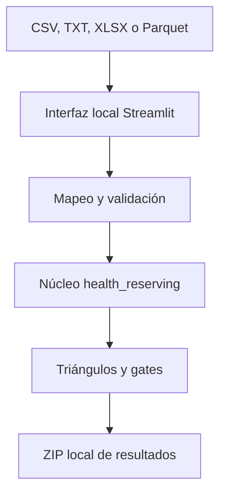

# Demo 5 · De datos propios a triángulos actuariales

## Resumen

Este demo convierte el contenido conceptual de los demos 3 y 4 en un asistente local para
principiantes. El usuario selecciona un archivo CSV, TXT delimitado, Excel o Parquet, mapea sus
columnas, confirma las definiciones de negocio y construye triángulos incrementales y acumulados
sin modificar código.

El flujo se ejecuta en el ambiente de Anaconda y abre una interfaz de Streamlit en
`http://localhost:8501`. El archivo fuente no se envía a GitHub ni se guarda automáticamente
dentro del repositorio.

El alcance de esta primera versión termina en la construcción, validación y exportación de los
triángulos. No estima todavía factores seleccionados, ultimate ni IBNR.

!!! warning "Uso educativo"
    Un triángulo reconciliado no es evidencia suficiente para aprobar Chain Ladder. La estabilidad,
    madurez, segmentación, representatividad y suficiencia estadística requieren evaluación
    actuarial adicional.

## 1. Objetivos de aprendizaje

Al finalizar el ejercicio, el usuario podrá:

1. leer un archivo local sin incorporarlo al control de versiones;
2. mapear columnas operativas a campos actuariales canónicos;
3. diferenciar validación sintáctica de confirmación semántica;
4. calcular periodo de origen, periodo calendario y edad de desarrollo;
5. construir un triángulo incremental;
6. convertirlo en acumulado;
7. diferenciar un cero observado de una celda futura;
8. reconciliar el triángulo con los datos canónicos;
9. interpretar los gates de preparación relevantes;
10. exportar resultados y configuración de forma reproducible.

## 2. Arquitectura



La interfaz y el cálculo están separados:

```text
apps/triangle_workshop.py
    Interfaz, selección de archivo y explicaciones.

src/health_reserving/
    config.py       Configuración reproducible.
    ingestion.py    Lectura local de texto delimitado, XLSX y Parquet.
    validation.py   Mapeo y controles no compensatorios.
    triangles.py    Construcción, máscara y reconciliación.
    export.py       Paquete ZIP generado en memoria.

scripts/iniciar_asistente_triangulos.py
    Lanzador local para principiantes.
```

Esta separación permite reutilizar el mismo motor desde Streamlit, un notebook, un proceso por
lotes o una prueba automatizada.

## 3. Requisitos del archivo de entrada

### 3.1 Campos mínimos

| Campo canónico | Significado | Ejemplos de columnas fuente |
|---|---|---|
| `fecha_origen` | ocurrencia, servicio, egreso u otra base declarada | `FECHA_SERVICIO`, `mes_origen` |
| `fecha_movimiento` | pago o movimiento que define el eje calendario | `FECHA_PAGO`, `mes_pago` |
| `importe_incremental` | valor ocurrido únicamente en ese movimiento | `VALOR_PAGADO`, `pago_incremental` |

### 3.2 Campos recomendados

| Campo | Utilidad |
|---|---|
| identificador de movimiento | evaluar unicidad y duplicados |
| tipo de movimiento | distinguir pago, reverso, recuperación o glosa |
| segmento | construir una población más homogénea |

Los importes deben ser incrementales. Si cada fila contiene un saldo acumulado, el archivo debe
transformarse antes de utilizar el asistente.

### 3.3 Formatos admitidos

| Formato | Extensiones | Opciones de lectura |
|---|---|---|
| texto delimitado | `.csv`, `.txt` | coma, punto y coma, tabulación, `|` o detección automática; decimal, miles y codificación |
| Excel | `.xlsx` | selección de hoja |
| Apache Parquet | `.parquet`, `.pq` | conserva los tipos almacenados; no usa separador ni codificación |

Los archivos TXT deben ser **delimitados**. Esta versión no interpreta archivos de ancho fijo ni
documentos de texto libre. Parquet suele ocupar menos espacio en disco, pero al abrirse se carga
como un `DataFrame` de pandas y puede requerir más memoria que el tamaño del archivo comprimido.

## 4. Instalación con Anaconda

Desde Anaconda Prompt en Windows o Terminal en macOS:

```bash
git clone https://github.com/jaforero/health-insurance-reserving-handbook.git
cd health-insurance-reserving-handbook
conda env create -f environment.yml
conda activate reserving-handbook
```

El archivo `environment.yml` instala Python, pandas, OpenPyXL, PyArrow, PyYAML, Streamlit y el
paquete local `health_reserving`.

Si el ambiente ya existe y cambió la configuración:

```bash
conda env update -f environment.yml --prune
conda activate reserving-handbook
```

## 5. Iniciar el asistente

Desde la raíz del repositorio:

```bash
python scripts/iniciar_asistente_triangulos.py
```

El navegador abrirá normalmente:

```text
http://localhost:8501
```

Para detenerlo, regrese a la terminal y presione `Ctrl+C`.

## 6. Recorrido guiado

### Paso 1 — Seleccionar la fuente

Existen dos rutas:

- utilizar el dataset sintético mensual incluido;
- seleccionar un CSV, TXT delimitado, XLSX o Parquet local.

Para CSV y TXT pueden configurarse separador, decimal, miles y codificación. Para Excel puede
elegirse la hoja de trabajo. Parquet conserva su esquema y no necesita opciones de texto ni hoja.

La vista preliminar muestra como máximo diez filas y veinte columnas. Los campos cuyo nombre
sugiere información personal se ocultan visualmente.

### Paso 2 — Mapear columnas

La aplicación propone columnas por similitud de nombre, pero el usuario debe confirmarlas. Una
columna fuente no puede representar simultáneamente dos campos canónicos.

El mapeo automático es una ayuda de interfaz, no una validación semántica. Por ejemplo, una columna
llamada `Periodo` podría representar pago, contabilización, radicación o cierre.

### Paso 3 — Definir el alcance

El usuario selecciona:

- periodicidad mensual, trimestral o anual;
- fecha de valoración;
- edad máxima de desarrollo;
- moneda;
- tratamiento de negativos;
- segmento, cuando exista;
- confirmaciones de obligación, fechas, medida y completitud.

La edad máxima no puede truncar movimientos observados. Si el archivo contiene un pago en edad 18,
el horizonte seleccionado debe ser al menos 18.

### Paso 4 — Validar

Los siguientes hallazgos bloquean la construcción:

- fechas nulas o no interpretables;
- fecha de movimiento anterior a la de origen;
- movimientos posteriores a la valoración;
- importes nulos, no numéricos o infinitos;
- negativos no confirmados;
- duplicados según los campos mapeados;
- identificadores de movimiento repetidos;
- confirmaciones semánticas pendientes.

La ausencia de identificador genera una advertencia porque limita la evaluación de integridad, pero
no impide el aprendizaje con datos agregados.

### Paso 5 — Construir periodos y desarrollo

Para frecuencia mensual:

$$
d = 12(año_c-año_o)+(mes_c-mes_o).
$$

Para frecuencia trimestral o anual se utiliza la diferencia ordinal entre los periodos
correspondientes.

El formato largo agregado conserva:

```text
periodo_origen
periodo_calendario
edad_desarrollo
importe_incremental
```

### Paso 6 — Construir la máscara observada

La fecha de valoración determina qué celdas pertenecen a la experiencia observada:

$$
M_{i,j}=
\begin{cases}
1, & \text{si el periodo calendario } i+j \text{ no supera la valoración},\\
0, & \text{si la celda pertenece al futuro}.
\end{cases}
$$

Dentro de la máscara, la ausencia de movimientos se representa con cero. Fuera de la máscara se
conserva `NaN` y la interfaz muestra una celda vacía.

### Paso 7 — Construir el triángulo incremental

$$
X_{i,j}=\sum_{r\in(i,j)} importe_r.
$$

Ejemplo:

| Periodo origen | `dev_0` | `dev_1` | `dev_2` |
|---|---:|---:|---:|
| 2024-01 | 100 | 0 | 50 |
| 2024-02 | 120 | 20 |  |
| 2024-03 | 130 |  |  |

El cero de enero en `dev_1` está observado. El vacío de febrero en `dev_2` es futuro.

### Paso 8 — Construir el acumulado

$$
C_{i,j}=\sum_{k=0}^{j}X_{i,k}.
$$

El acumulado equivalente es:

| Periodo origen | `dev_0` | `dev_1` | `dev_2` |
|---|---:|---:|---:|
| 2024-01 | 100 | 100 | 150 |
| 2024-02 | 120 | 140 |  |
| 2024-03 | 130 |  |  |

### Paso 9 — Reconciliar

El motor verifica:

$$
\sum_r importe_r
\approx
\sum_{i,j:M_{i,j}=1}X_{i,j}.
$$

La tolerancia numérica evita interpretar diferencias de representación de punto flotante como
diferencias económicas. El estado debe ser `RECONCILIADO` antes de utilizar la estructura en una
etapa posterior.

### Paso 10 — Interpretar gates

El MVP evalúa los gates del Demo 4 que son relevantes para construcción:

| Gate | Evaluación |
|---|---|
| G0 | obligación y medida definidas |
| G1 | fechas, orden temporal y corte |
| G2 | importes y semántica de la medida |
| G3 | integridad y reconciliación |
| G4 | historia, desarrollo y continuidad |
| G7 | representatividad confirmada |
| G9 | configuración y salidas versionables |

Los mínimos predeterminados de 36 periodos de origen y 12 edades de desarrollo son heurísticas
educativas. No constituyen un estándar actuarial universal.

## 7. Resultados descargables

La aplicación genera en memoria `demo5_resultados_triangulos.zip`:

| Archivo | Contenido |
|---|---|
| `01_validaciones.csv` | errores y advertencias |
| `02_datos_largos_agregados.csv` | celdas observadas en formato largo |
| `03_triangulo_incremental.csv` | medida por edad |
| `04_triangulo_acumulado.csv` | medida acumulada |
| `05_mascara_observada.csv` | diferencia entre observación y futuro |
| `06_diagnostico.csv` | perfil, suficiencia y reconciliación |
| `07_gates.csv` | gates relevantes |
| `08_configuracion.json` | mapeo y decisiones del usuario |
| `09_manifiesto.json` | versión, fecha y hash reproducible |

El detalle fila a fila se excluye por defecto. Puede incorporarse explícitamente, pero el usuario
debe evaluar sensibilidad, políticas internas y necesidad de conservarlo.

## 8. Privacidad y seguridad

La configuración fuerza el servidor a `localhost`, mantiene habilitadas las protecciones CORS y
XSRF y desactiva la recopilación de estadísticas de uso de Streamlit.

Las rutas `user_data/`, `outputs/`, `resultados_usuario/` y `.streamlit/secrets.toml` están excluidas
del repositorio. Aun así, el usuario es responsable de:

- seudonimizar identificadores personales;
- aplicar el principio de mínima información;
- no copiar archivos internos a carpetas sincronizadas sin autorización;
- eliminar resultados locales cuando dejen de ser necesarios;
- respetar las políticas de seguridad de su organización.

## 9. Limitaciones del MVP

La primera versión:

- procesa un archivo por ejecución;
- soporta CSV, TXT delimitado, XLSX y Parquet;
- utiliza pandas y mantiene el archivo cargado en memoria;
- permite un filtro de segmento por ejecución;
- asume que la medida mapeada es incremental;
- no deduplica automáticamente;
- no selecciona factores;
- no estima ultimate ni IBNR;
- no sustituye conciliación contable independiente.

El cargador visual está configurado para un máximo de 200 MB. El tamaño comprimido de un Parquet
no representa su consumo final en memoria. Archivos mayores o procesos con millones de filas
pueden requerir una futura implementación con DuckDB, Polars o lectura por lotes.

## 10. Pruebas reproducibles

Ejecute:

```bash
python -m unittest discover -s tests -p "test_*.py"
```

Las pruebas del MVP verifican:

- ceros observados frente a celdas futuras;
- acumulación correcta;
- reconciliación;
- bloqueo de negativos no confirmados;
- bloqueo de duplicados;
- confirmaciones semánticas no compensatorias;
- segmentación;
- lectura en memoria de CSV y TXT delimitado;
- conservación de tipos al leer Parquet;
- privacidad del paquete exportado;
- compatibilidad con las regresiones del Demo 3.

## 11. Adaptación responsable

Antes de utilizar un archivo interno:

1. documente la obligación y el propósito;
2. confirme las definiciones con operaciones y finanzas;
3. verifique bruto frente a neto y moneda;
4. clasifique reversos y recuperaciones;
5. revise cambios de cobertura, red, TPA y sistemas;
6. concilie el total contra la fuente autorizada;
7. documente filtros y exclusiones;
8. evalúe estabilidad por segmento;
9. conserve la configuración y el manifiesto;
10. solicite revisión actuarial antes de estimar reservas.

## Bibliografía comentada

- [Construcción de triángulos](../part-01-foundations/02-triangle-construction.md): define origen,
  desarrollo, diagonal, segmentación y control de calidad.
- [Triángulos incrementales y acumulados](../part-01-foundations/04-incremental-vs-cumulative-triangles.md):
  fundamenta la distinción entre ceros observados y desarrollo futuro.
- [Demo 3 mensual](03-demo-triangulos-mensuales-salud.md): aporta el diseño 60/24 y los controles
  reproducibles del generador sintético.
- [Demo 4 de preparación](04-demo-preparacion-datos.md): aporta el mapeo canónico, los controles
  semánticos y la lógica de gates.
- [Factores edad-a-edad](../part-01-foundations/05-age-to-age-development-factors.md): siguiente paso
  conceptual después de construir un triángulo defendible.

## Checklist práctico

- [ ] El ambiente Conda se creó sin errores.
- [ ] La aplicación abrió únicamente en `localhost`.
- [ ] El archivo contiene importes incrementales.
- [ ] Las fechas de origen y movimiento fueron confirmadas.
- [ ] La fecha de valoración coincide con la completitud del extracto.
- [ ] Los negativos están clasificados y fueron revisados.
- [ ] Los duplicados fueron resueltos antes de continuar.
- [ ] Los ceros observados se distinguen de las celdas futuras.
- [ ] El triángulo incremental reconcilia con el total canónico.
- [ ] El acumulado reconcilia con los incrementales.
- [ ] Los gates fallidos fueron interpretados.
- [ ] El ZIP no contiene detalle sensible innecesario.
- [ ] Configuración y manifiesto se conservaron para reproducibilidad.
- [ ] No se interpretó el resultado como una reserva aprobada.
