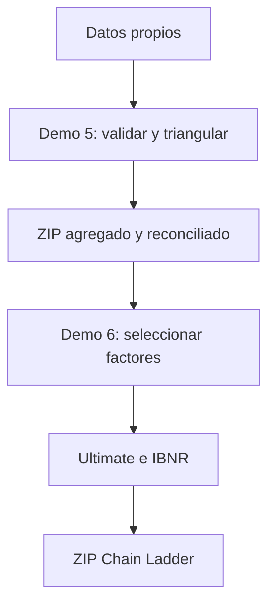

# Demo 6 · Chain Ladder con datos propios

## Resumen

Demo 6 continúa el recorrido iniciado en Demo 5. Recibe un triángulo acumulado reconciliado,
calcula ratios individuales y factores edad-a-edad, permite seleccionar el patrón de desarrollo y
estima ultimate e IBNR por periodo de origen.

La aplicación se ejecuta localmente con Streamlit. Los triángulos cargados no se envían a GitHub
ni a servicios externos. El paquete descargable contiene únicamente información agregada.

!!! warning "Alcance determinístico"
    Este demo no calcula error de predicción, intervalos de confianza, Mack ni bootstrap. Un
    resultado mecánicamente correcto no demuestra que el patrón histórico sea representativo.

## 1. Objetivos de aprendizaje

Al finalizar el ejercicio, el usuario podrá:

1. distinguir ratios individuales de factores seleccionados;
2. calcular el promedio ponderado por volumen;
3. comparar promedio simple, mediana y últimos tres orígenes;
4. documentar una selección manual;
5. incorporar un factor de cola explícito;
6. calcular CDF, madurez, ultimate e IBNR;
7. completar las celdas futuras del triángulo acumulado;
8. revisar alertas de suficiencia, dispersión y acumulados decrecientes;
9. evaluar sensibilidad a diferentes reglas de selección;
10. exportar una ejecución reproducible sin detalle fila a fila.

## 2. Flujo entre Demo 5 y Demo 6



Demo 6 verifica que el paquete de Demo 5 contenga:

- triángulo acumulado;
- máscara que distingue observados y futuros;
- configuración y manifiesto;
- estado de reconciliación;
- hash SHA-256 de los datos agregados.

El detalle canónico y el archivo fuente original no son necesarios para ejecutar Chain Ladder.
Sin embargo, deben permanecer disponibles bajo el gobierno de datos de la entidad para
reconciliación, auditoría e investigación de anomalías.

## 3. Método implementado

Para cada enlace entre edades $j$ y $j+1$, el factor ponderado por volumen es:

$$
f_j = \frac{\sum_i C_{i,j+1}}{\sum_i C_{i,j}}
$$

Los pares con denominador no positivo se excluyen y quedan contados en el diagnóstico. Si un
enlace no conserva ningún par válido, la ejecución se detiene porque no puede completarse la
cadena de desarrollo.

El factor acumulado desde la edad $k$ hacia ultimate es:

$$
CDF_k = \left(\prod_{j=k}^{J-1} f_j\right) \times f_{cola}
$$

Para cada periodo de origen:

$$
Ultimate_i = C_{i,k} \times CDF_k
$$

$$
IBNR_i = Ultimate_i - C_{i,k}
$$

La implementación no aplica un piso implícito de cero al IBNR. Un resultado negativo permanece
visible y requiere interpretación, especialmente cuando existen recuperaciones, reversos o
factores seleccionados menores que uno.

## 4. Métodos de selección

| Selección | Definición | Uso educativo |
|---|---|---|
| Ponderado por volumen | suma de acumulados siguientes dividida por suma de actuales | base Chain Ladder tradicional |
| Promedio simple | media de ratios individuales válidos | muestra el peso igual por origen |
| Mediana | mediana de ratios individuales | reduce sensibilidad a extremos |
| Últimos 3 | media simple de los tres ratios más recientes disponibles | muestra sensibilidad a experiencia reciente |
| Manual | factor ingresado para cada enlace | documenta juicio actuarial explícito |

Ninguna regla es automáticamente superior. La selección debe considerar volumen, cambios de
operación, mezcla, tendencia, calendario, glosas, recuperaciones y suficiencia por edad.

## 5. Factor de cola

El valor predeterminado es `1.000000`, que supone que la última edad visible representa ultimate.
Un valor diferente de uno queda registrado en configuración, manifiesto y diagnósticos.

La cola no debe elegirse únicamente para aumentar o reducir la reserva. Debe sustentarse con
historia adicional, curvas de maduración, experiencia externa pertinente o una metodología
documentada.

## 6. Controles implementados

El núcleo bloquea:

- triángulos vacíos;
- edades no consecutivas o que no comienzan en `dev_0`;
- periodos de origen duplicados;
- celdas marcadas como observadas sin valor numérico;
- valores futuros diligenciados en el triángulo de entrada;
- huecos dentro de la historia observada;
- enlaces sin pares válidos;
- factores seleccionados no finitos o no positivos;
- paquetes de Demo 5 incompletos, no reconciliados o con hash inconsistente.

También alerta, sin decidir por el actuario, sobre:

- acumulados decrecientes;
- ratios individuales menores que uno;
- enlaces con pocas observaciones;
- dispersión elevada de ratios;
- periodos cuyo último acumulado es cero;
- concentración del IBNR en periodos recientes;
- uso de un factor de cola distinto de uno.

## 7. Ejecución local

Desde la raíz del repositorio:

```bash
conda activate reserving-handbook
python scripts/iniciar_chain_ladder.py
```

También puede ejecutarse directamente:

```bash
python -m streamlit run apps/chain_ladder_workshop.py
```

La interfaz se abre normalmente en `http://localhost:8501`.

### 7.1 Aprender con el ejemplo

Selecciona **Aprender con el ejemplo mensual**. La aplicación utiliza el triángulo sintético de
60 meses de origen y desarrollo 0–24 incluido en Demo 3.

### 7.2 Utilizar datos propios

1. Ejecuta Demo 5 con el archivo local.
2. Completa los controles y construye los triángulos.
3. Descarga `demo5_resultados_triangulos.zip`.
4. Abre Demo 6.
5. Selecciona **Usar un paquete ZIP de Demo 5**.
6. Carga el ZIP sin descomprimirlo.
7. Revisa factores, cola y confirmación actuarial.
8. Ejecuta **Estimar ultimate e IBNR**.

## 8. Resultados descargables

El ZIP de Demo 6 incluye:

| Archivo | Contenido |
|---|---|
| `01_triangulo_acumulado_observado.csv` | valores usados para estimar factores |
| `02_mascara_observada.csv` | distinción entre observado y futuro |
| `03_factores_individuales.csv` | ratios por origen y enlace |
| `04_seleccion_factores.csv` | candidatos, selección y alertas |
| `05_cdf_a_ultimate.csv` | factor acumulado desde cada edad |
| `06_triangulo_acumulado_proyectado.csv` | celdas futuras completadas |
| `07_triangulo_incremental_proyectado.csv` | incrementos observados y proyectados |
| `08_resultados_por_origen.csv` | madurez, ultimate e IBNR |
| `09_totales.csv` | resumen agregado |
| `10_diagnosticos.csv` | alertas automáticas |
| `11_configuracion.json` | método, cola y parámetros |
| `12_manifiesto.json` | versión, hash y trazabilidad |

## 9. Arquitectura

```text
apps/chain_ladder_workshop.py
    Interfaz educativa y estado de sesión.

src/health_reserving/chain_ladder.py
    Validación, factores, CDF, proyección, resultados y sensibilidad.

src/health_reserving/export.py
    ZIP agregado generado completamente en memoria.

src/health_reserving/ui_theme.py
    Identidad visual compartida con Demo 5.

tests/test_chain_ladder.py
    Pruebas numéricas, controles y exportación.

tests/test_chain_ladder_app.py
    Prueba integral de la interfaz con el ejemplo mensual.
```

## 10. Limitaciones y siguientes pasos

Demo 6 implementa la primera etapa del comparador de métodos clásicos. Los siguientes incrementos
incorporarán Bornhuetter-Ferguson, Benktander y Cape Cod cuando se definan exposición y expectativa
previa defendibles.

Antes de utilizar el resultado profesionalmente se requiere, como mínimo:

1. reconciliación independiente contra sistemas y contabilidad;
2. evaluación de cambios de mezcla, beneficios, red, tarifas y operación;
3. diagnóstico de efectos calendario;
4. justificación de exclusiones, factores y cola;
5. sensibilidad y backtesting proporcional a la materialidad;
6. comparación contra métodos que incorporen exposición o priors;
7. cuantificación de incertidumbre;
8. revisión y aprobación bajo el gobierno actuarial aplicable.

## 11. Referencias relacionadas

- [Factores edad-a-edad](../part-01-foundations/05-age-to-age-development-factors.md)
- [Método Chain Ladder](../part-02-classical-reserving/06-chain-ladder-method.md)
- [Diagnósticos de Chain Ladder](../part-02-classical-reserving/07-chain-ladder-diagnostics.md)
- [Chain Ladder de Mack](../part-03-stochastic-reserving/08-mack-chain-ladder.md)
- [Ciclo de vida y rezagos operativos](../part-06-health-specific/22-health-claim-lifecycle-and-operational-lags.md)
