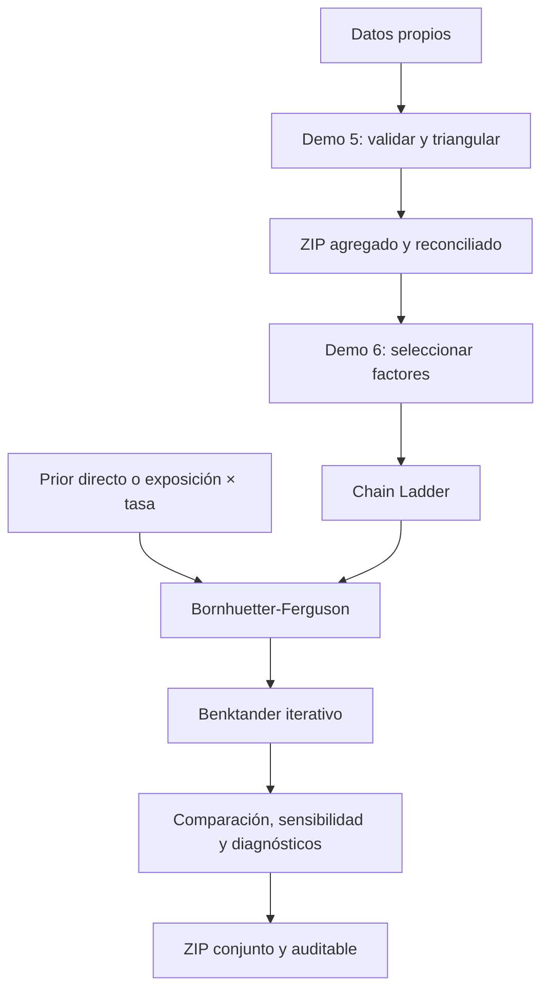

# Demo 6 · Chain Ladder, Bornhuetter-Ferguson y Benktander

## Resumen

Demo 6 continúa el recorrido iniciado en Demo 5. Recibe un triángulo acumulado reconciliado,
calcula ratios individuales y factores edad-a-edad, permite seleccionar el patrón de desarrollo y
estima costo proyectado y pasivo no pagado por periodo de origen. En una segunda etapa incorpora una expectativa
previa trazable y compara Chain Ladder con Bornhuetter-Ferguson (BF). Una tercera etapa aplica
Benktander con iteraciones configurables y muestra la transición desde el prior hacia Chain Ladder.

La aplicación se ejecuta localmente con Streamlit. Los triángulos y priors cargados no se envían a
GitHub ni a servicios externos. El paquete descargable contiene únicamente información agregada y
los priors normalizados necesarios para reproducir el cálculo, nunca los archivos fuente.

!!! warning "Alcance determinístico"
    Este demo no calcula error de predicción, intervalos de confianza, Mack ni bootstrap. Un
    resultado mecánicamente correcto no demuestra que el patrón histórico o el prior sean
    representativos.

!!! danger "El residual pagado no es IBNR puro"
    Con un triángulo agregado exclusivamente pagado, el demo estima el **pasivo no pagado total**.
    No puede separar IBNR puro, RBNS e IBNER sin fecha de reporte, reserva caso o incurrido y
    estado de reclamación. El término costo final solo se usa cuando existe una cola explícita;
    con cola `1.0` no sustentada, la lectura correcta es acumulado proyectado a edad terminal.

## Información que se muestra al cargar un archivo

Después de validar el ZIP de Demo 5, r2 presenta tres tablas antes de permitir el cálculo:

1. **Qué se recibió:** dimensión, celdas observadas, medida, moneda, valuación, segmento y trazabilidad.
2. **Qué falta o sería deseable:** reporte/aviso, reserva caso, estado, exposición, segmentación,
   recuperaciones, reclamaciones grandes, runoff y cambios operativos.
3. **Qué puede calcularse:** proyección determinística y pasivo no pagado total; costo final solo
   con cola; IBNR puro, RBNS e IBNER quedan marcados como no identificables.

La validación estructural del archivo no implica que su historia sea representativa ni que el
resultado sea apto para estados financieros.

## 1. Objetivos de aprendizaje

Al finalizar el ejercicio, el usuario podrá:

1. distinguir ratios individuales de factores seleccionados;
2. calcular el promedio ponderado por volumen;
3. comparar promedio simple, mediana y últimos tres orígenes;
4. documentar una selección manual;
5. incorporar un factor de cola explícito;
6. calcular CDF, madurez, costo proyectado y pasivo no pagado;
7. completar las celdas futuras del triángulo acumulado;
8. revisar alertas de suficiencia, dispersión y acumulados decrecientes;
9. evaluar sensibilidad a diferentes reglas de selección;
10. cargar y mapear un prior directo o una exposición por tasa esperada;
11. calcular BF aplicando el prior solo a la proporción no desarrollada;
12. comparar Chain Ladder y BF y someter el prior a shocks;
13. comprobar que una iteración Benktander equivale a BF;
14. evaluar la sensibilidad del resultado al número de iteraciones;
15. exportar una ejecución reproducible sin detalle fila a fila ni archivos fuente.

## 2. Flujo entre Demo 5 y Demo 6



Demo 6 verifica que el paquete de Demo 5 contenga:

- triángulo acumulado;
- máscara que distingue observados y futuros;
- configuración y manifiesto;
- estado de reconciliación;
- hash SHA-256 de los datos agregados.

El detalle canónico y el archivo fuente original no son necesarios para ejecutar los métodos. El
prior sí debe tener exactamente un registro por periodo de origen y conciliar con los orígenes del
triángulo. Las fuentes originales deben permanecer disponibles bajo el gobierno de datos de la
entidad para reconciliación, auditoría e investigación de anomalías.

## 3. Método implementado

Para cada enlace entre edades $j$ y $j+1$, el factor ponderado por volumen es:

$$
f_j = \frac{\sum_i C_{i,j+1}}{\sum_i C_{i,j}}
$$

Los pares con denominador no positivo se excluyen y quedan contados en el diagnóstico. Si un
enlace no conserva ningún par válido, la ejecución se detiene porque no puede completarse la
cadena de desarrollo.

El factor acumulado desde la edad $k$ hacia la edad terminal, más una cola explícita si existe, es:

$$
CDF_k = \left(\prod_{j=k}^{J-1} f_j\right) \times f_{cola}
$$

Para cada periodo de origen:

$$
\widehat{C}_{i,final} = C_{i,k} \times CDF_k
$$

$$
\widehat{L}_{i,no\ pagado} = \widehat{C}_{i,final} - C_{i,k}
$$

La implementación no aplica un piso implícito de cero al pasivo no pagado. Un resultado negativo permanece
visible y requiere interpretación, especialmente cuando existen recuperaciones, reversos o
factores seleccionados menores que uno.

### 3.1 Bornhuetter-Ferguson

Para cada origen $i$, la proporción no desarrollada se obtiene a partir del CDF de Chain Ladder:

$$
\text{No desarrollado}_i = 1 - \frac{1}{CDF_i}
$$

El prior puede suministrarse directamente como costo final esperado $U_i^{prior}$ o calcularse como
exposición por tasa esperada:

$$
U_i^{prior} = E_i \times r_i
$$

Entonces:

$$
L_{i,no\ pagado}^{BF} = U_i^{prior} \times \text{No desarrollado}_i
$$

$$
\widehat{C}_{i,final}^{BF} = C_{i,k} + L_{i,no\ pagado}^{BF}
$$

El motor conserva intacto el resultado Chain Ladder que determina la madurez. No utiliza la
experiencia emergente para recalibrar silenciosamente el prior.

<!-- v0.6.0-sprint2-benktander -->
### 3.2 Benktander

Con $q_i = 1 - 1/CDF_i$ y prior inicial $U_i^{(0)}$, el motor aplica:

$$
U_i^{(n)} = C_{i,k} + q_i U_i^{(n-1)}
$$

y valida la forma cerrada equivalente:

$$
U_i^{(n)} = (1-q_i^n)U_i^{CL} + q_i^n U_i^{(0)}
$$

La iteración 1 reproduce BF. La iteración 0 se conserva únicamente como escenario de
sensibilidad del prior; la interfaz exige al menos una iteración para calcular Benktander.

### 3.3 Estado de la comparación clásica

| Método o control | Estado al preparar v0.6.0 Sprint 2 |
|---|---|
| Chain Ladder | implementado y probado |
| Bornhuetter-Ferguson | implementado y probado |
| Benktander | implementado, reconciliado y probado |
| Cape Cod | especificación técnica lista; implementación pendiente |
| backtesting ampliado | contrato documental listo; implementación pendiente |
| comparación reconciliada de cuatro métodos | contrato documental listo; implementación pendiente |

Cape Cod, el backtesting ampliado y la comparación de cuatro métodos permanecen pendientes. Su
especificación documental no debe interpretarse como evidencia de disponibilidad en la interfaz.

## 4. Métodos de selección

| Selección | Definición | Uso educativo |
|---|---|---|
| Ponderado por volumen | suma de acumulados siguientes dividida por suma de actuales | base Chain Ladder tradicional |
| Promedio simple | media de ratios individuales válidos | muestra el peso igual por origen |
| Mediana | mediana de ratios individuales | reduce sensibilidad a extremos |
| Últimos 3 | media simple de los tres ratios más recientes disponibles | muestra sensibilidad a experiencia reciente |
| Manual | factor ingresado para cada enlace | documenta juicio actuarial explícito |

Ninguna regla es automáticamente superior. La selección debe considerar volumen, cambios de
operación, mezcla, tendencia, calendario, glosas, recuperaciones y suficiencia por edad.

## 5. Factor de cola

Para archivos del usuario el valor inicial es `1.000000`: significa que no se agregó una cola,
no que la última edad sea necesariamente final. La muestra r2 utiliza el factor sintético
35→48 `1.0052495821422405`, conocido porque el generador conserva runoff completo.
Un valor diferente de uno queda registrado en configuración, manifiesto y diagnósticos.

La cola no debe elegirse únicamente para aumentar o reducir la reserva. Debe sustentarse con
historia adicional, curvas de maduración, experiencia externa pertinente o una metodología
documentada.

## 6. Controles implementados

El núcleo bloquea:

- triángulos vacíos;
- edades no consecutivas o que no comienzan en `dev_0`;
- periodos de origen duplicados;
- celdas marcadas como observadas sin valor numérico;
- valores futuros diligenciados en el triángulo de entrada;
- huecos dentro de la historia observada;
- enlaces sin pares válidos;
- factores seleccionados no finitos o no positivos;
- paquetes de Demo 5 incompletos, no reconciliados o con hash inconsistente.

También alerta, sin decidir por el actuario, sobre:

- acumulados decrecientes;
- ratios individuales menores que uno;
- enlaces con pocas observaciones;
- dispersión elevada de ratios;
- periodos cuyo último acumulado es cero;
- concentración del pasivo no pagado en periodos recientes;
- uso de un factor de cola distinto de uno.

Para BF también bloquea:

- orígenes faltantes, adicionales o duplicados en el prior;
- columnas reutilizadas para significados incompatibles;
- exposición, tasa o costo final esperado no numéricos, no finitos o negativos;
- shocks del prior inválidos;
- discrepancias entre la configuración y las columnas suministradas.

Y alerta sobre CDF menores que uno, priors iguales a cero, pasivo BF negativo y diferencias
materiales frente a Chain Ladder. Las alertas informan; no sustituyen el juicio actuarial.

Para Benktander también valida la reconciliación exacta entre CL y BF, la equivalencia numérica
entre recurrencia y forma cerrada y la finitud de todas las salidas. Alerta sobre CDF menores que
uno, pesos fuera del intervalo de cero a uno y pasivo no pagado negativo sin ocultar esos resultados.

## 7. Ejecución local

Desde la raíz del repositorio:

```bash
conda activate reserving-handbook
python scripts/iniciar_chain_ladder.py
```

También puede ejecutarse directamente:

```bash
python -m streamlit run apps/chain_ladder_workshop.py
```

La interfaz se abre normalmente en `http://localhost:8501`.

### 7.1 Aprender con el ejemplo

Selecciona **Aprender con el ejemplo mensual**. La aplicación utiliza el triángulo sintético de
72 meses de origen y 36 edades 0–35 incluido en Demo 3. La aplicación muestra además la vista
tradicional 36×36 y documenta el runoff sintético hasta edad 48.

### 7.2 Utilizar datos propios

1. Ejecuta Demo 5 con el archivo local.
2. Completa los controles y construye los triángulos.
3. Descarga `demo5_resultados_triangulos.zip`.
4. Abre Demo 6.
5. Selecciona **Usar un paquete ZIP de Demo 5**.
6. Carga el ZIP sin descomprimirlo.
7. Revisa factores, cola y confirmación actuarial.
8. Ejecuta **Proyectar costo y pasivo no pagado**.

### 7.3 Incorporar el prior y ejecutar BF

Después de obtener Chain Ladder:

1. selecciona el prior sintético incluido o carga un archivo CSV, TXT, XLSX o Parquet;
2. identifica la columna de periodo de origen;
3. elige **costo final esperado directo** o **exposición × tasa esperada**;
4. mapea las columnas correspondientes;
5. define los shocks inferior y superior para la sensibilidad;
6. confirma que documentaste fuente, fecha, unidad, independencia y ajustes del prior;
7. ejecuta **Comparar Chain Ladder y Bornhuetter-Ferguson**.

El archivo de prior debe tener una fila por origen. Para el modo exposición por tasa, por ejemplo:

| mes_origen | miembros_mes | costo_esperado_por_miembro |
|---|---:|---:|
| 2021-01 | 80942 | 233275 |

Para el modo directo basta con `mes_origen` y una columna de costo final esperado, por ejemplo
`costo_final_esperado`. La interfaz también reconoce `ultimate_esperado` como alias heredado para
compatibilidad, pero no lo usa como rótulo de salida.

### 7.4 Ejecutar Benktander

Después de ejecutar BF:

1. selecciona el número de iteraciones;
2. documenta el criterio de selección;
3. confirma la trazabilidad del supuesto;
4. ejecuta **Calcular Benktander**;
5. revisa la sensibilidad desde la iteración 0 hasta los escenarios configurados.

Dos iteraciones son el valor educativo inicial del demo, no una recomendación universal. La
selección debe apoyarse en madurez, estabilidad, credibilidad del prior y backtesting.

### 7.5 Leer la comparación visual

El acumulado observado se presenta como una base común. Chain Ladder, BF y Benktander aparecen en
tarjetas paralelas con la misma jerarquía para costo final estimado y pasivo no pagado.

El gráfico principal utiliza dos líneas no apiladas sobre una escala común desde cero, porque son
estimaciones alternativas de la misma magnitud. Un segundo gráfico muestra la diferencia firmada
`BF − CL` por origen con una referencia en cero. Valores positivos representan mayor pasivo BF y
valores negativos, menor pasivo BF. Como ambos métodos parten del mismo observado, la diferencia de
costo proyectado coincide exactamente con la diferencia de pasivo no pagado.

Después de calcular Benktander, el gráfico principal presenta tres líneas no apiladas en la misma
escala. El gráfico firmado `Benktander − CL` conserva la referencia en cero y evita comunicar las
estimaciones alternativas como cantidades aditivas.

## 8. Resultados descargables

El primer botón mantiene el ZIP exclusivo de Chain Ladder e incluye:

| Archivo | Contenido |
|---|---|
| `01_triangulo_acumulado_observado.csv` | valores usados para estimar factores |
| `02_mascara_observada.csv` | distinción entre observado y futuro |
| `03_factores_individuales.csv` | ratios por origen y enlace |
| `04_seleccion_factores.csv` | candidatos, selección y alertas |
| `05_cdf_total_seleccionado.csv` | factor acumulado y cola seleccionada |
| `06_triangulo_acumulado_proyectado.csv` | celdas futuras completadas |
| `07_triangulo_incremental_proyectado.csv` | incrementos observados y proyectados |
| `08_resultados_por_origen.csv` | madurez, costo y pasivo no pagado |
| `09_totales.csv` | resumen agregado |
| `10_diagnosticos.csv` | alertas automáticas |
| `11_configuracion.json` | método, cola y parámetros |
| `12_manifiesto.json` | versión, hash y trazabilidad |
| `13_informacion_recibida.csv` | inventario de la base cargada |
| `14_informacion_faltante_deseable.csv` | datos adicionales e impacto |
| `15_alcance_calculable.csv` | resultados posibles y no identificables |

Después de ejecutar BF, el ZIP conjunto contiene los diez resultados agregados de Chain Ladder y
añade:

| Archivo | Contenido |
|---|---|
| `11_prior_bf_normalizado.csv` | prior conciliado usado por el motor |
| `12_resultados_bf_por_origen.csv` | madurez, prior, costo y pasivo no pagado CL/BF |
| `13_totales_bf.csv` | totales y diferencia BF frente a CL |
| `14_sensibilidad_prior_bf.csv` | resultado bajo cada shock configurado |
| `15_diagnosticos_bf.csv` | controles y alertas BF |
| `16_configuracion_chain_ladder.json` | supuestos de desarrollo |
| `17_configuracion_bf.json` | modo, columnas, shocks, moneda y medida |
| `18_manifiesto.json` | versiones, hashes y trazabilidad de ambas entradas agregadas |

Después de ejecutar Benktander, el mismo paquete añade:

| Archivo | Contenido |
|---|---|
| `19_resultados_benktander_por_origen.csv` | pesos, costo y pasivo no pagado Benktander |
| `20_totales_benktander.csv` | totales y diferencias frente a CL y BF |
| `21_sensibilidad_iteraciones_benktander.csv` | transición por número de iteraciones |
| `22_diagnosticos_benktander.csv` | reconciliaciones, pesos y alertas |
| `23_configuracion_benktander.json` | iteraciones, moneda, medida y sensibilidad |

El manifiesto declara explícitamente que no se incluyen los archivos fuente originales.

## 9. Arquitectura

```text
apps/chain_ladder_workshop.py
    Interfaz educativa y estado de sesión.

src/health_reserving/chain_ladder.py
    Validación, factores, CDF, proyección, resultados y sensibilidad.

src/health_reserving/bornhuetter_ferguson.py
    Contrato del prior, cálculo BF, comparación, sensibilidad y diagnósticos.

src/health_reserving/benktander.py
    Recurrencia, forma cerrada, sensibilidad, reconciliación y diagnósticos Benktander.

src/health_reserving/export.py
    ZIP de Chain Ladder y paquete conjunto generado completamente en memoria.

src/health_reserving/ui_theme.py
    Identidad visual compartida con Demo 5.

tests/test_chain_ladder.py
    Pruebas numéricas, controles y exportación.

tests/test_bornhuetter_ferguson.py
    Fórmulas BF, contratos del prior, sensibilidad y privacidad del paquete conjunto.

tests/test_benktander.py
    Equivalencia con BF, formas iterativa y cerrada, sensibilidad, controles y exportación.

tests/test_chain_ladder_app.py
    Prueba integral de Chain Ladder, BF y Benktander con el ejemplo mensual.
```

## 10. Limitaciones y siguientes pasos

<!-- v0.6.0-sprint1-demo6-next -->
!!! info "Hoja de ruta técnica de v0.6.0"
    La primera fase documental está definida en los capítulos de
    [diagnósticos y backtesting](../part-02-classical-reserving/07-chain-ladder-diagnostics.md),
    [Benktander](../part-02-classical-reserving/12-benktander-method.md),
    [Cape Cod](../part-02-classical-reserving/13-cape-cod-method.md) y
    [comparación clásica](../part-02-classical-reserving/14-classical-reserving-methods-comparison.md).
    La implementación debe mantener la base reconciliada y los resultados CL/BF existentes.

Demo 6 implementa Chain Ladder, Bornhuetter-Ferguson y Benktander. El siguiente incremento
incorporará Cape Cod; después se ampliarán backtesting, diagnósticos y la comparación reconciliada
de los cuatro métodos.

Antes de utilizar el resultado profesionalmente se requiere, como mínimo:

1. reconciliación independiente contra sistemas y contabilidad;
2. evaluación de cambios de mezcla, beneficios, red, tarifas y operación;
3. diagnóstico de efectos calendario;
4. justificación de exclusiones, factores y cola;
5. sensibilidad y backtesting proporcional a la materialidad;
6. revisión independiente de la fuente, unidad, vigencia y ajustes del prior;
7. cuantificación de incertidumbre;
8. revisión y aprobación bajo el gobierno actuarial aplicable.

## 11. Referencias relacionadas

- [Factores edad-a-edad](../part-01-foundations/05-age-to-age-development-factors.md)
- [Método Chain Ladder](../part-02-classical-reserving/06-chain-ladder-method.md)
- [Diagnósticos de Chain Ladder](../part-02-classical-reserving/07-chain-ladder-diagnostics.md)
- [Bornhuetter-Ferguson](../part-02-classical-reserving/11-bornhuetter-ferguson.md)
- [Método Benktander](../part-02-classical-reserving/12-benktander-method.md)
- [Método Cape Cod](../part-02-classical-reserving/13-cape-cod-method.md)
- [Comparación de métodos clásicos](../part-02-classical-reserving/14-classical-reserving-methods-comparison.md)
- [Chain Ladder de Mack](../part-03-stochastic-reserving/08-mack-chain-ladder.md)
- [Ciclo de vida y rezagos operativos](../part-06-health-specific/22-health-claim-lifecycle-and-operational-lags.md)
