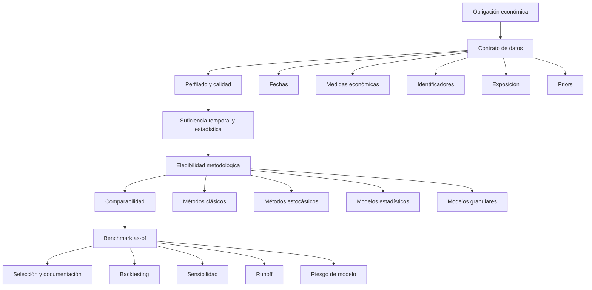
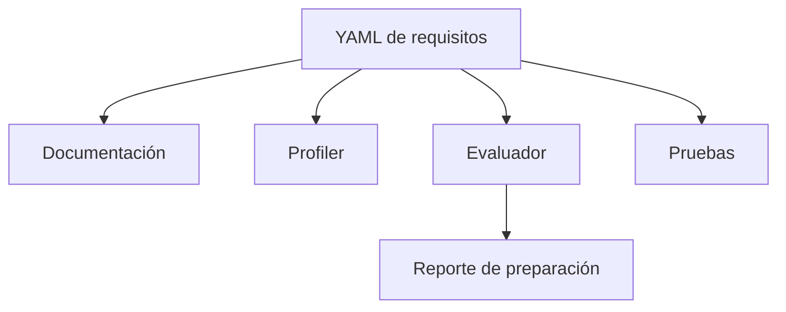
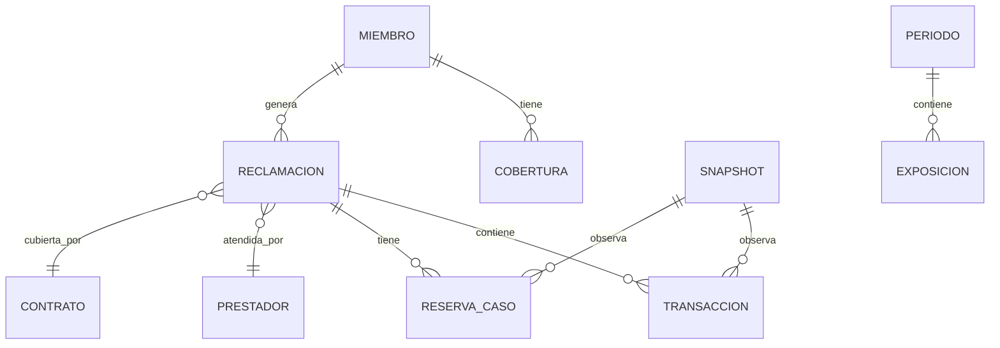

# Marco de preparación de datos para seleccionar y comparar metodologías de reserving

> **Parte 1 — Fundamentos, arquitectura, principios y taxonomía de datos**

## Resumen ejecutivo

La selección de una metodología de reserving no comienza con una fórmula. Comienza con una pregunta más básica: **¿los datos disponibles representan de forma suficiente, consistente y auditable la obligación que se desea estimar?**

En la práctica, es frecuente que un equipo disponga de un archivo con fechas, importes y dimensiones de segmentación, construya un triángulo y ejecute varios métodos. Sin embargo, la posibilidad de producir un resultado numérico no prueba que:

- el dataset represente la obligación económica correcta;
- la fecha de origen y la fecha de desarrollo estén bien definidas;
- los movimientos sean incrementales;
- los datos permitan distinguir pagos, incurridos, reservas de caso, recuperaciones y obligaciones contractuales;
- la historia sea suficiente para estimar factores;
- los métodos comparados utilicen la misma información;
- el benchmark esté libre de *leakage*;
- el resultado sea reproducible o defendible.

Este capítulo desarrolla un **marco de preparación de datos** para evaluar la elegibilidad de métodos de reserving antes de su ejecución. El marco se diseña para funcionar tanto como guía editorial como especificación de una futura herramienta automatizada que reciba un dataset cargado por el usuario y produzca:

1. un perfil de datos;
2. una matriz de elegibilidad por método;
3. una lista de brechas;
4. un plan de remediación;
5. un conjunto de métodos comparables para un benchmark.

La propuesta distingue entre:

- **presencia de datos**;
- **calidad de datos**;
- **suficiencia estadística**;
- **pertinencia económica**;
- **comparabilidad metodológica**;
- **capacidad de validación**;
- **gobierno del modelo**.

La Parte 1 define los fundamentos, la arquitectura y la taxonomía. La Parte 2 desarrollará los *gates* formales, el sistema de estados, el score de preparación, la matriz por método, el algoritmo de evaluación y un ejemplo completo.

---

## Objetivos de aprendizaje

Al finalizar esta parte, el lector podrá:

1. explicar por qué la disponibilidad de columnas no equivale a preparación actuarial;
2. separar obligación, medida, estructura temporal y método;
3. reconocer las principales capas de un framework de preparación de datos;
4. clasificar requisitos en dominios de alcance, fechas, importes, exposición, priors, segmentación, operación, validación y gobierno;
5. identificar riesgos de primer y segundo orden asociados con datasets incompletos o ambiguos;
6. diseñar un contrato de datos con nombres canónicos en español y alias opcionales en inglés;
7. formular un benchmark en el que los métodos sean verdaderamente comparables.

---

## Prerrequisitos

Se recomienda revisar previamente:

- [Guía de selección de metodologías](methodology-selection-guide.md);
- [Construcción de triángulos](part-01-foundations/02-triangle-construction.md);
- [Lags de desarrollo y transformaciones](part-01-foundations/03-development-lags-and-triangle-transformations.md);
- [Comparación de métodos clásicos](part-02-classical-reserving/14-classical-reserving-methods-comparison.md).

---

## Mapa conceptual



---

## 1. Introducción

## 1.1 El problema que este marco resuelve

En reserving, un dataset suele parecer utilizable porque contiene:

- una fecha asociada al servicio;
- una fecha asociada al pago o registro;
- un importe;
- un identificador;
- algunas variables de segmentación.

Con estos elementos puede construirse una tabla origen–desarrollo. Sin embargo, antes de llamarla “triángulo actuarial” deben resolverse preguntas fundamentales:

- ¿La fecha de origen representa ocurrencia, servicio, admisión, alta, radicación o facturación?
- ¿La fecha calendario representa pago, reconocimiento, adjudicación, contabilización o extracción?
- ¿El importe es pagado, facturado, permitido, reconocido, incurrido o neto?
- ¿Los importes negativos son recuperaciones, reversos, copagos, glosas o errores?
- ¿La ausencia de una celda representa cero, dato faltante o futuro no observado?
- ¿La historia contiene cortes sucesivos o solo una fotografía final?
- ¿Las filas duplicadas son copias, correcciones o transacciones legítimas?
- ¿La población cubierta es comparable entre periodos?
- ¿Los periodos recientes disponen de un prior ex ante?
- ¿Puede reconstruirse qué información estaba disponible en cada fecha histórica?

Si estas preguntas no se responden, la ejecución de varios métodos puede crear una ilusión de robustez. El problema no es la cantidad de resultados, sino que todos podrían estar respondiendo una pregunta mal definida.

## 1.2 Diferencia entre cálculo y evidencia

Un método es **computable** cuando el software puede generar un valor.

Un método es **elegible** cuando:

- responde al propósito;
- utiliza una medida económica pertinente;
- los datos superan controles mínimos;
- sus supuestos son identificables;
- existe validación razonable;
- el resultado puede gobernarse y explicarse.

Un método es **comparable** cuando comparte con los demás candidatos:

- la misma obligación;
- la misma fecha de valoración;
- el mismo segmento;
- la misma base bruta o neta;
- la misma información disponible;
- un tratamiento reconciliado de exposición, cola y grandes reclamaciones;
- una métrica de evaluación común.

Esta distinción es el fundamento del framework.

---

## 2. Motivación actuarial

## 2.1 La selección metodológica depende de la estructura de datos

Cada método utiliza una fuente de señal diferente.

| Método | Señal principal |
|---|---|
| Chain Ladder | patrón observado de desarrollo |
| Bornhuetter-Ferguson | observado + expectativa previa |
| Benktander | transición iterativa entre prior y experiencia |
| Cape Cod | exposición + experiencia desarrollada |
| Mack | variabilidad condicional del Chain Ladder |
| Bootstrap | estructura residual + proceso simulado |
| GLM | efectos explícitos de origen, desarrollo y calendario |
| GAM | relaciones no lineales suaves |
| Bayes jerárquico | pooling parcial + priors |
| Supervivencia | tiempo hasta evento |
| Multiestado | transiciones entre estados |
| Machine learning | relaciones predictivas granulares |

Por tanto, no existe un único concepto de “datos suficientes”. La suficiencia es específica al método y al propósito.

## 2.2 El mismo dataset puede habilitar unos métodos y bloquear otros

Considérese un archivo con:

- fecha de servicio;
- fecha de pago;
- importe pagado;
- identificador de factura;
- cinco años de historia.

Ese archivo podría ser razonable para:

- triángulos pagados;
- Chain Ladder;
- análisis de lags;
- un GLM agregado.

Pero seguiría siendo insuficiente para:

- Chain Ladder incurrido, por falta de reserva de caso;
- Bornhuetter-Ferguson, por falta de prior;
- Cape Cod, por falta de exposición;
- supervivencia, por falta de censura y estados;
- machine learning as-of, por falta de snapshots históricos.

La matriz debe identificar estas diferencias de forma explícita.

## 2.3 El riesgo de “benchmark por disponibilidad”

Un error frecuente es comparar únicamente los métodos que pueden ejecutarse con el archivo disponible. Esto supone implícitamente que:

> el dataset actual contiene toda la información relevante para la decisión.

Ese supuesto puede ser falso. La ausencia de meses-miembro, priors, reservas de caso o estados operativos no hace innecesarios esos datos; solo impide que ciertos métodos se evalúen.

El framework debe producir dos salidas distintas:

1. **benchmark elegible hoy**;
2. **benchmark objetivo después de completar los datos**.

---

## 3. Definición formal del problema

## 3.1 Obligación, información y método

Sea:

- \(O\): obligación económica que se desea estimar;
- \(t\): fecha de valoración;
- \(D_t\): información disponible en \(t\);
- \(m\): método candidato;
- \(\widehat{R}_{m,t}\): reserva producida por \(m\);
- \(Q(D_t)\): perfil de calidad y suficiencia de datos;
- \(G_m(D_t,O)\): conjunto de gates del método \(m\).

La elegibilidad de un método puede expresarse como:

\[
E_m(D_t,O)
=
\mathbb{1}
\left[
G_{m,1}(D_t,O)=1,\ldots,G_{m,K}(D_t,O)=1
\right].
\]

El conjunto elegible es:

\[
\mathcal{M}_{\text{elegible}}
=
\left\{
m\in\mathcal{M}:E_m(D_t,O)=1
\right\}.
\]

La comparación solo debe realizarse sobre métodos elegibles y reconciliados:

\[
\mathcal{M}_{\text{benchmark}}
\subseteq
\mathcal{M}_{\text{elegible}}.
\]

## 3.2 Elegibilidad no equivale a superioridad

Que un método sea elegible no significa que sea el mejor.

La selección posterior puede formularse conceptualmente como:

\[
m^*
=
\arg\min_{m\in\mathcal{M}_{\text{benchmark}}}
\left\{
\mathbb{E}\left[L(\widehat{R}_{m,t},R_t)\mid D_t\right]
+
\lambda_1 C_m
+
\lambda_2 MR_m
\right\},
\]

donde:

- \(L\) es una función de pérdida;
- \(C_m\) representa complejidad y costo operativo;
- \(MR_m\) representa riesgo de modelo;
- \(\lambda_1,\lambda_2\) reflejan su importancia para la decisión.

El framework de preparación de datos no resuelve esta optimización. Su función es determinar qué candidatos pueden entrar legítimamente.

## 3.3 Comparabilidad como condición adicional

Dos métodos \(m_a\) y \(m_b\) son comparables si existe una función de reconciliación \(\mathcal{C}\) tal que:

\[
\mathcal{C}(m_a,D_t,O)
=
\mathcal{C}(m_b,D_t,O),
\]

en dimensiones materiales como:

- obligación;
- medida;
- fecha;
- exposición;
- segmento;
- tratamiento de recoveries;
- moneda;
- horizonte;
- información as-of.

En la práctica, no se requiere igualdad absoluta en todos los detalles. Sí se requiere que las diferencias sean identificadas, cuantificadas y documentadas.

---

## 4. Alcance del framework

## 4.1 Incluido

El marco cubre:

- datos agregados y transaccionales;
- triángulos pagados e incurridos;
- métodos clásicos;
- métodos estocásticos;
- modelos estadísticos;
- modelos bayesianos;
- modelos de supervivencia y multiestado;
- machine learning;
- obligaciones de salud fee-for-service;
- exposición y PMPM;
- grandes reclamaciones;
- pagos prospectivos, siempre que se distingan de claims;
- evaluación as-of;
- benchmark y backtesting;
- calidad, trazabilidad y gobierno.

## 4.2 Fuera de alcance

Esta parte no define:

- la reserva regulatoria mínima de una jurisdicción;
- el tratamiento contable aplicable;
- una selección automática del valor final;
- un margen prudencial;
- una distribución de capital;
- una validación jurídica de contratos;
- un modelo universal de calidad de datos.

Estos elementos pueden incorporarse como capas posteriores.

## 4.3 Aplicación en salud

En seguros de salud, el marco debe reconocer que varias obligaciones pueden coexistir:

- fee-for-service;
- farmacia;
- capitación;
- pagos globales prospectivos;
- episodios;
- glosas;
- controversias;
- recuperaciones;
- reaseguro;
- alto costo;
- discapacidad o pagos prolongados.

No todas deben modelarse mediante triángulos. La primera decisión es clasificar la obligación.

---

## 5. Arquitectura del framework

## 5.1 Capas

La arquitectura propuesta contiene siete capas.


### Capa 1 — Propósito y obligación

Define:

- qué se estima;
- para quién;
- a qué fecha;
- bajo qué medida;
- con qué nivel de materialidad;
- con qué base bruta o neta.

### Capa 2 — Contrato de datos

Define:

- campos canónicos;
- tipos;
- reglas de negocio;
- llaves;
- alias;
- campos derivados;
- relaciones entre tablas.

### Capa 3 — Perfilado y controles

Evalúa:

- completitud;
- duplicación;
- consistencia temporal;
- valores negativos;
- outliers;
- integridad referencial;
- reconciliaciones.

### Capa 4 — Suficiencia y estabilidad

Evalúa:

- historia;
- número de cohortes;
- pares por factor;
- volumen;
- madurez;
- estacionalidad;
- cambios estructurales;
- credibilidad.

### Capa 5 — Elegibilidad por método

Aplica requisitos específicos a:

- Chain Ladder;
- BF;
- Benktander;
- Cape Cod;
- Mack;
- Bootstrap;
- GLM/GAM;
- Bayes;
- survival;
- ML.

### Capa 6 — Comparabilidad y benchmark

Define:

- candidatos;
- baseline;
- challengers;
- métricas;
- cortes as-of;
- sensibilidades;
- reglas de reconciliación.

### Capa 7 — Gobierno y comunicación

Registra:

- versiones;
- parámetros;
- resultados;
- excepciones;
- responsable;
- limitaciones;
- condiciones que cambiarían la conclusión.

## 5.2 Separación entre documentación y ejecución

La arquitectura debe tener una fuente única de verdad.



Los requisitos no deberían duplicarse manualmente entre documentos y scripts. La documentación puede explicar; el YAML debe parametrizar.

---

## 6. Principios de diseño

## 6.1 Obligación antes que dataset

El archivo disponible no define la obligación. Deben reconciliarse:

- cobertura;
- contratos;
- fechas;
- recuperaciones;
- responsabilidades transferidas;
- pagos directos;
- glosas;
- capitación;
- reaseguro.

## 6.2 Semántica antes que nombre de columna

Una columna llamada `Periodo` no prueba que sea fecha de pago.

Una columna llamada `COSTO` no prueba que sea paid.

Una columna llamada `FRECUENCIA` no prueba que sea número de siniestros.

La herramienta debe solicitar confirmación semántica cuando exista ambigüedad.

## 6.3 Gates antes que score

Un score alto no puede compensar:

- ausencia de prior en BF;
- ausencia de exposición en Cape Cod;
- ausencia de fecha de pago en paid Chain Ladder;
- ausencia de snapshots en ML as-of;
- obligación mal definida.

## 6.4 Comparabilidad antes que ranking

No debe mostrarse un ranking de métodos hasta reconciliar:

- base;
- medida;
- periodo;
- segmento;
- cola;
- grandes reclamaciones;
- información disponible.

## 6.5 Datos as-of antes que ajuste predictivo

El benchmark debe reconstruir lo que se conocía en cada fecha histórica.

Usar información final para:

- segmentar;
- imputar;
- construir priors;
- crear variables;
- definir ultimate;
- ajustar parámetros;

genera *leakage*.

## 6.6 Nombres canónicos en español

El repositorio utilizará nombres canónicos en español.

Ejemplos:

```yaml
fecha_servicio:
  alias_ingles:
    - service_date
    - incurred_date
    - occurrence_date
```

```yaml
costo_pagado:
  alias_ingles:
    - paid_amount
    - payment_amount
```

Los alias ayudan a interoperar, pero no sustituyen el estándar principal.

## 6.7 Umbrales configurables

Valores como:

- 36 meses de origen;
- 24 meses de desarrollo;
- 12 pares por factor;
- 24 observaciones;
- 5 años de historia;

son heurísticas configurables, no estándares universales.

## 6.8 Parsimonia

La herramienta debe preferir:

- reglas visibles;
- controles auditables;
- explicaciones claras;
- estados simples.

La complejidad solo se justifica si mejora una decisión material.

## 6.9 Trazabilidad

Cada resultado debe poder vincularse con:

- fuente;
- versión;
- transformación;
- parámetro;
- fecha;
- usuario;
- log de ejecución.

## 6.10 No automatizar el juicio

El framework puede bloquear métodos, detectar brechas y organizar evidencia. No debe declarar automáticamente que una reserva es adecuada o suficiente.

---

## 7. Taxonomía de dominios de datos

La preparación de datos se organiza en diez dominios.

| Código | Dominio | Objetivo |
|---|---|---|
| D1 | Alcance y obligación | Definir qué se estima |
| D2 | Fechas y estructura temporal | Construir correctamente origen, desarrollo y calendario |
| D3 | Medidas económicas | Distinguir paid, incurred, allowed, billed y recoveries |
| D4 | Identificadores y granularidad | Evitar duplicación y reconstruir movimientos |
| D5 | Historia y madurez | Evaluar suficiencia temporal |
| D6 | Exposición | Separar volumen y costo unitario |
| D7 | Priors y expectativas | Habilitar BF, Benktander y escenarios |
| D8 | Segmentación y homogeneidad | Separar patrones materiales |
| D9 | Operación y contratos | Explicar cambios y obligaciones no basadas en claims |
| D10 | Validación y gobierno | Permitir backtesting y reproducibilidad |

---

## 8. Dominio D1 — Alcance y obligación

## 8.1 Preguntas mínimas

1. ¿Cuál es la obligación?
2. ¿Qué evento la origina?
3. ¿Cuál es la fecha de valoración?
4. ¿La medida es bruta o neta?
5. ¿Incluye gastos de administración de claims?
6. ¿Incluye recuperaciones?
7. ¿Qué población y beneficios cubre?
8. ¿Cuál es el usuario del resultado?
9. ¿Cuál es la base contable o regulatoria?
10. ¿Qué nivel de materialidad aplica?

## 8.2 Campos documentales sugeridos

| Campo | Descripción |
|---|---|
| `id_evaluacion` | identificador del análisis |
| `fecha_valoracion` | fecha as-of |
| `proposito` | reporte, gestión, pricing, solvencia |
| `usuario_previsto` | destinatario |
| `obligacion` | descripción económica |
| `medida_objetivo` | paid, incurred, allowed, contractual |
| `base_bruta_neta` | gross o net |
| `segmento_objetivo` | población |
| `moneda` | COP, USD, etc. |
| `nivel_materialidad` | umbral o criterio |

## 8.3 Riesgo de falla

Si D1 falla, ningún método debe ejecutarse como benchmark central. El problema no es de datos; es de definición.

---

## 9. Dominio D2 — Fechas y estructura temporal

## 9.1 Fechas relevantes en salud

| Nombre canónico | Definición |
|---|---|
| `fecha_servicio` | fecha de prestación |
| `fecha_ocurrencia` | fecha del evento asegurado |
| `fecha_admision` | ingreso hospitalario |
| `fecha_alta` | egreso hospitalario |
| `fecha_radicacion` | presentación de la cuenta |
| `fecha_reporte` | primer conocimiento del claim |
| `fecha_adjudicacion` | reconocimiento o decisión |
| `fecha_pago` | desembolso |
| `fecha_contabilizacion` | reconocimiento contable |
| `fecha_valoracion` | corte as-of |
| `fecha_snapshot` | fecha de extracción histórica |

## 9.2 Desarrollo

Si la periodicidad es mensual:

\[
d
=
12(año_c-año_o)+(mes_c-mes_o),
\]

donde:

- \(o\) es la fecha de origen;
- \(c\) es la fecha calendario.

Debe cumplirse, salvo excepciones documentadas:

\[
fecha\_origen
\leq
fecha\_calendario
\leq
fecha\_valoracion.
\]

## 9.3 Controles

- rezagos negativos;
- fechas futuras;
- meses inválidos;
- timezone;
- granularidad diaria vs. mensual;
- fecha imputada;
- movimientos retroactivos;
- reversiones posteriores;
- falta de snapshots.

## 9.4 Riesgo de falla

Usar fecha de contabilización en lugar de pago puede modelar el proceso contable, no el desarrollo de pagos. Esto puede ser válido si esa es la obligación, pero debe declararse.

---

## 10. Dominio D3 — Medidas económicas

## 10.1 Medidas canónicas

| Campo | Descripción |
|---|---|
| `valor_facturado` | cargo presentado |
| `valor_permitido` | allowed amount |
| `valor_reconocido` | importe aceptado |
| `costo_pagado` | desembolso realizado |
| `reserva_caso` | estimación conocida por claim |
| `costo_incurrido` | paid + case reserve |
| `valor_recuperacion` | recoveries |
| `valor_reaseguro` | monto cedido o recuperable |
| `valor_glosa` | monto objetado |
| `valor_reverso` | reversión |
| `valor_neto` | medida después de offsets definidos |

## 10.2 Identidades

Una identidad común es:

\[
costo\_incurrido
=
costo\_pagado
+
reserva\_caso.
\]

Una medida neta podría ser:

\[
costo\_neto
=
costo\_bruto
-
recuperaciones
-
reaseguro.
\]

Estas identidades solo son válidas si las definiciones son consistentes.

## 10.3 Valores negativos

Un negativo puede representar:

- reverso;
- recuperación;
- copago;
- glosa;
- ajuste;
- descuento;
- capitación;
- corrección.

La herramienta debe clasificarlo antes de agregarlo.

## 10.4 Riesgo de falla

Un campo genérico como `COSTO` puede mezclar medidas incompatibles. El método puede calcularse, pero la reserva no será interpretable.

---

## 11. Dominio D4 — Identificadores y granularidad

## 11.1 Identificadores sugeridos

| Campo | Uso |
|---|---|
| `id_reclamacion` | claim |
| `id_transaccion` | movimiento |
| `id_factura` | cuenta |
| `id_folio` | subregistro |
| `id_miembro` | persona |
| `id_prestador` | proveedor |
| `id_contrato` | contrato |
| `id_producto` | plan |
| `id_snapshot` | corte histórico |
| `archivo_fuente` | trazabilidad |

## 11.2 Llaves

Una llave económica debe distinguir entre:

- duplicado;
- pago parcial;
- ajuste;
- reverso;
- resubmisión;
- nueva versión.

Ejemplo:

```text
id_reclamacion
+ id_transaccion
+ fecha_movimiento
+ tipo_movimiento
```

## 11.3 Granularidad

La granularidad puede ser:

- transacción;
- factura;
- claim;
- miembro-mes;
- prestador-mes;
- contrato-mes;
- celda triangular.

Cada método requiere una granularidad compatible.

## 11.4 Riesgo de falla

Eliminar duplicados sin comprender versiones puede borrar movimientos legítimos. No eliminarlos puede duplicar la reserva.

---

## 12. Dominio D5 — Historia y madurez

## 12.1 Componentes

La suficiencia temporal depende de:

- número de periodos de origen;
- horizonte de desarrollo;
- número de pares por factor;
- volumen por celda;
- madurez de cohortes;
- estabilidad por era;
- estacionalidad;
- cola.

## 12.2 Pares por factor

Para un factor \(j\to j+1\), el número de observaciones es:

\[
n_j
=
\sum_i
\mathbb{1}
\left[
C_{i,j}\text{ y }C_{i,j+1}\text{ observados}
\right].
\]

El conteo debe acompañarse de:

- volumen;
- dispersión;
- concentración;
- sensibilidad.

## 12.3 Historia nominal vs. historia útil

Cinco años de archivos no equivalen a cinco años útiles si:

- existen meses faltantes;
- hay duplicación;
- la población cambió;
- el sistema cambió;
- el producto dejó de ser comparable;
- los cortes no son as-of.

## 12.4 Riesgo de falla

Un triángulo grande puede contener poca información independiente. La apariencia visual no prueba credibilidad.

---

## 13. Dominio D6 — Exposición

## 13.1 Definiciones

| Campo | Uso |
|---|---|
| `miembros_mes` | PMPM y Cape Cod |
| `vidas_expuestas` | frecuencia |
| `dias_cobertura` | exposición parcial |
| `prima_devengada` | ELR |
| `contratos_activos` | obligaciones contractuales |
| `unidades_capitadas` | capitación |
| `exposicion_ajustada_riesgo` | morbilidad |

## 13.2 Descomposición

\[
Ultimate_i
=
Exposicion_i
\times
CostoUnitario_i.
\]

Para miembros-mes:

\[
Ultimate_i
=
MiembrosMes_i
\times
PMPM_i.
\]

## 13.3 Calidad

La exposición debe:

- cubrir el mismo perímetro;
- usar la misma periodicidad;
- reflejar altas y bajas;
- reconciliar población;
- evitar doble conteo;
- documentar retroactividad.

## 13.4 Riesgo de falla

Sin exposición, el costo total mezcla crecimiento de población, cambio de mix y cambio de severidad.

---

## 14. Dominio D7 — Priors y expectativas

## 14.1 Priors posibles

- ultimate esperado;
- ELR;
- PMPM presupuestado;
- pricing;
- presupuesto;
- benchmark externo;
- expert judgment;
- posterior previo.

## 14.2 Requisito as-of

El prior debe existir antes de observar el resultado que se intenta predecir.

Debe registrarse:

| Campo | Descripción |
|---|---|
| `fecha_prior` | fecha de disponibilidad |
| `valor_prior` | expectativa |
| `metodo_prior` | pricing, presupuesto, benchmark |
| `segmento_prior` | población |
| `exposicion_prior` | base |
| `tendencia_prior` | ajuste |
| `fuente_prior` | sistema o documento |

## 14.3 Riesgo de falla

Un prior construido retrospectivamente puede hacer que BF parezca superior sin serlo.

---

## 15. Dominio D8 — Segmentación y homogeneidad

## 15.1 Variables comunes

- producto;
- cobertura;
- región;
- ámbito;
- servicio;
- prestador;
- contrato;
- grupo etario;
- diagnóstico;
- modelo de pago;
- alto costo.

## 15.2 Compromiso entre homogeneidad y credibilidad

Segmentar reduce heterogeneidad, pero también reduce volumen.

Conceptualmente:

\[
RiesgoTotal
=
RiesgoHeterogeneidad
+
RiesgoMuestral.
\]

La segmentación óptima minimiza ambos.

## 15.3 Estrategia sugerida

1. comenzar con dimensiones económicamente materiales;
2. revisar desarrollo;
3. evaluar volumen;
4. combinar segmentos similares;
5. usar pooling parcial cuando sea necesario.

## 15.4 Riesgo de falla

Un triángulo total puede ocultar cambios. Cientos de triángulos pequeños pueden ser inestables.

---

## 16. Dominio D9 — Operación y contratos

## 16.1 Variables operativas

- inventario pendiente;
- tiempo de radicación;
- tiempo de adjudicación;
- tiempo de pago;
- backlog;
- TPA;
- cambios de sistema;
- cierres contables;
- política de glosas;
- capacidad de auditoría.

## 16.2 Variables contractuales

- fee-for-service;
- capitación;
- PGP;
- episodios;
- stop-loss;
- corredores;
- risk sharing;
- reaseguro;
- límites;
- deducibles.

## 16.3 Importancia

Un cambio de calendario puede parecer un cambio de desarrollo.

Una obligación contractual puede no seguir un patrón de claims.

## 16.4 Riesgo de falla

Aplicar Chain Ladder a capitación devengada puede responder a la pregunta equivocada.

---

## 17. Dominio D10 — Validación y gobierno

## 17.1 Snapshots

Un snapshot representa lo conocido en una fecha.

\[
D_{t_1}
\subseteq
D_{t_2}
\subseteq
\cdots
\subseteq
D_{t_k},
\]

aunque correcciones posteriores pueden romper la inclusión estricta.

## 17.2 Validación

Se requiere:

- backtesting as-of;
- runoff;
- estabilidad;
- holdout;
- challenger;
- reconciliación;
- sensibilidad.

## 17.3 Gobierno

Debe registrarse:

- versión del dataset;
- hash;
- versión del código;
- parámetros;
- fecha;
- responsable;
- excepciones;
- resultado.

## 17.4 Riesgo de falla

Sin snapshots, un benchmark predictivo puede incorporar inadvertidamente información futura.

---

## 18. Arquitectura lógica del contrato canónico

## 18.1 Entidades



## 18.2 Tablas mínimas

1. `reclamaciones`
2. `transacciones`
3. `reservas_caso`
4. `exposicion`
5. `priors`
6. `snapshots`
7. `contratos`
8. `catalogos`

No todos los métodos requieren todas las tablas.

---

## 19. Ejemplo conceptual

Supóngase un dataset con:

- `fecha_servicio`;
- `fecha_contabilizacion`;
- `costo`;
- `factura`;
- `segmento`;
- 3 meses calendario;
- sin exposición;
- sin prior;
- sin snapshots.

La evaluación preliminar sería:

| Método | Estado conceptual |
|---|---|
| Construcción incremental | posible con limitaciones |
| Chain Ladder | exploratorio |
| Bornhuetter-Ferguson | bloqueado |
| Benktander | bloqueado |
| Cape Cod | bloqueado |
| Mack | bloqueado |
| Bootstrap | bloqueado |
| GLM agregado | exploratorio |
| ML | bloqueado |

Los datos prioritarios serían:

1. confirmar semántica de fechas;
2. ampliar historia;
3. obtener fecha de valoración;
4. obtener exposición;
5. obtener prior;
6. conservar snapshots.

Este ejemplo se desarrollará formalmente en la Parte 2.

---

## 20. Supuestos ocultos que el framework debe revelar

1. El archivo cubre toda la obligación.
2. Los periodos faltantes son cero.
3. Las fechas representan el proceso correcto.
4. Los importes negativos pueden netearse.
5. La historia es representativa.
6. La población es comparable.
7. Los priors son ex ante.
8. Los métodos usan la misma información.
9. El ultimate usado en backtesting estaba maduro.
10. La selección de segmentos no usa información futura.

---

## 21. Mejor contraargumento al framework

El mejor contraargumento es que un marco demasiado rígido puede:

- bloquear métodos útiles;
- imponer burocracia;
- transformar heurísticas en reglas;
- desalentar juicio experto;
- favorecer datasets “completos” pero irrelevantes;
- crear una falsa sensación de control.

La respuesta es diseñarlo como:

- configurable;
- transparente;
- orientado a evidencia;
- no prescriptivo;
- con posibilidad de excepciones documentadas.

---

## 22. Riesgos de primer y segundo orden

## 22.1 Primer orden

- mapeo incorrecto;
- duplicados;
- fechas erróneas;
- campos ambiguos;
- historia insuficiente;
- exposición inconsistente;
- priors retrospectivos.

## 22.2 Segundo orden

- falsa precisión;
- selección metodológica sesgada;
- benchmark no comparable;
- adquisición ineficiente de datos;
- sobresegmentación;
- automatización acrítica;
- uso regulatorio fuera de alcance.

---

## 23. Qué información cambiaría una conclusión de preparación

La conclusión debe actualizarse cuando aparezca:

- un diccionario de datos;
- una aclaración de negocio;
- historia adicional;
- exposición;
- priors;
- reservas de caso;
- snapshots;
- evidencia de cambios operativos;
- contratos;
- controles de conciliación.

El estado de preparación no es permanente.

---

## 24. Referencias cruzadas

- [Guía de selección de metodologías](methodology-selection-guide.md)
- [Construcción de triángulos](part-01-foundations/02-triangle-construction.md)
- [Lags de desarrollo y transformaciones](part-01-foundations/03-development-lags-and-triangle-transformations.md)
- [Comparación de métodos clásicos](part-02-classical-reserving/14-classical-reserving-methods-comparison.md)
- [Chain Ladder](part-02-classical-reserving/06-chain-ladder-method.md)
- [Bornhuetter-Ferguson](part-02-classical-reserving/11-bornhuetter-ferguson.md)
- [Cape Cod](part-02-classical-reserving/13-cape-cod-method.md)
- [Mack Chain Ladder](part-03-stochastic-reserving/08-mack-chain-ladder.md)
- [Bootstrap Chain Ladder](part-03-stochastic-reserving/09-bootstrap-chain-ladder.md)
- [GLM para reserving](part-04-statistical-models/15-glm-for-loss-reserving.md)
- [Exposición, utilización y severidad](part-06-health-specific/23-health-exposure-utilization-and-severity.md)
- [Triángulos pagados e incurridos en Colombia](part-07-colombia/30-colombia-paid-vs-incurred-triangles.md)
- [Calidad de datos RIPS–FEV](part-07-colombia/36-colombia-rips-fev-data-quality-and-validation.md)

---

## 25. Bibliografía comentada — Parte 1

- **Actuarial Standards Board. ASOP No. 56, Modeling.** Marco general para propósito, estructura, datos, supuestos, validación, gobierno y riesgo de modelo.
- **Actuarial Standards Board. ASOP No. 23, Data Quality.** Referencia central para selección, revisión y comunicación de datos.
- **Actuarial Standards Board. ASOP No. 5, Incurred Health and Disability Claims.** Referencia para obligaciones incurridas en salud.
- **Health Insurance Reserving Handbook. Guía de selección de metodologías.** Organiza la selección mediante propósito, gates, validación y gobierno.
- **Health Insurance Reserving Handbook. Comparación de métodos clásicos.** Expone la dependencia de CL, BF, Benktander y Cape Cod respecto a datos diferentes.

---

## 26. Continuación prevista

La Parte 2 completará este mismo capítulo con:

1. gates formales G0–G9;
2. sistema de estados;
3. score de preparación;
4. matriz maestra por método;
5. requisitos precisos de campos;
6. lógica de recomendación;
7. benchmark mínimo, clásico, estocástico, estadístico y granular;
8. algoritmo en Python;
9. ejemplo completo;
10. checklist final;
11. bibliografía consolidada.

---

## Cierre de la Parte 1

El principio central es:

> **Un método no debe considerarse disponible porque el código pueda ejecutarlo. Debe considerarse elegible cuando los datos, la obligación, la historia y la validación permiten interpretar su resultado.**

La preparación de datos no es una etapa previa menor. Es parte de la metodología actuarial.
