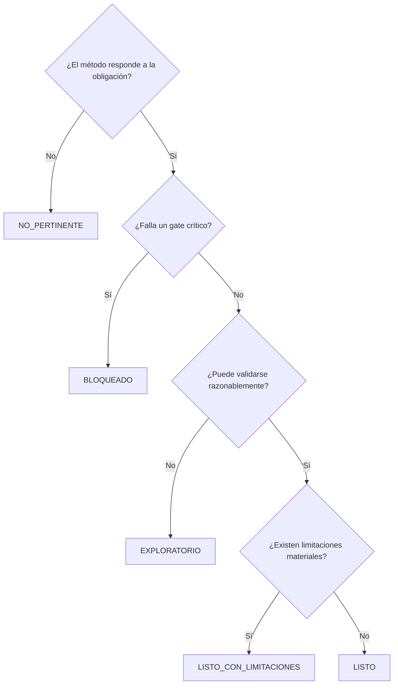

# Marco de preparación de datos para seleccionar y comparar metodologías de reserving

> **Parte 2 — Gates, matriz por método, benchmark, implementación y ejemplo aplicado**

!!! info "Continuidad editorial"
    Esta entrega continúa directamente la [Parte 1](marco-preparacion-datos-metodologias-parte-1.md). La numeración comienza en la sección 27 para facilitar la consolidación posterior de ambas partes en un único capítulo.

---

## 27. Gates formales de elegibilidad

## 27.1 Por qué los gates son necesarios

Un score agregado puede ocultar una carencia crítica. Por ejemplo:

- un dataset puede tener excelente completitud, historia y granularidad, pero no tener exposición para Cape Cod;
- puede disponer de meses-miembro y un triángulo estable, pero no tener un prior ex ante para Bornhuetter-Ferguson;
- puede tener millones de registros, pero carecer de snapshots históricos para validar machine learning sin *leakage*;
- puede contener pagos y reservas de caso, pero mezclar obligaciones fee-for-service y capitación.

Los gates son requisitos **no compensatorios**. Si un gate material falla, el método no debe promoverse como estimador central, aunque otros componentes sean sólidos.

Sea \(G_{m,g}\) el resultado del gate \(g\) para el método \(m\):

\[
G_{m,g}\in\{0,1\}.
\]

La elegibilidad estricta es:

\[
E_m
=
\prod_{g\in\mathcal{G}_m}G_{m,g},
\]

donde \(\mathcal{G}_m\) es el conjunto de gates críticos del método.

Si \(E_m=0\), el método queda bloqueado como benchmark central.

---

## 27.2 Resumen de gates

| Gate | Nombre | Pregunta |
|---|---|---|
| G0 | Propósito y obligación | ¿El método responde a la obligación correcta? |
| G1 | Fechas y estructura temporal | ¿Las fechas permiten construir el proceso de desarrollo? |
| G2 | Medida económica | ¿Paid, incurred, allowed, recoveries y reservas están definidos? |
| G3 | Integridad e identificadores | ¿Los movimientos pueden reconstruirse sin duplicación material? |
| G4 | Historia y madurez | ¿Existe experiencia suficiente para estimar el patrón? |
| G5 | Exposición | ¿La unidad de riesgo está completa y reconciliada? |
| G6 | Prior | ¿Existe una expectativa ex ante defendible? |
| G7 | Estabilidad y representatividad | ¿La historia representa razonablemente el futuro? |
| G8 | Validación as-of | ¿Puede evaluarse el método sin información futura? |
| G9 | Gobierno e implementación | ¿El proceso es reproducible, explicable y operable? |

---

## 27.3 G0 — Propósito y obligación

### Evidencia mínima

- fecha de valoración;
- propósito;
- usuario previsto;
- obligación económica;
- población;
- cobertura;
- medida;
- base bruta o neta;
- moneda;
- materialidad.

### Prueba formal

\[
G_0=
\mathbb{1}
\left[
O,\ t,\ M,\ S,\ B
\text{ están definidos}
\right],
\]

donde:

- \(O\): obligación;
- \(t\): fecha de valoración;
- \(M\): medida;
- \(S\): segmento;
- \(B\): base bruta o neta.

### Ejemplos de falla

- aplicar Chain Ladder a pagos de capitación;
- tratar cuentas por cobrar de una IPS como IBNR de un asegurador;
- estimar paid pero comparar contra incurred;
- mezclar costo médico y gasto administrativo sin definición.

### Consecuencia

**Bloqueo total.** No debe ejecutarse un benchmark central hasta definir la obligación.

---

## 27.4 G1 — Fechas y estructura temporal

### Evidencia mínima

Según el método, deben existir:

- `fecha_origen`;
- `fecha_calendario`;
- `fecha_valoracion`;
- opcionalmente `fecha_reporte`, `fecha_adjudicacion` y `fecha_pago`.

### Controles

\[
fecha\_origen
\leq
fecha\_calendario
\leq
fecha\_valoracion.
\]

Se debe revisar:

- rezagos negativos;
- fechas futuras;
- granularidad;
- periodicidad;
- cambios de definición;
- movimientos retroactivos;
- snapshot al que pertenece cada fila.

### Semáforo

| Resultado | Condición |
|---|---|
| Verde | fechas completas, coherentes y documentadas |
| Amarillo | fechas imputadas o parcialmente ambiguas |
| Rojo | no puede definirse origen o calendario |

### Consecuencia

- Rojo: bloquear métodos de desarrollo.
- Amarillo: permitir solo evaluación exploratoria con disclosure.

---

## 27.5 G2 — Medida económica

### Evidencia mínima

El dataset debe distinguir, cuando aplique:

- `valor_facturado`;
- `valor_permitido`;
- `valor_reconocido`;
- `costo_pagado`;
- `reserva_caso`;
- `costo_incurrido`;
- `valor_recuperacion`;
- `valor_reaseguro`;
- `valor_glosa`;
- `valor_reverso`.

### Reconciliaciones

\[
costo\_incurrido
\overset{?}{=}
costo\_pagado + reserva\_caso.
\]

\[
costo\_neto
\overset{?}{=}
costo\_bruto
-
recuperaciones
-
reaseguro.
\]

### Consecuencia

Un campo genérico llamado `costo` no supera este gate sin diccionario o confirmación de negocio.

---

## 27.6 G3 — Integridad e identificadores

### Evidencia mínima

- llave de reclamación;
- llave de transacción;
- trazabilidad de archivo;
- tipo de movimiento;
- regla de deduplicación;
- tratamiento de pagos parciales y reversos.

### Indicadores sugeridos

\[
TasaDuplicacion
=
\frac{N_{\text{filas duplicadas}}}{N_{\text{filas totales}}}.
\]

\[
TasaLlaveNula
=
\frac{N_{\text{llaves nulas}}}{N_{\text{filas totales}}}.
\]

### Consecuencia

- duplicación material no resuelta: bloquear;
- duplicación identificada y reconciliada: continuar con disclosure;
- inexistencia de llave transaccional: limitar modelos granulares.

---

## 27.7 G4 — Historia y madurez

### Evidencia mínima

- número de periodos de origen;
- horizonte de desarrollo;
- pares por factor;
- volumen por celda;
- cohortes maduras;
- análisis de cola.

Para el factor \(j\to j+1\):

\[
n_j
=
\sum_i
\mathbb{1}
\left[
C_{i,j},C_{i,j+1}
\text{ observados}
\right].
\]

También conviene calcular:

\[
CV_j
=
\frac{sd(r_{i,j})}{mean(r_{i,j})},
\qquad
r_{i,j}=\frac{C_{i,j+1}}{C_{i,j}}.
\]

### Regla importante

Los umbrales deben parametrizarse. Por ejemplo:

```yaml
minimo_periodos_origen: 36
minimo_pares_factor: 12
minimo_periodos_completos: 12
```

Estos valores no constituyen estándares universales.

### Consecuencia

- historia corta: Chain Ladder exploratorio;
- factores largos sin observaciones: tail o método alternativo;
- ausencia de cohortes maduras: backtesting limitado.

---

## 27.8 G5 — Exposición

### Evidencia mínima

Uno o más de:

- `miembros_mes`;
- `vidas_expuestas`;
- `dias_cobertura`;
- `prima_devengada`;
- `contratos_activos`;
- `unidades_capitadas`.

### Reconciliación

\[
Ultimate_i
=
Exposicion_i\times CostoUnitario_i.
\]

La exposición debe cubrir el mismo:

- periodo;
- segmento;
- beneficio;
- contrato;
- perímetro económico.

### Consecuencia

- Cape Cod y PMPM: bloquear si no existe exposición;
- GLM con offset: ejecutar solo sin offset y con fuerte limitación;
- BF basado en ELR: bloquear si no hay prima devengada o expected ultimate.

---

## 27.9 G6 — Prior

### Evidencia mínima

- `valor_prior`;
- `fecha_prior`;
- `metodo_prior`;
- `segmento_prior`;
- `exposicion_prior`;
- `fuente_prior`.

### Condición ex ante

\[
fecha\_prior
\leq
fecha\_valoracion.
\]

Un prior construido después del cierre del periodo no es válido para backtesting.

### Consecuencia

- BF y Benktander: bloquear sin prior;
- Bayes: bloquear o limitar si el prior es no identificable;
- escenarios: permitir si se documenta que no representan un estimador calibrado.

---

## 27.10 G7 — Estabilidad y representatividad

### Evidencia mínima

Análisis de:

- cambios de sistema;
- TPA;
- red;
- beneficios;
- tarifas;
- población;
- morbilidad;
- políticas de glosa;
- grandes reclamaciones;
- inflación médica;
- estacionalidad;
- backlog.

### Concepto

La historia puede ser abundante y no ser representativa.

\[
D_{\text{historico}}
\not\sim
D_{\text{futuro}}
\]

cuando existe una ruptura estructural material.

### Consecuencia

- segmentar por eras;
- excluir historia con justificación;
- usar prior ajustado;
- incorporar efecto calendario;
- no usar CL mecánicamente.

---

## 27.11 G8 — Validación as-of

### Evidencia mínima

Snapshots o capacidad de reconstruir:

\[
D_{t_1},D_{t_2},\ldots,D_{t_k}.
\]

Para cada corte debe conocerse:

- información disponible;
- parámetros;
- prior;
- exposición;
- resultado posterior maduro.

### Consecuencia

- sin snapshots: no presentar ranking predictivo fuerte;
- ML sin holdout temporal: bloquear como benchmark central;
- modelos clásicos: permitir sensibilidad, pero limitar evidencia de desempeño.

---

## 27.12 G9 — Gobierno e implementación

### Evidencia mínima

- propietario del modelo;
- versión de datos;
- versión de código;
- parámetros;
- log;
- pruebas;
- reconciliaciones;
- documentación;
- fallback.

### Consecuencia

Un método técnicamente sólido puede quedar como exploratorio si la organización no puede ejecutarlo consistentemente.

---

## 28. Sistema de estados

## 28.1 Estados oficiales

| Estado | Código | Uso permitido |
|---|---|---|
| Listo | `LISTO` | benchmark central |
| Listo con limitaciones | `LISTO_CON_LIMITACIONES` | central con disclosures o challenger fuerte |
| Exploratorio | `EXPLORATORIO` | challenger, sensibilidad o aprendizaje |
| Bloqueado | `BLOQUEADO` | no ejecutar como resultado actuarial |
| No pertinente | `NO_PERTINENTE` | no responde a la obligación |

Los alias opcionales en inglés pueden ser:

```text
READY
READY_WITH_LIMITATIONS
EXPLORATORY
BLOCKED
NOT_APPLICABLE
```

## 28.2 Precedencia



## 28.3 Regla de prudencia

Un estado alto no implica que el método deba seleccionarse. Solo indica que puede compararse de forma defendible.

---

## 29. Score de preparación

## 29.1 Objetivo

El score sirve para:

- priorizar remediaciones;
- comparar la preparación relativa;
- monitorear mejoras;
- resumir evidencia.

No sustituye gates.

## 29.2 Fórmula

Sea \(s_d\in[0,1]\) el cumplimiento del dominio \(d\) y \(w_{m,d}\) el peso para el método \(m\):

\[
Score_m
=
100\sum_{d=1}^{10}w_{m,d}s_d,
\qquad
\sum_{d=1}^{10}w_{m,d}=1.
\]

## 29.3 Ejemplo de pesos

### Chain Ladder pagado

| Dominio | Peso |
|---|---:|
| D1 Alcance | 0,10 |
| D2 Fechas | 0,15 |
| D3 Medida | 0,10 |
| D4 Integridad | 0,10 |
| D5 Historia | 0,25 |
| D6 Exposición | 0,02 |
| D7 Prior | 0,00 |
| D8 Segmentación | 0,08 |
| D9 Operación | 0,10 |
| D10 Validación | 0,10 |

### Cape Cod

| Dominio | Peso |
|---|---:|
| D1 Alcance | 0,10 |
| D2 Fechas | 0,08 |
| D3 Medida | 0,08 |
| D4 Integridad | 0,08 |
| D5 Historia | 0,15 |
| D6 Exposición | 0,25 |
| D7 Prior | 0,05 |
| D8 Segmentación | 0,08 |
| D9 Operación | 0,05 |
| D10 Validación | 0,08 |

## 29.4 Interpretación orientativa

| Score | Interpretación preliminar |
|---:|---|
| 90–100 | muy preparado |
| 75–89 | preparado con limitaciones |
| 50–74 | exploratorio |
| < 50 | preparación insuficiente |

Un gate crítico fallido fuerza `BLOQUEADO`.

## 29.5 Mejor contraargumento

Los pesos contienen juicio. Un score puede parecer objetivo sin serlo. Por ello:

- deben versionarse;
- deben ser visibles;
- deben permitir override documentado;
- no deben utilizarse como ranking de calidad actuarial.

---

## 30. Matriz maestra de requisitos por método

## 30.1 Métodos clásicos

| Método | Campos esenciales | Campos recomendados | Gate crítico | Validación mínima |
|---|---|---|---|---|
| Chain Ladder pagado | `fecha_origen`, `fecha_pago`, `costo_pagado`, `fecha_valoracion` | segmento, recuperaciones, large claims | G1, G2, G4, G7 | runoff y estabilidad |
| Chain Ladder incurrido | `fecha_origen`, `costo_incurrido`, `fecha_valoracion` | paid, case reserve, política de reservas | G2, G4, G7 | reconciliación paid + case |
| Bornhuetter-Ferguson | triángulo, CDF, `ultimate_esperado` o ELR | exposición, pricing, presupuesto | G4, G6 | backtest del prior |
| Benktander | datos BF + madurez | pesos o iteración | G4, G6 | continuidad por madurez |
| Cape Cod | triángulo, exposición, CDF | tendencia, mix, beneficios | G4, G5, G7 | backtest del costo unitario |
| PMPM | costo maduro, miembros-mes | morbilidad, tendencia, estacionalidad | G5, G7 | error por periodo |
| Devengo contractual | población, tarifa, contrato, periodo | liquidaciones y risk sharing | G0, G5, G9 | reconciliación contractual |

## 30.2 Métodos estocásticos

| Método | Campos esenciales | Gate crítico | Riesgo no cubierto automáticamente |
|---|---|---|---|
| Mack | triángulo acumulado, factores CL | G4, G7 | model risk, data risk, tail |
| Bootstrap | incrementales, residuos, proceso | G4, G7, G8 | cambio estructural |
| GLM estocástico | incrementales, diseño, distribución | G4, G7, G8 | especificación |
| Bayes | datos, likelihood, priors | G6, G8 | prior y convergencia |

## 30.3 Métodos estadísticos y granulares

| Método | Campos esenciales | Campos recomendados | Gate crítico |
|---|---|---|---|
| GLM agregado | origen, desarrollo, calendario, incremental | exposición, covariables | G4, G7, G8 |
| GAM | mismos de GLM + volumen | splines y offsets | G4, G8 |
| Frecuencia-severidad | claim ID, exposición, conteo, severidad | miembro, diagnóstico | G3, G5, G8 |
| Supervivencia | inicio, evento, censura | covariables | G1, G3, G8 |
| Multiestado | estado, fecha de transición, claim ID | historia completa | G1, G3, G8 |
| Árboles/boosting | target maduro, features as-of | exposición, SHAP | G8, G9 |
| Deep learning | gran volumen, target, snapshots | secuencias y embeddings | G8, G9 |

---

## 31. Requisitos precisos de campos

## 31.1 Chain Ladder pagado

### Obligatorios

```text
fecha_servicio
fecha_pago
costo_pagado
fecha_valoracion
```

### Recomendados

```text
id_reclamacion
id_transaccion
segmento
tipo_movimiento
valor_recuperacion
indicador_alto_costo
archivo_fuente
```

### Alias opcionales en inglés

| Español | Inglés |
|---|---|
| `fecha_servicio` | `service_date` |
| `fecha_pago` | `payment_date` |
| `costo_pagado` | `paid_amount` |
| `fecha_valoracion` | `valuation_date` |

### Bloqueos

- fecha de pago ausente;
- costo ambiguo;
- celdas no incrementales;
- duplicación material;
- historia insuficiente.

---

## 31.2 Chain Ladder incurrido

### Obligatorios

```text
fecha_servicio
costo_incurrido
fecha_valoracion
```

### Idealmente derivados de

```text
costo_pagado
reserva_caso
```

### Reconciliación

\[
costo\_incurrido
=
costo\_pagado + reserva\_caso.
\]

### Bloqueos

- cambios no documentados en políticas de case reserving;
- reservas negativas sin explicación;
- incurred no reconciliable.

---

## 31.3 Bornhuetter-Ferguson

### Obligatorios

```text
fecha_origen
importe_acumulado
proporcion_desarrollada
ultimate_esperado
fecha_prior
fecha_valoracion
```

Alternativamente:

```text
prima_devengada
tasa_siniestralidad_esperada
```

### Cálculo

\[
U_i^{BF}
=
C_{i,k_i}
+
(1-p_i)U_i^{(0)}.
\]

### Bloqueos

- prior retrospectivo;
- prior sin exposición;
- CDF no creíble;
- diferencias de perímetro entre prior y triángulo.

---

## 31.4 Benktander

### Obligatorios

Los mismos de BF.

### Cálculo de una iteración

\[
U_i^{Benk}
=
C_{i,k_i}
+
(1-p_i)U_i^{BF}.
\]

### Riesgo

Benktander no corrige un prior sesgado ni un patrón defectuoso.

---

## 31.5 Cape Cod

### Obligatorios

```text
fecha_origen
importe_acumulado
proporcion_desarrollada
exposicion
```

### Tasa

\[
\widehat{\theta}
=
\frac{\sum_i C_{i,k_i}}
{\sum_i Exposicion_i p_i}.
\]

### Ultimate esperado

\[
\widehat{U}_i
=
Exposicion_i\widehat{\theta}.
\]

### Bloqueos

- exposición incompleta;
- mezcla de segmentos;
- tendencia no ajustada;
- periodo anómalo dominante.

---

## 31.6 Mack

### Obligatorios

- triángulo acumulado;
- celdas positivas o tratamiento válido;
- CL central elegible.

### Supuestos centrales

\[
E[C_{i,j+1}\mid C_{i,0},\ldots,C_{i,j}]
=
f_jC_{i,j}.
\]

\[
Var(C_{i,j+1}\mid C_{i,j})
=
\sigma_j^2 C_{i,j}.
\]

### Bloqueos

- CL no apropiado;
- negativos incompatibles;
- pocos grados de libertad;
- dependencia material entre años.

---

## 31.7 Bootstrap

### Obligatorios

- incrementales o acumulados transformables;
- modelo de media;
- residuos;
- distribución de proceso;
- número de simulaciones;
- semilla.

### Bloqueos

- residuos mal definidos;
- muy pocas celdas;
- dependencia no modelada;
- tail implícito.

---

## 31.8 GLM y GAM

### Obligatorios

```text
periodo_origen
edad_desarrollo
periodo_calendario
importe_incremental
```

### Recomendados

```text
exposicion
segmento
indicador_alto_costo
tipo_servicio
region
```

### Estructura típica

\[
Y_{i,j}
\sim
\text{ODP}(\mu_{i,j},\phi),
\]

\[
\log(\mu_{i,j})
=
\alpha_i+\beta_j+\gamma_{i+j}.
\]

Con offset:

\[
\log(\mu_{i,j})
=
\log(Exposicion_i)
+\alpha_i+\beta_j+\gamma_{i+j}.
\]

---

## 31.9 Supervivencia y multiestado

### Supervivencia

```text
id_reclamacion
fecha_inicio
fecha_evento
indicador_censura
estado
```

### Multiestado

```text
id_reclamacion
estado_origen
estado_destino
fecha_transicion
```

### Aplicación

- glosas;
- controversias;
- adjudicación;
- cierre;
- pagos prolongados.

---

## 31.10 Machine learning

### Obligatorios

- target maduro;
- features disponibles as-of;
- fecha de corte;
- split temporal;
- identificadores;
- volumen.

### Gate adicional

\[
fecha\_feature
\leq
fecha\_prediccion.
\]

Toda variable posterior produce *leakage*.

---

## 32. Lógica de recomendación de datos faltantes

## 32.1 Estructura de una recomendación útil

No basta con indicar “falta exposición”. La salida debe incluir:

| Elemento | Contenido |
|---|---|
| Dato | nombre canónico |
| Definición | significado |
| Granularidad | claim, mes, contrato |
| Periodicidad | mensual, diaria |
| Historia | rango requerido |
| Fuente candidata | afiliaciones, pricing, tesorería |
| Métodos habilitados | lista |
| Prioridad | crítica, alta, media, baja |
| Riesgo | efecto de no obtenerlo |

## 32.2 Priorización

Sea \(H_r\) el número de métodos habilitados por el requisito \(r\), \(M_r\) su materialidad y \(C_r\) el costo de obtención:

\[
Prioridad_r
=
\frac{H_r\times M_r}{C_r}.
\]

Esta fórmula es conceptual. Su utilidad es ordenar esfuerzos.

## 32.3 Ejemplo

| Brecha | Habilita | Prioridad |
|---|---|---|
| `fecha_pago` | CL paid, Mack, Bootstrap | crítica |
| `miembros_mes` | Cape Cod, PMPM, GLM offset | alta |
| `ultimate_esperado` | BF, Benktander | alta |
| snapshots | backtesting, ML, validación | crítica |
| `reserva_caso` | CL incurred | media |

---

## 33. Perfiles de benchmark

## 33.1 Benchmark mínimo

### Datos

- triángulo pagado;
- historia moderada;
- sin prior;
- sin exposición.

### Métodos

- Chain Ladder;
- ventanas alternativas;
- tail;
- sensibilidad de factores.

### Limitación

No permite evaluar BF, Benktander o Cape Cod.

---

## 33.2 Benchmark clásico completo

### Datos

- triángulo;
- prior;
- exposición;
- madurez.

### Métodos

- Chain Ladder;
- BF;
- Benktander;
- Cape Cod;
- PMPM.

### Comparación

- ultimate;
- reserva;
- variación por madurez;
- sensibilidad al prior;
- sensibilidad al costo unitario.

---

## 33.3 Benchmark estocástico

### Datos

- triángulo suficiente;
- residuos;
- CL elegible;
- snapshots.

### Métodos

- Mack;
- Bootstrap;
- GLM estocástico.

### Output

- error estándar;
- MSEP;
- distribución predictiva;
- percentiles;
- sensibilidad de tail.

---

## 33.4 Benchmark estadístico

### Datos

- incrementales;
- origen, desarrollo, calendario;
- exposición;
- covariables.

### Métodos

- GLM;
- GAM;
- Bayes jerárquico;
- Chain Ladder como baseline.

---

## 33.5 Benchmark granular

### Datos

- claims;
- transacciones;
- estados;
- snapshots;
- outcome maduro.

### Métodos

- frecuencia-severidad;
- survival;
- multiestado;
- boosting;
- benchmark agregado.

---

## 33.6 Perfil salud Colombia

### Componentes sugeridos

| Obligación | Métodos iniciales |
|---|---|
| Fee-for-service | paid/incurred CL, BF, Cape Cod, PMPM |
| Capitación | devengo poblacional y liquidación |
| PGP | devengo + modelo contractual |
| Glosas | multiestado, survival, case |
| Alto costo | segmentación + case + frecuencia-severidad |
| Recuperaciones | triángulo separado o modelo de cobro |

---

## 34. Especificación de configuración

## 34.1 Ejemplo YAML

```yaml
metodos:
  chain_ladder_pagado:
    nombre: "Chain Ladder pagado"
    alias_ingles: "Paid Chain Ladder"
    medida: "pagado"
    campos_obligatorios:
      - fecha_servicio
      - fecha_pago
      - costo_pagado
      - fecha_valoracion
    campos_recomendados:
      - id_reclamacion
      - id_transaccion
      - segmento
      - valor_recuperacion
    gates_criticos:
      - G0
      - G1
      - G2
      - G3
      - G4
      - G7
      - G9
    umbrales:
      minimo_periodos_origen: 36
      minimo_pares_factor: 12
    estado_si_no_hay_snapshots: "LISTO_CON_LIMITACIONES"

  bornhuetter_ferguson:
    nombre: "Bornhuetter-Ferguson"
    campos_obligatorios:
      - fecha_origen
      - importe_acumulado
      - proporcion_desarrollada
      - ultimate_esperado
      - fecha_prior
    gates_criticos:
      - G0
      - G2
      - G4
      - G6
      - G7
      - G9

  cape_cod:
    nombre: "Cape Cod"
    campos_obligatorios:
      - fecha_origen
      - importe_acumulado
      - proporcion_desarrollada
      - exposicion
    gates_criticos:
      - G0
      - G2
      - G4
      - G5
      - G7
      - G9
```

## 34.2 Diccionario canónico

```yaml
campos:
  fecha_servicio:
    tipo: "fecha"
    descripcion: "Fecha de prestación o incurral"
    alias_ingles:
      - service_date
      - incurred_date

  costo_pagado:
    tipo: "decimal"
    descripcion: "Pago incremental"
    alias_ingles:
      - paid_amount

  miembros_mes:
    tipo: "decimal_no_negativo"
    descripcion: "Exposición mensual"
    alias_ingles:
      - member_months
```

---

## 35. Implementación de referencia en Python

## 35.1 Objetivo

El siguiente código ilustra:

- perfil del dataset;
- evaluación de campos;
- aplicación de gates;
- estado;
- lista de brechas.

No reemplaza el script final del paquete.

```python
from __future__ import annotations

from dataclasses import dataclass, field
from typing import Any


@dataclass(frozen=True)
class EspecificacionMetodo:
    codigo: str
    nombre: str
    campos_obligatorios: tuple[str, ...]
    campos_recomendados: tuple[str, ...]
    gates_criticos: tuple[str, ...]


@dataclass
class PerfilDatos:
    columnas: set[str]
    indicadores: dict[str, Any] = field(default_factory=dict)
    gates: dict[str, bool] = field(default_factory=dict)


@dataclass(frozen=True)
class ResultadoPreparacion:
    metodo: str
    estado: str
    score: float
    campos_faltantes: tuple[str, ...]
    gates_fallidos: tuple[str, ...]
    recomendaciones: tuple[str, ...]


def calcular_score(perfil: PerfilDatos, pesos: dict[str, float]) -> float:
    total = 0.0
    for dominio, peso in pesos.items():
        cumplimiento = float(perfil.indicadores.get(dominio, 0.0))
        total += peso * max(0.0, min(1.0, cumplimiento))
    return round(100.0 * total, 2)


def evaluar_metodo(
    perfil: PerfilDatos,
    especificacion: EspecificacionMetodo,
    pesos: dict[str, float],
) -> ResultadoPreparacion:
    faltantes = tuple(
        campo
        for campo in especificacion.campos_obligatorios
        if campo not in perfil.columnas
    )

    gates_fallidos = tuple(
        gate
        for gate in especificacion.gates_criticos
        if not perfil.gates.get(gate, False)
    )

    score = calcular_score(perfil, pesos)

    if faltantes or gates_fallidos:
        estado = "BLOQUEADO"
    elif not perfil.gates.get("G8", False):
        estado = "EXPLORATORIO"
    elif score >= 90:
        estado = "LISTO"
    elif score >= 75:
        estado = "LISTO_CON_LIMITACIONES"
    else:
        estado = "EXPLORATORIO"

    recomendaciones: list[str] = []
    for campo in faltantes:
        recomendaciones.append(f"Obtener o mapear el campo '{campo}'.")
    for gate in gates_fallidos:
        recomendaciones.append(f"Resolver el gate crítico {gate}.")

    return ResultadoPreparacion(
        metodo=especificacion.nombre,
        estado=estado,
        score=score,
        campos_faltantes=faltantes,
        gates_fallidos=gates_fallidos,
        recomendaciones=tuple(recomendaciones),
    )
```

## 35.2 Ejemplo de ejecución

```python
perfil = PerfilDatos(
    columnas={
        "fecha_servicio",
        "fecha_contabilizacion",
        "costo",
        "id_factura",
        "segmento",
    },
    indicadores={
        "D1": 0.8,
        "D2": 0.5,
        "D3": 0.3,
        "D4": 0.6,
        "D5": 0.2,
        "D6": 0.0,
        "D7": 0.0,
        "D8": 0.7,
        "D9": 0.4,
        "D10": 0.2,
    },
    gates={
        "G0": True,
        "G1": False,
        "G2": False,
        "G3": True,
        "G4": False,
        "G5": False,
        "G6": False,
        "G7": False,
        "G8": False,
        "G9": True,
    },
)
```

El resultado para Chain Ladder pagado sería `BLOQUEADO` hasta mapear `fecha_pago`, `costo_pagado` y resolver historia y medida.

---

## 36. Implementación de referencia en R

```r
evaluar_metodo <- function(
  columnas,
  campos_obligatorios,
  gates,
  gates_criticos,
  score
) {
  faltantes <- setdiff(campos_obligatorios, columnas)
  gates_fallidos <- gates_criticos[!gates[gates_criticos]]

  if (length(faltantes) > 0 || length(gates_fallidos) > 0) {
    estado <- "BLOQUEADO"
  } else if (!isTRUE(gates[["G8"]])) {
    estado <- "EXPLORATORIO"
  } else if (score >= 90) {
    estado <- "LISTO"
  } else if (score >= 75) {
    estado <- "LISTO_CON_LIMITACIONES"
  } else {
    estado <- "EXPLORATORIO"
  }

  list(
    estado = estado,
    score = score,
    campos_faltantes = faltantes,
    gates_fallidos = gates_fallidos
  )
}
```

---

## 37. Consultas SQL de perfilado

## 37.1 Duplicados

```sql
SELECT
    id_reclamacion,
    id_transaccion,
    COUNT(*) AS numero_registros
FROM reclamaciones
GROUP BY
    id_reclamacion,
    id_transaccion
HAVING COUNT(*) > 1;
```

## 37.2 Coherencia de fechas

```sql
SELECT
    COUNT(*) AS registros_invalidos
FROM reclamaciones
WHERE fecha_servicio > fecha_pago
   OR fecha_pago > fecha_valoracion;
```

## 37.3 Historia por desarrollo

```sql
SELECT
    periodo_origen,
    mes_desarrollo,
    COUNT(*) AS registros,
    SUM(costo_pagado) AS costo_pagado
FROM movimientos
GROUP BY
    periodo_origen,
    mes_desarrollo
ORDER BY
    periodo_origen,
    mes_desarrollo;
```

## 37.4 Cobertura de exposición

```sql
SELECT
    periodo_origen,
    SUM(miembros_mes) AS miembros_mes
FROM exposicion
GROUP BY periodo_origen
HAVING SUM(miembros_mes) IS NULL
    OR SUM(miembros_mes) <= 0;
```

---

## 38. Ejemplo aplicado de evaluación

## 38.1 Dataset

Supóngase un archivo consolidado con:

- 394 filas físicas;
- 197 movimientos económicos únicos;
- dos archivos fuente que duplican los movimientos;
- ocho meses de servicio;
- tres meses calendario;
- costos positivos y negativos;
- `Periodo Servicio`;
- `Periodo`;
- `COSTO`;
- `FRECUENCIA`;
- sin exposición;
- sin prior;
- sin reserva de caso;
- sin snapshots.

## 38.2 Mapeo preliminar

| Original | Canónico | Estado |
|---|---|---|
| `Periodo Servicio` | `fecha_servicio` | plausible |
| `Periodo` | `fecha_calendario` | ambiguo |
| `COSTO` | `importe` | ambiguo |
| `FRECUENCIA` | `conteo` | ambiguo |
| `factura` + `Folio` | `id_reclamacion` | candidato |
| `archivo_origen` | `archivo_fuente` | válido |
| `Componente` | `tipo_movimiento` | crítico |

## 38.3 Gates

| Gate | Resultado | Razón |
|---|---|---|
| G0 | Amarillo | obligación parcialmente definida |
| G1 | Rojo | `Periodo` no confirmado como pago |
| G2 | Rojo | `COSTO` mezcla componentes |
| G3 | Rojo | duplicación del 100% |
| G4 | Rojo | tres meses calendario |
| G5 | Rojo | no hay exposición |
| G6 | Rojo | no hay prior |
| G7 | Amarillo | no se evaluó representatividad |
| G8 | Rojo | no hay snapshots |
| G9 | Amarillo | proceso aún no implementado |

## 38.4 Estados

| Método | Estado |
|---|---|
| Construcción incremental | `LISTO_CON_LIMITACIONES` |
| Chain Ladder | `EXPLORATORIO` o `BLOQUEADO` según semántica |
| BF | `BLOQUEADO` |
| Benktander | `BLOQUEADO` |
| Cape Cod | `BLOQUEADO` |
| Mack | `BLOQUEADO` |
| Bootstrap | `BLOQUEADO` |
| GLM agregado | `EXPLORATORIO` |
| ML | `BLOQUEADO` |

## 38.5 Plan de remediación

| Orden | Acción | Métodos habilitados |
|---:|---|---|
| 1 | confirmar `Periodo` y `COSTO` | construcción y CL |
| 2 | resolver duplicados | todos |
| 3 | ampliar historia | CL, Mack, Bootstrap, GLM |
| 4 | obtener `miembros_mes` | Cape Cod, PMPM, GLM offset |
| 5 | obtener prior ex ante | BF, Benktander |
| 6 | conservar snapshots | backtesting, ML |
| 7 | obtener reserva de caso | incurred |

## 38.6 Benchmark actual y objetivo

### Actual

- perfilado;
- deduplicación;
- triángulo descriptivo;
- análisis de lags;
- visualización;
- no selección de reserva.

### Objetivo

- CL;
- BF;
- Benktander;
- Cape Cod;
- Mack;
- Bootstrap;
- GLM;
- backtesting as-of.

---

## 39. Formato de salida del evaluador

## 39.1 Resumen ejecutivo

```text
Métodos listos: 1
Métodos listos con limitaciones: 2
Métodos exploratorios: 2
Métodos bloqueados: 7
Brechas críticas: 5
```

## 39.2 Matriz

| Método | Estado | Score | Gates fallidos | Campos faltantes | Próxima acción |
|---|---|---:|---|---|---|
| CL pagado | Exploratorio | 61 | G1, G4, G8 | fecha_pago | confirmar fecha |
| BF | Bloqueado | 44 | G6 | ultimate_esperado | obtener pricing |
| Cape Cod | Bloqueado | 38 | G5 | miembros_mes | integrar afiliación |
| Mack | Bloqueado | 41 | G4 | historia | ampliar cortes |

## 39.3 Artefactos

- `perfil_datos.csv`;
- `matriz_elegibilidad.csv`;
- `brechas_datos.csv`;
- `plan_remediacion.csv`;
- `resumen_ejecutivo.md`;
- `log_evaluacion.json`.

---

## 40. Reglas de comparación

## 40.1 Misma obligación

No comparar:

- claims con capitación;
- paid con cuentas por cobrar;
- allowed con paid sin reconciliación.

## 40.2 Misma información

Un método con información adicional puede ser válido, pero la comparación debe declarar la diferencia.

## 40.3 Mismo horizonte

El tail debe:

- ser común;
- reconciliarse;
- presentarse como sensibilidad.

## 40.4 Mismo tratamiento de grandes reclamaciones

Opciones:

1. incluir en todos;
2. excluir y modelar por separado;
3. winsorizar solo como sensibilidad.

## 40.5 Mismo criterio de evaluación

Métricas sugeridas:

\[
Error_{m,t}
=
\widehat{U}_{m,t}-U_t.
\]

\[
APE_{m,t}
=
\frac{|\widehat{U}_{m,t}-U_t|}{U_t}.
\]

\[
Sesgo_m
=
\frac{1}{T}\sum_t
(\widehat{U}_{m,t}-U_t).
\]

También:

- estabilidad;
- volatilidad de selección;
- cobertura de intervalos;
- error por madurez;
- error por segmento.

---

## 41. Pruebas del framework

## 41.1 Unitarias

- mapeo de alias;
- detección de faltantes;
- precedencia de estados;
- score;
- gates;
- fechas;
- duplicados.

## 41.2 Integración

- CSV completo;
- CSV sin exposición;
- dataset duplicado;
- historia corta;
- prior posterior a valoración;
- snapshots válidos.

## 41.3 Pruebas adversariales

- columna llamada `fecha_pago` con contenido de contabilización;
- `costo` con negativos;
- exposición duplicada;
- claims maduros usados como features;
- método marcado listo con gate crítico fallido.

## 41.4 Criterio de aceptación

Ningún método debe recibir `LISTO` cuando falla un gate crítico.

---

## 42. Checklist práctico

## Alcance

- [ ] Obligación definida.
- [ ] Fecha de valoración definida.
- [ ] Medida paid/incurred/allowed definida.
- [ ] Base bruta o neta definida.
- [ ] Segmento definido.

## Fechas

- [ ] Fecha de origen validada.
- [ ] Fecha calendario validada.
- [ ] Rezagos negativos explicados.
- [ ] Snapshots identificados.

## Importes

- [ ] Paid separado.
- [ ] Case reserve separado.
- [ ] Recoveries separados.
- [ ] Negativos clasificados.
- [ ] Reconciliaciones ejecutadas.

## Integridad

- [ ] Llaves documentadas.
- [ ] Duplicados resueltos.
- [ ] Pagos parciales identificados.
- [ ] Reversos identificados.

## Historia

- [ ] Periodos completos.
- [ ] Pares por factor calculados.
- [ ] Volumen por celda revisado.
- [ ] Tail evaluado.
- [ ] Cambios de era documentados.

## Exposición y priors

- [ ] Exposición reconciliada.
- [ ] Prior ex ante.
- [ ] Fecha del prior.
- [ ] Perímetro consistente.

## Validación

- [ ] Backtesting as-of.
- [ ] Holdout temporal.
- [ ] Runoff.
- [ ] Challengers.
- [ ] Sensibilidades.

## Gobierno

- [ ] Código versionado.
- [ ] Datos versionados.
- [ ] Parámetros registrados.
- [ ] Logs.
- [ ] Responsable.
- [ ] Fallback.

---

## 43. Bibliografía comentada

- **Actuarial Standards Board. ASOP No. 5, Incurred Health and Disability Claims.** Referencia para la estimación de reclamaciones incurridas en salud y para la evaluación de datos, métodos, supuestos y seguimiento de experiencia.
- **Actuarial Standards Board. ASOP No. 23, Data Quality.** Establece consideraciones sobre selección, revisión y uso de datos, así como comunicación de limitaciones.
- **Actuarial Standards Board. ASOP No. 41, Actuarial Communications.** Sustenta los requerimientos de documentación y disclosure.
- **Actuarial Standards Board. ASOP No. 56, Modeling.** Proporciona el marco de propósito, estructura, datos, supuestos, validación, gobierno y riesgo de modelo.
- **Mack, T. (1993). Distribution-Free Calculation of the Standard Error of Chain Ladder Reserve Estimates.** Referencia fundamental del MSEP de Mack.
- **England, P. D. y Verrall, R. J. (2002). Stochastic Claims Reserving in General Insurance.** Referencia sobre bootstrap y formulaciones estocásticas.
- **Bornhuetter, R. L. y Ferguson, R. E. (1972). The Actuary and IBNR.** Fundamento del método BF.
- **Health Insurance Reserving Handbook — Guía de selección de metodologías.** Marco de selección, gates, backtesting y combinación.
- **Health Insurance Reserving Handbook — Comparación de métodos clásicos.** Comparación de CL, BF, Benktander y Cape Cod.
- **Health Insurance Reserving Handbook — Triángulos mensuales.** Referencia práctica sobre historia, madurez y observaciones por factor.

---

## 44. Conclusión

La preparación de datos debe evaluarse en tres niveles:

\[
\text{Presencia}
\rightarrow
\text{Suficiencia}
\rightarrow
\text{Comparabilidad}.
\]

Un campo puede estar presente y ser semánticamente incorrecto. Un triángulo puede existir y ser estadísticamente insuficiente. Dos métodos pueden ejecutarse y no ser comparables.

El framework propone:

- gates no compensatorios;
- estados explícitos;
- score secundario;
- nombres canónicos en español;
- requisitos por método;
- recomendaciones precisas;
- benchmark as-of;
- gobierno reproducible.

La conclusión operativa es:

> **El primer resultado del análisis no debe ser una reserva, sino una matriz que establezca qué métodos pueden utilizarse, cuáles no, por qué y qué datos habilitarían un benchmark superior.**

---

## Cierre editorial

1. **Nivel de confianza:** Alto.
2. **Factores que podrían cambiar la conclusión:** regulación aplicable, semántica institucional de los campos, obligación específica, volumen, historia, disponibilidad de exposición, priors y snapshots.
3. **Acción recomendada:** consolidar las Partes 1 y 2 en un solo capítulo después de la revisión editorial y utilizarlo como especificación para `config/diccionario_datos_canonico.yml` y el demo automático de preparación de datos.
