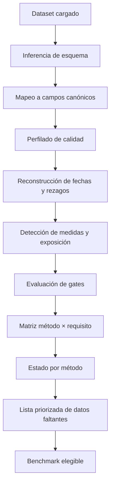

# Matriz de preparación de datos para comparar métodos de reserving

## 1. Propósito

Esta matriz permite responder tres preguntas antes de calcular una reserva:

1. **¿Qué métodos son técnicamente elegibles con los datos disponibles?**
2. **¿Qué campos, historia, definiciones o controles faltan para aplicar métodos específicos?**
3. **¿Qué transformaciones son necesarias para que los resultados sean comparables dentro de un benchmark actuarial?**

La herramienta no selecciona automáticamente el “mejor” método. Su función es determinar si cada método cuenta con evidencia suficiente para ser:

- **aplicable**;
- **aplicable con restricciones**;
- **solo exploratorio**;
- **no aplicable**.

El resultado debe impedir que un método se ejecute cuando falten datos esenciales, aun cuando el código pueda producir numéricamente una estimación.

---

## 2. Principio rector

La comparabilidad exige que los métodos respondan a la misma obligación, fecha de valoración, segmento, moneda y medida económica.

Dos resultados no son comparables cuando uno estima pagos futuros, otro costo incurrido, otro obligaciones contractuales de capitación y otro una proyección prospectiva de costo.

Sea \(m\) un método candidato. Su elegibilidad se define mediante gates no compensatorios:

\[
Eligible(m)
=
G_{\text{scope}}
\times
G_{\text{dates}}
\times
G_{\text{measure}}
\times
G_{\text{history}}
\times
G_{\text{quality}}
\times
G_{\text{validation}}.
\]

Si cualquiera de los gates materiales es cero, el método no debe promoverse como benchmark central.

---

## 3. Taxonomía mínima de datos

La evaluación se organiza en diez dominios.

| Código | Dominio | Pregunta central |
|---|---|---|
| D1 | Alcance y obligación | ¿Qué obligación económica se está estimando? |
| D2 | Fechas | ¿Existen fechas de servicio, reporte, adjudicación, pago y valoración? |
| D3 | Medidas económicas | ¿Se distinguen billed, allowed, paid, case reserve, incurred y recoveries? |
| D4 | Identificadores | ¿Existe una llave estable de claim, factura, caso o transacción? |
| D5 | Historia | ¿Existe suficiente experiencia por origen, desarrollo y calendario? |
| D6 | Exposición | ¿Existen miembros, meses-miembro, primas o unidades de riesgo? |
| D7 | Priors | ¿Existe un ultimate esperado, ELR, PMPM o presupuesto técnico ex ante? |
| D8 | Segmentación | ¿Se pueden separar poblaciones con patrones materialmente distintos? |
| D9 | Operación y contratos | ¿Se identifican cambios de red, TPA, glosas, capitación, PGP y pagos parciales? |
| D10 | Validación | ¿Existen snapshots as-of, cohortes maduras y holdout temporal? |

---

## 4. Catálogo canónico de campos

La herramienta debe mapear los nombres originales del dataset a un esquema canónico.

### 4.1 Campos obligatorios básicos

| Campo canónico | Tipo | Descripción |
|---|---|---|
| `origin_date` | fecha | Fecha de servicio, ocurrencia o incurral |
| `calendar_date` | fecha | Fecha del movimiento observado |
| `valuation_date` | fecha | Fecha as-of del dataset o snapshot |
| `amount` | numérico | Importe incremental principal |
| `claim_id` | texto | Identificador estable de claim o caso |
| `transaction_id` | texto | Identificador del movimiento |
| `measure_type` | categoría | paid, incurred, allowed, billed, recovery, case reserve |
| `segment_id` | texto | Segmento actuarial o portafolio |

### 4.2 Campos condicionales

| Campo | Necesario para |
|---|---|
| `report_date` | IBNR reportado/no reportado, survival y multiestado |
| `adjudication_date` | rezagos operativos y modelos de procesamiento |
| `payment_date` | triángulos paid |
| `paid_amount` | Chain Ladder paid, Mack, Bootstrap |
| `case_reserve` | triángulos incurred |
| `incurred_amount` | Chain Ladder incurred |
| `allowed_amount` | análisis de costo reconocido |
| `recovery_amount` | neto de recuperaciones |
| `member_months` | Cape Cod, PMPM, GLM con offset |
| `earned_premium` | BF/Cape Cod con ELR |
| `expected_ultimate` | BF y Benktander |
| `expected_loss_ratio` | BF/Cape Cod |
| `claim_status` | survival, multiestado y case reserving |
| `large_claim_flag` | segmentación de alta severidad |
| `contract_type` | distinguir FFS, capitación, PGP y otros |
| `provider_id` | diagnóstico de red y comportamiento de prestador |
| `benefit_code` | homogeneidad de cobertura |
| `member_id` | frecuencia, severidad y modelos granulares |
| `diagnosis_group` | ajuste de riesgo y modelos granulares |
| `snapshot_id` | backtesting as-of |
| `source_file` | trazabilidad y deduplicación |

---

## 5. Matriz maestra por método

### 5.1 Métodos clásicos y estocásticos

| Método | Datos esenciales | Datos recomendados | Historia mínima orientativa | Gate crítico | Resultado si falta |
|---|---|---|---|---|---|
| Chain Ladder paid | `origin_date`, `payment_date`, `paid_amount`, `valuation_date` | segmento, large claims, recoveries | múltiples cohortes y pares por edad | patrón de desarrollo estable | bloquear o limitar a demo |
| Chain Ladder incurred | `origin_date`, `incurred_amount`, `valuation_date` | paid, case reserve y políticas de reserva | igual que paid | consistencia de case reserves | preferir paid o reconciliar |
| Bornhuetter-Ferguson | triángulo, CDF y `expected_ultimate` o ELR | exposición, pricing, presupuesto | puede operar con cohortes inmaduras | prior ex ante defendible | no identificable |
| Benktander | mismos datos de BF | regla de credibilidad y madurez | igual que BF | prior y desarrollo creíbles | no identificable |
| Cape Cod | triángulo, exposición y desarrollo | tendencia, mix, beneficios | varias cohortes comparables | exposición homogénea | no aplicable |
| Mack Chain Ladder | triángulo acumulado positivo y CL apropiado | tail, diagnósticos de residuos | suficientes pares por edad | supuestos de Mack | MSEP no defendible |
| Bootstrap Chain Ladder | incremental/cumulative, residual model | process distribution, tail | suficientes celdas y grados de libertad | residuos estables | distribución no confiable |
| BF estocástico | BF + distribución/prior | correlación y proceso | depende de especificación | incertidumbre del prior | solo sensibilidad |
| Chain Ladder con tail | CL + factor de cola | datos externos o extrapolación | historia que informe la cola | madurez insuficiente | mostrar sensibilidad |

### 5.2 Modelos estadísticos y granulares

| Método | Datos esenciales | Datos recomendados | Validación necesaria | Gate crítico |
|---|---|---|---|---|
| GLM agregado | incrementales, origen, desarrollo, calendario | exposición, tendencia, covariables | holdout temporal y residuos | especificación distributiva |
| GAM | mismos datos de GLM con mayor volumen | offsets y no linealidades | validación temporal | volumen suficiente |
| Bayes jerárquico | datos + priors + niveles jerárquicos | segmentación y expert judgment | posterior predictive checks | identificabilidad |
| Frequency–severity | claim-level, conteos y severidad | exposición y member-level | out-of-time | definición estable de claim |
| Survival | fecha de inicio, evento/censura y estado | covariables operativas | calibración por cohorte | censura correctamente definida |
| Multiestado | estados y fechas de transición | claim history completa | validación de transiciones | estados mutuamente coherentes |
| Árboles/boosting | target maduro, features as-of y gran volumen | exposición y segmentación | holdout temporal estricto | leakage |
| Deep learning | gran volumen y features estables | embeddings o secuencias | holdout temporal y estabilidad | gobernanza y explicabilidad |
| PMPM/proyección | exposición y costo maduro | tendencia, morbilidad y estacionalidad | backtest por periodo | calidad de exposición |

---

## 6. Requisitos de comparabilidad

Antes de comparar métodos, todos deben compartir:

| Dimensión | Regla |
|---|---|
| Fecha de valoración | mismo corte as-of |
| Unidad de origen | mismo mes, trimestre o año |
| Unidad de desarrollo | misma definición |
| Segmento | misma población y cobertura |
| Medida | paid, incurred o allowed claramente separada |
| Moneda | misma moneda y base nominal/real |
| Recoveries | mismo tratamiento bruto o neto |
| Grandes claims | misma política de exclusión y reintegración |
| Tail | mismo horizonte o sensibilidad explícita |
| Exposure | misma unidad y ajuste |
| Prior | disponible ex ante |
| Backtesting | mismos cortes históricos |
| Materialidad | misma base de evaluación |

### 6.1 Comparaciones inválidas frecuentes

- Chain Ladder paid contra BF incurred.
- Cape Cod con meses-miembro contra CL sobre costo total sin reconciliar exposición.
- Un modelo entrenado con ultimate final contra métodos calculados as-of.
- Bootstrap con grandes reclamaciones incluidas contra CL con grandes reclamaciones excluidas.
- Métodos con diferentes factores de cola sin mostrar el efecto.
- Métodos ejecutados sobre segmentos distintos.

---

## 7. Sistema de estados

La herramienta debe producir uno de cinco estados por método.

| Estado | Código | Interpretación |
|---|---|---|
| Listo | `READY` | Puede entrar al benchmark central |
| Listo con restricciones | `READY_WITH_LIMITATIONS` | Aplicable con disclosures y sensibilidades |
| Exploratorio | `EXPLORATORY` | Útil como challenger, no como selección central |
| Bloqueado | `BLOCKED` | Faltan datos o gates esenciales |
| No pertinente | `NOT_APPLICABLE` | El método no corresponde a la obligación |

---

## 8. Score de preparación

El score ayuda a priorizar trabajo, pero no reemplaza los gates.

\[
Score_m
=
100
\sum_{d=1}^{10} w_{m,d}s_d,
\]

donde:

- \(w_{m,d}\) es el peso del dominio \(d\) para el método \(m\);
- \(s_d\in[0,1]\) es el grado de cumplimiento;
- \(\sum_d w_{m,d}=1\).

### 8.1 Interpretación orientativa

| Score | Estado preliminar |
|---:|---|
| 90–100 | READY |
| 75–89 | READY_WITH_LIMITATIONS |
| 50–74 | EXPLORATORY |
| < 50 | BLOCKED |

Un gate crítico incumplido fuerza `BLOCKED`, aunque el score total sea alto.

---

## 9. Gates automáticos

### G0 — Definición de obligación

Debe existir documentación de:

- propósito;
- usuario;
- medida;
- gross/net;
- fecha de valoración;
- segmento;
- base contable o regulatoria.

### G1 — Fechas válidas

Controles:

- `origin_date <= calendar_date <= valuation_date`;
- no hay fechas imposibles;
- periodicidad consistente;
- rezagos negativos explicados;
- snapshot claramente definido.

### G2 — Llaves y duplicados

Controles:

- unicidad de `transaction_id`;
- duplicación por archivo fuente;
- pagos parciales;
- reversos;
- correcciones;
- conciliación antes/después de depurar.

### G3 — Medida económica

Debe distinguirse:

\[
Paid,\quad CaseReserve,\quad Incurred,\quad Recoveries,\quad Allowed.
\]

No se debe inferir `incurred` de un campo ambiguo llamado `cost`.

### G4 — Suficiencia triangular

Para cada factor \(j\to j+1\):

- número de pares;
- volumen del denominador;
- dispersión de ratios;
- presencia de ceros o negativos;
- estabilidad por ventana;
- efecto calendario.

### G5 — Priors

Para BF y Benktander:

- fecha de origen del prior;
- método de construcción;
- exposición;
- tendencia;
- evidencia de backtesting;
- independencia de información futura.

### G6 — Exposición

Para Cape Cod, PMPM y GLM con offset:

- cobertura completa por periodo;
- unidad consistente;
- reconciliación con población;
- tratamiento de altas/bajas;
- ajuste por mix o morbilidad.

### G7 — Incertidumbre

Para Mack y Bootstrap:

- CL central elegible;
- grados de libertad;
- residuos diagnosticados;
- tail documentado;
- tratamiento de negativos;
- dependencia y large claims.

### G8 — Validación as-of

Debe ser posible reconstruir:

\[
D_{t_1}, D_{t_2}, \ldots, D_{t_k},
\]

sin utilizar información posterior a cada fecha \(t_k\).

### G9 — Gobierno

Debe existir:

- versión de datos;
- versión de código;
- parámetros;
- log de ejecución;
- reconciliaciones;
- responsable;
- fallback.

---

## 10. Evaluación automática de un dataset cargado

### 10.1 Flujo



### 10.2 Salidas

La evaluación debe producir:

#### A. Resumen del dataset

- número de filas;
- periodos;
- rango de fechas;
- segmentos;
- volumen;
- negativos;
- duplicados;
- missingness;
- exposición;
- snapshots.

#### B. Matriz de elegibilidad

| Método | Estado | Score | Gates fallidos | Datos faltantes | Acción |
|---|---|---:|---|---|---|
| Chain Ladder | EXPLORATORY | 62 | G4 | más diagonales | ampliar historia |
| BF | BLOCKED | 44 | G5 | expected ultimate | obtener pricing |
| Cape Cod | BLOCKED | 38 | G6 | member months | obtener exposición |
| Mack | BLOCKED | 41 | G4, G7 | pares y residuos | ampliar triángulo |
| Bootstrap | BLOCKED | 36 | G4, G7 | celdas y process model | ampliar historia |

#### C. Plan de remediación

Ordenado por valor incremental:

1. datos que habilitan más métodos;
2. datos que mejoran comparabilidad;
3. datos que reducen riesgo de modelo;
4. datos opcionales.

---

## 11. Lógica de recomendación de datos

La herramienta no debe limitarse a decir “falta exposición”. Debe indicar exactamente:

- campo requerido;
- granularidad;
- rango temporal;
- periodicidad;
- definición;
- fuente candidata;
- método habilitado;
- prioridad;
- riesgo de no obtenerlo.

### Ejemplo

| Falta | Especificación | Fuente candidata | Métodos habilitados | Prioridad |
|---|---|---|---|---|
| meses-miembro | mensual por producto y región | afiliaciones | Cape Cod, PMPM, GLM | alta |
| expected ultimate | por origen, disponible en fecha as-of | pricing/presupuesto | BF, Benktander | alta |
| payment_date | fecha real por movimiento | tesorería/claims | paid CL, Mack, Bootstrap | crítica |
| case reserve | saldo por claim y snapshot | sistema de reservas | incurred CL | media |
| snapshots históricos | cortes mensuales completos | data lake/versiones | backtesting, ML | crítica |

---

## 12. Benchmark recomendado

### 12.1 Benchmark mínimo

Cuando solo hay triángulo y desarrollo creíble:

- Chain Ladder;
- Chain Ladder con ventanas alternativas;
- sensibilidad de tail;
- PMPM externo o expectativa simple como challenger.

### 12.2 Benchmark clásico completo

Cuando existen prior y exposición:

- Chain Ladder;
- Bornhuetter-Ferguson;
- Benktander;
- Cape Cod;
- selección por madurez.

### 12.3 Benchmark estocástico

Cuando el triángulo es suficiente:

- Mack;
- Bootstrap;
- sensibilidad de process distribution;
- escenarios de model risk.

### 12.4 Benchmark estadístico

Cuando existen incrementales y covariables:

- GLM;
- GAM;
- Bayes jerárquico;
- benchmark clásico como baseline.

### 12.5 Benchmark granular

Cuando existen claims y snapshots:

- frecuencia–severidad;
- survival;
- multiestado;
- árboles/boosting;
- benchmark agregado para reconciliación.

---

## 13. Aplicación al archivo `Bd2023_2026_consolidada.txt`

### 13.1 Mapeo preliminar

| Campo original | Campo canónico | Calidad |
|---|---|---|
| `Periodo Servicio` | `origin_date` | candidato |
| `Periodo` | `calendar_date` | requiere confirmación |
| `COSTO` | `amount` | ambiguo |
| `FRECUENCIA` | `claim_count` | requiere definición |
| `factura` + `Folio` | `claim_id` | candidato |
| `archivo_origen` | `source_file` | útil para trazabilidad |
| `Componente` | `measure_subtype` | crítico |
| `Ambito` | `segment_attribute` | útil |
| `Subgrupo_A1` | `benefit_group` | útil |
| `IdContrato` | `contract_id` | útil |

### 13.2 Resultado preliminar

| Método | Estado |
|---|---|
| Construcción incremental | READY_WITH_LIMITATIONS |
| Chain Ladder | EXPLORATORY |
| BF | BLOCKED |
| Benktander | BLOCKED |
| Cape Cod | BLOCKED |
| Mack | BLOCKED |
| Bootstrap | BLOCKED |
| GLM agregado | EXPLORATORY |
| ML | BLOCKED |

### 13.3 Brechas críticas

- duplicación completa entre archivos;
- solo tres meses calendario;
- ausencia de `valuation_date`;
- significado ambiguo de `Periodo`;
- ausencia de exposición;
- ausencia de prior;
- ausencia de case reserve;
- ausencia de snapshots;
- importes negativos no clasificados.

---

## 14. Esquema de configuración

La matriz debe almacenarse en un archivo legible por máquina.

```yaml
methods:
  chain_ladder_paid:
    required_fields:
      - origin_date
      - payment_date
      - paid_amount
      - valuation_date
    critical_gates:
      - scope
      - dates
      - history
      - quality
    minimum_checks:
      min_origin_periods: 36
      min_development_periods: 12
      min_pairs_per_factor: 12
    comparable_measure: paid

  bornhuetter_ferguson:
    required_fields:
      - origin_date
      - cumulative_amount
      - cdf
      - expected_ultimate
    critical_gates:
      - scope
      - prior
      - history
    comparable_measure: configurable

  cape_cod:
    required_fields:
      - origin_date
      - cumulative_amount
      - exposure
      - cdf
    critical_gates:
      - scope
      - exposure
      - history
    comparable_measure: configurable
```

Los umbrales son parámetros del demo, no estándares universales.

---

## 15. Pseudocódigo de evaluación

```python
def evaluate_method(dataset_profile, method_spec):
    missing_fields = [
        field
        for field in method_spec.required_fields
        if not dataset_profile.has_field(field)
    ]

    failed_gates = [
        gate
        for gate in method_spec.critical_gates
        if not evaluate_gate(gate, dataset_profile, method_spec)
    ]

    score = weighted_readiness_score(
        dataset_profile=dataset_profile,
        method_spec=method_spec,
    )

    if failed_gates or missing_fields:
        status = "BLOCKED"
    elif score >= 90:
        status = "READY"
    elif score >= 75:
        status = "READY_WITH_LIMITATIONS"
    else:
        status = "EXPLORATORY"

    return {
        "method": method_spec.name,
        "status": status,
        "score": score,
        "missing_fields": missing_fields,
        "failed_gates": failed_gates,
        "recommended_actions": build_remediation_plan(
            missing_fields,
            failed_gates,
        ),
    }
```

---

## 16. Diseño de interfaz del demo

La interfaz debe permitir:

### Paso 1 — Carga

- CSV, TXT o Parquet;
- separador y codificación;
- fecha de valoración;
- diccionario opcional.

### Paso 2 — Mapeo

El usuario asigna columnas a:

- origen;
- calendario;
- pago;
- incurrido;
- exposición;
- prior;
- claim ID;
- segmento.

### Paso 3 — Objetivo

El usuario selecciona:

- obligación;
- medida;
- métodos candidatos;
- horizonte;
- granularidad;
- gross/net.

### Paso 4 — Evaluación

Se muestran:

- métodos elegibles;
- métodos bloqueados;
- requisitos faltantes;
- severidad de cada brecha;
- plan de datos.

### Paso 5 — Benchmark

Solo se habilitan métodos que superen gates. Los demás pueden aparecer en gris con la explicación de bloqueo.

---

## 17. Riesgos

### Riesgos de primer orden

- inferir incorrectamente campos por nombre;
- usar thresholds genéricos como reglas;
- considerar suficientes datos que son duplicados;
- aceptar una medida económica ambigua;
- confundir missing con cero.

### Riesgos de segundo orden

- incentivar adquisición de datos sin definir primero la obligación;
- privilegiar métodos complejos porque requieren más campos;
- generar una falsa jerarquía basada en score;
- comparar modelos con diferente información disponible;
- crear leakage al completar priors o snapshots retrospectivamente.

---

## 18. Alternativa superior

La alternativa superior a una matriz estática es implementar una **matriz ejecutable** formada por tres componentes:

1. **Catálogo YAML de métodos y requisitos.**
2. **Profiler automático de datasets.**
3. **Motor de gates y recomendaciones.**

Esto permite que la documentación, las pruebas y la aplicación utilicen una única fuente de verdad.

---

## 19. Archivos propuestos para implementación

```text
docs/matriz-preparacion-datos-metodologias.md
config/reserving_method_requirements.yml
scripts/evaluate_reserving_data_readiness.py
tests/test_reserving_data_readiness.py
data/examples/readiness_assessment_example.csv
```

La presente entrega corresponde al archivo:

```text
docs/matriz-preparacion-datos-metodologias.md
```

---

## 20. Checklist

- [ ] Definir obligación y medida.
- [ ] Crear esquema canónico.
- [ ] Documentar campos mínimos por método.
- [ ] Identificar gates críticos.
- [ ] Definir estados READY/BLOCKED.
- [ ] Separar score y elegibilidad.
- [ ] Implementar mapeo de columnas.
- [ ] Detectar duplicados y fechas inconsistentes.
- [ ] Medir historia por factor.
- [ ] Evaluar exposición y priors.
- [ ] Verificar snapshots as-of.
- [ ] Generar plan de remediación.
- [ ] Bloquear benchmarks no comparables.
- [ ] Mantener thresholds configurables.
- [ ] Registrar versión de datos y código.

---

## 21. Bibliografía comentada

- **Health Insurance Reserving Handbook — Guía de selección de metodologías.** Base conceptual para gates de propósito, datos, estabilidad, validación y gobierno.
- **Health Insurance Reserving Handbook — Comparación de métodos clásicos.** Define las diferencias entre Chain Ladder, Bornhuetter-Ferguson, Benktander y Cape Cod.
- **Health Insurance Reserving Handbook — Mack y Bootstrap.** Referencia para separar estimación central e incertidumbre.
- **ASOP No. 56 — Modeling.** Marco para propósito, estructura, datos, supuestos, validación, gobierno y riesgo de modelo.
- **ASOP No. 23 — Data Quality.** Referencia para selección, revisión, uso y comunicación de limitaciones de datos.
- **ASOP No. 5 — Incurred Health and Disability Claims.** Referencia central para estimaciones de reclamaciones incurridas en salud.

---

## 22. Conclusión

La matriz convierte la selección metodológica en un proceso verificable y reproducible. Su mayor valor no es recomendar un algoritmo, sino impedir que se presente como benchmark un método cuyos datos, supuestos o resultados no son comparables.

1. **Nivel de confianza:** Alto.
2. **Factores que podrían cambiar la conclusión:** disponibilidad de un diccionario regulatorio específico, definición institucional de reservas, estructura definitiva de los datasets y alcance de la interfaz.
3. **Acción recomendada:** aprobar esta matriz como especificación funcional y construir a continuación el archivo YAML y el script de evaluación automática.
