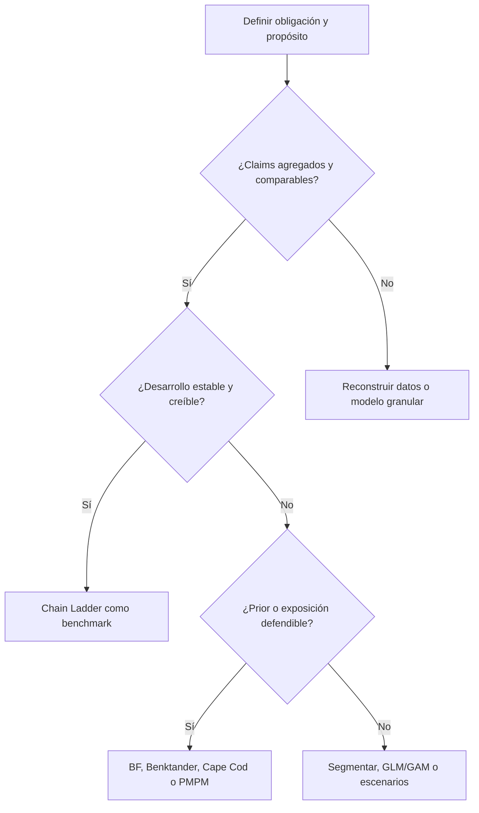
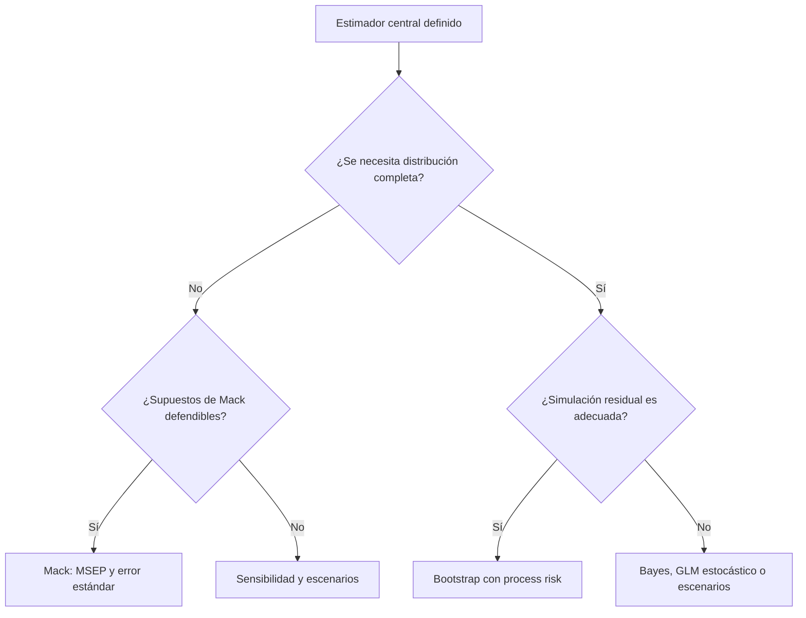
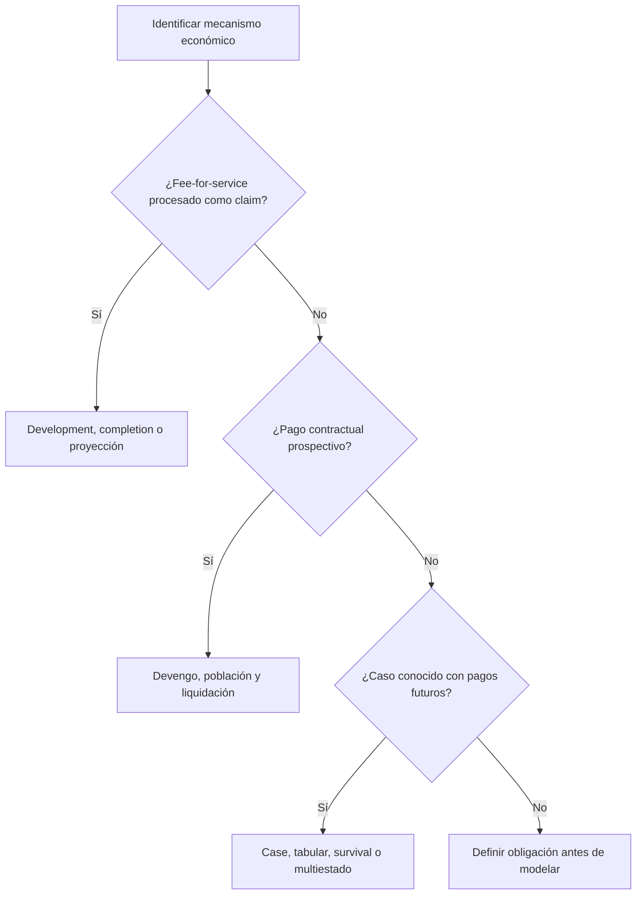

# Guía de selección de metodologías de reserving

> Seleccionar un método no es escoger una fórmula: es decidir qué evidencia resulta suficientemente confiable para estimar una obligación bajo un propósito, unos datos y una fecha de valoración específicos.

## Advertencia de alcance

Esta guía organiza el juicio metodológico, pero no lo reemplaza. No produce una respuesta automática ni establece que un método sea universalmente superior. La selección final debe adaptarse a:

- la obligación económica y contractual;
- el propósito y los usuarios de la estimación;
- la base contable o regulatoria aplicable;
- la fecha de valoración y la información disponible;
- la materialidad de los riesgos;
- las características y limitaciones de los datos;
- los cambios operativos, clínicos, contractuales y regulatorios;
- la capacidad de validación y gobierno.

Las referencias a Actuarial Standards of Practice (ASOP) describen un marco profesional de Estados Unidos. No sustituyen las normas colombianas ni son automáticamente vinculantes en otras jurisdicciones.

El lector debe dominar previamente los conceptos de [IBNR and Reserving](part-01-foundations/01-ibnr-and-reserving.md), construcción de triángulos y factores de desarrollo.

!!! danger "Regla de seguridad"
    Ninguna puntuación, backtest o promedio de métodos puede compensar una obligación mal definida, datos materialmente inadecuados, leakage, una ruptura estructural no tratada o un modelo que no puede validarse para su propósito.

## Objetivos de aprendizaje

Al finalizar esta guía, el lector podrá:

1. separar la selección del estimador central de la selección del método de incertidumbre;
2. definir gates mínimos de alcance, datos, supuestos, validación y gobierno;
3. identificar familias metodológicas plausibles según madurez, exposición y estabilidad;
4. reconocer cuándo Chain Ladder, Bornhuetter-Ferguson, Benktander, Cape Cod, Mack, Bootstrap, GLM, GAM, Bayes o machine learning son candidatos razonables;
5. diseñar challengers y backtests sin leakage temporal;
6. construir combinaciones defendibles sin promedios mecánicos;
7. documentar evidencia, contraargumentos, incertidumbre y condiciones que cambiarían la selección.

## Contenido

1. El problema de decisión
2. Roles metodológicos
3. Principios de selección
4. Gates eliminatorios
5. Diagnóstico de datos y portafolio
6. Árboles de decisión
7. Matriz comparativa
8. Perfiles metodológicos
9. Particularidades de salud
10. Aplicación a Colombia
11. Selección por madurez
12. Incertidumbre
13. Validación y backtesting
14. Ejemplo numérico
15. Scorecard y registro de decisión
16. Implementaciones en Python, R y SQL
17. Combinación de métodos
18. Gobierno y comunicación
19. Patrones de falla
20. Checklist
21. Conclusiones y bibliografía

## 1. El problema de decisión

Sea \(D_t\) la información disponible a la fecha de valoración \(t\), \(U_i\) el costo *ultimate* del periodo de origen \(i\) y \(C_{i,k_i}\) el importe acumulado observado a su madurez disponible \(k_i\). La reserva central es:

\[
\widehat{R}_{i,t}
=
\widehat{U}_{i,t}-C_{i,k_i}.
\]

La selección metodológica busca una acción adecuada para una decisión, no simplemente el menor error histórico. Conceptualmente:

\[
m^*
=
\arg\min_{m\in\mathcal{C}_{\mathrm{eligible}}}
\left\{
\mathbb{E}\!\left[L\!\left(a_m,U\right)\mid D_t\right]
+
\lambda G(m)
\right\},
\]

donde:

- \(\mathcal{C}_{\mathrm{eligible}}\) es el conjunto de candidatos que superan los gates mínimos;
- \(a_m\) es la estimación o decisión producida por el método \(m\);
- \(L\) representa la pérdida relevante para el propósito;
- \(G(m)\) representa complejidad, riesgo de modelo, costo operativo y carga de gobierno;
- \(\lambda\) refleja cuánto importa esa carga en la decisión.

Esta formulación no implica que todos los términos puedan medirse con precisión. Su utilidad es exponer un supuesto oculto frecuente: **optimizar una sola métrica predictiva equivale a asumir que los demás costos son cero**.

## 1.1 El propósito cambia la selección

La misma cartera puede requerir métodos o márgenes diferentes según el uso:

| Propósito | Medida prioritaria | Implicación metodológica |
|---|---|---|
| Mejor estimación actuarial | Centro de la distribución relevante | Evitar sesgo intencional y separar margen |
| Reporte financiero | Medida definida por la base aplicable | Reconciliación, materialidad y controles reforzados |
| Solvencia o capital | Cola y dependencia | Distribución predictiva, escenarios y agregación |
| Pricing o planeación | Costo futuro | Tendencia, exposición, cambios de beneficios y morbilidad |
| Gestión operativa | Señales tempranas y explicabilidad | Granularidad, oportunidad y estabilidad |
| Auditoría o revisión | Razonabilidad y trazabilidad | Benchmarks transparentes y documentación reproducible |

No debe reutilizarse una reserva contable como forecast de costo futuro sin reconciliar diferencias de fecha, exposición, tendencia, margen y obligación.

## 2. Roles metodológicos

Los métodos no siempre compiten por el mismo rol.

| Rol | Pregunta | Familias típicas |
|---|---|---|
| Estimador central | ¿Cuál es el ultimate o la reserva esperada? | Chain Ladder, BF, Benktander, Cape Cod, PMPM, GLM, GAM, Bayes |
| Cuantificación de incertidumbre | ¿Qué variabilidad rodea la estimación? | Mack, Bootstrap, GLM estocástico, Bayes, escenarios |
| Diagnóstico | ¿Qué supuesto falla y dónde? | Link ratios, residuos, runoff, estabilidad, calendario |
| Modelo granular | ¿Cómo influyen atributos de reclamo o miembro? | Frecuencia-severidad, supervivencia, multiestado, ML |
| Valuación de obligaciones conocidas | ¿Cuál es el valor de pagos futuros de casos reportados? | Reservas de caso, tabular, supervivencia, multiestado |
| Acumulación contractual | ¿Qué se ha devengado aunque no siga el flujo de claims? | PMPM contractual, capitación, PGP, liquidaciones |

!!! example "Error de comparación"
    Mack no es necesariamente un challenger de Bornhuetter-Ferguson para el centro de la estimación. Mack añade una estructura de error al Chain Ladder bajo supuestos específicos; BF cambia la forma de estimar el ultimate de periodos inmaduros. Primero se selecciona el centro y después se decide cómo representar su incertidumbre.

## 3. Principios de selección

## 3.1 Propósito antes que algoritmo

Defina el intended measure, la base y el usuario antes de revisar resultados. Un algoritmo que responde otra pregunta puede tener excelente ajuste y ser irrelevante.

## 3.2 Obligación antes que dataset

El dataset disponible no define por sí solo la obligación. Deben reconciliarse cobertura, fechas, contratos, población, recuperables, pagos directos, glosas y responsabilidades transferidas.

## 3.3 Estructura de datos antes que complejidad

Los triángulos agregados favorecen métodos de desarrollo. Los datos claim-level permiten supervivencia, frecuencia-severidad o ML, pero introducen más riesgo de leakage, definición y mantenimiento.

## 3.4 Segmentación antes que corrección

Cuando dos grupos tienen mecanismos de desarrollo diferentes, promediarlos y luego ajustar factores puede ser inferior a segmentarlos. Sin embargo, segmentar demasiado reduce credibilidad y estabilidad.

## 3.5 Múltiples métodos como evidencia, no como ritual

Usar varios métodos permite detectar dependencia de supuestos. No obliga a promediarlos. Un método puede ser central, otro challenger y un tercero una sensibilidad adversa.

## 3.6 Parsimonia condicionada a suficiencia

Se prefiere el método más simple que represente adecuadamente el fenómeno y la decisión. Simplicidad no justifica ignorar una ruptura estructural material.

## 3.7 Incertidumbre no equivale a margen

Una distribución predictiva describe variabilidad bajo un modelo. Un margen prudencial o provision for adverse deviation responde a otro objetivo y debe identificarse por separado.

## 4. Gates eliminatorios

Antes de asignar scores, cada candidato debe superar gates no compensatorios:

\[
\mathcal{C}_{\mathrm{eligible}}
=
\left\{
m\in\mathcal{C}:G_g(m)=1\ \text{para todo gate material }g
\right\}.
\]

| Gate | Pregunta | Evidencia mínima | Consecuencia de falla |
|---|---|---|---|
| G0 — Propósito | ¿El output responde a la decisión? | Intended measure, usuario, base y fecha documentados | Rechazar o redefinir |
| G1 — Obligación | ¿El perímetro económico está completo? | Contratos, cobertura, población, recuperables y exclusiones | Reconciliar antes de modelar |
| G2 — Datos | ¿Los datos son relevantes, suficientes y conciliables? | Diccionario, controles, reconciliación y limitaciones | Corregir, complementar o restringir alcance |
| G3 — Identificación | ¿Los supuestos centrales pueden distinguirse con la evidencia? | Madurez, variación, exposición o prior defendible | Simplificar o usar escenarios |
| G4 — Validación | ¿Puede evaluarse el modelo fuera de la muestra usada para ajustarlo? | Holdout temporal, runoff o benchmark | No usar como modelo central sin disclosure fuerte |
| G5 — Estabilidad | ¿El proceso histórico representa razonablemente el futuro inmediato? | Análisis de cambios de sistema, contratos y mezcla | Segmentar, ajustar o excluir historia |
| G6 — Gobierno | ¿El modelo puede explicarse, reproducirse y monitorearse? | Documentación, propietario, versiones y pruebas | Mantener como exploratorio |
| G7 — Implementación | ¿La organización puede ejecutarlo de manera confiable? | Datos oportunos, dependencias, controles y fallback | Elegir alternativa operable |

Una falla puede ser material para un segmento y no para otro. Los gates se evalúan al nivel al que se toma la decisión, no solo en agregado.

## 5. Diagnóstico de datos y portafolio

## 5.1 Preguntas mínimas

Antes de seleccionar métodos, documente:

1. ¿Cuál es la fecha de servicio o incurral correcta?
2. ¿Qué fechas de presentación, adjudicación, contabilización y pago existen?
3. ¿La medida es paid, incurred, allowed, billed o una obligación contractual?
4. ¿Existen reservas de caso consistentes?
5. ¿Cómo se registran denegaciones, reversos, recuperaciones y pagos parciales?
6. ¿Existe exposición por periodo y segmento?
7. ¿Hubo cambios de beneficios, red, TPA, sistema o política de claims?
8. ¿Qué proporción del total depende de grandes reclamantes?
9. ¿Qué periodos son suficientemente maduros para validación?
10. ¿La frecuencia de valoración es compatible con el rezago de datos?

## 5.2 Síntomas y consecuencias

| Síntoma | Riesgo oculto | Implicación para selección |
|---|---|---|
| Factores crecientes en diagonales recientes | Retraso operativo o inflación, no desarrollo estable | Evitar Chain Ladder sin ajuste de calendario |
| Paid estable e incurred volátil | Cambio en reservas de caso | Preferir paid, ajustar incurred o usar enfoque multivariado |
| Paid volátil e incurred estable | Calendario de pagos o conciliaciones | Evaluar incurred y contractual accrual |
| Exposición cambia rápidamente | Triángulos confunden volumen con costo | Incorporar PMPM, Cape Cod o GLM con offset |
| Segmentos pequeños | Factores no creíbles | Agrupar, usar BF o partial pooling bayesiano |
| Reversos y negativos materiales | Ratios inestables y distribución asimétrica | Modelar neto/bruto por separado o usar incremental |
| Grandes reclamos concentrados | Distorsión de factores y varianza | Truncar/segmentar con reintegración explícita |
| Nuevo sistema de adjudicación | Ruptura de velocidad de procesamiento | Separar eras, usar prior y escenarios |
| Falta de member months | Proyecciones de costo no comparables | Reconstruir exposición antes de PMPM/Cape Cod |
| Cierre sin ultimate observable | Backtest circular | Usar as-of histórico y pseudo-ultimate maduro |

Véanse [Triangle Construction](part-01-foundations/02-triangle-construction.md), [Development Lags](part-01-foundations/03-development-lags-and-triangle-transformations.md) y [Chain Ladder Diagnostics](part-02-classical-reserving/07-chain-ladder-diagnostics.md).

## 6. Árboles de decisión

## 6.1 Selección del estimador central



El árbol identifica candidatos, no selecciona automáticamente. Un Chain Ladder plausible sigue requiriendo diagnósticos; un prior disponible no es necesariamente confiable.

## 6.2 Selección del marco de incertidumbre



## 6.3 Naturaleza de la obligación en salud



## 7. Matriz comparativa de familias

Las categorías alta, media y baja son relativas; no constituyen ratings universales.

Esta matriz complementa la discusión desarrollada en [Classical Reserving Methods Comparison](part-02-classical-reserving/14-classical-reserving-methods-comparison.md).

| Método | Rol principal | Datos mínimos | Periodos inmaduros | Cambio estructural | Incertidumbre nativa | Interpretabilidad |
|---|---|---|---|---|---|---|
| Chain Ladder | Ultimate por desarrollo | Triángulo estable | Baja robustez | Baja | No | Alta |
| Bornhuetter-Ferguson | Prior + experiencia emergente | Triángulo, CDF y prior | Alta utilidad | Media si el prior refleja el cambio | No | Alta |
| Benktander | Credibilidad iterativa | Igual que BF | Alta utilidad | Media | No | Alta |
| Cape Cod | ELR derivado de experiencia/exposición | Triángulo y exposición | Alta utilidad | Media | No | Alta |
| Mack | Error de Chain Ladder | Triángulo acumulado | Hereda CL | Baja | MSEP analítico | Media-alta |
| Bootstrap | Distribución simulada | Triángulo y modelo residual | Hereda estructura base | Baja-media | Sí, condicional | Media |
| GLM | Efectos explícitos y distribución | Incrementales y covariables | Media-alta | Media-alta | Sí, condicional | Media-alta |
| GAM | No linealidad suave | Igual que GLM con volumen suficiente | Media-alta | Media-alta | Sí, condicional | Media |
| Bayes jerárquico | Partial pooling y posterior | Datos + priors | Alta | Alta si se modela | Sí | Media |
| Árboles/boosting | Predicción granular no lineal | Datos ricos y holdout temporal | Variable | Media-alta | No por defecto | Baja-media |
| PMPM/proyección | Costo por exposición | Claims maduros y member months | Alta | Alta si se ajusta | No por defecto | Alta |
| Supervivencia/multiestado | Tiempo y estado de claims | Eventos granulares | Alta | Media-alta | Sí | Media |

## 8. Perfiles metodológicos

## 8.1 Chain Ladder

**Candidato fuerte cuando:** existe volumen suficiente, los patrones de desarrollo son estables y los periodos de origen son comparables.

**Supuesto dominante:** el desarrollo futuro de cada periodo puede inferirse de la experiencia histórica seleccionada.

**Mejor contraargumento:** su aparente objetividad oculta que la selección de factores, ventanas, segmentos y cola contiene juicio; además, una ruptura operativa puede hacer más precisos los factores históricos y menos relevantes para el futuro.

**Evidencia que cambia la selección:** inestabilidad de link ratios, efectos calendario, cambios de TPA, reservas de caso, mezcla o grandes claims.

Consulte [Age-to-Age Development Factors](part-01-foundations/05-age-to-age-development-factors.md), [Chain Ladder Method](part-02-classical-reserving/06-chain-ladder-method.md) y [Chain Ladder Diagnostics](part-02-classical-reserving/07-chain-ladder-diagnostics.md).

## 8.2 Bornhuetter-Ferguson

**Candidato fuerte cuando:** los periodos son inmaduros y existe un prior de ultimate o ELR defendible.

Si \(p_i\) es la proporción reportada y \(q_i=1-p_i\), entonces:

\[
\widehat{U}^{BF}_i
=
C_{i,k_i}+q_i U_i^{(0)}.
\]

**Supuesto dominante:** el prior es más informativo que la experiencia emergente para la porción no reportada.

**Mejor contraargumento:** BF reduce volatilidad, pero puede estabilizar sistemáticamente una expectativa sesgada.

**Evidencia que cambia la selección:** backtest del prior, cambios de precio/beneficio, suficiencia del ELR y madurez real.

Consulte [Bornhuetter-Ferguson](part-02-classical-reserving/11-bornhuetter-ferguson.md).

## 8.3 Benktander

**Candidato fuerte cuando:** se busca una transición explícita entre el prior y la experiencia conforme aumenta la credibilidad.

Una iteración posterior a BF puede expresarse como:

\[
\widehat{U}^{Benk}_i
=
C_{i,k_i}+q_i\widehat{U}^{BF}_i.
\]

**Mejor contraargumento:** el mecanismo de credibilidad no corrige por sí mismo un patrón de desarrollo defectuoso ni un prior sesgado.

Consulte [Benktander Method](part-02-classical-reserving/12-benktander-method.md).

## 8.4 Cape Cod

**Candidato fuerte cuando:** existe exposición comparable y el ELR puede estimarse de forma creíble entre periodos.

**Supuesto dominante:** la relación entre ultimate y exposición es suficientemente homogénea después de los ajustes seleccionados.

**Mejor contraargumento:** un ELR agregado puede ocultar cambios de morbilidad, beneficios o mezcla y transferirlos a todos los periodos.

Consulte [Cape Cod Method](part-02-classical-reserving/13-cape-cod-method.md).

## 8.5 Mack Chain Ladder

**Candidato fuerte cuando:** el centro Chain Ladder es apropiado y se requiere MSEP o error estándar bajo una formulación distribution-free condicional.

**No cubre automáticamente:** error de modelo, calidad de datos, cambio estructural, incertidumbre del tail fuera de la especificación ni sesgo de selección.

Consulte [Mack Chain Ladder](part-03-stochastic-reserving/08-mack-chain-ladder.md).

## 8.6 Bootstrap Chain Ladder

**Candidato fuerte cuando:** se requiere una distribución predictiva simulada y el modelo residual representa razonablemente el proceso.

**Riesgos:** residuos mal ajustados, celdas negativas, process distribution inadecuada, extrapolación de cola y dependencia no modelada.

Consulte [Bootstrap Chain Ladder](part-03-stochastic-reserving/09-bootstrap-chain-ladder.md) y [Comparing Mack vs. Bootstrap](part-03-stochastic-reserving/10-comparing-mack-vs-bootstrap.md).

## 8.7 GLM y GAM

**Candidatos fuertes cuando:** se necesitan efectos de origen, desarrollo y calendario explícitos, offsets de exposición o relaciones suaves no lineales.

**Mejor contraargumento:** mayor flexibilidad puede desplazar la inestabilidad desde factores visibles hacia decisiones menos evidentes de distribución, enlace, suavización y regularización.

Consulte [GLM for Loss Reserving](part-04-statistical-models/15-glm-for-loss-reserving.md) y [GAM for Loss Reserving](part-04-statistical-models/16-gam-for-loss-reserving.md).

## 8.8 Modelos bayesianos

**Candidatos fuertes cuando:** se necesita partial pooling, conocimiento previo explícito, jerarquías o una distribución posterior completa.

**Riesgos:** priors no calibrados, convergencia aparente, mala identificabilidad y costo computacional.

Consulte [Bayesian Loss Reserving](part-04-statistical-models/17-bayesian-loss-reserving.md).

## 8.9 Machine learning

**Candidato fuerte cuando:** existen datos granulares, relaciones complejas, un target correctamente construido y suficiente historia para validación temporal.

**Gate adicional:** ningún modelo debe promoverse por R² o error aleatorio si no supera un benchmark actuarial en backtesting as-of, estabilidad, explicabilidad y operación.

Consulte [Machine Learning for Loss Reserving](part-05-machine-learning/18-machine-learning-for-loss-reserving.md) y [Tree-Based Models](part-05-machine-learning/19-tree-based-models-for-loss-reserving.md).

## 9. Particularidades de seguros de salud

La selección debe reconocer que distintas obligaciones pueden coexistir dentro del mismo producto.

| Componente | Patrón típico | Candidato inicial | Ajustes críticos |
|---|---|---|---|
| Fee-for-service médico | Alta frecuencia y rezago de procesamiento | Completion/development + PMPM | Servicio, adjudicación, tendencia y estacionalidad |
| Farmacia | Desarrollo rápido y reversos | Development corto + proyección | Rebates, reversos y cambio de mix |
| Dental y visión | Estacionalidad y límites de beneficio | Development o PMPM | Calendario de beneficios y exposición |
| Salud mental | Episodios y continuidad | PMPM, frecuencia-severidad o survival | Paridad, red y duración |
| Grandes claims | Baja frecuencia, alta severidad | Separación + case/frequency-severity | Umbral, reintegración y reaseguro |
| Capitación | Devengo contractual | Población × tarifa + liquidación | Altas/bajas, retroactividad y risk sharing |
| PGP/episodios | Obligación contractual y desempeño | Devengo + modelo de liquidación | Corredores, calidad, stop-loss y reconciliación |
| Discapacidad o pagos prolongados | Serie futura por caso | Tabular, survival o multiestado | Recuperación, mortalidad y beneficio remanente |

## 9.1 Paid versus incurred

Paid puede ser más objetivo, pero sensible a calendarios de pago. Incurred puede incorporar información temprana, pero depende de la calidad de reservas de caso. La selección debe analizar ambos y explicar divergencias, como se desarrolla en [Incremental vs. Cumulative Triangles](part-01-foundations/04-incremental-vs-cumulative-triangles.md) y [Colombia Paid vs. Incurred Triangles](part-07-colombia/30-colombia-paid-vs-incurred-triangles.md).

## 9.2 Exposición

Cuando la población cambia, el costo total mezcla exposición y costo unitario. Con member months \(MM_i\):

\[
\widehat{U}_i
=
MM_i\times \widehat{PMPM}_i.
\]

Un PMPM defendible debe ajustar, cuando sea material, tendencia, beneficios, morbilidad, estacionalidad y mix. Los capítulos específicos de completion factors, PMPM y medical trend están planificados en la Parte VI.

## 9.3 Grandes claims

Separar grandes claims puede estabilizar el patrón base, pero crea tres decisiones: umbral, método del exceso y reintegración. Excluirlos sin reincorporar su expectativa subestima el ultimate.

## 10. Aplicación al contexto colombiano

La metodología debe partir del rol de la entidad y de la obligación, no de una etiqueta genérica de “reserva de salud”.

| Situación | Riesgo de selección errónea | Portafolio metodológico inicial |
|---|---|---|
| EPS — servicios fee-for-service | Confundir radicación, reconocimiento y pago | Paid/incurred triangles, completion, PMPM y glosas separadas |
| EPS — capitación o PGP | Aplicar desarrollo de claims a una obligación contractual | Devengo poblacional, liquidación y escenarios contractuales |
| IPS — ingresos y cuentas por cobrar | Tratar revenue recognition como IBNR del asegurador | Modelos de facturación, glosa, recaudo y deterioro separados |
| Medicina prepagada | Mezclar prima, costo médico y reserva contractual | Triángulos, PMPM y análisis contractual por producto |
| Glosas y controversias | Reservar todo o nada sin estados intermedios | Case reserve, probabilidad de reconocimiento, survival/multiestado |
| Alto costo | Distorsión de desarrollo y concentración | Segmentación, case estimates, frecuencia-severidad y escenarios |

Consulte [Colombia Health Reserving Methodologies](part-07-colombia/29-colombia-health-reserving-methodologies.md), [Data and Multistate Models](part-07-colombia/31-colombia-data-and-multistate-models.md), [Glosas and Disputes](part-07-colombia/32-colombia-glosas-and-disputes.md) y [Capitation and Prospective Payments](part-07-colombia/33-colombia-capitation-and-prospective-payments.md).

!!! warning "Regulación y metodología"
    Un mínimo regulatorio puede restringir la selección o imponer un piso, pero no prueba que ese valor sea la mejor estimación económica. Documente por separado resultado actuarial, ajuste regulatorio, provisión contable y margen.

## 11. Selección por madurez

La selección puede variar por periodo de origen. Obligar a que todos los periodos usen el mismo estimador puede ser menos coherente que aplicar una regla de credibilidad documentada.

Sea \(p_i\) la proporción desarrollada y \(q_i=1-p_i\). Una forma general de combinación es:

\[
\widehat{U}_i
=
w_i\widehat{U}^{CL}_i
+
(1-w_i)U_i^{(0)},
\qquad 0\leq w_i\leq 1.
\]

La madurez puede informar \(w_i\), pero no debe determinarlo mecánicamente. Credibilidad también depende de volumen, estabilidad, ruptura estructural y calidad del prior.

| Madurez y evidencia | Método central plausible | Challengers mínimos |
|---|---|---|
| Alta madurez, patrón estable | Chain Ladder | BF/Cape Cod y PMPM |
| Madurez media, prior confiable | Benktander o BF | Chain Ladder y Cape Cod |
| Baja madurez, exposición confiable | BF, Cape Cod o PMPM | Escenarios y GLM |
| Baja madurez, prior débil | Rango de escenarios | Agregación, partial pooling o fuentes externas |
| Ruptura operativa reciente | Prior ajustado + escenarios | Modelo por eras y datos operativos |

## 11.1 Riesgo de discontinuidades

Una regla que cambia abruptamente de BF a Chain Ladder al cruzar un umbral de madurez puede producir saltos artificiales. Deben evaluarse:

- continuidad del ultimate entre valoraciones;
- sensibilidad a pequeñas variaciones de \(p_i\);
- runoff por cohorte;
- estabilidad de pesos o reglas de selección;
- consistencia con nueva información.

## 12. Selección del tratamiento de incertidumbre

## 12.1 Fuentes de incertidumbre

| Fuente | Ejemplo | Tratamiento posible |
|---|---|---|
| Process risk | Variación aleatoria de pagos futuros | Mack, Bootstrap, GLM o Bayes |
| Parameter risk | Factores estimados con historia limitada | Mack, Bootstrap, posterior bayesiano |
| Model risk | Desarrollo estable versus ruptura no modelada | Challengers, escenarios y model averaging |
| Data risk | Claims faltantes, duplicados o mal fechados | Ajustes, rangos y controles; no solo simulación |
| Operational risk | Cambio de TPA o acumulación de inventario | Escenarios informados por métricas operativas |
| Contractual risk | Liquidación de PGP o risk sharing | Modelo contractual y escenarios jurídicos |
| Regulatory risk | Cambio de base o mínimo requerido | Crosswalk y escenarios normativos |

Mack y Bootstrap suelen cuantificar incertidumbre condicional a una estructura. No deben presentarse como medida exhaustiva si data risk, model risk o cambios futuros son materiales.

## 12.2 Output según decisión

| Necesidad | Output recomendado |
|---|---|
| Mejor estimación | Centro + sensibilidad de supuestos materiales |
| Rango de razonabilidad | Intervalo actuarial con fuentes claramente definidas |
| Capital o solvencia | Distribución agregada, dependencia y cola |
| Gestión mensual | Runoff, estabilidad y escenarios operativos |
| Comunicación ejecutiva | Centro, drivers, rango y condiciones que cambiarían la conclusión |

## 13. Validación y backtesting

## 13.1 Diseño as-of

La validación debe reconstruir lo que se conocía en cada fecha histórica. Usar información posterior para construir features, factores, segmentos o ultimate produce leakage.

Para cada fecha de evaluación \(t\):

1. congele datos disponibles hasta \(t\);
2. ajuste el método sin utilizar diagonales futuras;
3. estime \(\widehat{U}_{i\mid t}\) o \(\widehat{R}_{i\mid t}\);
4. avance a \(t+h\);
5. compare con pagos emergentes y reserva revisada;
6. repita sobre múltiples fechas y segmentos.

## 13.2 Métricas

Si \(U_i^{eval}\) es un ultimate suficientemente maduro:

\[
e_i
=
\widehat{U}_{i\mid t}-U_i^{eval}.
\]

Sesgo agregado relativo:

\[
\operatorname{Bias}_{rel}
=
\frac{\sum_i e_i}{\sum_i U_i^{eval}}.
\]

Error absoluto ponderado:

\[
\operatorname{WAPE}
=
\frac{\sum_i |e_i|}{\sum_i |U_i^{eval}|}.
\]

Runoff de reserva entre \(t\) y \(t+h\):

\[
\rho_{t,h}
=
\frac{
\widehat{R}_t-
\left(P_{(t,t+h]}+\widehat{R}_{t+h}\right)
}{\widehat{R}_t}.
\]

Con esta convención, \(\rho_{t,h}>0\) indica redundancia de la reserva previa y \(\rho_{t,h}<0\) deficiencia.

Para distribuciones predictivas deben evaluarse adicionalmente:

- cobertura de intervalos;
- ancho y sharpness;
- PIT o calibración de cuantiles;
- CRPS o log score, cuando sean apropiados;
- estabilidad de VaR y TVaR;
- calibración por segmento y madurez.

## 13.3 Limitaciones del backtest

El backtest tampoco es verdad perfecta:

- el ultimate de evaluación puede continuar desarrollándose;
- pocas valoraciones generan alta incertidumbre en el ranking;
- un periodo de calma no valida desempeño en crisis;
- optimizar repetidamente contra el mismo holdout lo convierte en entrenamiento;
- el mejor promedio puede ocultar sesgo material en un segmento.

La evidencia debe incluir desempeño, estabilidad, diagnóstico económico y plausibilidad prospectiva.

## 14. Ejemplo numérico de selección

Considere un periodo reciente con:

- acumulado observado: \(C=7.20\) millones;
- proporción reportada seleccionada: \(p=0.80\);
- proporción no reportada: \(q=0.20\);
- prior de ultimate: \(U^{(0)}=10.00\) millones;
- expectativa Cape Cod basada en exposición: \(U^{CC,0}=9.50\) millones.

## 14.1 Resultados

Chain Ladder:

\[
\widehat{U}^{CL}
=
\frac{7.20}{0.80}
=
9.00,
\qquad
\widehat{R}^{CL}=1.80.
\]

Bornhuetter-Ferguson:

\[
\widehat{U}^{BF}
=
7.20+0.20(10.00)
=
9.20,
\qquad
\widehat{R}^{BF}=2.00.
\]

Benktander:

\[
\widehat{U}^{Benk}
=
7.20+0.20(9.20)
=
9.04,
\qquad
\widehat{R}^{Benk}=1.84.
\]

Cape Cod, usando su expectativa por exposición:

\[
\widehat{U}^{CC}
=
7.20+0.20(9.50)
=
9.10,
\qquad
\widehat{R}^{CC}=1.90.
\]

| Método | Ultimate | Reserva | Dependencia dominante |
|---|---:|---:|---|
| Chain Ladder | 9.00 | 1.80 | Proporción reportada |
| Bornhuetter-Ferguson | 9.20 | 2.00 | Prior para la parte no reportada |
| Benktander | 9.04 | 1.84 | Prior actualizado por experiencia |
| Cape Cod | 9.10 | 1.90 | Exposición y ELR implícito |

## 14.2 Selección razonada

Suponga que:

- el periodo es inmaduro;
- el prior proviene de pricing ajustado por tendencia y beneficios;
- los factores recientes muestran ruido por cambio de adjudicación;
- el backtest histórico del prior no presenta sesgo material;
- el patrón anterior al cambio sigue siendo útil como benchmark.

Una selección defendible sería BF en 9.20 como estimación central, Benktander y Cape Cod como challengers, y Chain Ladder como sensibilidad. No existe fundamento para promediar automáticamente los cuatro valores.

## 14.3 Qué cambiaría la conclusión

- Si el prior sobreestima sistemáticamente el ultimate, aumentaría el peso de experiencia.
- Si el cambio de adjudicación reduce \(p\) real de 0.80 a 0.75, el Chain Ladder aumentaría a 9.60 y la interpretación cambiaría.
- Si member months o mix de riesgo están mal medidos, Cape Cod perdería credibilidad.
- Si el periodo madura sin deterioro, Benktander o Chain Ladder ganarían peso.
- Si grandes claims explican la diferencia, se requeriría segmentar antes de escoger.

Este ejemplo ilustra selección condicional, no una regla general.

## 15. Scorecard y registro de decisión

## 15.1 Gates antes de scores

Los candidatos que fallen un gate material se excluyen o permanecen como exploratorios. Solo los elegibles pasan a una comparación ordinal.

## 15.2 Dimensiones sugeridas

| Dimensión | Pregunta | Evidencia |
|---|---|---|
| Fit to purpose | ¿Estima la medida correcta? | Mapeo entre output y decisión |
| Compatibilidad de datos | ¿La granularidad y madurez soportan el método? | Data profile y reconciliación |
| Backtest | ¿Tiene sesgo y error aceptables? | Rolling as-of |
| Estabilidad | ¿Resiste ventanas, segmentos y supuestos? | Sensibilidad |
| Prospectividad | ¿Representa cambios futuros conocidos? | Escenarios y conocimiento operativo |
| Incertidumbre | ¿El output cubre la necesidad decisional? | MSEP, distribución o escenarios |
| Interpretabilidad | ¿Los drivers pueden explicarse? | Documentación y XAI |
| Operabilidad | ¿Puede ejecutarse oportunamente? | SLA, dependencias y fallback |
| Gobierno | ¿Puede reproducirse, revisarse y monitorearse? | Versionado, pruebas y ownership |

Si se usa un score:

\[
S_m
=
\frac{\sum_{k=1}^{K}w_k s_{m,k}}{\sum_{k=1}^{K}w_k},
\]

debe reconocerse que sumar escalas ordinales crea una apariencia de precisión. El score organiza evidencia; no decide por el actuario.

## 15.3 Registro mínimo

```yaml
decision_id: RSV-YYYY-MM-SEGMENT
valuation_date: YYYY-MM-DD
intended_measure: best-estimate-unpaid-claims
segment: example-segment
materiality_basis: documented-reference
data_as_of: YYYY-MM-DD
central_method: bornhuetter-ferguson
challengers:
  - chain-ladder
  - benktander
  - cape-cod
uncertainty_method: bootstrap-plus-structural-scenarios
rejected_candidates:
  - method: gradient-boosting
    reason: insufficient-temporal-holdout
key_assumptions:
  - selected-completion-pattern
  - expected-ultimate-prior
known_limitations:
  - recent-claims-system-change
evidence_that_would_change_selection:
  - two-additional-runout-diagonals
  - revised-member-month-reconciliation
reviewer: independent-reviewer-id
approval_status: draft
```

## 16. Implementaciones reproducibles

## 16.1 Python — gates y scorecard

```python
from __future__ import annotations

from collections.abc import Mapping

import pandas as pd


GATE_COLUMNS: tuple[str, ...] = (
    "gate_purpose",
    "gate_obligation",
    "gate_data",
    "gate_validation",
    "gate_stability",
    "gate_governance",
)


def evaluate_candidates(
    candidates: pd.DataFrame,
    weights: Mapping[str, float],
) -> pd.DataFrame:
    """Apply non-compensatory gates and an ordinal evidence score.

    The score is reported only for candidates that pass every material gate.
    It is a decision aid, not an automatic model selector.
    """
    if candidates.empty:
        raise ValueError("candidates must contain at least one method")

    required = {"method", *GATE_COLUMNS, *weights.keys()}
    missing = required.difference(candidates.columns)
    if missing:
        raise ValueError(f"missing columns: {sorted(missing)}")

    if not weights or any(value < 0 for value in weights.values()):
        raise ValueError("weights must be non-empty and non-negative")

    total_weight = float(sum(weights.values()))
    if total_weight <= 0:
        raise ValueError("at least one weight must be positive")

    result = candidates.copy()
    result["eligible"] = result.loc[:, list(GATE_COLUMNS)].astype(bool).all(axis=1)

    score = sum(
        result[column].astype(float) * weight
        for column, weight in weights.items()
    ) / total_weight

    result["evidence_score"] = score.where(result["eligible"])
    return result.sort_values(
        ["eligible", "evidence_score", "method"],
        ascending=[False, False, True],
        na_position="last",
    ).reset_index(drop=True)


weights = {
    "fit_to_purpose": 3.0,
    "backtest": 2.0,
    "stability": 2.0,
    "interpretability": 1.0,
    "operability": 1.0,
}

candidates = pd.DataFrame(
    [
        {
            "method": "chain-ladder",
            "gate_purpose": True,
            "gate_obligation": True,
            "gate_data": True,
            "gate_validation": True,
            "gate_stability": False,
            "gate_governance": True,
            "fit_to_purpose": 4,
            "backtest": 3,
            "stability": 2,
            "interpretability": 5,
            "operability": 5,
        },
        {
            "method": "bornhuetter-ferguson",
            "gate_purpose": True,
            "gate_obligation": True,
            "gate_data": True,
            "gate_validation": True,
            "gate_stability": True,
            "gate_governance": True,
            "fit_to_purpose": 5,
            "backtest": 4,
            "stability": 4,
            "interpretability": 5,
            "operability": 5,
        },
    ]
)

selection_table = evaluate_candidates(candidates, weights)
```

El ejemplo deja Chain Ladder sin score final porque falla el gate de estabilidad, aun si su interpretabilidad y operabilidad son altas.

## 16.2 R — implementación equivalente

```r
library(dplyr)

evaluate_candidates <- function(candidates, weights) {
  gate_columns <- c(
    "gate_purpose", "gate_obligation", "gate_data",
    "gate_validation", "gate_stability", "gate_governance"
  )

  required <- c("method", gate_columns, names(weights))
  missing <- setdiff(required, names(candidates))

  if (nrow(candidates) == 0) {
    stop("candidates must contain at least one method")
  }
  if (length(missing) > 0) {
    stop(paste("missing columns:", paste(missing, collapse = ", ")))
  }
  if (length(weights) == 0 || any(weights < 0) || sum(weights) <= 0) {
    stop("weights must be non-empty, non-negative, and sum to a positive value")
  }

  score_matrix <- as.matrix(candidates[, names(weights), drop = FALSE])
  raw_score <- as.vector(score_matrix %*% weights / sum(weights))

  candidates %>%
    mutate(
      eligible = if_all(all_of(gate_columns), as.logical),
      evidence_score = if_else(eligible, raw_score, NA_real_)
    ) %>%
    arrange(desc(eligible), desc(evidence_score), method)
}
```

## 16.3 SQL — perfil previo a selección

El siguiente ejemplo usa PostgreSQL y asume una tabla claim-level `claims` y una tabla de exposición `membership`.

```sql
WITH claim_base AS (
    SELECT
        segment_id,
        service_date,
        payment_date,
        paid_amount,
        CASE
            WHEN service_date IS NOT NULL
             AND payment_date IS NOT NULL
            THEN payment_date - service_date
        END AS lag_days
    FROM claims
),
claim_quality AS (
    SELECT
        segment_id,
        COUNT(*) AS claim_rows,
        COUNT(*) FILTER (
            WHERE service_date IS NULL OR payment_date IS NULL
        ) AS missing_date_rows,
        COUNT(*) FILTER (WHERE paid_amount < 0) AS negative_rows,
        COUNT(*) FILTER (WHERE lag_days < 0) AS invalid_lag_rows,
        AVG(lag_days) FILTER (WHERE lag_days >= 0) AS avg_lag_days,
        MAX(ABS(paid_amount)) AS largest_absolute_claim,
        SUM(ABS(paid_amount)) AS total_absolute_claims
    FROM claim_base
    GROUP BY segment_id
),
exposure AS (
    SELECT
        segment_id,
        SUM(member_months) AS member_months
    FROM membership
    GROUP BY segment_id
)
SELECT
    q.segment_id,
    q.claim_rows,
    q.missing_date_rows,
    q.negative_rows,
    q.invalid_lag_rows,
    q.avg_lag_days,
    q.largest_absolute_claim
        / NULLIF(q.total_absolute_claims, 0) AS largest_claim_share,
    e.member_months,
    CASE
        WHEN e.member_months IS NULL OR e.member_months <= 0
        THEN FALSE ELSE TRUE
    END AS exposure_gate,
    CASE
        WHEN q.missing_date_rows = 0
         AND q.invalid_lag_rows = 0
        THEN TRUE ELSE FALSE
    END AS date_quality_gate
FROM claim_quality AS q
LEFT JOIN exposure AS e
    ON q.segment_id = e.segment_id
ORDER BY q.segment_id;
```

Este perfil no decide el método. Identifica segmentos donde development, PMPM o modelos granulares pueden ser inválidos antes de cualquier ajuste.

## 17. Combinación de métodos

Una combinación explícita puede escribirse como:

\[
\widehat{U}^{comb}_i
=
\sum_{m=1}^{M}w_{i,m}\widehat{U}_{i,m},
\qquad
w_{i,m}\geq 0,
\qquad
\sum_{m=1}^{M}w_{i,m}=1.
\]

Los pesos pueden variar por madurez, segmento y evidencia, pero deben tener justificación.

## 17.1 Combinaciones defendibles

- credibilidad explícita entre experiencia y prior;
- pesos por madurez definidos antes de ver el resultado final;
- stacking o averaging validado en rolling-origin holdouts;
- central estimate más escenarios separados, sin fingir una distribución única;
- selección por componente con reconciliación agregada.

## 17.2 Combinaciones débiles

- promedio simple porque “reduce extremos”;
- escoger pesos para alcanzar un número deseado;
- incluir métodos fallidos para aparentar diversidad;
- estimar pesos y medir desempeño en el mismo holdout;
- combinar outputs que representan obligaciones o bases distintas.

## 18. Gobierno y comunicación

La documentación debe permitir que otro profesional calificado evalúe la razonabilidad del trabajo.

## 18.1 Contenido mínimo de la comunicación

- propósito, intended measure y usuarios;
- fechas de servicio, datos, valoración y revisión;
- perímetro de obligación y bases de reconocimiento;
- fuentes, reconciliaciones y limitaciones de datos;
- métodos considerados, descartados y seleccionados;
- supuestos materiales y fuentes;
- resultados centrales, challengers y sensibilidades;
- incertidumbre cubierta y no cubierta;
- cambios frente a la valoración anterior;
- reliance en terceros, expertos o modelos externos;
- evidencia que podría cambiar la conclusión;
- aprobación, versión y seguimiento.

## 18.2 Monitoreo

Defina triggers antes de producción:

| Trigger | Ejemplo | Acción |
|---|---|---|
| Bias de runoff | Deficiencia persistente por segmento | Recalibrar y revisar obligación |
| Drift de desarrollo | Link ratios fuera de rango | Analizar operación y calendario |
| Cambio de exposición | Variación material de member months | Reponderar PMPM/Cape Cod |
| Cambio contractual | Nuevo PGP o stop-loss | Redefinir modelo de obligación |
| Data quality | Aumento de fechas faltantes | Bloquear release o ampliar rango |
| Model drift | Deterioro del holdout | Activar challenger o fallback |

## 19. Patrones de falla y contraargumentos

| Atajo | Por qué parece razonable | Mejor contraargumento |
|---|---|---|
| “Siempre usamos Chain Ladder” | Es conocido y auditable | Familiaridad no prueba estabilidad futura |
| “El ML tiene menor RMSE” | Mejora una métrica | Puede contener leakage, sesgo segmental o mala calibración |
| “Promediemos todos” | Reduce discusiones | Oculta métodos no elegibles y no define qué riesgo cubre |
| “El método conservador es más seguro” | Reduce riesgo de insuficiencia | Conservadurismo acumulado puede distorsionar decisiones y duplicar margen |
| “Más segmentos son mejores” | Capturan heterogeneidad | Pueden destruir credibilidad y aumentar varianza |
| “El backtest ganó” | Usa evidencia histórica | El ranking puede ser inestable y no representar una ruptura futura |
| “Mack da el rango total” | Produce error estándar | Es condicional y no incorpora automáticamente model/data risk |
| “Los claims pagados son objetivos” | El pago es observable | Calendarios y decisiones operativas pueden distorsionarlos |
| “Incurred contiene más información” | Incluye case reserves | Cambios de práctica pueden dominar la señal |

## 20. Checklist práctico de selección

## Propósito y obligación

- [ ] Intended measure, usuario y base definidos.
- [ ] Fecha de valoración y data as-of separadas.
- [ ] Cobertura, población, contratos y recuperables reconciliados.
- [ ] Mejor estimación, mínimo regulatorio y margen diferenciados.

## Datos

- [ ] Fechas y estados de claims comprendidos.
- [ ] Paid, incurred, allowed y billed no se mezclan.
- [ ] Exposición disponible y conciliada.
- [ ] Reversos, negativos y grandes claims evaluados.
- [ ] Cambios de sistemas, TPA, red y beneficios documentados.

## Candidatos

- [ ] Gates aplicados antes del score.
- [ ] Benchmark actuarial incluido.
- [ ] Prior evaluado mediante backtest.
- [ ] Métodos descartados y razones documentados.
- [ ] Centro e incertidumbre seleccionados por separado.

## Validación

- [ ] Backtest rolling as-of sin leakage.
- [ ] Bias, error, runoff y estabilidad evaluados.
- [ ] Desempeño revisado por segmento y madurez.
- [ ] Sensibilidades materiales cuantificadas.
- [ ] Evidencia prospectiva y cambios estructurales incorporados.

## Gobierno

- [ ] Código, datos y versiones reproducibles.
- [ ] Limitaciones y reliance comunicados.
- [ ] Triggers, challenger y fallback definidos.
- [ ] Revisión independiente completada.
- [ ] Información que cambiaría la conclusión identificada.

## 21. Conclusiones

La selección metodológica de reserving debe ser un proceso de evidencia y eliminación de riesgos, no un torneo de algoritmos. El método central más defendible es el que:

1. estima la obligación correcta;
2. usa datos adecuados para su estructura;
3. hace explícitos sus supuestos;
4. supera benchmarks y validación temporal;
5. representa los cambios futuros conocidos;
6. cuantifica o comunica la incertidumbre relevante;
7. puede operarse, reproducirse y gobernarse.

La alternativa potencialmente superior a buscar un único método ganador suele ser una arquitectura por componentes: desarrollo para segmentos estables, credibilidad para periodos inmaduros, exposición para cambios de volumen, modelos granulares para mecanismos específicos y escenarios para rupturas que los datos históricos no identifican.

## Referencias y bibliografía comentada

1. **Actuarial Standards Board. ASOP No. 5, *Incurred Health and Disability Claims*, Doc. No. 186 (2017).** Marco específico de salud para categorías, grandes claims, contratos de proveedores, development, projection, tabular methods y follow-up studies. Verifique siempre la versión vigente en el [ASB](https://www.actuarialstandardsboard.org/wp-content/uploads/2017/04/asop005_186.pdf).

2. **Actuarial Standards Board. ASOP No. 23, *Data Quality*, Doc. No. 185 (2016; effective 2017).** Referencia para selección, revisión, uso y reliance sobre datos. Es central para los gates de calidad. [Versión oficial](https://www.actuarialstandardsboard.org/wp-content/uploads/2017/01/asop023_185.pdf).

3. **Actuarial Standards Board. ASOP No. 28, *Statements of Actuarial Opinion Regarding Health Insurance Assets and Liabilities*, Doc. No. 214, Revised Edition (2024).** Refuerza materialidad, documentación, razonabilidad, reconciliación y reliance en el contexto de opiniones sobre activos y pasivos de salud.

4. **Actuarial Standards Board. ASOP No. 43, *Property/Casualty Unpaid Claim Estimates*, Doc. No. 159 (2007; deviation update 2011).** Aporta un marco útil sobre métodos múltiples, changing conditions y fuentes de incertidumbre. Su alcance P&C no debe trasladarse automáticamente a salud.

5. **Actuarial Standards Board. ASOP No. 56, *Modeling*, Doc. No. 195 (2019).** Fundamenta intended purpose, model risk, testing, holdout data, output validation, governance y reliance. [Versión oficial](https://www.actuarialstandardsboard.org/wp-content/uploads/2020/01/asop056_195.pdf).

6. **Bornhuetter, R. L., y Ferguson, R. E. (1972). “The Actuary and IBNR.” *Proceedings of the Casualty Actuarial Society*, 59.** Fuente clásica del enfoque que combina expectativa inicial y desarrollo observado.

7. **Mack, T. (1993). “Distribution-Free Calculation of the Standard Error of Chain Ladder Reserve Estimates.” *ASTIN Bulletin*, 23(2), 213–225.** Desarrollo fundacional del error estándar de Chain Ladder bajo supuestos condicionales.

8. **England, P. D., y Verrall, R. J. (2002). “Stochastic Claims Reserving in General Insurance.” *British Actuarial Journal*, 8(3), 443–518.** Síntesis de modelos estocásticos y conexión entre ODP, bootstrap y reserving clásico.

9. **Wüthrich, M. V., y Merz, M. (2008). *Stochastic Claims Reserving Methods in Insurance*. Wiley.** Tratamiento matemático amplio de incertidumbre, modelos y predicción.

10. **Friedland, J. (2010). *Estimating Unpaid Claims Using Basic Techniques*. Casualty Actuarial Society.** Referencia práctica para técnicas determinísticas, diagnósticos y juicio de selección.

## Nota sobre evidencia

Los ASOP aportan criterios profesionales de proceso y comunicación; no demuestran superioridad predictiva de un algoritmo. Los papers y libros desarrollan teoría; no garantizan validez para una cartera. La evidencia decisiva debe integrar fuentes primarias, datos internos, backtesting as-of, conocimiento operativo y revisión independiente.

## Próximo archivo

La siguiente pieza de infraestructura editorial es:

```text
docs/glossary.md
```

El glosario debe estabilizar términos como incurred, paid, allowed, ultimate, reserve, liability, provision, margin, completion factor, exposure y member months antes de ampliar la Parte VI.
