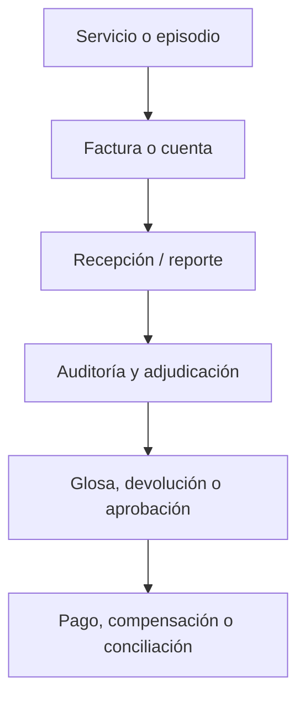
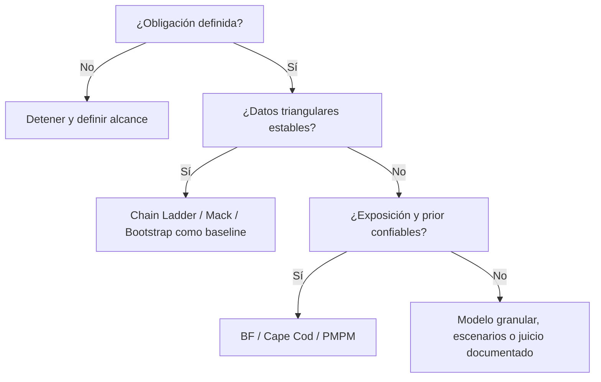

# Particularidades de las reservas en seguros de salud

> En salud, estimar reservas no es solo aplicar triángulos de desarrollo. Es traducir eventos clínicos, autorizaciones, facturas, glosas, pagos, contratos, morbilidad, calidad de datos y obligaciones regulatorias en una medida financiera defendible.

## Advertencia de alcance

Este capítulo es técnico y educativo. No establece una norma contable, regulatoria o contractual. Para una aplicación real deben prevalecer:

1. el contrato, plan de beneficios o mecanismo de financiación aplicable;
2. la regulación vigente en la jurisdicción y fecha de valoración;
3. la definición contable o estatutaria del pasivo;
4. la evidencia operativa y financiera conciliada;
5. el juicio actuarial documentado.

Las referencias a Actuarial Standards of Practice (ASOP) describen un marco profesional de Estados Unidos. Pueden orientar buenas prácticas de alcance, datos, modelos y comunicación, pero no sustituyen fuentes oficiales colombianas. Las referencias colombianas deben incorporarse desde [bibliography.md](../bibliography.md) antes de convertir este capítulo en una guía normativa.

## Objetivos de aprendizaje

Al finalizar este capítulo, el lector podrá:

1. explicar por qué el reserving en salud difiere del reserving general de seguros patrimoniales;
2. separar obligaciones por claims, reservas de caso, IBNR puro, IBNER, gastos, liquidaciones de proveedores y activos o pasivos de ajuste de riesgo;
3. escoger entre triángulos pagados, incurridos reportados, allowed, billed, autorizados o unidades de servicio;
4. identificar las fechas relevantes de un claim de salud y sus implicaciones para el desarrollo;
5. diseñar segmentaciones que capturen morbilidad, red, contrato, servicio y patrón de liquidación sin destruir credibilidad;
6. reconocer cuándo Chain Ladder, Bornhuetter-Ferguson, Cape Cod, GLM, GAM, supervivencia, multiestado, ML o escenarios catastróficos son candidatos razonables;
7. construir controles de calidad de datos y reconciliación adecuados para salud;
8. documentar limitaciones, incertidumbre, dependencia de terceros y cambios de metodología.

## Contenido

1. Por qué salud es diferente
2. La obligación antes del método
3. Fechas y estados del ciclo de un claim
4. Medidas observables: billed, allowed, paid e incurred
5. Componentes de reserva en salud
6. Mecanismos de desarrollo
7. Segmentación actuarial
8. Calidad de datos y reconciliación
9. Selección metodológica
10. Risk adjustment y morbilidad
11. Contratos y modelos de pago
12. Tendencia médica, estacionalidad y shocks
13. Particularidades para Colombia
14. Validación, backtesting y seguimiento
15. Gobierno y comunicación
16. Checklist de cierre
17. Conclusiones y bibliografía

## 1. Por qué salud es diferente

El reserving en salud comparte técnicas con otros ramos, pero el fenómeno económico que intenta estimar tiene rasgos propios:

| Dimensión | Efecto en reserving |
|---|---|
| Alta frecuencia y severidad heterogénea | La masa de claims pequeños puede ser estable, mientras pocos casos de alto costo dominan la cola. |
| Morbilidad y utilización | La exposición no es solo póliza o prima; importa edad, sexo, diagnóstico, cronicidad, red, acceso y patrón de uso. |
| Múltiples fechas materiales | Servicio, admisión, egreso, factura, reporte, adjudicación, glosa, conciliación, pago y registro contable pueden diferir. |
| Contratos complejos con prestadores | Fee-for-service, capitación, paquetes, presupuestos globales, pagos prospectivos y acuerdos de riesgo producen pasivos distintos. |
| Datos clínicos y administrativos | Diagnósticos, procedimientos, medicamentos, autorizaciones y facturas pueden tener calidad desigual y sesgos de codificación. |
| Ajustes posteriores | Glosas, devoluciones, recuperaciones, recobros, auditorías, reliquidaciones y cambios de cobertura alteran el desarrollo. |
| Cambios externos rápidos | Regulación, tecnologías, tarifas, inflación médica, epidemias, disponibilidad de red y comportamiento de prestadores pueden romper patrones. |

Una reserva de salud debe responder una pregunta más precisa que “¿cuánto falta por pagar?”:

> ¿Cuál es la estimación defendible de la obligación económica atribuible a servicios, episodios o coberturas incurridos hasta una fecha, bajo una base definida, con datos observados a otra fecha y con incertidumbre documentada?

## 2. La obligación antes del método

Antes de construir cualquier triángulo, el actuario debe definir el objeto de estimación.

## 2.1 Pregunta primaria

La pregunta debe identificar al menos:

- **entidad responsable:** asegurador, EPS, pagador, administrador, fondo, reasegurador, empleador, proveedor u otro;
- **cobertura:** servicios incluidos, exclusiones, gastos, copagos, cuotas moderadoras, recuperables y reaseguro;
- **evento generador:** servicio, episodio, hospitalización, diagnóstico, incapacidad, autorización o periodo de cobertura;
- **fecha de corte:** fecha de valoración y fecha de información disponible;
- **base de medición:** pagado, incurrido reportado, allowed, facturado, devengado, contractual o regulatoria;
- **horizonte:** hasta pago final, hasta reconocimiento contable, hasta conciliación contractual o hasta otro punto definido;
- **nivel de agregación:** cartera total, producto, contrato, red, servicio, cohorte, proveedor, diagnóstico o miembro;
- **uso:** reporte financiero, solvencia, pricing, suficiencia de prima, gestión operativa, presupuesto o auditoría.

!!! danger "Regla de seguridad"
    Ningún método corrige una obligación mal definida. Si no se sabe si se está estimando claims no pagados, IBNR puro, IBNR incluido IBNER, glosas esperadas, liquidaciones de proveedores o ajustes de riesgo, el resultado no es auditable aunque el modelo sea sofisticado.

## 2.2 Medidas canónicas

El handbook usa la notación de [glossary.md](../glossary.md):

$$
R_i(C)=U_i-C_{i,k_i},
$$

donde $U_i$ es el costo *ultimate* de la cohorte $i$ y $C_{i,k_i}$ es la medida acumulada observada a la edad disponible $k_i$.

Si $C=P$, la reserva representa claims no pagados respecto de pagos acumulados:

$$
R_i^{(P)}=U_i-P_{i,k_i}.
$$

Si $C=I=P+O$, donde $O$ es la reserva de caso, la reserva representa desarrollo adicional sobre incurrido reportado:

$$
R_i^{(I)}=U_i-I_{i,k_i}.
$$

Estas dos cantidades no deben presentarse con el mismo nombre. En salud es frecuente que “IBNR” se use de forma amplia; el capítulo exige rotularlo como:

- **IBNR puro:** eventos incurridos no reportados;
- **IBNER:** eventos reportados pero insuficientemente reservados;
- **IBNR incluido IBNER:** desarrollo pendiente sobre incurrido reportado;
- **claims no pagados:** desarrollo pendiente sobre pagos acumulados.

## 3. Fechas y estados del ciclo de un claim

Un claim de salud no aparece completo en una sola fecha. El desarrollo combina rezagos clínicos, administrativos y financieros.

## 3.1 Fechas relevantes

| Fecha | Qué representa | Riesgo si se ignora |
|---|---|---|
| Fecha de cobertura | Periodo en que el afiliado o asegurado tenía derecho al beneficio | Incluir eventos fuera de cobertura o excluir obligaciones válidas. |
| Fecha de servicio | Momento en que se prestó el servicio | Es la base natural para incurrencia en muchos análisis. |
| Fecha de admisión | Inicio de hospitalización o episodio | Puede subestimar costos si el egreso ocurre mucho después. |
| Fecha de egreso | Cierre clínico de hospitalización | Útil para episodios, pero puede desplazar incurrencia. |
| Fecha de autorización | Aprobación previa o gestión de uso | No siempre implica servicio prestado ni obligación definitiva. |
| Fecha de factura | Momento en que el proveedor emite cuenta | Mezcla comportamiento del prestador y flujo operativo. |
| Fecha de recepción | Momento en que la entidad recibe el claim | Afecta triángulos de reporte y oportunidad de datos. |
| Fecha de adjudicación | Decisión de reconocer, ajustar o negar | Afecta allowed e incurred operativo. |
| Fecha de glosa | Objeción administrativa o técnica | Puede crear desarrollo negativo o diferido. |
| Fecha de pago | Desembolso, compensación o cruce contable | Base natural para triángulos pagados. |
| Fecha contable | Registro bajo una base financiera | Puede diferir de pago, reporte y servicio. |

## 3.2 Edad de desarrollo

La edad de desarrollo debe declararse. Por ejemplo:

- meses desde servicio hasta pago;
- meses desde servicio hasta recepción;
- meses desde factura hasta pago;
- meses desde egreso hasta adjudicación;
- meses desde origen contable hasta cierre financiero.

El mismo claim puede tener edades diferentes según el triángulo. Comparar factores de desarrollo entre medidas sin alinear el reloj produce diagnósticos falsos.

## 4. Medidas observables: billed, allowed, paid e incurred

Los sistemas de salud suelen contener varias medidas de costo. No son intercambiables.

| Medida | Definición operativa | Uso potencial | Riesgo principal |
|---|---|---|---|
| `billed` / facturado | Valor presentado por proveedor o reclamante | presión de facturación, auditoría, cuentas por procesar | no equivale a costo cubierto ni obligación aceptada |
| `allowed` / reconocido | Valor permitido bajo contrato, tarifa o adjudicación | costo del beneficio después de reglas de cobertura | depende de adjudicación, glosas y reglas de red |
| `paid` / pagado | Valor desembolsado o compensado | cash flow, unpaid claims, desarrollo de pagos | se retrasa por procesos administrativos o liquidez |
| `case reserve` | estimación de pendiente para claims reportados | incurrido reportado, IBNER, seguimiento de casos | puede ser inconsistente entre equipos o periodos |
| `reported incurred` | pagado más reserva de caso bajo convención definida | estimación temprana de ultimate | depende de calidad de reservas de caso |
| `authorized` | valor autorizado o preautorizado | señal temprana de utilización futura | no prueba servicio, factura ni pago |
| `accounting accrual` | devengo bajo política contable | reporte financiero | puede no coincidir con claim-level operativo |

!!! example "Lectura correcta"
    Un triángulo pagado mide desarrollo de cash flow. Un triángulo incurrido reportado mide desarrollo de la combinación entre pagos y reservas de caso. Un triángulo facturado mide comportamiento de presentación de cuentas. Los tres pueden ser útiles, pero no responden la misma pregunta.

## 4.1 Selección de medida

| Si el propósito es... | Medida candidata | Control mínimo |
|---|---|---|
| Estimar cash flow futuro | `paid` | conciliación bancaria o contable, anulaciones y recuperaciones |
| Estimar claims no pagados | `paid` contra $U$ | tratamiento de pagos parciales, anticipos y glosas |
| Estimar desarrollo sobre reportado | `reported incurred` | calidad y consistencia de reservas de caso |
| Medir costo económico reconocido | `allowed` | reglas de adjudicación, contratos y glosas |
| Vigilar presión operativa | `billed` y cuentas recibidas | separación de cuentas válidas, duplicados y devoluciones |
| Anticipar servicios aprobados | autorizaciones | tasa de conversión autorización-servicio-factura |
| Evaluar capitación o pagos prospectivos | exposición contractual | devengo, cobertura y mecanismos de ajuste |

## 5. Componentes de reserva en salud

Las reservas de salud pueden incluir más que claims médicos no pagados. ASOP 28 enumera ejemplos de activos y pasivos relacionados con planes de salud, incluyendo unpaid claims, gastos de ajuste, liquidaciones de contratos de proveedores, contract reserves, premium deficiency reserves, experience refunds, premium stabilization reserves y estimaciones de risk adjustment (`ASB-ASOP28-2024`).

## 5.1 Taxonomía práctica

| Componente | Pregunta | Método típico | Riesgo |
|---|---|---|---|
| IBNR puro | ¿Qué servicios incurridos aún no han sido reportados? | triángulos de reporte, BF, modelos de delay | rezagos cambiantes y datos incompletos |
| IBNER | ¿Qué claims reportados están insuficientemente reservados? | análisis de case reserve adequacy, runoff, survival | políticas de reserva de caso inestables |
| Claims no pagados | ¿Cuánto falta por pagar del ultimate? | triángulos pagados, BF, Cape Cod, cash-flow models | pagos diferidos por liquidez o procesos |
| Gastos de ajuste | ¿Qué gastos de gestión acompañan claims pendientes? | ratios, activity-based costing, ULAE/ALAE | mezclar gasto administrativo general con claim expense |
| Liquidaciones de proveedores | ¿Qué ajustes contractuales quedan pendientes? | accrual contractual, reconciliación, escenarios | datos fuera del sistema de claims |
| Capitación y pagos prospectivos | ¿Qué obligación se devengó aunque no haya claim individual? | exposición cubierta, PMPM, contratos | confundir gasto esperado con claim ocurrido |
| Ajustes de riesgo | ¿Hay receivables/payables por morbilidad o transferencias? | risk adjustment model, conciliación, sensibilidad | codificación, versión del modelo, collectability |
| Deficiencia de prima | ¿La prima futura cubre obligaciones futuras? | proyección de pérdidas y gastos | mezclar con IBNR de servicios ya incurridos |
| Eventos extremos | ¿Un shock puede alterar frecuencia, severidad o delay? | escenarios, cat modeling, stress tests | extrapolar historia normal a eventos no normales |

## 5.2 Separar centro, margen y mínimo

En salud es común mezclar tres conceptos:

- **estimación central:** expectativa o mejor estimación bajo datos y supuestos actuales;
- **margen o provisión por incertidumbre:** ajuste explícito para riesgo, prudencia o requerimiento;
- **mínimo regulatorio o contable:** importe exigido por norma o política.

El análisis debe conservarlos separados. Si se combinan en un solo número, el reporte debe explicar la composición.

## 6. Mecanismos de desarrollo

El desarrollo de claims de salud puede ser impulsado por varios mecanismos simultáneos.

## 6.1 Desarrollo de reporte

Ocurre cuando el servicio ya sucedió, pero la entidad aún no conoce el claim. Puede depender de:

- canal de facturación;
- tipo de proveedor;
- complejidad del caso;
- régimen de autorizaciones;
- reglas de radicación;
- capacidad operativa del prestador;
- cambios en sistemas o validaciones.

## 6.2 Desarrollo de adjudicación

Ocurre cuando la cuenta fue recibida, pero todavía no se decidió cuánto se reconoce. Puede depender de:

- auditoría médica;
- pertinencia clínica;
- cobertura;
- tarifas;
- soportes documentales;
- duplicados;
- glosas y devoluciones.

## 6.3 Desarrollo de pago

Ocurre entre reconocimiento y desembolso. Puede depender de:

- flujo de caja;
- acuerdos de pago;
- conciliaciones;
- compensaciones;
- priorización de proveedores;
- disputas;
- procesos judiciales o administrativos.

## 6.4 Desarrollo clínico o de episodio

En hospitalizaciones, enfermedades crónicas, tratamientos de alto costo y episodios prolongados, el costo ultimate puede no conocerse aunque ya exista un evento reportado. El desarrollo proviene de la evolución clínica y no solo del procesamiento administrativo.

## 6.5 Desarrollo por codificación

En modelos que usan diagnóstico, procedimiento o medicamentos, el desarrollo puede surgir de:

- diagnósticos tardíos;
- codificación incompleta;
- cambios en reglas de captura;
- upcoding o downcoding;
- nuevos catálogos;
- migraciones de sistemas.

## 7. Segmentación actuarial

La segmentación es una de las decisiones más importantes en salud. Un promedio global puede ocultar patrones incompatibles.

## 7.1 Ejes de segmentación

| Eje | Ejemplos | Cuándo importa |
|---|---|---|
| Producto o plan | individual, colectivo, empleador, régimen, plan complementario | beneficios, copagos y red cambian el costo |
| Población | edad, sexo, geografía, cronicidad, riesgo clínico | morbilidad y utilización son heterogéneas |
| Servicio | hospitalario, ambulatorio, urgencias, farmacia, laboratorio, imagen, alto costo | delays y severidades son diferentes |
| Contrato | fee-for-service, capitación, paquete, PGP, presupuesto global | la obligación no se desarrolla igual |
| Red o proveedor | IPS, especialidad, nivel de complejidad | prácticas de facturación y glosas varían |
| Estado operativo | reportado, auditado, glosado, conciliado, pagado | cada estado tiene transición propia |
| Tamaño de claim | ordinario, grande, catastrófico, stop-loss | la cola puede dominar la reserva |
| Fuente de financiación | prima, UPC, presupuesto máximo, reaseguro, recuperable | el neto depende de transferencias |

## 7.2 Regla de credibilidad

La segmentación debe balancear homogeneidad y volumen. Una regla práctica:

> Segmente cuando el mecanismo de desarrollo sea diferente; agregue cuando la evidencia no soporte estimaciones estables.

El documento de selección metodológica debe registrar si un segmento se modela por separado, se agrupa o recibe un ajuste externo.

## 7.3 Grandes claims

Los grandes claims merecen tratamiento específico porque pueden distorsionar:

- factores edad-a-edad;
- selección de tail;
- loss ratios esperados;
- varianza de Mack o bootstrap;
- calibración de GLM/GAM;
- métricas de error promedio;
- conclusiones sobre suficiencia.

Opciones típicas:

- limitar el claim ordinario y modelar el exceso por separado;
- separar claims de alto costo;
- aplicar reaseguro o recuperables explícitos;
- usar modelos frecuencia-severidad;
- usar escenarios o simulación;
- reportar sensibilidad con y sin grandes claims.

## 8. Calidad de datos y reconciliación

ASOP 23 se identifica en la bibliografía como fuente prioritaria para calidad de datos (`ASB-ASOP23-2016`), y ASOP 56 refuerza que los datos y supuestos deben ser consistentes con el propósito del modelo (`ASB-ASOP56-2019`). En salud, la calidad de datos no es un control posterior: define qué pregunta se puede responder.

## 8.1 Dominios de datos

| Dominio | Campos críticos | Pruebas mínimas |
|---|---|---|
| Elegibilidad | miembro, periodo, cobertura, plan, geografía | continuidad, duplicados, cortes, retroactividad |
| Claims | servicio, proveedor, diagnóstico, procedimiento, billed, allowed, paid | integridad, fechas, duplicados, negativos, anulaciones |
| Reservas de caso | claim, fecha, monto, responsable, regla | consistencia temporal, cambios abruptos, suficiencia |
| Autorizaciones | fecha, servicio, monto autorizado, estado | conversión a servicio y factura |
| Proveedores | contrato, red, tarifa, modalidad de pago | vigencia, cambios contractuales, mapeo |
| Farmacia | medicamento, dosis, unidad, precio, diagnóstico asociado | unidad comparable, equivalencias, alto costo |
| Contabilidad | cuentas, devengo, pagos, provisiones | conciliación contra claims y estados financieros |
| Recuperables | reaseguro, copagos, cuotas, glosas, recobros | bruto/neto, collectability, fecha de reconocimiento |
| Morbilidad | diagnóstico, grupos clínicos, risk scores | codificación, completitud, sesgo, versión |

## 8.2 Controles de fechas

Los controles mínimos son:

- fecha de servicio no posterior a fecha de recepción, salvo reglas explícitas;
- fecha de pago no anterior a fecha de servicio, salvo anticipos identificados;
- egreso no anterior a admisión;
- reversos y anulaciones con vínculo al claim original;
- claims reabiertos identificables;
- cambios de sistema documentados;
- periodos cerrados bloqueados o conciliados.

## 8.3 Reconciliación financiera

Todo modelo de reservas debe reconciliarse contra una fuente financiera. La reconciliación debe explicar diferencias por:

- claims excluidos del modelo;
- gastos incluidos o excluidos;
- recuperables;
- reaseguro;
- pagos directos fuera del sistema;
- provisiones manuales;
- ajustes contables;
- cortes de fecha;
- redondeos y monedas;
- impuestos o retenciones;
- cuentas en disputa.

!!! warning "Riesgo típico"
    Un triángulo construido desde claim-level puede ser estadísticamente limpio y, aun así, no reconciliar con la obligación financiera. La limpieza analítica no sustituye la conciliación contable u operativa.

## 9. Selección metodológica

La selección de metodología en salud depende de madurez, medida, segmentación, estabilidad, morbilidad y propósito. No existe un método universal.

## 9.1 Árbol de decisión resumido

## 9.2 Matriz de métodos

| Condición observada | Método candidato | Por qué | Advertencia |
|---|---|---|---|
| cartera madura, desarrollo estable, volumen suficiente | Chain Ladder | usa experiencia propia de desarrollo | falla ante cambios estructurales o mix cambiante |
| requiere incertidumbre bajo supuestos de desarrollo | Mack | estima variabilidad del Chain Ladder | no corrige un centro sesgado |
| se necesita distribución predictiva y validación empírica | Bootstrap | simula variabilidad de proceso y parámetro | sensible a residuos y estructura del triángulo |
| periodos inmaduros o crecimiento rápido | Bornhuetter-Ferguson | combina prior con desarrollo observado | depende de prior defendible |
| exposición confiable y loss ratio esperado | Cape Cod / PMPM | estabiliza estimación con exposición | puede ocultar cambio de mix o morbilidad |
| costo explicado por covariables | GLM | modela frecuencia/severidad o costo con estructura estadística | requiere diseño de datos, controles y validación |
| efectos no lineales fuertes | GAM | permite suavización de edad, tiempo, utilización | riesgo de sobreajuste y baja interpretabilidad |
| episodios con estados clínicos | supervivencia / multiestado | representa transiciones, duración y recurrencia | exige datos clínicos longitudinales confiables |
| alta granularidad y señales complejas | ML | captura interacciones y señales tempranas | requiere benchmarks, explicabilidad y control de leakage |
| pandemias o shocks extremos | escenarios / cat modeling | permite evaluar rangos fuera de historia normal | no debe calibrarse solo con promedio histórico |

## 9.3 Cuándo Chain Ladder es razonable

Chain Ladder puede ser un buen baseline si:

- el triángulo tiene volumen suficiente;
- los patrones de desarrollo son estables;
- la definición de origen y desarrollo no cambió;
- no hubo cambios materiales de red, contrato, codificación o regulación;
- los grandes claims están controlados;
- la estacionalidad no distorsiona factores;
- los datos recientes tienen runout suficiente;
- los factores seleccionados son defendibles.

No debe ser la única evidencia si:

- hay crecimiento acelerado;
- hay cambios de producto o cobertura;
- hay migración de sistemas;
- la morbilidad cambió;
- las reservas de caso son inconsistentes;
- los pagos se retrasaron por razones administrativas;
- hay glosas o conciliaciones significativas;
- la cola está dominada por pocos casos.

## 9.4 Cuándo Bornhuetter-Ferguson es preferible

Bornhuetter-Ferguson suele ser preferible cuando:

- los periodos recientes son inmaduros;
- la experiencia observada temprana es poco creíble;
- existe prior razonable de costo esperado;
- la exposición es confiable;
- hay crecimiento de membresía o cambios de mix;
- se requiere evitar que pocos claims tempranos determinen todo el ultimate.

El prior puede venir de:

- PMPM esperado;
- loss ratio esperado;
- presupuesto médico;
- pricing;
- experiencia ajustada por tendencia;
- modelo de morbilidad;
- benchmark externo con ajustes documentados.

El prior debe revisarse como supuesto material, no tratarse como dato observado.

## 10. Risk adjustment y morbilidad

El costo de salud está fuertemente asociado con morbilidad, pero incorporar morbilidad al reserving exige disciplina.

ASOP 45 define el ámbito de metodologías de risk adjustment basadas en estado de salud para cuantificar diferencias relativas en uso de recursos por diferencias de salud (`ASB-ASOP45-2012`). Ese marco es útil, pero el risk adjustment no debe confundirse con reserving.

## 10.1 Risk score no es reserva

Un risk score puede ayudar a:

- explicar costo esperado;
- segmentar población;
- ajustar experiencia;
- identificar cambios de mix;
- construir priors;
- evaluar transferencias entre entidades;
- proyectar costo futuro.

Pero no prueba por sí mismo:

- que un servicio ya ocurrió;
- que una factura sea válida;
- que el costo esté cubierto;
- que el claim se pagará;
- que el pasivo esté reconocido;
- que el modelo sea adecuado para otra población.

## 10.2 Riesgos de morbilidad codificada

| Riesgo | Efecto |
|---|---|
| Diagnóstico incompleto | subestima riesgo y costo esperado |
| Upcoding | sobreestima morbilidad y puede inflar transferencias |
| Cambios de codificación | crea tendencia artificial |
| Diferencias entre proveedores | confunde práctica clínica con práctica administrativa |
| Modelo diseñado para otra población | mala calibración |
| Versión del modelo no documentada | resultados no reproducibles |
| Falta de transparencia | limita recalibración y explicación |

## 10.3 Uso adecuado en reserving

La morbilidad puede entrar al reserving como:

- variable de segmentación;
- ajuste de exposición;
- predictor en GLM/GAM/ML;
- prior para BF;
- explicación de cambios en frecuencia/severidad;
- escenario de tendencia;
- control de mezcla poblacional;
- análisis de suficiencia de prima o UPC.

Debe documentarse si el modelo es concurrente o prospectivo, qué periodo usa para capturar diagnósticos y qué periodo intenta explicar o predecir.

## 11. Contratos y modelos de pago

En salud, el contrato con prestadores puede definir la forma del pasivo tanto como el claim individual.

## 11.1 Modalidades

| Modalidad | Objeto de reserving | Riesgo |
|---|---|---|
| Fee-for-service | claims por servicios prestados | volumen, tarifa, glosas, rezago de factura |
| Capitación | pago por miembro o población cubierta | devengo, elegibilidad, ajustes por cobertura |
| Paquete o bundled payment | episodio o conjunto de servicios | definición de episodio, outliers, calidad |
| Presupuesto global | obligación por periodo o red | conciliación, suficiencia, desviaciones |
| Pago por desempeño | incentivo o penalidad | métricas, retrasos, disputes |
| Riesgo compartido | ajuste según resultados o costo | atribución, medición y collectability |
| Reaseguro / stop-loss | recuperable o límite de retención | timing, cobertura, disputas, neteo |

## 11.2 Reglas de modelación

- Fee-for-service se presta naturalmente a triángulos por servicio/factura/pago.
- Capitación requiere exposición cubierta y devengo, no solo claims.
- Paquetes requieren definir inicio y cierre de episodio.
- Presupuestos globales requieren reconciliación contractual.
- Riesgo compartido requiere modelar outcome, atribución y liquidación.
- Recuperables deben modelarse brutos y netos, con collectability separada.

## 12. Tendencia médica, estacionalidad y shocks

El reserving de salud debe separar desarrollo de tendencia.

## 12.1 Componentes de tendencia médica

La tendencia médica puede descomponerse como:

$$
\text{Tendencia de costo} \approx \text{utilización} \times \text{precio unitario} \times \text{mix de servicios} \times \text{intensidad clínica} \times \text{cobertura}
$$

En la práctica, los componentes interactúan y no siempre son observables por separado. Aun así, la descomposición ayuda a evitar diagnósticos incorrectos.

| Componente | Señales |
|---|---|
| Utilización | servicios por miembro, admisiones, consultas, fórmulas, procedimientos |
| Precio | tarifa, inflación médica, negociación con proveedores |
| Mix | desplazamiento entre niveles de complejidad o tecnologías |
| Intensidad | más procedimientos por episodio o mayor severidad clínica |
| Cobertura | nuevos beneficios, exclusiones, copagos o autorizaciones |
| Acceso | cambios de red, barreras, demanda reprimida |
| Codificación | más diagnósticos o procedimientos capturados |

## 12.2 Estacionalidad

La salud tiene estacionalidad por:

- enfermedades respiratorias;
- vacaciones y cierre de agendas;
- calendarios escolares;
- pagos y facturación de fin de año;
- campañas de vacunación;
- brotes regionales;
- vencimientos contractuales;
- comportamiento de autorizaciones.

Los triángulos mensuales deben evaluar si la edad de desarrollo mezcla madurez con calendario.

## 12.3 Shocks y eventos extremos

ASOP 38 incluye pandemias dentro del alcance de modelos de catástrofe (`ASB-ASOP38-2021`). Para salud, los eventos extremos pueden afectar:

- frecuencia de consultas;
- hospitalizaciones;
- severidad;
- mortalidad;
- disponibilidad de red;
- costo unitario;
- delay de reporte;
- pagos;
- utilización diferida;
- morbilidad de largo plazo.

Un shock puede producir simultáneamente menos claims ordinarios por acceso restringido y más claims severos por complicaciones. Promediar ambos efectos puede ocultar el riesgo.

## 13. Particularidades para Colombia

Este capítulo no establece reglas colombianas. Sí identifica puntos que los capítulos Colombia deben resolver con fuentes primarias.

## 13.1 Objetos que requieren definición local

| Objeto | Pregunta actuarial |
|---|---|
| UPC | ¿Es exposición, ingreso, prima regulada, base de suficiencia o variable de comparación? |
| EPS | ¿Qué obligación financiera específica se está estimando bajo el marco aplicable? |
| IPS | ¿La cuenta del prestador representa claim, cuenta por cobrar, facturación o obligación aceptada? |
| ADRES | ¿El flujo es ingreso, compensación, recuperable, ajuste o mecanismo de financiación? |
| RIPS | ¿El registro prueba servicio, diagnóstico, facturación, validación o solo evento administrativo? |
| FEV | ¿La factura representa billed, allowed, devengo o requisito de trámite? |
| Glosa | ¿La objeción reduce costo, difiere pago, abre disputa o cambia estado de la obligación? |
| MIPRES / tecnologías no financiadas por UPC | ¿El costo pertenece a qué fuente de financiación y a qué pasivo? |
| Cuenta de Alto Costo | ¿El dato se usa para epidemiología, compensación, riesgo clínico o estimación financiera? |

## 13.2 Glosas y disputas

Las glosas pueden crear desarrollo difícil de modelar porque no son simples pagos negativos. Pueden representar:

- devolución por forma;
- objeción técnica;
- objeción médica;
- diferencia tarifaria;
- duplicado;
- falta de soporte;
- servicio no cubierto;
- disputa en conciliación;
- levantamiento parcial;
- ratificación;
- deterioro o castigo.

Un modelo debe distinguir:

$$
\text{billed} \rightarrow \text{glosado} \rightarrow \text{aceptado} \rightarrow \text{pagado}
$$

de:

$$
\text{billed} \rightarrow \text{devuelto} \rightarrow \text{re-radicado} \rightarrow \text{auditado}
$$

Ambos flujos pueden verse similares en pagos acumulados, pero tienen implicaciones distintas para allowed, reservas, liquidez y litigios.

## 13.3 Reglas prudentes para capítulos Colombia

Los capítulos 21-25 deben:

- citar fuentes oficiales vigentes para toda afirmación normativa;
- separar EPS, IPS, aseguradoras vigiladas por SFC, fondos y entidades públicas;
- distinguir UPC, presupuestos máximos, pagos directos, recobros, recuperables y otros flujos;
- mapear cada campo local a `billed`, `allowed`, `paid`, `reported incurred` o devengo;
- explicar cómo glosas, devoluciones y conciliaciones afectan triángulos;
- documentar si el modelo estima bruto o neto;
- probar reconciliación contra estados financieros o reportes oficiales;
- declarar limitaciones de calidad de RIPS, FEV, MIPRES, ADRES u otras fuentes cuando se usen.

## 14. Validación, backtesting y seguimiento

La validación en salud debe evaluar centro, cola, datos y operación.

## 14.1 Pruebas mínimas

| Prueba | Pregunta |
|---|---|
| Runoff | ¿La reserva previa fue suficiente cuando emergió información posterior? |
| Backtest temporal | ¿El método habría funcionado con cortes históricos reales? |
| Reconciliación | ¿El modelo concilia con pagos, contabilidad y exposición? |
| Diagnóstico de factores | ¿Los link ratios son estables o responden a cambios de mix? |
| Sensibilidad | ¿Qué cambia con tail, prior, tendencia, segmentación o grandes claims? |
| Challenger | ¿Otro método defendible cuenta una historia distinta? |
| Actual vs expected | ¿El desarrollo emergente coincide con supuestos? |
| Data drift | ¿Cambió la codificación, red, producto, contrato o población? |
| Model drift | ¿Perdió calibración el modelo granular? |
| Operational drift | ¿Cambió el proceso de facturación, auditoría, glosa o pago? |

## 14.2 Métricas

Las métricas deben elegirse según propósito:

- error de ultimate;
- error de reserva;
- error de cash flow;
- bias por cohorte;
- cobertura de intervalo;
- error por segmento;
- sensibilidad al tail;
- estabilidad de factores;
- suficiencia contra runoff;
- precisión en grandes claims;
- calibración de risk scores;
- error neto después de recuperables.

No basta un error promedio bajo si el método subestima sistemáticamente la cola o periodos inmaduros.

## 15. Gobierno y comunicación

ASOP 56 exige que el modelo sea consistente con el propósito, datos, supuestos, validación, controles y uso previsto (`ASB-ASOP56-2019`). ASOP 28 refuerza que las opiniones sobre activos y pasivos de salud deben identificar propósito, usuarios, alcance, bases, datos, métodos, supuestos, cambios y limitaciones (`ASB-ASOP28-2024`).

## 15.1 Registro de decisión

Cada cierre debe documentar:

- propósito de la estimación;
- fecha de valoración;
- fecha de datos;
- base de medición;
- poblaciones y servicios incluidos;
- exclusiones;
- gross/net;
- fuentes de datos;
- reconciliación;
- método central;
- métodos challenger;
- supuestos materiales;
- selección de tail;
- prior o trend;
- tratamiento de grandes claims;
- tratamiento de glosas;
- recuperables;
- margen o provisión por incertidumbre;
- cambios frente al cierre anterior;
- limitaciones;
- conclusión y rango.

## 15.2 Comunicación ejecutiva

La comunicación debe separar:

| Elemento | Mensaje |
|---|---|
| Resultado central | estimación seleccionada y base |
| Incertidumbre | rango, drivers y sensibilidad |
| Cambios | qué movió la reserva frente al cierre anterior |
| Riesgos | datos, modelo, operación, regulación, liquidez |
| Acciones | mejoras de datos, monitoreo, provisiones, validación |
| No inferencias | qué no puede concluirse del modelo |

!!! note "Buen reporte"
    Un buen reporte no solo entrega un número. Explica qué evidencia lo sostiene, qué evidencia lo contradice, qué supuestos lo mueven y qué información futura cambiaría la conclusión.

## 16. Checklist de cierre

## 16.1 Alcance

- [ ] La obligación económica está definida.
- [ ] La base contable, regulatoria o contractual está identificada.
- [ ] Se distingue pagado, incurrido reportado, allowed, billed y devengo.
- [ ] IBNR puro, IBNER, RBNS y claims no pagados no se mezclan.
- [ ] Gross/net y recuperables están documentados.

## 16.2 Datos

- [ ] Elegibilidad y exposición concilian.
- [ ] Claims concilian con contabilidad o fuente financiera.
- [ ] Fechas clave son consistentes.
- [ ] Duplicados, anulaciones y reversos están controlados.
- [ ] Glosas y devoluciones tienen estado trazable.
- [ ] Cambios de sistema o proceso están identificados.
- [ ] Grandes claims están tratados explícitamente.

## 16.3 Método

- [ ] El método responde el propósito definido.
- [ ] La segmentación está justificada.
- [ ] El prior, trend y tail están documentados.
- [ ] Se revisaron métodos challenger.
- [ ] Hay sensibilidad a supuestos materiales.
- [ ] La incertidumbre está cuantificada o cualificada.
- [ ] Los modelos granulares tienen control de leakage y validación temporal.

## 16.4 Gobierno

- [ ] Existe registro de decisión.
- [ ] Las fuentes se citan con claves de [bibliography.md](../bibliography.md).
- [ ] Los términos coinciden con [glossary.md](../glossary.md).
- [ ] Limitaciones y dependencia de terceros están declaradas.
- [ ] Cambios frente al cierre anterior están explicados.
- [ ] La conclusión indica condiciones que podrían cambiarla.

## 17. Conclusiones y bibliografía

El reserving en salud exige un marco propio porque el desarrollo de claims combina clínica, administración, contratos, pagos, codificación, glosas, morbilidad y regulación. Los métodos clásicos siguen siendo indispensables, pero deben operar dentro de una arquitectura que primero defina la obligación, luego la medida, después los datos y finalmente el modelo.

Las decisiones más importantes no son algorítmicas:

- escoger el reloj correcto de desarrollo;
- distinguir paid, allowed, billed e incurred;
- separar IBNR puro, IBNER y claims no pagados;
- decidir la segmentación;
- controlar grandes claims y cambios de mix;
- reconciliar con finanzas;
- tratar morbilidad y risk adjustment como evidencia, no como sustituto de claims;
- documentar incertidumbre, limitaciones y cambios.

## Referencias registradas

- `ASB-ASOP05-2017`: Incurred Health and Disability Claims.
- `ASB-ASOP23-2016`: Data Quality.
- `ASB-ASOP28-2024`: Statements of Actuarial Opinion Regarding Health Insurance Assets and Liabilities.
- `ASB-ASOP38-2021`: Catastrophe Modeling (for All Practice Areas).
- `ASB-ASOP42-2018`: Health and Disability Actuarial Assets and Liabilities Other Than Liabilities for Incurred Claims.
- `ASB-ASOP45-2012`: The Use of Health Status Based Risk Adjustment Methodologies.
- `ASB-ASOP56-2019`: Modeling.
- `BORN-FERGUSON-1972`: The Actuary and IBNR.
- `MACK-1993`: Distribution-Free Calculation of the Standard Error of Chain Ladder Reserve Estimates.
- `ENGLAND-VERRALL-2002`: Stochastic Claims Reserving in General Insurance.
- `FRIEDLAND-2010`: Estimating Unpaid Claims Using Basic Techniques.

## Próximo paso recomendado

El siguiente capítulo debe aterrizar este marco en Colombia: [Colombia Health Reserving Methodologies](../part-07-colombia/29-colombia-health-reserving-methodologies.md). Allí deben incorporarse fuentes oficiales para UPC, EPS, ADRES, RIPS, FEV, glosas y mecanismos de financiación antes de emitir conclusiones normativas.

## Próximo capítulo

➡️ **[Health Claim Lifecycle and Operational Lags](22-health-claim-lifecycle-and-operational-lags.md)**
