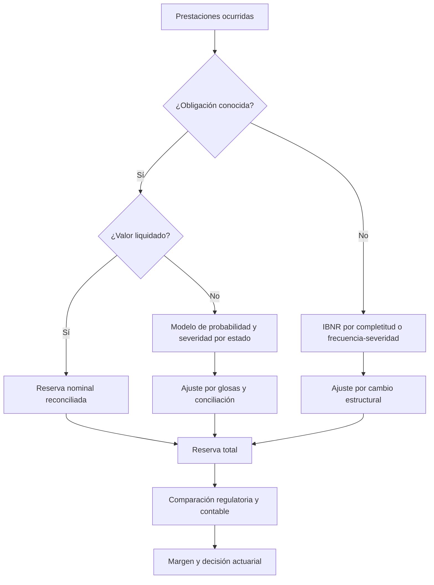
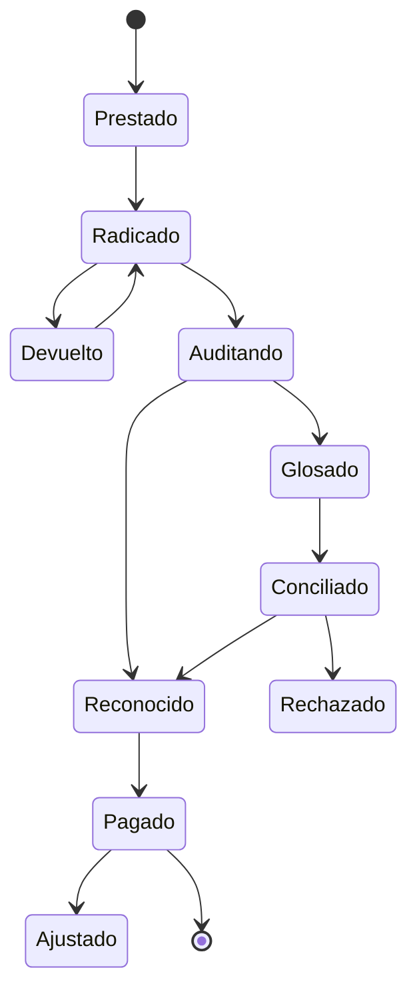
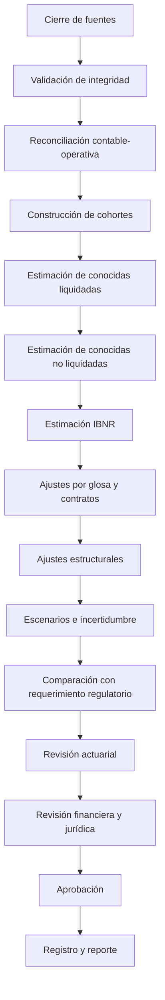

21-colombian-health-reserving-methodologies.md
---

title: Metodologías de reservas en salud adaptadas al contexto colombiano
subtitle: Marco técnico, regulatorio y operativo para estimar obligaciones pendientes e IBNR
author: Health Insurance Reserving Handbook
version: 1.0
chapter: 21
status: Draft
jurisdiction: Colombia
last_updated: 2026-07-13
language: es
tags:

* Colombia
* IBNR
* reservas técnicas
* EPS
* salud
* glosas
* UPC
* ADRES
* Supersalud

---

# Metodologías de reservas en salud adaptadas al contexto colombiano

> Las técnicas internacionales de reserving son herramientas estadísticas, no reglas universales. En Colombia deben adaptarse al régimen de financiación, al flujo operativo de las cuentas médicas, a la calidad de los datos y a las obligaciones regulatorias aplicables a cada entidad.

---

## Advertencia de alcance

Este capítulo es una guía técnica y actuarial. No constituye asesoría jurídica, contable, tributaria ni una interpretación oficial de la regulación colombiana.

Antes de utilizarlo en una nota técnica, certificación, estado financiero o reporte a la Superintendencia Nacional de Salud, deben verificarse:

* la versión vigente del Decreto 780 de 2016;
* la Circular Única de la Superintendencia Nacional de Salud y sus modificaciones;
* las resoluciones, circulares e instrucciones aplicables al tipo de entidad;
* el régimen contable aplicable;
* las condiciones particulares de habilitación, vigilancia o intervención;
* los requerimientos específicos de información financiera y técnica.

La regulación puede variar entre EPS, EPS indígenas, entidades adaptadas, compañías de medicina prepagada, servicios de ambulancia prepagada, IPS, ARL y aseguradoras.

---

## Objetivos de aprendizaje

Al finalizar este capítulo, el lector podrá:

* identificar por qué un modelo tradicional de triángulos puede fallar en Colombia;
* diferenciar una reserva regulatoria, una provisión contable y una estimación actuarial de suficiencia;
* construir triángulos compatibles con el ciclo colombiano de prestación, radicación, auditoría, glosa y pago;
* seleccionar metodologías según la naturaleza de la obligación;
* adaptar Chain Ladder, Bornhuetter-Ferguson, Cape Cod, GLM, modelos de supervivencia y modelos bayesianos;
* tratar glosas, autorizaciones, capitación, paquetes, recobros y pagos directos;
* diseñar controles de calidad, backtesting y gobierno del modelo;
* documentar una metodología susceptible de revisión por auditoría, revisoría fiscal y supervisión.

---

## Contenido

1. Alcance institucional
2. Particularidades del sistema colombiano
3. Marco regulatorio de referencia
4. Taxonomía de obligaciones y reservas
5. Diferencia entre reserva regulatoria, contable y actuarial
6. Modelo de datos recomendado
7. Los múltiples relojes de desarrollo
8. Segmentación mínima
9. Arquitectura metodológica
10. Adaptación de métodos clásicos
11. Modelos avanzados aplicables
12. Glosas y controversias
13. Contratos capitados y pagos prospectivos
14. Tecnologías no financiadas con UPC y mecanismos especiales
15. Incapacidades por enfermedad general
16. Alto costo y eventos extremos
17. Efectos regulatorios y cambios estructurales
18. Validación y backtesting
19. Gobierno, documentación y nota técnica
20. Flujo mensual de cierre
21. Caso ilustrativo
22. Matriz de selección metodológica
23. Riesgos y limitaciones
24. Checklist de implementación
25. Conclusiones
26. Referencias normativas y técnicas

---

## 1. Alcance institucional

## 1.1 EPS y entidades adaptadas

El foco principal de este capítulo son las entidades responsables del aseguramiento en salud que deben estimar obligaciones derivadas de servicios y tecnologías suministrados a sus afiliados.

Para estas entidades, la reserva no puede limitarse a las cuentas ya facturadas. Debe contemplar, según el marco aplicable:

* obligaciones conocidas;
* obligaciones todavía no liquidadas;
* obligaciones pendientes no conocidas;
* incapacidades por enfermedad general, cuando corresponda;
* efectos de glosas, conciliaciones y otros estados operativos.

## 1.2 IPS

Una IPS normalmente enfrenta un problema distinto:

* cuentas por cobrar;
* ingresos pendientes de facturar;
* deterioro de cartera;
* probabilidad de aceptación de cuentas;
* glosas y devoluciones;
* tiempo esperado de recaudo.

Por tanto, una IPS no debe copiar sin ajustes un modelo de IBNR diseñado para una EPS. En una IPS suele ser más apropiado modelar:

1. producción asistencial no facturada;
2. facturación pendiente de radicación;
3. probabilidad de aceptación;
4. glosa esperada;
5. recuperación esperada;
6. deterioro crediticio.

## 1.3 Medicina prepagada y planes voluntarios

Estas entidades pueden presentar patrones más cercanos a seguros privados tradicionales, pero deben diferenciar:

* servicios propios;
* redes contratadas;
* reembolsos;
* autorizaciones;
* siniestros de alto costo;
* periodos de carencia;
* exclusiones y preexistencias permitidas por el contrato;
* obligaciones derivadas de planes voluntarios.

## 1.4 ARL y aseguradoras

Las ARL y compañías de seguros están sujetas a marcos diferentes y pueden requerir:

* reservas de siniestros avisados;
* IBNR;
* reservas matemáticas;
* prestaciones periódicas;
* renta o invalidez;
* gastos asociados.

Las recomendaciones de este capítulo solo deben trasladarse a esas entidades después de reconciliarlas con el régimen asegurador aplicable.

---

## 2. Particularidades del sistema colombiano

## 2.1 La cuenta médica no es un siniestro simple

En un modelo tradicional, el flujo puede representarse como:

```text
Ocurrencia → Reporte → Pago → Cierre
```

En Colombia, una cuenta puede recorrer:

```text
Prestación
    ↓
Autorización o validación
    ↓
Generación de factura
    ↓
Radicación
    ↓
Devolución o recepción
    ↓
Auditoría
    ↓
Glosa
    ↓
Respuesta del prestador
    ↓
Levantamiento, ratificación o conciliación
    ↓
Reconocimiento
    ↓
Pago parcial o total
    ↓
Ajustes posteriores
```

Por esta razón, el desarrollo no es exclusivamente actuarial. También refleja procesos administrativos, contractuales, tecnológicos y jurídicos.

## 2.2 Radicación tardía

El tiempo entre la prestación y la radicación depende de:

* capacidad administrativa de la IPS;
* términos contractuales;
* cierres de facturación;
* calidad de RIPS y soportes;
* cambios de plataforma;
* devoluciones;
* dispersión geográfica;
* atención fuera de red;
* servicios derivados de tutela u orden judicial.

Un aumento del lag de radicación no implica necesariamente un aumento de la utilización. Puede representar deterioro operativo.

## 2.3 Glosas

La glosa introduce incertidumbre sobre:

* existencia;
* valor;
* exigibilidad;
* momento de pago;
* probabilidad de aceptación;
* recuperación o reversión.

No debe tratarse como una simple cancelación del siniestro.

## 2.4 Heterogeneidad de mecanismos de pago

El sistema combina, entre otros:

* pago por evento;
* capitación;
* paquetes;
* pagos globales prospectivos;
* presupuestos;
* tarifas negociadas;
* contratos integrales;
* acuerdos de riesgo compartido;
* reembolsos;
* pagos directos.

Cada mecanismo produce un patrón de reconocimiento y desarrollo distinto.

## 2.5 Cambios regulatorios

Las reformas, modificaciones de cobertura, reglas de financiación, ajustes a la UPC y cambios en mecanismos de reconocimiento pueden romper la comparabilidad histórica.

Un modelo que utiliza cinco años de experiencia presupone, implícitamente, que esos cinco años son comparables. En Colombia esa hipótesis debe demostrarse, no asumirse.

## 2.6 Concentración y dependencia entre periodos

Los periodos de ocurrencia no siempre son independientes debido a:

* acumulación de facturación;
* cierres masivos;
* acuerdos de conciliación;
* pagos extraordinarios;
* depuración de cartera;
* cambios de administrador;
* liquidación o intervención de entidades;
* migraciones de afiliados;
* fallas de plataformas.

Esto puede invalidar los supuestos de independencia de Mack y de algunos bootstraps tradicionales.

---

## 3. Marco regulatorio de referencia

El Decreto 2702 de 2014 actualizó y unificó condiciones financieras y de solvencia para entidades autorizadas para operar el aseguramiento en salud. Sus disposiciones fueron incorporadas en el Decreto Único Reglamentario 780 de 2016. El marco exige que las EPS calculen, constituyan y mantengan reservas relacionadas con obligaciones conocidas, no conocidas e incapacidades por enfermedad general, de acuerdo con la metodología regulatoria o con una metodología propia que cumpla los requisitos de presentación y supervisión.

La Circular Externa 008 de 2018 exige documentar e implementar la metodología de cálculo y presentar la correspondiente nota técnica conforme con las instrucciones de la Circular Única.

Las instrucciones sobre obligaciones conocidas no liquidadas permiten estimar la probabilidad de pago de glosas mediante estudios técnicos incluidos en la nota técnica, pero establecen pisos de reserva para las glosas: no inferiores al 50% para cuentas por pagar menores de 360 días y al 100% para cuentas con antigüedad igual o superior a 360 días, según la modificación de 2022 a la Circular 13 de 2020. La aplicación exacta debe validarse contra la compilación vigente de la Circular Única.

Además de constituir el pasivo, las entidades deben considerar las reglas aplicables a los activos e inversiones que respaldan las reservas técnicas. La estimación actuarial del pasivo y la cobertura de ese pasivo son problemas relacionados, pero distintos.

## 3.1 Jerarquía práctica de cumplimiento

El equipo actuarial debe trabajar con una matriz de requisitos que distinga:

1. ley y decreto;
2. resoluciones;
3. Circular Única;
4. circulares modificatorias;
5. anexos técnicos y catálogos de reporte;
6. instrucciones particulares de supervisión;
7. políticas contables;
8. metodología actuarial interna;
9. controles y procedimientos operativos.

## 3.2 Regla de prudencia

Cuando exista diferencia entre:

* estimación actuarial central;
* reserva mínima regulatoria;
* reconocimiento contable;
* obligación contractual;
* mejor estimación económica;

la entidad debe identificar cada medida por separado y aplicar el tratamiento exigible. No debe seleccionarse automáticamente el menor importe.

---

## 4. Taxonomía de obligaciones y reservas

Una arquitectura útil separa las obligaciones en capas.

## 4.1 Obligaciones conocidas y liquidadas

Corresponden, en términos operativos, a obligaciones cuyo valor ha sido reconocido o determinado.

Ejemplos:

* facturas auditadas y aprobadas;
* saldos conciliados;
* pagos autorizados pendientes;
* valores reconocidos contractualmente.

Estimación general:

$$
R_{KL}=\sum_{m=1}^{M}V_m
$$

donde (V_m) es el valor reconocido pendiente de pago.

En principio, no requieren un modelo de IBNR; requieren reconciliación, integridad y medición correcta.

## 4.2 Obligaciones conocidas y no liquidadas

Incluyen obligaciones respecto de las cuales existe conocimiento, pero cuyo valor definitivo no está completamente determinado.

Ejemplos:

* autorizaciones utilizadas pendientes de factura;
* cuentas radicadas en auditoría;
* facturas con glosa;
* cuentas devueltas pendientes de corrección;
* servicios con valorización incompleta;
* acuerdos de pago aún no cerrados.

Una formulación general es:

$$
R_{KNL}
=======

\sum_{m=1}^{M}
E[V_m\mid S_m,X_m]
$$

donde:

* (S_m): estado operativo;
* (X_m): características de la cuenta;
* (V_m): pago final esperado.

## 4.3 Obligaciones pendientes no conocidas

Es la categoría más cercana al IBNR clásico:

* servicios ya prestados;
* cuentas aún no radicadas;
* eventos no visibles en los sistemas de facturación;
* diferencias por completitud de RIPS;
* prestaciones conocidas clínicamente, pero no financieramente;
* servicios fuera de red aún no reportados.

Definición conceptual:

$$
IBNR_t
======

E[U_t-O_t\mid\mathcal F_t]
$$

donde:

* (U_t): costo último de las prestaciones ocurridas hasta (t);
* (O_t): costo observado o reconocido hasta (t);
* (\mathcal F_t): información disponible a la fecha de corte.

## 4.4 Incapacidades por enfermedad general

Deben modelarse separadamente de las cuentas médicas porque presentan:

* unidad de exposición distinta;
* reglas de reconocimiento específicas;
* tiempos de reporte diferentes;
* severidad ligada a días y base salarial;
* reversos y ajustes propios.

## 4.5 Contingencias operativas o jurídicas

No toda contingencia debe mezclarse con IBNR.

Deben identificarse por separado:

* tutelas;
* litigios;
* sanciones;
* controversias contractuales;
* procesos de responsabilidad;
* obligaciones laborales;
* acuerdos de conciliación extraordinarios.

---

## 5. Reserva regulatoria, provisión contable y estimación actuarial

## 5.1 Reserva regulatoria

Es la obligación calculada conforme al régimen aplicable a la entidad vigilada.

## 5.2 Provisión contable

Es el reconocimiento en los estados financieros de acuerdo con el marco contable aplicable.

## 5.3 Mejor estimación actuarial

Es la expectativa matemática del costo pendiente bajo la información disponible y una metodología técnicamente sustentada.

## 5.4 Margen de prudencia

Puede existir un margen adicional por:

* incertidumbre de parámetros;
* riesgo de modelo;
* calidad de datos;
* cambios regulatorios;
* cola no observada;
* eventos extremos;
* decisiones de gobierno.

## 5.5 Reconciliación

El informe debe contener una tabla explícita:

| Concepto                         | Valor | Base                   |
| -------------------------------- | ----: | ---------------------- |
| Estimación actuarial central     |       | Modelo                 |
| Ajustes por datos                |       | Juicio profesional     |
| Ajustes regulatorios             |       | Norma                  |
| Margen de prudencia              |       | Política               |
| Reserva reconocida               |       | Contabilidad           |
| Activos de respaldo              |       | Régimen de inversiones |
| Déficit o superávit de cobertura |       | Comparación            |

---

## 6. Modelo de datos recomendado

## 6.1 Grano mínimo

La unidad recomendada es la línea de factura o prestación, no únicamente la factura agregada.

Variables mínimas:

| Campo                 | Descripción                                   |
| --------------------- | --------------------------------------------- |
| afiliado_id_hash      | Identificador anonimizado                     |
| prestacion_id         | Identificador de servicio                     |
| factura_id            | Identificador de cuenta                       |
| linea_factura_id      | Detalle de factura                            |
| fecha_prestacion      | Fecha del servicio                            |
| fecha_autorizacion    | Fecha de autorización                         |
| fecha_factura         | Emisión                                       |
| fecha_radicacion      | Recepción válida                              |
| fecha_devolucion      | Devolución                                    |
| fecha_auditoria       | Auditoría                                     |
| fecha_glosa           | Generación de glosa                           |
| fecha_respuesta_glosa | Respuesta                                     |
| fecha_conciliacion    | Conciliación                                  |
| fecha_pago            | Pago                                          |
| fecha_ajuste          | Ajuste                                        |
| valor_cobrado         | Valor facturado                               |
| valor_glosado         | Valor glosado                                 |
| valor_aceptado        | Valor reconocido                              |
| valor_pagado          | Pago neto                                     |
| saldo_pendiente       | Saldo                                         |
| mecanismo_pago        | Evento, capitación, paquete, etc.             |
| fuente_financiacion   | UPC u otra                                    |
| regimen               | Contributivo, subsidiado u otro               |
| tipo_servicio         | Hospitalario, ambulatorio, medicamentos, etc. |
| prestador_id          | IPS o proveedor                               |
| municipio             | Localización                                  |
| diagnostico           | Agrupación clínica                            |
| procedimiento         | Agrupación                                    |
| estado_cuenta         | Estado operativo                              |
| fecha_corte           | Valuation date                                |

## 6.2 Historia de estados

No debe guardarse únicamente el estado actual. Se requiere una tabla de eventos:

```text
factura_id
evento
fecha_evento
valor_antes
valor_despues
usuario_o_sistema
motivo
```

Sin historia de estados es difícil reconstruir:

* tiempos de transición;
* probabilidad de glosa;
* recuperación;
* liberación de reserva;
* reapertura;
* ajustes retrospectivos.

## 6.3 Reconciliación de fuentes

Como mínimo:

$$
\text{Valor bruto}
------------------

## \text{glosas aceptadas}

## \text{descuentos}

$$
\text{pagos}
$$

\text{saldo pendiente}
$$

Los totales deben reconciliar con:

* contabilidad;
* cuentas médicas;
* tesorería;
* autorizaciones;
* RIPS;
* reportes regulatorios;
* libros auxiliares;
* notas a estados financieros.

---

## 7. Los múltiples relojes de desarrollo

En Colombia no existe un único development lag.

## 7.1 Lag de prestación a radicación

$$
L^{PR}_m
========

## \text{fecha de radicación}

\text{fecha de prestación}
$$

Mide principalmente completitud de reporte.

## 7.2 Lag de radicación a auditoría

$$
L^{RA}_m
========

## \text{fecha de auditoría}

\text{fecha de radicación}
$$

Mide eficiencia operativa de la entidad.

## 7.3 Lag de auditoría a glosa

$$
L^{AG}_m
========

## \text{fecha de glosa}

\text{fecha de auditoría}
$$

## 7.4 Lag de glosa a conciliación

$$
L^{GC}_m
========

## \text{fecha de conciliación}

\text{fecha de glosa}
$$

## 7.5 Lag de reconocimiento a pago

$$
L^{RP}_m
========

## \text{fecha de pago}

\text{fecha de reconocimiento}
$$

## 7.6 Lag total

$$
L^{Total}_m
===========

## \text{fecha de pago}

\text{fecha de prestación}
$$

El lag total mezcla comportamiento del prestador, auditoría, tesorería, contratación y disponibilidad de recursos. No debe interpretarse automáticamente como desarrollo clínico.

---

## 8. Segmentación mínima

Un único triángulo para toda la entidad rara vez es suficiente.

## 8.1 Por régimen

* contributivo;
* subsidiado;
* otros regímenes o poblaciones aplicables.

## 8.2 Por mecanismo de financiación

* financiado con UPC;
* no financiado con UPC;
* presupuestos o mecanismos especiales;
* reembolsos;
* recobros o reconocimientos a terceros.

## 8.3 Por mecanismo contractual

* evento;
* capitación;
* paquete;
* pago global prospectivo;
* riesgo compartido;
* reembolso.

## 8.4 Por servicio

* hospitalario;
* urgencias;
* ambulatorio;
* medicamentos;
* domiciliario;
* transporte;
* salud mental;
* alto costo;
* ayudas diagnósticas;
* terapias.

## 8.5 Por canal de reporte

* factura electrónica;
* RIPS;
* MIPRES, cuando corresponda;
* autorización;
* radicación manual;
* cargue masivo;
* orden judicial.

## 8.6 Por comportamiento operativo

* prestadores de radicación rápida;
* prestadores de radicación tardía;
* alta glosa;
* baja glosa;
* conciliación frecuente;
* fuera de red.

## 8.7 Regla de balance

La segmentación debe ser suficientemente detallada para generar homogeneidad, pero no tanto que destruya la credibilidad estadística.

---

## 9. Arquitectura metodológica recomendada

No se recomienda un único modelo. Es preferible una arquitectura por capas.



## 9.1 Capa 1: obligaciones conocidas liquidadas

Medición directa y reconciliación.

## 9.2 Capa 2: conocidas no liquidadas

Modelos por estado:

$$
E[V_m]
======

P(\text{pago}_m)
\times
E[\text{monto pagado}_m\mid\text{pago}]
$$

## 9.3 Capa 3: no conocidas

Métodos de completitud:

$$
IBNR_i
======

U_i-O_i
$$

## 9.4 Capa 4: ajustes estructurales

* cambio de contratación;
* cambio de tarifa;
* migración de afiliados;
* modificación de cobertura;
* acumulación de radicación;
* reforma normativa;
* shock epidemiológico.

## 9.5 Capa 5: incertidumbre

* escenarios;
* bootstrap;
* modelos bayesianos;
* margen de riesgo de modelo.

---

## 10. Adaptación de métodos clásicos

## 10.1 Chain Ladder

## Uso apropiado

Puede ser útil cuando:

* existe suficiente historia;
* el proceso de radicación es estable;
* los segmentos son homogéneos;
* no hay cambios materiales de contratación;
* no se mezclan mecanismos de pago;
* los periodos están corregidos por cierres incompletos;
* la inflación y los cambios de tarifa son controlables.

## Adaptación recomendada

Construir triángulos separados de:

1. valor radicado;
2. valor reconocido;
3. valor pagado;
4. número de prestaciones;
5. número de facturas.

La comparación entre ellos permite separar:

* demora de reporte;
* demora de auditoría;
* demora de pago;
* severidad.

## No usarlo sin ajustes cuando

* existe acumulación masiva de facturación;
* se modificó el sistema de información;
* hay cambios de cobertura;
* existen periodos de intervención o liquidación;
* los prestadores presentan cambios abruptos de radicación;
* el triángulo contiene capitación mezclada con evento;
* el último periodo está incompleto.

## Fórmula

$$
\widehat f_j
============

\frac{\sum_i C_{i,j+1}}
{\sum_i C_{ij}}
$$

$$
\widehat U_i
============

C_{i,k_i}
\prod_{j=k_i}^{J-1}\widehat f_j
$$

El supuesto crítico es que (\widehat f_j) siga representando el proceso futuro.

---

## 10.2 Mack Chain Ladder

Mack es útil para cuantificar incertidumbre bajo supuestos de Chain Ladder.

No obstante, en Colombia debe evaluarse cuidadosamente la independencia entre periodos de origen.

Puede fallar cuando varias cohortes son afectadas simultáneamente por:

* un pago masivo;
* un cierre de radicación;
* una conciliación;
* una modificación de plataforma;
* un cambio regulatorio.

La desviación estándar de Mack no captura automáticamente riesgo regulatorio ni riesgo de cambio estructural.

---

## 10.3 Bootstrap Chain Ladder

El bootstrap es útil para obtener distribuciones de reserva, pero solo si los residuos son razonablemente intercambiables.

Debe adaptarse mediante:

* estratificación por régimen;
* bloques por periodo calendario;
* exclusión o modelación separada de shocks;
* bootstrap por prestador;
* simulación de escenarios regulatorios;
* incorporación separada de riesgo de parámetro y de proceso.

Un bootstrap ingenuo puede replicar errores históricos en lugar de representar incertidumbre futura.

---

## 10.4 Bornhuetter-Ferguson

Es especialmente útil para:

* periodos recientes;
* poblaciones nuevas;
* traslados masivos;
* cambios regulatorios;
* contratos nuevos;
* segmentos con baja credibilidad.

## Adaptación colombiana

En lugar de prima y ELR, puede utilizarse:

$$
U_i^{prior}
===========

N_i
\times
UPC_i
\times
r_i
$$

o:

$$
U_i^{prior}
===========

\text{Afiliados equivalentes}_i
\times
\text{PMPM esperado}_i
\times
\text{meses}
$$

donde (r_i) representa la proporción esperada destinada al costo objeto del análisis, ajustada por:

* estructura de riesgo;
* régimen;
* región;
* edad y sexo;
* dispersión geográfica;
* contratación;
* recobros o mecanismos especiales;
* gastos excluidos del segmento.

La reserva BF es:

$$
IBNR_i^{BF}
===========

U_i^{prior}(1-p_i)
$$

donde (p_i) es la proporción completada.

## Principal riesgo

Confundir ingreso por UPC con costo esperado. La UPC es una fuente de financiación, no necesariamente una estimación insesgada del costo último de una entidad particular.

---

## 10.5 Benktander

Es apropiado cuando:

* el prior es informativo;
* existe experiencia parcial;
* se desea una transición gradual entre BF y Chain Ladder.

Puede utilizarse para cohortes en maduración o contratos nuevos.

---

## 10.6 Cape Cod

Debe usarse con precaución.

La exposición puede definirse como:

* afiliados-mes;
* UPC reconocida;
* unidades de capitación;
* días de cobertura;
* PMPM ajustado por riesgo.

Cape Cod presupone una relación relativamente estable entre exposición y costo. Esta hipótesis puede ser débil cuando:

* cambia la suficiencia de la tarifa;
* cambia el perfil epidemiológico;
* se redistribuyen poblaciones;
* existen diferencias territoriales importantes;
* el reconocimiento de ingresos no coincide temporalmente con la ocurrencia del costo.

---

## 10.7 Método PMPM por completitud

Es uno de los enfoques más útiles para salud.

Para el periodo de prestación (i):

$$
PMPM_i^{obs}
============

\frac{C_i^{obs}}{MM_i}
$$

donde (MM_i) son afiliados-mes.

Con factor de completitud (p_i):

$$
PMPM_i^{ult}
============

\frac{PMPM_i^{obs}}{p_i}
$$

$$
IBNR_i
======

MM_i
\left(
PMPM_i^{ult}
------------

PMPM_i^{obs}
\right)
$$

Debe ajustarse por:

* riesgo;
* inflación;
* mix de servicios;
* región;
* movilidad;
* meses de afiliación parcial;
* nacimientos y fallecimientos;
* cambios de red.

---

## 10.8 Frecuencia-severidad

En lugar de modelar directamente el costo:

$$
U_i
===

N_i
\times
S_i
$$

donde:

* (N_i): número último de prestaciones;
* (S_i): severidad media última.

Ventajas:

* separa utilización de precio;
* permite detectar inflación tarifaria;
* facilita ajustes clínicos;
* mejora la explicación de variaciones.

Es recomendable para:

* alto costo;
* hospitalización;
* urgencias;
* medicamentos;
* transporte;
* terapias.

---

## 11. Modelos avanzados aplicables

## 11.1 GLM

Un modelo incremental puede ser:

$$
Y_{ijd}
\sim
\text{Tweedie}(\mu_{ijd},\phi,p)
$$

$$
\log(\mu_{ijd})
===============

\alpha_i
+
\beta_j
+
\gamma_{i+j}
+
\delta^\top X_{ijd}
+
\log(E_{ijd})
$$

donde:

* (i): periodo de prestación;
* (j): desarrollo;
* (i+j): periodo calendario;
* (X): covariables regulatorias y operativas;
* (E): exposición.

Covariables recomendadas:

* régimen;
* departamento;
* mecanismo de pago;
* prestador;
* tipo de servicio;
* cambio de plataforma;
* inflación;
* concentración de red;
* indicador de glosa;
* mecanismo de financiación;
* shock normativo.

## Ventaja

Permite separar efectos de ocurrencia, desarrollo y calendario.

## Riesgo

El modelo APC presenta problemas de identificabilidad porque:

$$
\text{calendario}
=================

\text{origen}
+
\text{desarrollo}
$$

Se requiere restricción, regularización o suavización.

---

## 11.2 GAM

Útil para:

* curvas no lineales de radicación;
* estacionalidad;
* inflación;
* diferencias geográficas;
* colas de desarrollo.

Ejemplo:

$$
\log(\mu)
=========

s_1(\text{lag})
+
s_2(\text{calendario})
+
s_3(\text{afiliados})
+
\delta^\top X
$$

---

## 11.3 Modelos de supervivencia

Son especialmente apropiados para tiempos de:

* prestación a radicación;
* radicación a auditoría;
* glosa a conciliación;
* reconocimiento a pago.

Sea (T) el tiempo hasta radicación.

La función de supervivencia es:

$$
S(t)=P(T>t)
$$

La completitud a tiempo (t) es:

$$
p(t)=1-S(t)
$$

Ventajas:

* maneja censura;
* incorpora covariables;
* modela tiempos individuales;
* permite estimar colas.

Modelos posibles:

* Kaplan-Meier;
* Cox;
* Weibull;
* lognormal;
* log-logístico;
* accelerated failure time;
* modelos multiestado.

---

## 11.4 Modelos multiestado

El proceso puede representarse como:



Cada transición tiene:

* probabilidad;
* tiempo;
* monto esperado.

La reserva por cuenta puede estimarse como el valor esperado de los pagos futuros sobre todas las trayectorias posibles.

---

## 11.5 Modelos bayesianos

Adecuados cuando:

* existen segmentos pequeños;
* hay regiones con baja credibilidad;
* se desea incorporar experiencia de otras EPS o periodos;
* existen cambios recientes;
* se requiere expresar incertidumbre completa.

Ejemplo jerárquico:

$$
\theta_r
\sim
N(\mu_\theta,\tau^2)
$$

$$
Y_{ir}
\sim
\text{Tweedie}(\mu_{ir},\phi,p)
$$

Esto permite compartir información entre regiones sin asumir que son idénticas.

---

## 11.6 Machine learning

Puede ser útil para:

* probabilidad de glosa;
* valor final pagado;
* tiempo hasta radicación;
* tiempo hasta conciliación;
* detección de anomalías;
* predicción de alto costo;
* estimación a nivel de factura.

Debe utilizarse con:

* validación temporal;
* explicabilidad;
* monitoreo de drift;
* benchmark actuarial;
* documentación;
* revisión de sesgo;
* control de variables sensibles.

No debe adoptarse únicamente porque produce menor RMSE.

---

## 12. Tratamiento de glosas

## 12.1 La glosa como variable aleatoria

Para una cuenta glosada:

$$
R_m^{glosa}
===========

P(A_m=1\mid X_m)
\times
E[V_m\mid A_m=1,X_m]
$$

donde:

* (A_m=1): la obligación se paga total o parcialmente;
* (X_m): causa de glosa, prestador, antigüedad y demás variables.

## 12.2 Modelo de dos partes

### Probabilidad de aceptación

$$
P(A_m=1)
========

\operatorname{logit}^{-1}(X_m^\top\beta)
$$

### Proporción pagada

$$
Q_m
===

\frac{V_m^{pagado}}{V_m^{glosado}}
$$

Puede modelarse con:

* beta;
* zero-one-inflated beta;
* árbol de decisión;
* gradient boosting.

Reserva:

$$
R_m
===

P(A_m=1)
\times
E[Q_m\mid A_m=1]
\times
V_m^{glosado}
$$

## 12.3 Restricción regulatoria

El resultado estadístico no sustituye los pisos regulatorios aplicables. El cálculo final debe ser:

$$
R_m^{final}
===========

\max
\left(
R_m^{modelo},
R_m^{mínimo\ regulatorio}
\right)
$$

cuando la norma aplicable establezca un mínimo.

## 12.4 Segmentación de glosas

* pertinencia;
* facturación;
* tarifas;
* soportes;
* autorización;
* cobertura;
* duplicidad;
* devolución;
* calidad de datos;
* oportunidad;
* glosa administrativa;
* glosa médica.

Las probabilidades de aceptación pueden ser muy diferentes.

## 12.5 Sesgo de selección

Las glosas antiguas que permanecen abiertas no son comparables con las glosas cerradas rápidamente. Utilizar únicamente casos cerrados puede subestimar la severidad y el tiempo de resolución.

---

## 13. Contratos capitados y pagos prospectivos

## 13.1 Error frecuente

Aplicar un triángulo de pagos por evento a contratos capitados.

En capitación, el costo contractual puede devengarse por afiliado-mes, aunque el detalle de utilización llegue después.

## 13.2 Reserva contractual

Para pagos fijos devengados:

$$
R_t^{cap}
=========

\sum_{p}
MM_{pt}
\times
Tarifa_{pt}
-----------

Pagos_{pt}
+
Ajustes_{pt}
$$

## 13.3 Riesgo adicional

Si la entidad conserva riesgos por:

* exclusiones;
* servicios fuera de capitación;
* desviaciones;
* alto costo;
* ajustes retrospectivos;
* cumplimiento de indicadores;

deben modelarse por separado.

## 13.4 Pagos globales prospectivos

Distinguir:

* obligación fija devengada;
* componente variable;
* incentivos;
* penalidades;
* liquidación final;
* corredores de riesgo;
* stop-loss contractual.

---

## 14. Tecnologías no financiadas con UPC y mecanismos especiales

Estas obligaciones no deben mezclarse automáticamente con las financiadas con UPC.

Deben separarse por:

* fuente de financiación;
* periodo normativo;
* mecanismo de reconocimiento;
* responsable de pago;
* estado de auditoría;
* probabilidad de reconocimiento;
* riesgo de devolución;
* recuperabilidad.

## 14.1 Reserva bruta y activo de recuperación

Cuando corresponda, es preferible mostrar:

$$
Reserva\ bruta
\neq
Reserva\ neta
$$

y reconocer separadamente un posible activo de recuperación solo cuando cumpla los criterios aplicables.

Compensar automáticamente un costo con un recobro esperado puede ocultar:

* riesgo de rechazo;
* diferencia temporal;
* riesgo de contraparte;
* riesgo documental;
* riesgo regulatorio.

---

## 15. Incapacidades por enfermedad general

Se recomienda un modelo separado.

## 15.1 Frecuencia

$$
N_t
\sim
\text{NegBin}(\lambda_t,k)
$$

con offset de afiliados expuestos.

## 15.2 Severidad

$$
S_m
===

D_m
\times
B_m
\times
c_m
$$

donde:

* (D_m): días reconocidos;
* (B_m): base de liquidación;
* (c_m): porcentaje aplicable.

## 15.3 Desarrollo

Separar:

* fecha de inicio;
* radicación;
* validación;
* reconocimiento;
* pago;
* prórroga;
* transcripción;
* controversia.

---

## 16. Alto costo y eventos extremos

## 16.1 Separación de attritional y large claims

$$
U
=

U^{regular}
+
U^{alto\ costo}
$$

El costo regular puede modelarse con triángulos. El alto costo puede requerir:

* frecuencia-severidad;
* modelos individuales;
* mezcla de distribuciones;
* Pareto;
* lognormal;
* EVT;
* escenarios clínicos.

## 16.2 Enfermedades de larga duración

Algunos eventos generan pagos durante varios periodos. En tales casos, el origen no debe ser únicamente el primer diagnóstico; puede requerirse una estructura por episodio o paciente.

## 16.3 Dependencia clínica

Los pagos de un paciente no son independientes. La reserva debe considerar:

* recurrencia;
* tratamiento continuo;
* progresión;
* comorbilidades;
* adherencia;
* cambio de prestador.

---

## 17. Cambios estructurales y regulatorios

## 17.1 Inventario de eventos

Cada cierre debe actualizar una tabla:

| Fecha | Evento                      | Segmento afectado | Impacto esperado | Tratamiento |
| ----- | --------------------------- | ----------------- | ---------------- | ----------- |
|       | Cambio tarifario            |                   |                  |             |
|       | Nueva red                   |                   |                  |             |
|       | Migración de afiliados      |                   |                  |             |
|       | Cambio de plataforma        |                   |                  |             |
|       | Nueva regla de financiación |                   |                  |             |
|       | Conciliación masiva         |                   |                  |             |

## 17.2 Métodos de ajuste

* excluir periodos no comparables;
* recalibrar factores;
* usar BF;
* añadir covariable;
* aplicar intervención en serie temporal;
* separar cohortes;
* establecer escenarios;
* utilizar ponderación decreciente.

## 17.3 Contraargumento al uso de toda la historia

Más historia no siempre significa más información. Si el proceso cambió, los datos antiguos pueden introducir sesgo.

---

## 18. Validación y backtesting

## 18.1 Backtesting por fecha de corte

Para cada fecha histórica (t):

1. reconstruir la información disponible en (t);
2. estimar la reserva;
3. observar el desarrollo posterior;
4. comparar con el costo último actualizado.

Error:

$$
e_t
===

\widehat U_t-U_t^{observado}
$$

## 18.2 Métricas

### Sesgo

$$
Bias
====

\frac{1}{T}
\sum_t
(\widehat U_t-U_t)
$$

### Sesgo relativo

$$
RelativeBias
============

\frac{\sum_t(\widehat U_t-U_t)}
{\sum_tU_t}
$$

### MAE

$$
MAE
===

\frac{1}{T}
\sum_t
|\widehat U_t-U_t|
$$

### Cobertura

$$
Coverage
========

\frac{1}{T}
\sum_t
I(U_t\in[L_t,H_t])
$$

## 18.3 Pruebas prácticas

* leave-one-period-out;
* exclusión de prestadores principales;
* exclusión de alto costo;
* periodos de radicación incompleta;
* estrés de inflación;
* cambio de glosa;
* incremento de severidad;
* retraso de facturación;
* migración de población.

## 18.4 Validación por componente

No validar solo la reserva total.

Validar:

* número de cuentas;
* valor radicado;
* valor glosado;
* valor reconocido;
* valor pagado;
* PMPM;
* frecuencia;
* severidad;
* tiempo hasta radicación;
* tiempo hasta pago.

---

## 19. Gobierno, documentación y nota técnica

## 19.1 Contenido mínimo recomendado

La nota técnica debe documentar:

1. objetivo;
2. alcance;
3. población;
4. obligaciones cubiertas;
5. fecha de corte;
6. fuentes de datos;
7. controles de calidad;
8. segmentación;
9. metodología;
10. supuestos;
11. parámetros;
12. tratamiento de glosas;
13. tratamiento de cambios regulatorios;
14. tail;
15. incertidumbre;
16. backtesting;
17. limitaciones;
18. ajustes manuales;
19. responsables;
20. aprobaciones;
21. versión de código;
22. archivos de salida;
23. reconciliación contable;
24. cumplimiento de mínimos regulatorios.

## 19.2 Reproducibilidad

Un tercero calificado debe poder:

* reconstruir los datos;
* ejecutar el modelo;
* obtener resultados equivalentes;
* identificar ajustes;
* rastrear decisiones;
* reconciliar con estados financieros.

## 19.3 Modelo propio

Una metodología propia no debe entenderse como libertad irrestricta. Requiere:

* fundamento técnico;
* información suficiente;
* validación;
* documentación;
* trazabilidad;
* cumplimiento de requisitos regulatorios;
* disponibilidad para revisión ex post.

---

## 20. Flujo mensual de cierre



## 20.1 Calendario sugerido

### Día 1–3

* congelamiento;
* integridad;
* conciliación.

### Día 4–6

* actualización de triángulos;
* completitud;
* modelos de glosa.

### Día 7–8

* escenarios;
* backtesting;
* análisis de variación.

### Día 9–10

* revisión;
* aprobación;
* registro;
* reporte.

---

## 21. Caso ilustrativo

Supóngase una EPS con el siguiente periodo reciente:

| Concepto                                     |   Valor |
| -------------------------------------------- | ------: |
| Servicios radicados y reconocidos pendientes |     120 |
| Cuentas en auditoría                         |      80 |
| Valor glosado                                |      40 |
| Costo observado del periodo reciente         |     300 |
| Afiliados-mes                                | 500.000 |
| PMPM esperado ajustado                       |     800 |
| Completitud estimada                         |     72% |

Cifras monetarias en millones.

## 21.1 Conocidas liquidadas

$$
R_{KL}=120
$$

## 21.2 Cuentas en auditoría

Supóngase:

$$
P(\text{pago})=90%
$$

y proporción pagada esperada de 95%.

$$
R_{aud}
=======

80
\times
0.90
\times
0.95
====

68.4
$$

## 21.3 Glosas

Supóngase que el modelo estima recuperación de 45%.

$$
R_{glosa}^{modelo}
==================

40
\times
0.45
====

18
$$

Si el mínimo aplicable fuera 50%:

$$
R_{glosa}^{final}
=================

$$
\max(18,20)
$$

20
$$

## 21.4 IBNR PMPM

Costo esperado:

$$
U^{prior}
=========

500{,}000
\times
800
===

400
$$

Por BF:

$$
IBNR^{BF}
=========

400
\times
(1-0.72)
========

112
$$

Ultimate BF:

$$
U^{BF}
======

$$
300+112
$$

412
$$

## 21.5 Reserva total ilustrativa

$$
R^{total}
=========

120
+
68.4
+
20
+
112
===

320.4
$$

Este ejemplo es deliberadamente simplificado. En una aplicación real debe evitarse doble conteo entre cuentas conocidas y el componente de IBNR.

---

## 22. Matriz de selección metodológica

| Componente              | Método principal         | Benchmark                | Comentario                             |
| ----------------------- | ------------------------ | ------------------------ | -------------------------------------- |
| Conocidas liquidadas    | Medición directa         | Reconciliación           | No requiere proyección                 |
| Cuentas en auditoría    | Probabilidad × severidad | Historial por estado     | Modelo individual                      |
| Glosas                  | Modelo de dos partes     | Mínimo regulatorio       | Aplicar mayor valor cuando corresponda |
| No radicadas            | BF/PMPM                  | Chain Ladder             | Adecuado para periodos recientes       |
| Radicación estable      | Chain Ladder             | GLM                      | Segmentar                              |
| Cambios regulatorios    | BF/escenarios            | GLM con intervención     | No extrapolar ciegamente               |
| Capitación              | Devengo contractual      | Reconciliación afiliados | No usar paid triangle                  |
| Paquetes                | Modelo contractual       | Triángulo separado       | Considerar liquidación final           |
| Incapacidades           | Frecuencia-severidad     | Chain Ladder separado    | Exposición específica                  |
| Alto costo              | Modelo individual        | Frecuencia-severidad     | Separar del attritional                |
| Tiempos de radicación   | Supervivencia            | Completion factors       | Maneja censura                         |
| Múltiples estados       | Multiestado              | ML                       | Requiere historial de eventos          |
| Segmentos pequeños      | Bayesiano jerárquico     | BF                       | Borrowing of strength                  |
| Distribución de reserva | Bootstrap por bloques    | Mack                     | Incorporar shocks                      |

---

## 23. Riesgos y limitaciones

## 23.1 Riesgos de primer orden

* subestimación del pasivo;
* doble conteo;
* omisión de cuentas no radicadas;
* liberación prematura de glosas;
* uso incorrecto de exposición;
* periodos incompletos;
* tail insuficiente;
* modelo no calibrado.

## 23.2 Riesgos de segundo orden

* deterioro de solvencia;
* retraso en pagos a prestadores;
* distorsión del costo médico;
* decisiones erróneas de contratación;
* señales equivocadas sobre suficiencia de UPC;
* incumplimiento regulatorio;
* pérdida de confianza en la información financiera.

## 23.3 Supuestos ocultos frecuentes

* todos los prestadores radican igual;
* los pagos reflejan el costo incurrido;
* una glosa equivale a no obligación;
* el periodo más reciente está completo;
* la UPC es un prior de costo insesgado;
* los años históricos son comparables;
* los ajustes contables no afectan el desarrollo;
* la cartera antigua es igual a la reciente;
* un modelo con menor error es automáticamente más prudente.

## 23.4 Mejor contraargumento a un modelo sofisticado

Un modelo avanzado no compensa datos incompletos, definiciones inconsistentes o ausencia de historia de estados.

En muchos casos, una segmentación razonable, un BF transparente y una reconciliación sólida son superiores a un modelo de machine learning difícil de auditar.

---

## 24. Checklist de implementación

## Alcance

* [ ] Tipo de entidad definido.
* [ ] Régimen regulatorio identificado.
* [ ] Obligaciones cubiertas documentadas.
* [ ] Fecha de corte establecida.
* [ ] Unidad monetaria y materialidad definidas.

## Datos

* [ ] Prestación y radicación diferenciadas.
* [ ] Historia de estados disponible.
* [ ] Pagos y ajustes reconciliados.
* [ ] Glosas identificadas.
* [ ] Exposición validada.
* [ ] Periodos incompletos identificados.
* [ ] Duplicados y reversos tratados.
* [ ] RIPS y facturación conciliados.

## Metodología

* [ ] Segmentación sustentada.
* [ ] Conocidas separadas de no conocidas.
* [ ] Contratos capitados separados.
* [ ] Glosas modeladas con restricción regulatoria.
* [ ] Alto costo separado.
* [ ] Tail documentado.
* [ ] Cambios estructurales incorporados.
* [ ] Benchmark alternativo calculado.

## Validación

* [ ] Backtesting ejecutado.
* [ ] Sesgo medido.
* [ ] Sensibilidad realizada.
* [ ] Escenarios definidos.
* [ ] Resultados por segmento revisados.
* [ ] Reserva total reconciliada.
* [ ] Doble conteo descartado.

## Gobierno

* [ ] Nota técnica actualizada.
* [ ] Código versionado.
* [ ] Datos congelados.
* [ ] Ajustes manuales documentados.
* [ ] Revisión independiente realizada.
* [ ] Aprobaciones conservadas.
* [ ] Cumplimiento regulatorio validado.
* [ ] Activos de respaldo analizados separadamente.

---

## 25. Conclusiones

No existe una técnica única de reservas adecuada para todo el sistema colombiano.

La metodología más robusta es una arquitectura híbrida que:

1. mide directamente las obligaciones liquidadas;
2. estima las obligaciones conocidas no liquidadas mediante modelos por estado;
3. calcula el IBNR con métodos de completitud, BF, PMPM o frecuencia-severidad;
4. separa glosas, capitación, alto costo e incapacidades;
5. incorpora cambios regulatorios y operativos;
6. cuantifica la incertidumbre;
7. contrasta el resultado con los requerimientos regulatorios;
8. mantiene una nota técnica reproducible.

La principal adaptación al contexto colombiano consiste en abandonar la idea de un único reloj de desarrollo. El costo médico evoluciona a través de prestación, radicación, auditoría, glosa, conciliación, reconocimiento y pago. Un modelo que ignore esos estados puede confundir retrasos administrativos con comportamiento actuarial.

Chain Ladder sigue siendo útil como benchmark, pero no debe ser el método automático. Bornhuetter-Ferguson, modelos PMPM, supervivencia, GLM y modelos multiestado suelen representar mejor determinados componentes de la obligación.

La mejor metodología no es la más compleja. Es aquella que:

* corresponde al proceso real;
* utiliza datos verificables;
* cumple la regulación;
* es estable;
* puede explicarse;
* resiste backtesting;
* permite que otro profesional reproduzca el resultado.

---

## 26. Referencias normativas y técnicas

## Normativa colombiana de consulta prioritaria

* Decreto 2702 de 2014: condiciones financieras y de solvencia de entidades autorizadas para operar el aseguramiento en salud.
* Decreto 780 de 2016: Decreto Único Reglamentario del Sector Salud y Protección Social, con sus modificaciones.
* Resolución 4175 de 2014 de la Superintendencia Nacional de Salud.
* Resolución 412 de 2015 de la Superintendencia Nacional de Salud.
* Circular Única de la Superintendencia Nacional de Salud.
* Circular Externa 008 de 2018 y sus modificaciones.
* Circular 13 de 2020 y modificaciones posteriores sobre reservas técnicas y condiciones financieras.
* Instrucciones vigentes sobre reporte de información financiera, cuentas por pagar, glosas, inversiones de reservas y notas técnicas.

## Referencias actuariales

* Born, R. y Ferguson, R. The Actuary and IBNR.
* England, P. y Verrall, R. Stochastic Claims Reserving in General Insurance.
* Friedland, J. Estimating Unpaid Claims Using Basic Techniques.
* Mack, T. Distribution-Free Calculation of the Standard Error of Chain Ladder Reserve Estimates.
* Wüthrich, M. y Merz, M. Stochastic Claims Reserving Methods in Insurance.
* Taylor, G. Loss Reserving.
* McCullagh, P. y Nelder, J. Generalized Linear Models.
* Kleinbaum, D. y Klein, M. Survival Analysis.
* Gelman, A. et al. Bayesian Data Analysis.

---

## Próximo capítulo

➡️ **[Colombia Paid vs. Incurred Triangles](30-colombia-paid-vs-incurred-triangles.md)**
