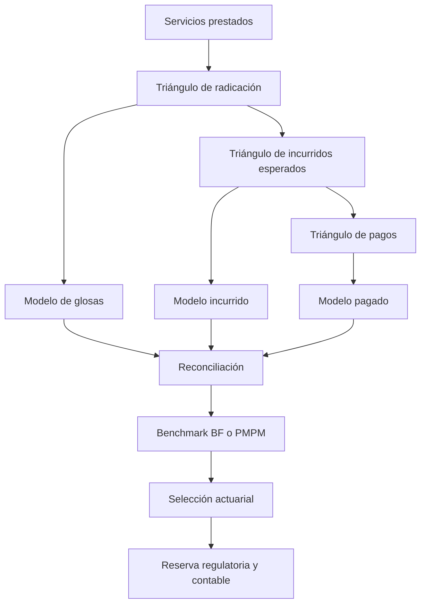

22-paid-vs-incurred-triangles-colombia.md
---
title: Triángulos de pagos vs. triángulos de incurridos
subtitle: Selección, adaptación y reconciliación para reservas de salud en Colombia
author: Health Insurance Reserving Handbook
version: 1.0
chapter: 22
status: Draft
jurisdiction: Colombia
last_updated: 2026-07-14
language: es
tags:
  - Colombia
  - IBNR
  - reservas técnicas
  - triángulos
  - pagos
  - incurridos
  - EPS
  - glosas
---

# Triángulos de pagos vs. triángulos de incurridos

> Los triángulos de pagos reflejan el momento en que sale el dinero. Los triángulos de incurridos intentan reflejar cuándo se reconoce económicamente la obligación. En salud colombiana, ninguna de estas mediciones es automáticamente superior: su calidad depende de los procesos de radicación, auditoría, glosa, reconocimiento y pago.

---

## Advertencia de alcance

Este capítulo presenta criterios técnicos y actuariales. No constituye asesoría jurídica, contable ni una interpretación oficial de la regulación colombiana.

Antes de emplear las metodologías en una nota técnica, certificación actuarial, reporte regulatorio o estado financiero, deben verificarse:

- la normativa vigente aplicable al tipo de entidad;
- la Circular Única de la Superintendencia Nacional de Salud y sus modificaciones;
- el régimen contable aplicable;
- las definiciones institucionales de obligación conocida y no conocida;
- los criterios vigentes para glosas, autorizaciones, facturas, reservas y cuentas por pagar.

---

## Objetivos de aprendizaje

Al finalizar este capítulo, el lector podrá:

- distinguir conceptualmente los triángulos de pagos y de incurridos;
- identificar qué componente de la reserva estima cada enfoque;
- construir ambas clases de triángulos;
- interpretar correctamente el IBNR resultante;
- reconocer las distorsiones propias del sistema colombiano;
- evaluar la confiabilidad de las reservas o saldos conocidos;
- utilizar métodos combinados como Munich Chain Ladder;
- ajustar cambios en velocidad de pago o adecuación de reservas;
- seleccionar una metodología según la calidad de los datos;
- reconciliar los resultados con las obligaciones conocidas y no conocidas.

---

## 1. Definiciones fundamentales

## 1.1 Triángulo de pagos

Cada celda acumulada representa el valor efectivamente pagado hasta un determinado periodo de desarrollo.

Sea:

\[
P_{i,j}
\]

el pago acumulado correspondiente al periodo de ocurrencia $i$, observado hasta el periodo de desarrollo $j$.

El pago incremental es:

\[
p_{i,j}
=
P_{i,j}-P_{i,j-1}
\]

con la convención:

\[
P_{i,-1}=0
\]

La estimación clásica del costo último es:

\[
\widehat{U}^{Paid}_i
=
P_{i,k_i}
\prod_{j=k_i}^{J-1}
\widehat f^{Paid}_j
\]

La reserva pendiente de pago es:

\[
\widehat{R}^{Paid}_i
=
\widehat{U}^{Paid}_i-P_{i,k_i}
\]

Esta reserva comprende toda la diferencia entre el costo último y los pagos efectuados.

---

## 1.2 Triángulo de incurridos

Cada celda acumulada representa el costo reconocido hasta un determinado periodo de desarrollo.

Una definición tradicional es:

\[
I_{i,j}
=
P_{i,j}+O_{i,j}
\]

donde:

- $P_{i,j}$: pagos acumulados;
- $O_{i,j}$: obligaciones o saldos pendientes reconocidos.

El costo último se estima mediante:

\[
\widehat{U}^{Incurred}_i
=
I_{i,k_i}
\prod_{j=k_i}^{J-1}
\widehat f^{Incurred}_j
\]

El IBNR adicional no reconocido es:

\[
\widehat{IBNR}^{Incurred}_i
=
\widehat{U}^{Incurred}_i-I_{i,k_i}
\]

La obligación total pendiente de pago es:

\[
\widehat R^{Total}_i
=
O_{i,k_i}
+
\widehat{IBNR}^{Incurred}_i
\]

Equivalentemente:

\[
\widehat R^{Total}_i
=
\widehat{U}^{Incurred}_i-P_{i,k_i}
\]

---

## 2. Diferencia económica

| Elemento | Triángulo de pagos | Triángulo de incurridos |
|---|---|---|
| Base principal | Flujo de caja | Obligación reconocida |
| Incluye pagos | Sí | Sí |
| Incluye obligaciones conocidas pendientes | No | Sí |
| Sensibilidad a velocidad de pago | Muy alta | Menor, pero no nula |
| Sensibilidad a políticas de reservamiento | Indirecta | Muy alta |
| Dependencia de juicio operativo | Menor | Mayor |
| Trazabilidad con tesorería | Alta | Parcial |
| Trazabilidad con cuentas médicas | Parcial | Alta |
| Información temprana | Limitada | Potencialmente alta |
| Requiere saldos conocidos confiables | No | Sí |
| Riesgo de distorsión por liquidez | Alto | Moderado |
| Riesgo de distorsión por cambios de política | Moderado | Alto |

La diferencia principal no es matemática. Es económica:

- pagos mide cuánto se ha desembolsado;
- incurridos mide cuánto se considera reconocido, aunque todavía no se haya pagado.

---

## 3. Relación con las reservas colombianas

La clasificación regulatoria entre obligaciones pendientes conocidas y obligaciones pendientes no conocidas no coincide exactamente con la distinción entre paid e incurred.

## 3.1 Desde el enfoque de pagos

La reserva:

\[
\widehat R^{Paid}
=
\widehat U-Paid
\]

puede incluir conjuntamente:

- obligaciones conocidas y liquidadas pendientes de pago;
- obligaciones conocidas no liquidadas;
- servicios prestados aún no radicados;
- IBNR puro;
- IBNER;
- ajustes futuros;
- glosas finalmente reconocidas.

## 3.2 Desde el enfoque de incurridos

La diferencia:

\[
\widehat U-Incurred
\]

representa solamente la porción todavía no incorporada en el incurrido registrado.

Por tanto:

\[
\widehat R^{Paid}
=
Outstanding\ Known
+
\widehat{IBNR}^{Incurred}
\]

Un IBNR calculado desde incurridos será normalmente menor que una reserva pendiente calculada desde pagos, porque parte de la obligación ya se encuentra incluida en el saldo conocido.

## 3.3 Implicación práctica

No deben compararse directamente:

\[
IBNR^{Paid}
\]

e:

\[
IBNR^{Incurred}
\]

sin reconciliar primero sus componentes.

---

## 4. Construcción de triángulos de pagos

## 4.1 Unidad de origen

En salud colombiana, el origen recomendado suele ser:

- mes de prestación;
- trimestre de prestación;
- periodo de cobertura.

La fecha de pago determina el desarrollo.

## 4.2 Desarrollo

\[
j
=
\mathrm{mes}
(
FechaPago-FechaPrestacion
)
\]

El valor incremental es:

\[
p_{i,j}
=
\sum_{m\in(i,j)}
PagoNeto_m
\]

El triángulo acumulado es:

\[
P_{i,j}
=
\sum_{h=0}^{j}
p_{i,h}
\]

## 4.3 Pagos netos

La definición debe establecer el tratamiento de:

- reversos;
- notas crédito;
- recuperaciones;
- descuentos;
- retenciones;
- pagos directos;
- compensaciones;
- pagos por terceros;
- ajustes contables;
- recobros.

No debe asumirse automáticamente que todos los movimientos negativos son errores. Algunos representan correcciones reales del costo.

---

## 5. Ventajas de los triángulos de pagos

Los pagos corresponden a transacciones efectivamente ejecutadas. Esto ofrece:

- trazabilidad con tesorería;
- menor dependencia de juicio sobre reservas conocidas;
- menor riesgo de manipulación mediante fortalecimientos o liberaciones;
- definición relativamente objetiva;
- facilidad de auditoría;
- consistencia cuando la política de pagos es estable;
- independencia parcial de la política de glosas.

Los triángulos pagados son especialmente útiles como benchmark independiente de los saldos registrados por cuentas médicas.

---

## 6. Limitaciones de los triángulos de pagos

Los pagos pueden reflejar más la operación financiera que el costo médico.

Factores de distorsión:

- disponibilidad de liquidez;
- programación de tesorería;
- acuerdos de pago;
- pagos masivos;
- pagos directos;
- conciliaciones extraordinarias;
- intervención o liquidación;
- litigios;
- cambios contractuales;
- fallas de plataforma;
- cierres de radicación;
- priorización de determinados prestadores;
- retención de pagos por auditoría.

## 6.1 Ejemplo

Un aumento en el pago durante un mes puede deberse a una conciliación de cuentas antiguas.

El triángulo puede mostrar un factor de desarrollo elevado, aunque no haya cambiado:

- la frecuencia;
- la severidad;
- la utilización;
- el costo médico esperado.

Esto es un efecto calendario, no un efecto de desarrollo.

---

## 7. Cuándo utilizar triángulos de pagos

Son más apropiados cuando:

- los procesos de pago son estables;
- no existen atrasos materiales por liquidez;
- la historia de pagos es completa;
- el portafolio posee suficiente madurez;
- los saldos conocidos son poco confiables;
- se requiere una estimación independiente;
- las fechas y montos de pago están bien controlados;
- los pagos directos pueden reconciliarse.

Métodos compatibles:

- Paid Chain Ladder;
- Mack sobre pagos;
- Bootstrap sobre pagos;
- Bornhuetter-Ferguson pagado;
- Cape Cod pagado;
- GLM sobre pagos incrementales;
- GAM;
- modelos de supervivencia hasta pago;
- frecuencia-severidad.

---

## 8. Construcción de triángulos de incurridos

## 8.1 Definición tradicional

\[
I_{i,j}
=
P_{i,j}+O_{i,j}
\]

El problema central es definir $O_{i,j}$.

En Colombia puede corresponder a:

- cuentas radicadas;
- cuentas auditadas;
- valor reconocido;
- saldo contable;
- autorizaciones utilizadas;
- valor bruto antes de glosa;
- valor neto después de glosa;
- valor esperado de pago.

Estas bases no son equivalentes.

## 8.2 Incurrido esperado

Una definición actuarial más robusta es:

\[
I^{Expected}_{i,j}
=
P_{i,j}
+
O^{Expected}_{i,j}
\]

donde:

\[
O^{Expected}_{i,j}
=
\sum_{m}
P(A_m=1\mid X_m)
E[V_m^{Final}\mid A_m=1,X_m]
\]

con:

- $A_m=1$: la cuenta resulta total o parcialmente pagadera;
- $X_m$: características de la cuenta;
- $V_m^{Final}$: valor final esperado.

Esta definición evita equiparar automáticamente el valor radicado con la obligación económica final.

---

## 9. Ventajas de los triángulos de incurridos

Los incurridos incorporan información antes de que ocurra el pago.

Ventajas:

- señal más temprana;
- menor dependencia de la velocidad de tesorería;
- mejor respuesta en periodos recientes;
- incorporación de cuentas conocidas;
- potencialmente menor cola de desarrollo;
- utilidad para portafolios con pagos retrasados;
- mayor alineación con el reconocimiento económico de la obligación.

En teoría, los incurridos se aproximan al ultimate más rápido que los pagos.

En la práctica, esto solo ocurre si los saldos conocidos son razonables.

---

## 10. Limitaciones de los triángulos de incurridos

Su confiabilidad depende directamente de:

- oportunidad del reconocimiento;
- política de reservas;
- calidad de auditoría;
- tratamiento de glosas;
- consistencia de provisiones;
- historia de estados;
- disciplina contable;
- definición de obligación.

Pueden distorsionarse por:

- fortalecimientos;
- liberaciones;
- provisiones manuales;
- cambios de política;
- reclasificaciones;
- conciliaciones;
- diferencias entre factura y valor aceptado;
- reservas duplicadas;
- autorizaciones no utilizadas;
- glosas registradas de manera inconsistente.

Un triángulo incurrido estable puede representar una política estable de provisión, no necesariamente una evolución estable del costo.

---

## 11. Cuándo utilizar triángulos de incurridos

Son más apropiados cuando:

- las obligaciones conocidas se registran oportunamente;
- los saldos pendientes están bien estimados;
- las glosas se modelan consistentemente;
- existe historia de reservas por fecha de corte;
- las políticas contables son estables;
- los procesos de auditoría son reproducibles;
- los pagos sufren retrasos administrativos o financieros;
- el portafolio es reciente.

Métodos compatibles:

- Incurred Chain Ladder;
- Mack sobre incurridos;
- Bootstrap;
- Bornhuetter-Ferguson;
- Cape Cod;
- Munich Chain Ladder;
- Berquist-Sherman;
- GLM sobre incrementales incurridos;
- modelos multiestado.

---

## 12. Definiciones alternativas de incurrido en Colombia

Se recomienda mantener variables separadas.

## 12.1 Facturado

\[
F_{i,j}
=
ValorFacturadoAcumulado
\]

## 12.2 Radicado

\[
R_{i,j}
=
ValorRadicadoAcumulado
\]

## 12.3 Auditado

\[
A_{i,j}
=
ValorAuditadoAcumulado
\]

## 12.4 Glosado

\[
G_{i,j}
=
ValorGlosadoAcumulado
\]

## 12.5 Reconocido

\[
K_{i,j}
=
ValorReconocidoAcumulado
\]

## 12.6 Pagado

\[
P_{i,j}
=
ValorPagadoAcumulado
\]

## 12.7 Incurrido actuarial esperado

\[
I^{Act}_{i,j}
=
P_{i,j}
+
O^{Expected}_{i,j}
\]

No se recomienda denominar “incurrido” a una variable sin documentar cuál de estas bases utiliza.

---

## 13. Ejemplo numérico

Supóngase un periodo de prestación con:

- pagos acumulados: 60;
- cuentas radicadas pendientes: 50;
- valor esperado de pago de las cuentas: 40;
- ultimate estimado: 120.

## 13.1 Enfoque pagado

\[
P=60
\]

\[
Reserve^{Paid}
=
120-60
=
60
\]

La reserva incluye:

- cuentas conocidas pendientes;
- servicios no radicados;
- desarrollo adicional;
- IBNER;
- IBNR.

## 13.2 Enfoque incurrido

\[
I
=
60+40
=
100
\]

\[
IBNR^{Incurred}
=
120-100
=
20
\]

La reserva total pendiente es:

\[
40+20=60
\]

Ambos enfoques producen la misma obligación total si alcanzan el mismo ultimate y utilizan definiciones consistentes.

La diferencia está en la clasificación:

| Componente | Pagos | Incurridos |
|---|---:|---:|
| Conocido pendiente | Incluido en reserva total | Incluido en incurrido |
| No reconocido | Incluido en reserva total | 20 |
| Reserva pendiente total | 60 | 60 |

---

## 14. Impacto de las glosas

## 14.1 En pagos

Las glosas afectan:

- tiempo hasta pago;
- monto final;
- pagos parciales;
- reversos;
- cola de desarrollo.

El efecto aparece indirectamente en el patrón de pagos.

## 14.2 En incurridos brutos

Si:

\[
I^{Gross}
=
Paid+Radicado
\]

puede sobreestimarse la obligación cuando parte de las cuentas radicadas no será reconocida.

## 14.3 En incurridos netos

Si:

\[
I^{Net}
=
Paid+Radicado-Glosa
\]

puede subestimarse la obligación cuando parte de la glosa sea posteriormente levantada.

## 14.4 Enfoque esperado

\[
I^{Expected}
=
Paid+E[PagoFuturo]
\]

Para una cuenta glosada:

\[
E[PagoFuturo_m]
=
P(A_m=1\mid X_m)
E[V_m^{Final}\mid A_m=1,X_m]
\]

Este enfoque debe reconciliarse con los mínimos y criterios regulatorios aplicables.

---

## 15. Efecto de cambios en políticas de reserva

Supóngase que la entidad fortalece sus saldos pendientes en una fecha de corte.

El triángulo incurrido mostrará un incremento diagonal, aunque no cambien:

- utilización;
- frecuencia;
- severidad;
- perfil epidemiológico.

Consecuencias:

- factores incurridos artificialmente altos;
- falsa señal de deterioro;
- dependencia entre periodos de origen;
- sesgo de Chain Ladder;
- incremento aparente del ultimate.

El triángulo pagado no refleja inmediatamente este cambio.

Por ello, los incurridos históricos deben reconstruirse o ajustarse cuando cambie la política de reconocimiento.

---

## 16. Efecto de cambios en velocidad de pago

Si la entidad acelera pagos:

- los factores de pagos tempranos aumentan;
- los factores tardíos disminuyen;
- el patrón histórico deja de ser comparable.

Si desacelera pagos:

- el triángulo parece más inmaduro;
- el IBNR pagado puede aumentar;
- el ultimate puede distorsionarse.

Un cambio en velocidad de pago no equivale a un cambio en ultimate.

---

## 17. Paid-to-incurred ratio

Defínase:

\[
Q_{i,j}
=
\frac{P_{i,j}}{I_{i,j}}
\]

Interpretación:

- $Q$ bajo: gran proporción del incurrido está pendiente;
- $Q$ alto: gran parte del incurrido ha sido pagada;
- $Q>1$: posible liberación, error de definición o valores negativos;
- variaciones abruptas: cambios de pago o adecuación de saldos.

## 17.1 Diagnóstico por desarrollo

Debe evaluarse:

\[
E[Q_{i,j}]
\]

para cada edad de desarrollo.

## 17.2 Diagnóstico por calendario

Cambios simultáneos en varias cohortes pueden indicar:

- conciliación masiva;
- ajuste de reservas;
- aceleración de pagos;
- cambio de plataforma;
- depuración contable.

---

## 18. Munich Chain Ladder

Munich Chain Ladder combina información de pagos e incurridos.

## 18.1 Motivación

Chain Ladder pagado e incurrido pueden producir ultimates diferentes.

Munich Chain Ladder utiliza la relación entre:

- desviaciones del desarrollo pagado;
- desviaciones del desarrollo incurrido;
- paid-to-incurred ratio.

## 18.2 Variables

\[
P_{i,j}
=
PagosAcumulados
\]

\[
I_{i,j}
=
IncurridosAcumulados
\]

\[
Q_{i,j}
=
\frac{P_{i,j}}{I_{i,j}}
\]

## 18.3 Aplicabilidad

Es útil cuando:

- ambos triángulos son confiables;
- sus definiciones son consistentes;
- existe relación estable entre pagos e incurridos;
- los saldos conocidos contienen información relevante.

## 18.4 Limitación crítica

Si el incurrido está sesgado, Munich Chain Ladder puede trasladar el sesgo al resultado pagado.

Si los pagos están afectados por liquidez, también puede contaminar el modelo incurrido.

No convierte automáticamente dos fuentes deficientes en una estimación robusta.

---

## 19. Berquist-Sherman

Berquist-Sherman busca corregir cambios en:

- velocidad de pago;
- adecuación de reservas conocidas;
- inflación.

## 19.1 Ajuste de pagos

Los pagos históricos se reexpresan como si hubieran ocurrido bajo la velocidad de pago actual.

## 19.2 Ajuste de incurridos

Los saldos conocidos se ajustan para mantener un nivel consistente de adecuación histórica.

## 19.3 Aplicaciones en Colombia

Puede ser útil después de:

- cambio de plataforma;
- centralización de auditoría;
- conciliaciones masivas;
- modificación de política de glosas;
- fortalecimiento de provisiones;
- aceleración de pagos;
- incorporación de pagos directos;
- cambio en contratos de red.

## 19.4 Riesgo

El método requiere estimar cuál habría sido el comportamiento histórico bajo la práctica actual. Esa reconstrucción incorpora juicio y riesgo de modelo.

---

## 20. Comparación metodológica

| Característica | Pagos | Incurridos |
|---|---:|---:|
| Objetividad transaccional | Alta | Media |
| Información temprana | Baja | Alta |
| Dependencia de tesorería | Alta | Media |
| Dependencia de política de reservas | Baja | Alta |
| Sensibilidad a glosas | Indirecta | Directa |
| Adecuado para periodos recientes | Limitado | Potencialmente |
| Adecuado con saldos débiles | Sí | No |
| Adecuado con pagos atrasados | No | Sí |
| Facilidad de reconciliación | Alta | Media |
| Necesidad de historia de estados | Media | Alta |
| Riesgo de cola extensa | Alto | Menor |
| Riesgo de liberación artificial | Bajo | Alto |

---

## 21. Marco de selección para Colombia

| Situación | Pagos | Incurridos | Recomendación |
|---|---:|---:|---|
| Tesorería estable | Alto | Alto | Comparar ambos |
| Retrasos de pago | Bajo | Alto | Preferir incurridos |
| Saldos conocidos débiles | Alto | Bajo | Preferir pagos |
| Glosas volátiles | Medio | Bajo | Modelo separado |
| Periodos recientes | Bajo | Alto | Incurridos o BF |
| Portafolio maduro | Alto | Alto | Chain Ladder en ambos |
| Cambio de auditoría | Alto | Bajo | Pagos y ajustes |
| Cambio de plataforma | Medio | Medio | Segmentar |
| Contratos capitados | Bajo | Bajo | Devengo contractual |
| Alto costo | Medio | Medio | Modelo individual |
| Pagos directos materiales | Medio | Medio | Reconciliación específica |
| Conciliación masiva | Bajo | Bajo | Ajuste calendario |
| Reservas fortalecidas | Alto | Bajo | Reconstruir incurridos |
| Aceleración de pagos | Bajo | Alto | Ajustar pagos |

---

## 22. Arquitectura recomendada

## 22.1 Flujo práctico

1. construir triángulo de pagos;
2. construir triángulo de radicados;
3. construir incurridos esperados;
4. calcular ultimates pagados;
5. calcular ultimates incurridos;
6. revisar paid-to-incurred;
7. identificar cambios operativos;
8. comparar con BF o PMPM;
9. ejecutar backtesting;
10. seleccionar por segmento.

---

## 23. Reconciliación entre ambos métodos

Para cada periodo de origen:

\[
\widehat U^{Paid}_i
\]

\[
\widehat U^{Incurred}_i
\]

Diferencia:

\[
D_i
=
\widehat U^{Paid}_i
-
\widehat U^{Incurred}_i
\]

El análisis debe explicar si la diferencia se debe a:

- velocidad de pago;
- adecuación del saldo;
- glosas;
- madurez;
- cambios contractuales;
- tail;
- outliers;
- mix de servicios;
- política contable;
- selección de factores;
- pagos directos;
- ajustes manuales.

Una diferencia persistente no debe resolverse promediando automáticamente los resultados.

---

## 24. Diagnósticos para triángulos pagados

Revisar:

- estabilidad de factores;
- prestación a pago;
- radicación a pago;
- acumulación por tesorería;
- pagos extraordinarios;
- reversos;
- notas crédito;
- pagos directos;
- antigüedad de cuentas;
- pagos por prestador;
- concentración;
- efecto calendario;
- proporción pagada por edad.

## 24.1 Indicador de velocidad

\[
PaymentSpeed_j
=
\frac{P_j}{U}
\]

Debe analizarse por:

- servicio;
- régimen;
- prestador;
- mecanismo de pago;
- periodo calendario.

---

## 25. Diagnósticos para triángulos incurridos

Revisar:

- adecuación de saldo;
- incurred-to-paid;
- reconocimiento inicial;
- liberaciones;
- fortalecimientos;
- glosa bruta y neta;
- reaperturas;
- reclasificaciones;
- cambios contables;
- autorizaciones no utilizadas;
- consistencia por fecha de corte;
- reservas negativas;
- incrementales negativos;
- desarrollo posterior al cierre.

## 25.1 Cambio en adecuación

\[
Adequacy_{i,j}
=
\frac{I_{i,j}}{U_i^{Observed}}
\]

Si la adecuación cambia sistemáticamente por calendario, el triángulo incurrido no es estacionario.

---

## 26. Backtesting comparativo

Para una fecha histórica $t$:

1. reconstruir el triángulo pagado disponible;
2. reconstruir el triángulo incurrido disponible;
3. estimar ambos ultimates;
4. comparar con el costo último observado posteriormente.

## 26.1 Error pagado

\[
e^{Paid}_t
=
\widehat U^{Paid}_t-U_t
\]

## 26.2 Error incurrido

\[
e^{Incurred}_t
=
\widehat U^{Incurred}_t-U_t
\]

## 26.3 Métricas

- sesgo;
- sesgo relativo;
- MAE;
- RMSE;
- estabilidad;
- cobertura de intervalos;
- error por madurez;
- error por segmento.

La selección debe apoyarse en evidencia histórica de la entidad, no únicamente en preferencia metodológica.

---

## 27. Selección combinada

Puede utilizarse:

\[
\widehat U_i^{Selected}
=
w_i\widehat U_i^{Incurred}
+
(1-w_i)\widehat U_i^{Paid}
\]

Sin embargo, $w_i$ no debe ser arbitrario.

Puede depender de:

- madurez;
- calidad del saldo;
- estabilidad de pagos;
- antigüedad;
- resultado de backtesting;
- cambio operativo;
- nivel de glosas;
- consistencia contable.

## 27.1 Peso basado en error

Una aproximación es:

\[
w
=
\frac{1/MSE_{Incurred}}
{1/MSE_{Incurred}+1/MSE_{Paid}}
\]

Este esquema debe limitarse cuando existan cambios estructurales, porque el error histórico puede no representar el futuro.

---

## 28. Alternativa segmentada

Una solución frecuentemente superior es seleccionar métodos diferentes por componente.

| Componente | Método sugerido |
|---|---|
| Pagos con historia estable | Paid Chain Ladder |
| Obligaciones conocidas confiables | Incurred Chain Ladder |
| Meses recientes | Bornhuetter-Ferguson |
| Cuentas glosadas | Probabilidad × severidad |
| Capitación | Devengo contractual |
| Alto costo | Modelo individual |
| Incapacidades | Frecuencia-severidad |
| Radicación tardía | Supervivencia |
| Segmentos pequeños | Bayesiano jerárquico |
| Cambios regulatorios | BF y escenarios |

---

## 29. Ejemplo de reconciliación

Supóngase:

| Método | Ultimate | Pagado | Incurrido |
|---|---:|---:|---:|
| Paid Chain Ladder | 150 | 100 | — |
| Incurred Chain Ladder | 142 | 100 | 130 |
| BF | 146 | 100 | — |

## 29.1 Reserva pagada

\[
R^{Paid}
=
150-100
=
50
\]

## 29.2 IBNR incurrido

\[
IBNR^{Incurred}
=
142-130
=
12
\]

Si el saldo conocido pendiente es:

\[
130-100=30
\]

la reserva total incurrida es:

\[
30+12=42
\]

## 29.3 Diferencia

\[
50-42=8
\]

Posibles explicaciones:

- reserva conocida insuficiente;
- Chain Ladder pagado sobrestimado;
- cambio en velocidad de pago;
- tail distinto;
- glosas;
- factores inestables.

El BF de 146 actúa como benchmark intermedio, pero no resuelve por sí solo la causa.

---

## 30. Errores comunes

- comparar IBNR pagado con IBNR incurrido sin reconciliación;
- usar radicado bruto como incurrido económico;
- acumular dos veces saldos pendientes;
- ignorar liberaciones;
- mezclar pagos y reconocimientos;
- utilizar el estado actual para reconstruir periodos históricos;
- ignorar cambios en glosas;
- aplicar Mack sin revisar independencia;
- promediar paid e incurred sin justificación;
- mezclar capitación con evento;
- asumir que pago equivale a costo;
- asumir que reserva conocida equivale a obligación definitiva.

---

## 31. Checklist de implementación

## Definiciones

- [ ] El periodo de origen está documentado.
- [ ] La definición de pago neto está documentada.
- [ ] La definición de incurrido está documentada.
- [ ] Las glosas tienen tratamiento explícito.
- [ ] Los pagos directos están incluidos o conciliados.
- [ ] Las autorizaciones están diferenciadas de servicios prestados.

## Datos

- [ ] Existe historia por fecha de corte.
- [ ] Los pagos reconcilian con tesorería.
- [ ] Los incurridos reconcilian con contabilidad.
- [ ] Los saldos pendientes tienen trazabilidad.
- [ ] Los reversos están identificados.
- [ ] Los cambios de política están inventariados.
- [ ] Los periodos incompletos están identificados.

## Diagnósticos

- [ ] Se analizaron factores pagados.
- [ ] Se analizaron factores incurridos.
- [ ] Se calculó paid-to-incurred.
- [ ] Se revisaron efectos calendario.
- [ ] Se evaluó velocidad de pago.
- [ ] Se evaluó adecuación de saldos.
- [ ] Se ejecutó backtesting.

## Selección

- [ ] Existe benchmark BF o PMPM.
- [ ] Las diferencias están explicadas.
- [ ] Los pesos, si existen, están sustentados.
- [ ] La selección se realiza por segmento.
- [ ] Los ajustes manuales están documentados.
- [ ] Se descartó doble conteo.

---

## 32. Supuestos ocultos

Los principales supuestos que deben hacerse explícitos son:

- el concepto de incurrido es consistente;
- los pagos no están condicionados materialmente por liquidez;
- las glosas reflejan correctamente la expectativa de pago;
- los saldos conocidos son comparables históricamente;
- los periodos no contienen cierres extraordinarios;
- las cohortes son homogéneas;
- los pagos e incurridos convergen al mismo ultimate;
- el último periodo está suficientemente completo;
- la cola observada representa el futuro.

---

## 33. Calidad de la evidencia

No existe evidencia suficiente para afirmar que los triángulos pagados o incurridos sean universalmente superiores en Colombia.

La evidencia relevante debe provenir de:

- backtesting de la entidad;
- reconciliación histórica;
- calidad de reservas conocidas;
- estabilidad de pagos;
- comportamiento de glosas;
- resultados por segmento;
- cambios regulatorios y operativos.

Una metodología puede funcionar bien para hospitalización por evento y fallar en medicamentos, capitación o alto costo.

---

## 34. Mejor contraargumento

El enfoque incurrido puede parecer conceptualmente superior porque incorpora información temprana.

Sin embargo, puede ser inferior cuando:

- las reservas son discrecionales;
- las glosas son inconsistentes;
- existen cambios contables;
- el saldo conocido no representa el valor final.

El enfoque pagado puede parecer más objetivo.

Sin embargo, puede ser inferior cuando:

- existen restricciones de liquidez;
- el pago está administrativamente retrasado;
- ocurren conciliaciones masivas;
- la fecha de pago no refleja el desarrollo económico.

Por tanto, objetividad transaccional e información económica no son sinónimos.

---

## 35. Riesgos

## 35.1 Primer orden

- subestimación del ultimate;
- sobreestimación;
- doble conteo;
- clasificación incorrecta;
- factores sesgados;
- tail insuficiente;
- liberaciones prematuras.

## 35.2 Segundo orden

- decisiones erróneas de solvencia;
- distorsión de suficiencia financiera;
- pagos inadecuados a prestadores;
- mala contratación;
- información financiera poco confiable;
- incumplimiento regulatorio;
- pérdida de credibilidad ante supervisión.

---

## 36. Alternativa potencialmente superior

Un modelo multietapa puede representar mejor el contexto colombiano:

\[
Prestación
\rightarrow
Radicación
\rightarrow
Auditoría
\rightarrow
Reconocimiento
\rightarrow
Pago
\]

Cada etapa puede modelarse mediante:

- probabilidad de transición;
- tiempo de transición;
- monto esperado;
- riesgo de glosa;
- reversos;
- reapertura.

La reserva sería el valor esperado de los pagos futuros condicionado al estado actual de cada prestación o cuenta.

Este enfoque utiliza pagos e incurridos, pero no depende exclusivamente de un único triángulo agregado.

---

## 37. Recomendación metodológica

Para una EPS o entidad responsable del aseguramiento en salud en Colombia se recomienda:

1. mantener triángulos de pagos;
2. mantener triángulos de radicados;
3. construir incurridos esperados;
4. separar obligaciones conocidas;
5. modelar glosas explícitamente;
6. comparar ultimates pagados e incurridos;
7. utilizar BF o PMPM para periodos recientes;
8. aplicar backtesting por segmento;
9. documentar cambios operativos;
10. seleccionar el método según la calidad de cada fuente.

Chain Ladder pagado debe actuar como benchmark objetivo.

El incurrido debe utilizarse cuando el saldo conocido sea oportuno, consistente y verificable.

Ninguno debe aplicarse automáticamente a capitación, contratos prospectivos o alto costo sin adaptaciones adicionales.

---

## 38. Conclusiones

Los triángulos pagados y de incurridos son representaciones complementarias del mismo proceso económico.

El enfoque pagado estima:

\[
Ultimate-Paid
\]

El enfoque incurrido estima:

\[
Ultimate-(Paid+Outstanding)
\]

Por ello, el primero contiene toda la obligación pendiente, mientras el segundo contiene únicamente la parte aún no reconocida.

En Colombia, la calidad del triángulo incurrido depende críticamente de la definición de obligación conocida, del tratamiento de glosas y de la consistencia de las políticas de auditoría y reconocimiento.

La calidad del triángulo pagado depende de que el flujo de caja no esté materialmente distorsionado por liquidez, conciliaciones, pagos directos o cambios administrativos.

La práctica más robusta no consiste en escoger anticipadamente uno de los dos enfoques. Consiste en:

- construir ambos;
- reconciliarlos;
- diagnosticar sus diferencias;
- medir su desempeño histórico;
- seleccionar por segmento;
- documentar el juicio actuarial.

---

## Referencias

## Normativa colombiana

- Superintendencia Nacional de Salud. Resolución 412 de 2015.
- Superintendencia Nacional de Salud. Circular Única y sus modificaciones.
- Decreto 2702 de 2014.
- Decreto 780 de 2016 y sus modificaciones.
- Instrucciones vigentes sobre reservas técnicas, obligaciones pendientes conocidas y obligaciones pendientes no conocidas.

## Referencias actuariales

- Friedland, J. *Estimating Unpaid Claims Using Basic Techniques*.
- Mack, T. *Distribution-Free Calculation of the Standard Error of Chain Ladder Reserve Estimates*.
- Quarg, G. y Mack, T. *Munich Chain Ladder*.
- Berquist, J. y Sherman, R. *Loss Reserve Adequacy Testing*.
- England, P. y Verrall, R. *Stochastic Claims Reserving in General Insurance*.
- Wüthrich, M. y Merz, M. *Stochastic Claims Reserving Methods in Insurance*.
- Taylor, G. *Loss Reserving*.

---

## Próximo capítulo

➡️ **[Colombia Data and Multistate Models](31-colombia-data-and-multistate-models.md)**
