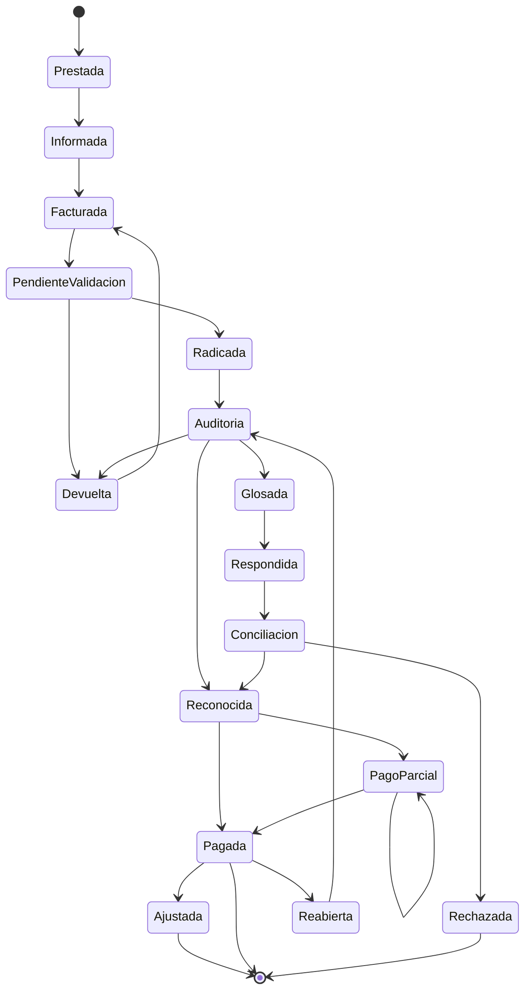
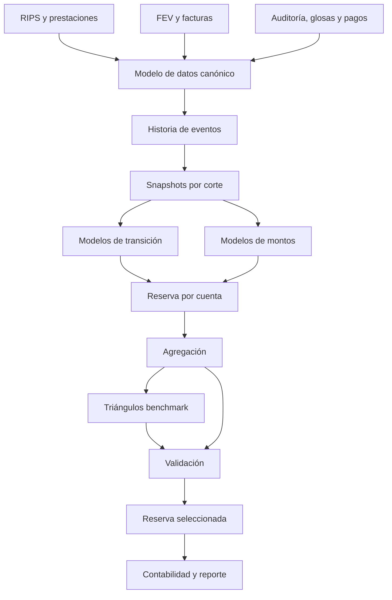

23-colombian-health-reserving-data-and-multistate-models.md
---

title: Datos y modelos multiestado para reservas de salud en Colombia
subtitle: Modelación del proceso desde la prestación hasta el pago definitivo
author: Health Insurance Reserving Handbook
version: 1.0
chapter: 23
status: Draft
jurisdiction: Colombia
last_updated: 2026-07-14
language: es
tags:

* Colombia
* IBNR
* reservas técnicas
* modelos multiestado
* RIPS
* FEV
* glosas
* supervivencia
* EPS
* IPS

---

# Datos y modelos multiestado para reservas de salud en Colombia

> Un triángulo resume cuánto se desarrolló una cohorte. Un modelo multiestado explica cómo una prestación transita por radicación, validación, auditoría, glosa, reconocimiento y pago.

---

## Advertencia de alcance

Este capítulo presenta un marco técnico y actuarial. No constituye asesoría jurídica, contable ni una interpretación oficial de la regulación colombiana.

Antes de implementar sus recomendaciones deben verificarse:

* la regulación vigente para el tipo de entidad;
* la Circular Única de la Superintendencia Nacional de Salud;
* las normas vigentes sobre RIPS y factura electrónica de venta en salud;
* el Manual Único de Devoluciones, Glosas y Respuestas;
* las reglas contractuales aplicables;
* las definiciones institucionales de obligación conocida y no conocida;
* los requisitos de protección de datos personales y seguridad de la información.

---

## Objetivos de aprendizaje

Al finalizar este capítulo, el lector podrá:

* diseñar un modelo de datos histórico para reserving;
* diferenciar prestaciones, cuentas, facturas, movimientos y pagos;
* reconstruir el estado de cada obligación en cualquier fecha de corte;
* representar el ciclo de una cuenta médica como un proceso multiestado;
* estimar probabilidades y tiempos de transición;
* incorporar censura, reaperturas y pagos parciales;
* calcular reservas mediante esperanza condicional;
* integrar modelos multiestado con triángulos pagados e incurridos;
* validar los modelos mediante backtesting;
* implementar prototipos en SQL, Python y R;
* identificar riesgos de doble conteo, sesgo y fuga de información.

---

## Contenido

1. Motivación
2. Relación con el marco colombiano
3. Unidad de análisis
4. Arquitectura de datos
5. Historia de eventos
6. Definición de estados
7. Diagrama multiestado
8. Reglas de transición
9. Construcción de cohortes
10. Fundamentos probabilísticos
11. Modelos de supervivencia
12. Riesgos competitivos
13. Modelos multiestado
14. Modelación de montos
15. Pagos parciales y saldos
16. Glosas, devoluciones y reaperturas
17. Reserva a nivel de prestación o cuenta
18. Agregación y reconciliación
19. Integración con triángulos
20. Calibración
21. Validación y backtesting
22. Implementación SQL
23. Implementación Python
24. Implementación R
25. Arquitectura de producción
26. Gobierno y documentación
27. Caso ilustrativo
28. Limitaciones
29. Checklist
30. Conclusiones

---

## 1. Motivación

Los triángulos tradicionales organizan los valores por:

* periodo de prestación;
* periodo de desarrollo.

Esta estructura es útil para estimar el costo último, pero comprime información operativa.

Dos periodos pueden presentar el mismo pago acumulado y, sin embargo, tener perfiles muy diferentes:

* uno puede contener cuentas aún no radicadas;
* otro puede contener cuentas glosadas;
* otro puede tener obligaciones reconocidas pendientes de tesorería;
* otro puede incluir pagos parciales en conciliación.

Un modelo multiestado conserva esa información.

La unidad de análisis deja de ser únicamente una celda del triángulo y pasa a ser una prestación, línea de factura, cuenta o episodio que puede cambiar de estado durante su ciclo de vida.

---

## 2. Relación con el marco colombiano

El flujo colombiano de información y cobro incluye componentes clínicos, administrativos y financieros.

Los RIPS contienen información relativa a las prestaciones realizadas. La factura electrónica de venta en salud y sus soportes permiten integrar la información de facturación y prestación, mientras que los procesos de devolución, glosa y respuesta determinan si una cuenta continúa en auditoría, es corregida, es reconocida o es rechazada.

Para reserving, estos sistemas generan distintos momentos de observación:

1. prestación realizada;
2. registro clínico disponible;
3. generación del RIPS;
4. validación;
5. emisión de factura;
6. radicación válida;
7. devolución;
8. auditoría;
9. glosa;
10. respuesta;
11. conciliación;
12. reconocimiento;
13. pago;
14. ajuste posterior.

La existencia de una prestación no implica que exista una factura radicada. La existencia de una factura no implica que su valor sea plenamente reconocido. El reconocimiento tampoco implica pago inmediato.

---

## 3. Unidad de análisis

## 3.1 Prestación

Corresponde al servicio o tecnología suministrada a una persona.

Es la unidad más cercana a la ocurrencia económica.

Ventajas:

* permite modelar utilización;
* evita depender del momento de facturación;
* facilita modelos de frecuencia-severidad;
* permite agrupar por diagnóstico y procedimiento.

Limitaciones:

* puede no estar disponible oportunamente;
* puede sufrir cambios de identificación;
* puede agruparse posteriormente en paquetes o facturas.

## 3.2 Línea de factura

Representa un cargo específico dentro de una factura.

Suele ser la unidad más apropiada para modelar:

* glosa;
* reconocimiento;
* pago parcial;
* tarifa;
* causal de devolución.

## 3.3 Factura

Puede agrupar múltiples prestaciones y personas.

Es útil para procesos administrativos, pero puede ocultar heterogeneidad clínica.

## 3.4 Episodio

Agrupa prestaciones asociadas a una misma atención o condición.

Es útil para:

* hospitalizaciones;
* enfermedades de alto costo;
* maternidad;
* tratamientos prolongados;
* paquetes.

## 3.5 Regla recomendada

Mantener simultáneamente:

```text
Persona
   ↓
Episodio
   ↓
Prestación
   ↓
Línea de factura
   ↓
Factura
   ↓
Movimiento financiero
```

Las relaciones deben poder ser uno-a-muchos y muchos-a-muchos cuando la operación lo requiera.

---

## 4. Arquitectura de datos

## 4.1 Tabla de prestaciones

```text
prestacion_id
afiliado_id_hash
episodio_id
fecha_prestacion
tipo_servicio
diagnostico
procedimiento
prestador_id
municipio
regimen
mecanismo_pago
fuente_financiacion
cantidad
valor_estimado_inicial
```

## 4.2 Tabla de facturas

```text
factura_id
prestador_id
fecha_factura
fecha_recepcion
fecha_radicacion_valida
numero_fev
cuv
valor_facturado
estado_actual
```

## 4.3 Tabla de líneas de factura

```text
linea_factura_id
factura_id
prestacion_id
codigo_servicio
cantidad
valor_unitario
valor_cobrado
valor_glosado
valor_reconocido
valor_pagado
saldo
```

## 4.4 Tabla de eventos

```text
evento_id
entidad_id
tipo_entidad
estado_origen
estado_destino
tipo_evento
fecha_evento
valor_antes
valor_despues
causal
usuario
sistema
fecha_carga
```

## 4.5 Tabla de pagos

```text
pago_id
factura_id
linea_factura_id
fecha_pago
valor_pago
tipo_pago
tercero_pagador
referencia_contable
es_reverso
```

## 4.6 Tabla de exposición

```text
periodo
regimen
region
producto
afiliados_mes
dias_expuestos
upc_reconocida
factor_riesgo
```

---

## 5. Historia de eventos

## 5.1 Por qué es indispensable

Un campo con el estado actual no permite saber:

* cuándo ocurrió la transición;
* cuánto tiempo permaneció la cuenta en cada estado;
* si fue reabierta;
* si fue devuelta varias veces;
* cuál era su valor en una fecha de corte histórica.

Para backtesting se debe reconstruir la información que realmente estaba disponible en cada fecha.

## 5.2 Estructura event-sourcing

Cada cambio se guarda como un evento inmutable:

| Cuenta | Fecha | Estado anterior | Estado nuevo | Valor anterior | Valor nuevo |
| ------ | ----- | --------------- | ------------ | -------------: | ----------: |
| A      | 05-01 | Prestada        | Facturada    |              0 |         100 |
| A      | 10-01 | Facturada       | Radicada     |            100 |         100 |
| A      | 20-01 | Radicada        | Glosada      |            100 |          70 |
| A      | 15-02 | Glosada         | Reconocida   |             70 |          85 |
| A      | 28-02 | Reconocida      | Pagada       |             85 |          85 |

## 5.3 Snapshot por fecha de corte

Para una fecha (t), el estado es:

[
S_m(t)
======

\text{último estado registrado antes o en }t
]

El valor pendiente es:

[
B_m(t)
======

V_m^{reconocido}(t)-V_m^{pagado}(t)
]

---

## 6. Definición de estados

Una taxonomía inicial puede incluir:

| Código | Estado                  | Descripción                                     |
| ------ | ----------------------- | ----------------------------------------------- |
| 0      | Prestada                | Servicio realizado                              |
| 1      | Informada               | Registro clínico o RIPS disponible              |
| 2      | Facturada               | Factura emitida                                 |
| 3      | Pendiente de validación | Espera de validación técnica                    |
| 4      | Radicada                | Cuenta recibida válidamente                     |
| 5      | Devuelta                | No supera requisitos para continuar             |
| 6      | En auditoría            | Revisión administrativa o médica                |
| 7      | Glosada                 | Existe controversia parcial o total             |
| 8      | Respondida              | Prestador respondió la glosa                    |
| 9      | Conciliación            | En negociación o resolución                     |
| 10     | Reconocida              | Obligación aceptada                             |
| 11     | Pago parcial            | Se efectuó pago no total                        |
| 12     | Pagada                  | Pago final esperado completado                  |
| 13     | Rechazada               | Sin obligación esperada                         |
| 14     | Reabierta               | Cuenta previamente cerrada reactivada           |
| 15     | Ajustada                | Modificación posterior al pago o reconocimiento |

## 6.1 Estados observables vs. latentes

Algunos estados son directamente observables:

* radicada;
* glosada;
* pagada.

Otros pueden ser parcialmente latentes:

* prestación aún no informada;
* factura preparada pero no transmitida;
* valor definitivo esperado;
* probabilidad de conciliación favorable.

El modelo debe distinguir estados registrados de estados económicos estimados.

---

## 7. Diagrama multiestado



## 7.1 Estados absorbentes

Un estado absorbente es aquel del cual no se espera una transición posterior.

Ejemplos simplificados:

* pagada;
* rechazada.

En la práctica, pueden existir reaperturas. Por tanto, “pagada” solo debe tratarse como absorbente si la experiencia demuestra que los ajustes posteriores son inmateriales o se modelan separadamente.

---

## 8. Reglas de transición

## 8.1 Matriz de transiciones permitidas

Sea (A) una matriz donde:

[
A_{rs}
======

\begin{cases}
1, & \text{si se permite transición de }r\text{ a }s\
0, & \text{en otro caso}
\end{cases}
]

Ejemplo:

| Desde / Hacia | Radicada | Devuelta | Glosada | Reconocida | Pagada |
| ------------- | -------: | -------: | ------: | ---------: | -----: |
| Facturada     |        1 |        1 |       0 |          0 |      0 |
| Radicada      |        0 |        1 |       1 |          1 |      0 |
| Glosada       |        0 |        0 |       0 |          1 |      0 |
| Reconocida    |        0 |        0 |       0 |          0 |      1 |

## 8.2 Validaciones

Identificar:

* transiciones imposibles;
* fechas fuera de secuencia;
* pago previo a prestación;
* glosa previa a radicación;
* reconocimiento superior al valor vigente;
* pagos mayores al saldo;
* transiciones sin evento;
* cuentas cerradas con saldo;
* cuentas abiertas sin valor.

---

## 9. Construcción de cohortes

## 9.1 Cohorte por prestación

La cohorte principal debe corresponder al periodo en que se prestó el servicio:

[
i
=

Periodo(FechaPrestacion)
]

## 9.2 Desarrollo desde prestación

[
j
=

Periodo(FechaEvento)-Periodo(FechaPrestacion)
]

## 9.3 Cohortes complementarias

También pueden construirse cohortes por:

* radicación;
* glosa;
* reconocimiento;
* inicio de incapacidad;
* ingreso hospitalario.

Cada cohorte responde una pregunta diferente.

### Prestación

¿Cuándo surgió económicamente el costo?

### Radicación

¿Cuánto tarda el proceso de auditoría?

### Reconocimiento

¿Cuánto tarda el pago?

### Glosa

¿Cuánto tarda la resolución de controversias?

---

## 10. Fundamentos probabilísticos

Sea (S(t)) el estado de una cuenta en el tiempo (t).

El proceso multiestado puede representarse como:

[
{S(t):t\geq0}
]

La probabilidad de transición es:

[
P_{rs}(u,t)
===========

P(S(t)=s\mid S(u)=r)
]

donde (u<t).

Si el proceso es Markoviano:

[
P(S(t)=s\mid S(u)=r,\mathcal H_u)
=================================

P(S(t)=s\mid S(u)=r)
]

donde (\mathcal H_u) representa toda la historia previa.

Este supuesto implica que el futuro depende del estado actual, no de toda la trayectoria.

## 10.1 Limitación del supuesto Markov

En cuentas médicas, el futuro puede depender también de:

* tiempo acumulado en el estado;
* número de devoluciones;
* causal de glosa;
* prestador;
* antigüedad;
* valor;
* historia de pagos parciales.

Por tanto, pueden requerirse:

* modelos semi-Markov;
* covariables dependientes del tiempo;
* estados ampliados;
* modelos de duración.

---

## 11. Modelos de supervivencia

## 11.1 Tiempo hasta transición

Sea:

[
T_{rs}
]

el tiempo desde el ingreso al estado (r) hasta la transición al estado (s).

La función de supervivencia es:

[
S_{rs}(t)
=========

P(T_{rs}>t)
]

La función de riesgo es:

[
h_{rs}(t)
=========

\lim_{\Delta t\to0}
\frac{
P(t\leq T_{rs}<t+\Delta t\mid T_{rs}\geq t)
}{
\Delta t
}
]

## 11.2 Censura

Una cuenta que continúa abierta a la fecha de corte está censurada.

No debe tratarse como si nunca fuera a transitar.

Ejemplo:

* cuenta en auditoría durante 90 días;
* la fecha de corte ocurre antes de su reconocimiento;
* solo se sabe que el tiempo hasta reconocimiento excede 90 días.

## 11.3 Kaplan-Meier

Puede estimar la distribución no paramétrica del tiempo hasta:

* radicación;
* reconocimiento;
* pago.

## 11.4 Modelo de Cox

[
h(t\mid X)
==========

h_0(t)\exp(X^\top\beta)
]

Covariables posibles:

* prestador;
* régimen;
* servicio;
* valor;
* causal de glosa;
* región;
* mecanismo contractual;
* periodo calendario.

## 11.5 Modelos paramétricos

* exponencial;
* Weibull;
* lognormal;
* log-logístico;
* gamma generalizada.

Son útiles para extrapolar la cola cuando el seguimiento observado es insuficiente.

---

## 12. Riesgos competitivos

Desde auditoría, una cuenta puede pasar a:

* reconocida;
* glosada;
* devuelta.

Estas transiciones compiten entre sí.

Sea:

[
T=\min(T_1,T_2,T_3)
]

y (K) la causa de salida.

La incidencia acumulada de la causa (k) es:

[
F_k(t)
======

P(T\leq t,K=k)
]

No debe estimarse la probabilidad de reconocimiento tratando glosas y devoluciones como censura no informativa, porque son resultados alternativos.

---

## 13. Modelos multiestado

## 13.1 Intensidad de transición

Para transición (r\rightarrow s):

[
\lambda_{rs}(t)
===============

\lim_{\Delta t\to0}
\frac{
P(S(t+\Delta t)=s\mid S(t)=r)
}{
\Delta t
}
]

## 13.2 Matriz de intensidad

[
Q(t)
====

\begin{pmatrix}
-\sum_{s\neq1}\lambda_{1s} & \lambda_{12} & \cdots \
\lambda_{21} & -\sum_{s\neq2}\lambda_{2s} & \cdots \
\vdots & \vdots & \ddots
\end{pmatrix}
]

## 13.3 Probabilidades de transición

En un modelo homogéneo:

[
P(t)
====

\exp(Qt)
]

## 13.4 Aalen-Johansen

El estimador de Aalen-Johansen permite estimar probabilidades de transición sin imponer una distribución paramétrica específica.

## 13.5 Modelos con covariables

[
\lambda_{rs}(t\mid X)
=====================

\lambda_{rs,0}(t)
\exp(X^\top\beta_{rs})
]

Cada transición puede tener predictores diferentes.

Ejemplo:

* el prestador puede afectar radicación;
* la causal afecta resolución de glosa;
* tesorería afecta pago;
* el tipo de servicio afecta reconocimiento.

---

## 14. Modelación de montos

Predecir la transición no es suficiente. También debe estimarse el monto final.

## 14.1 Modelo de dos partes

Para una cuenta (m):

[
E[V_m^{final}]
==============

P(V_m^{final}>0)
E[V_m^{final}\mid V_m^{final}>0]
]

## 14.2 Proporción reconocida

[
Q_m
===

\frac{V_m^{reconocido}}
{V_m^{facturado}}
]

Distribuciones posibles:

* beta;
* beta inflada en cero y uno;
* quasi-binomial;
* gradient boosting.

## 14.3 Monto positivo

[
V_m^{final}\mid V_m^{final}>0
\sim
Gamma(\mu_m,\phi)
]

o:

[
\log(V_m^{final})
\sim
N(\mu_m,\sigma^2)
]

## 14.4 Modelo conjunto

El monto esperado condicionado al estado es:

[
E[V_m^{future}\mid S_m(t),X_m]
]

Este valor puede cambiar cuando la cuenta transita:

* radicada;
* glosada;
* reconocida;
* parcialmente pagada.

---

## 15. Pagos parciales y saldos

## 15.1 Proceso de pagos

Sea:

[
N_m(t)
]

el número de pagos realizados hasta (t), y:

[
Z_{mk}
]

el monto del pago (k).

Entonces:

[
P_m(t)
======

\sum_{k=1}^{N_m(t)}Z_{mk}
]

## 15.2 Reserva pendiente

[
R_m(t)
======

E[V_m^{ultimate}-P_m(t)\mid\mathcal F_t]
]

## 15.3 Pagos recurrentes

Una cuenta puede permanecer en “pago parcial” y generar múltiples pagos.

Puede modelarse mediante:

* proceso recurrente;
* modelo de conteo;
* intensidad de pagos;
* severidad por pago;
* estado con saldo continuo.

## 15.4 Evitar pagos negativos artificiales

Reversos y notas crédito deben identificarse como eventos específicos, no simplemente combinarse con pagos ordinarios.

---

## 16. Glosas, devoluciones y reaperturas

## 16.1 Devolución

La devolución puede impedir que una cuenta sea considerada válidamente radicada.

El modelo debe establecer si:

* vuelve a facturada;
* vuelve a validación;
* se cancela;
* se sustituye por otra factura.

## 16.2 Glosa

La glosa puede ser:

* total;
* parcial;
* administrativa;
* tarifaria;
* médica;
* documental.

Cada tipo puede tener distintas probabilidades y tiempos de resolución.

## 16.3 Reapertura

Una cuenta pagada o rechazada puede reabrirse.

La reapertura debe modelarse cuando sea material:

[
P(Reapertura\mid X)
]

y:

[
E[CostoAdicional\mid Reapertura,X]
]

## 16.4 Estado expandido

En lugar de un único estado “glosada”, puede utilizarse:

```text
Glosa administrativa
Glosa médica
Glosa tarifaria
Glosa documental
Glosa en respuesta
Glosa en conciliación
```

El beneficio debe compararse con la pérdida de credibilidad causada por una segmentación excesiva.

---

## 17. Reserva a nivel de cuenta

Para una cuenta (m) en estado (r):

[
R_m(t)
======

\sum_{s}
P(S_m(\infty)=s\mid S_m(t)=r,X_m)
E[V_m^{future}\mid s,r,X_m]
]

Si los estados finales son “pagada” y “rechazada”:

[
R_m(t)
======

P(Pagada\mid S_m(t),X_m)
E[V_m^{final}-P_m(t)\mid Pagada,X_m]
]

## 17.1 Reserva de cuentas conocidas

[
R^{known}(t)
============

\sum_{m\in Known(t)}
R_m(t)
]

## 17.2 Prestaciones aún no informadas

Deben modelarse separadamente:

[
R^{unknown}(t)
==============

E[
\text{costo de prestaciones ocurridas no observadas}
\mid\mathcal F_t
]
]

## 17.3 Reserva total

[
R^{total}(t)
============

R^{known}(t)
+
R^{unknown}(t)
+
R^{other}(t)
]

---

## 18. Agregación y reconciliación

## 18.1 Por cohorte

[
R_i
===

\sum_{m:Origin_m=i}
R_m
]

## 18.2 Por segmento

[
R_g
===

\sum_{m:Segment_m=g}
R_m
]

## 18.3 Reconciliación contable

[
Ultimate
========

PaidToDate
+
KnownOutstanding
+
UnknownReserve
]

## 18.4 Prevención del doble conteo

Una prestación no debe aparecer simultáneamente como:

* cuenta conocida;
* IBNR no radicado;
* autorización pendiente;
* componente de un paquete.

Se requiere un identificador y una jerarquía de clasificación.

---

## 19. Integración con triángulos

Los modelos multiestado no sustituyen necesariamente los triángulos.

## 19.1 Triángulos como benchmark

Mantener:

* triángulo pagado;
* triángulo incurrido;
* triángulo radicado;
* triángulo de conteos.

## 19.2 Resultados multiestado agregados

Las predicciones individuales pueden agregarse en formato triangular:

[
\widehat X_{i,j}
================

\sum_{m:Origin_m=i}
E[Pago_{m,j}]
]

## 19.3 Reconciliación

Comparar:

[
\widehat U_i^{Triangle}
]

con:

[
\widehat U_i^{Multistate}
]

Las diferencias pueden revelar:

* heterogeneidad;
* cambios de mezcla;
* sesgo de reservas conocidas;
* efectos calendario;
* segmentos con baja completitud.

---

## 20. Calibración

## 20.1 Ventanas temporales

Los procesos operativos cambian. La calibración debe ponderar:

* historia reciente;
* estabilidad;
* cambios regulatorios;
* cambios de plataforma;
* modificaciones contractuales.

## 20.2 Segmentación

Calibrar por:

* régimen;
* prestador;
* servicio;
* mecanismo de pago;
* región;
* causal de glosa.

## 20.3 Regularización

Para evitar sobreajuste:

* pooling;
* efectos aleatorios;
* modelos jerárquicos;
* penalización;
* agrupaciones actuariales.

## 20.4 Cola

Cuando no se observa el cierre completo:

* distribución paramétrica;
* benchmark externo;
* prior bayesiano;
* escenario prudencial.

---

## 21. Validación y backtesting

## 21.1 Reconstrucción histórica

Para una fecha de corte (t):

1. usar únicamente eventos con fecha (\leq t);
2. identificar el estado de cada cuenta;
3. estimar pagos futuros;
4. comparar con pagos observados posteriormente.

## 21.2 Calibración de probabilidad

Para grupos con probabilidad estimada (p), la proporción observada debería aproximarse a (p).

Herramientas:

* reliability plots;
* Brier score;
* log-loss;
* expected calibration error.

## 21.3 Validación de tiempos

* concordance index;
* Brier score dependiente del tiempo;
* curvas observadas vs. estimadas;
* cobertura de cuantiles;
* análisis de residuos.

## 21.4 Validación de montos

* MAE;
* RMSE;
* Tweedie deviance;
* sesgo;
* error por segmento;
* error de reserva agregada.

## 21.5 Validación financiera

[
ReserveError_t
==============

## \widehat R_t

PaymentsAfter_t
]

Debe analizarse por:

* cohorte;
* estado;
* prestador;
* servicio;
* antigüedad.

---

## 22. Implementación SQL

## 22.1 Construcción de historia de estados

```sql
WITH ordered_events AS (
    SELECT
        entity_id,
        event_date,
        event_type,
        state_to,
        amount_after,
        ROW_NUMBER() OVER (
            PARTITION BY entity_id
            ORDER BY event_date, event_id
        ) AS event_order,
        LAG(state_to) OVER (
            PARTITION BY entity_id
            ORDER BY event_date, event_id
        ) AS previous_state
    FROM claim_events
)
SELECT
    entity_id,
    event_date,
    previous_state AS state_from,
    state_to,
    amount_after
FROM ordered_events;
```

## 22.2 Estado a fecha de corte

```sql
WITH ranked AS (
    SELECT
        entity_id,
        state_to,
        amount_after,
        event_date,
        ROW_NUMBER() OVER (
            PARTITION BY entity_id
            ORDER BY event_date DESC, event_id DESC
        ) AS rn
    FROM claim_events
    WHERE event_date <= :valuation_date
)
SELECT
    entity_id,
    state_to AS state_at_valuation,
    amount_after
FROM ranked
WHERE rn = 1;
```

## 22.3 Duración en estado

```sql
SELECT
    entity_id,
    state_from,
    state_to,
    event_date AS transition_date,
    LAG(event_date) OVER (
        PARTITION BY entity_id
        ORDER BY event_date
    ) AS state_entry_date,
    DATEDIFF(
        day,
        LAG(event_date) OVER (
            PARTITION BY entity_id
            ORDER BY event_date
        ),
        event_date
    ) AS days_in_state
FROM claim_transitions;
```

---

## 23. Implementación Python

```python
from __future__ import annotations

import pandas as pd


def build_transitions(events: pd.DataFrame) -> pd.DataFrame:
    required = {
        "entity_id",
        "event_id",
        "event_date",
        "state_to",
        "amount_after",
    }
    missing = required.difference(events.columns)
    if missing:
        raise ValueError(f"Missing columns: {sorted(missing)}")

    result = events.copy()
    result["event_date"] = pd.to_datetime(
        result["event_date"],
        errors="raise",
    )

    result = result.sort_values(
        ["entity_id", "event_date", "event_id"]
    )

    result["state_from"] = (
        result.groupby("entity_id")["state_to"].shift(1)
    )
    result["state_entry_date"] = (
        result.groupby("entity_id")["event_date"].shift(1)
    )
    result["days_in_state"] = (
        result["event_date"] - result["state_entry_date"]
    ).dt.days

    return result
```

## 23.1 Snapshot

```python
def snapshot_at(
    events: pd.DataFrame,
    valuation_date: str | pd.Timestamp,
) -> pd.DataFrame:
    cutoff = pd.Timestamp(valuation_date)

    eligible = events.loc[
        pd.to_datetime(events["event_date"]) <= cutoff
    ].copy()

    eligible = eligible.sort_values(
        ["entity_id", "event_date", "event_id"]
    )

    return (
        eligible.groupby("entity_id", as_index=False)
        .tail(1)
        .rename(
            columns={
                "state_to": "state_at_valuation",
                "amount_after": "amount_at_valuation",
            }
        )
    )
```

## 23.2 Modelo de supervivencia

```python
from lifelines import CoxPHFitter

cox_data = transitions[
    [
        "days_in_state",
        "transition_observed",
        "amount",
        "provider_group",
        "service_group",
    ]
].copy()

cox_data = pd.get_dummies(
    cox_data,
    columns=["provider_group", "service_group"],
    drop_first=True,
)

model = CoxPHFitter(penalizer=0.01)
model.fit(
    cox_data,
    duration_col="days_in_state",
    event_col="transition_observed",
)
```

---

## 24. Implementación R

## 24.1 Modelo de Cox

```r
library(survival)

fit <- coxph(
  Surv(days_in_state, transition_observed) ~
    amount +
    provider_group +
    service_group,
  data = transitions
)

summary(fit)
```

## 24.2 Modelo multiestado

```r
library(mstate)

transition_matrix <- transMat(
  list(
    c(2, 3),
    c(4, 5),
    c(4, 5),
    c(),
    c()
  ),
  names = c(
    "Radicada",
    "Auditoria",
    "Glosada",
    "Pagada",
    "Rechazada"
  )
)
```

---

## 25. Arquitectura de producción



## 25.1 Componentes

* almacenamiento histórico;
* motor de reglas;
* capa de features;
* modelo;
* registro de versiones;
* reconciliación;
* monitoreo;
* reportes;
* auditoría.

---

## 26. Gobierno y documentación

Documentar:

1. definición de cada estado;
2. transiciones permitidas;
3. reglas de fecha;
4. definición de valor;
5. tratamiento de reversos;
6. censura;
7. segmentación;
8. variables utilizadas;
9. metodología de estimación;
10. calibración;
11. validación;
12. limitaciones;
13. override manual;
14. versión de datos;
15. versión de código;
16. responsables;
17. aprobaciones.

## 26.1 Control de cambios

Un cambio en la definición de estado puede modificar toda la historia.

Debe conservarse:

* versión anterior;
* fecha de vigencia;
* mapeo;
* impacto cuantitativo;
* aprobación.

---

## 27. Caso ilustrativo

Supónganse 1.000 cuentas radicadas:

| Estado       | Número | Valor pendiente |
| ------------ | -----: | --------------: |
| Auditoría    |    400 |             200 |
| Glosada      |    300 |             150 |
| Reconocida   |    200 |             100 |
| Pago parcial |    100 |              50 |

Cifras monetarias en millones.

## 27.1 Probabilidades estimadas

| Estado       | Probabilidad de pago | Proporción final pagada |
| ------------ | -------------------: | ----------------------: |
| Auditoría    |                 0,90 |                    0,95 |
| Glosada      |                 0,65 |                    0,70 |
| Reconocida   |                 0,99 |                    1,00 |
| Pago parcial |                 0,98 |                    1,00 |

## 27.2 Reserva

Auditoría:

[
200(0.90)(0.95)=171
]

Glosada:

[
150(0.65)(0.70)=68.25
]

Reconocida:

[
100(0.99)(1.00)=99
]

Pago parcial:

[
50(0.98)(1.00)=49
]

Total conocido:

[
R^{known}
=========

$$
171+68.25+99+49
$$

387.25
]

Si la reserva por prestaciones no radicadas es 120:

[
R^{total}
=========

$$
387.25+120
$$

507.25
]

Debe verificarse que la reserva de glosas cumpla cualquier requisito mínimo aplicable.

---

## 28. Limitaciones

## 28.1 Datos

* falta de identificadores;
* historia incompleta;
* fechas modificadas;
* estados sobrescritos;
* pagos no asociados;
* duplicados;
* relaciones muchos-a-muchos no resueltas.

## 28.2 Modelo

* supuesto Markov insuficiente;
* colas no observadas;
* cambios regulatorios;
* dependencia entre cuentas;
* concentración por prestador;
* selección de casos cerrados;
* baja credibilidad.

## 28.3 Operación

* cambios de plataforma;
* nuevas reglas de validación;
* modificaciones de contratación;
* conciliaciones masivas;
* migraciones de afiliados;
* pagos directos.

## 28.4 Interpretación

Una probabilidad de pago no determina por sí sola la reserva regulatoria. Debe reconciliarse con la normativa y los mínimos aplicables.

---

## 29. Checklist

## Datos

* [ ] Existe identificador persistente.
* [ ] Se conserva historia de eventos.
* [ ] Las fechas son reproducibles.
* [ ] Los pagos están asociados.
* [ ] Los estados están definidos.
* [ ] Los reversos están separados.
* [ ] Los snapshots históricos son reconstruibles.
* [ ] Los totales reconcilian.

## Estados

* [ ] Las transiciones permitidas están documentadas.
* [ ] Se identificaron estados absorbentes.
* [ ] Se modelan reaperturas materiales.
* [ ] Se diferencian devolución y glosa.
* [ ] Los pagos parciales están representados.
* [ ] Se evita segmentación excesiva.

## Modelos

* [ ] Se considera censura.
* [ ] Se consideran riesgos competitivos.
* [ ] Se modelan tiempos y montos.
* [ ] Se validan probabilidades.
* [ ] Se valida el ultimate agregado.
* [ ] Se mantiene benchmark triangular.
* [ ] Se realizan escenarios.

## Gobierno

* [ ] Existe nota técnica.
* [ ] El código está versionado.
* [ ] Los datos están congelados.
* [ ] Los cambios de estado son auditables.
* [ ] Existe validación independiente.
* [ ] Los ajustes manuales están documentados.
* [ ] Se verifica cumplimiento regulatorio.

---

## 30. Conclusiones

Los modelos multiestado son especialmente adecuados para el sistema colombiano porque el costo pendiente no evoluciona únicamente con el tiempo. Evoluciona a través de estados administrativos y financieros.

La estructura:

[
Prestación
\rightarrow
Radicación
\rightarrow
Auditoría
\rightarrow
Glosa
\rightarrow
Reconocimiento
\rightarrow
Pago
]

permite diferenciar:

* servicios aún no informados;
* cuentas conocidas;
* controversias;
* obligaciones reconocidas;
* retrasos de pago.

La reserva puede expresarse como:

[
R(t)
====

\sum_m
E[V_m^{ultimate}-P_m(t)\mid S_m(t),X_m]
+
R^{unknown}(t)
]

Este enfoque ofrece mayor precisión conceptual que un único triángulo, pero exige datos más completos, mayor gobierno y validación rigurosa.

La alternativa más robusta es híbrida:

* modelos multiestado para obligaciones conocidas;
* BF, PMPM o supervivencia para prestaciones no radicadas;
* triángulos pagados e incurridos como benchmark;
* reglas regulatorias como restricción final.

---

## Referencias

## Normativa y fuentes institucionales

* Ministerio de Salud y Protección Social. Resolución 2275 de 2023 y modificaciones.
* Ministerio de Salud y Protección Social. Resolución 2284 de 2023.
* Ministerio de Salud y Protección Social. Lineamientos para FEV en salud y RIPS.
* Superintendencia Nacional de Salud. Resolución 412 de 2015.
* Superintendencia Nacional de Salud. Circular Única y modificaciones.
* Decreto 780 de 2016 y modificaciones.
* ADRES. Manuales operativos y de auditoría aplicables.

## Referencias técnicas

* Andersen, P. et al. *Statistical Models Based on Counting Processes*.
* Aalen, O., Borgan, Ø. y Gjessing, H. *Survival and Event History Analysis*.
* Putter, H., Fiocco, M. y Geskus, R. *Tutorial in Biostatistics: Competing Risks and Multi-State Models*.
* Klein, J. y Moeschberger, M. *Survival Analysis*.
* Therneau, T. y Grambsch, P. *Modeling Survival Data*.
* Friedland, J. *Estimating Unpaid Claims Using Basic Techniques*.
* Wüthrich, M. y Merz, M. *Stochastic Claims Reserving Methods in Insurance*.

---

## Próximo capítulo

➡️ **[Colombia Glosas and Disputes](32-colombia-glosas-and-disputes.md)**
