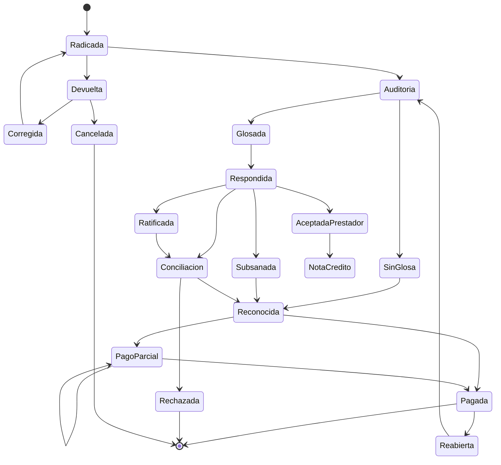

24-colombian-health-reserving-glosas-and-disputes.md
---
title: Modelación actuarial de glosas, devoluciones y controversias en salud
subtitle: Estimación de obligaciones pendientes, probabilidad de reconocimiento y tiempos de resolución en Colombia
author: Health Insurance Reserving Handbook
version: 1.0
chapter: 24
status: Draft
jurisdiction: Colombia
last_updated: 2026-07-14
language: es
tags:
  - Colombia
  - IBNR
  - reservas técnicas
  - glosas
  - devoluciones
  - cuentas médicas
  - controversias
  - EPS
  - IPS
  - supervivencia
  - modelos multiestado
---

# Modelación actuarial de glosas, devoluciones y controversias en salud

> Una glosa no equivale automáticamente a una reducción de la obligación. Es una controversia sobre la factura cuyo resultado, monto y tiempo de resolución permanecen inciertos.

---

## Advertencia de alcance

Este capítulo presenta un marco técnico y actuarial. No constituye asesoría jurídica, contable ni una interpretación oficial de la regulación colombiana.

Antes de aplicar sus recomendaciones deben verificarse:

- la versión vigente del Decreto 780 de 2016;
- la Resolución 2284 de 2023 y sus modificaciones;
- la Resolución 948 de 2026 y los documentos técnicos vigentes de RIPS–FEV;
- la Circular Única de la Superintendencia Nacional de Salud;
- las reglas vigentes sobre reservas técnicas y obligaciones conocidas;
- las cláusulas del acuerdo de voluntades;
- los requisitos contables aplicables;
- las instrucciones particulares de la autoridad de supervisión.

La estimación actuarial no sustituye los mínimos regulatorios ni las decisiones jurídicas sobre la exigibilidad de una obligación.

---

## Objetivos de aprendizaje

Al finalizar este capítulo, el lector podrá:

- diferenciar devolución, glosa, respuesta, conciliación y rechazo;
- identificar la unidad correcta de modelación;
- construir una base histórica de controversias;
- estimar la probabilidad de reconocimiento total, parcial o nulo;
- modelar el porcentaje final reconocido;
- estimar tiempos de respuesta, conciliación y pago;
- incorporar glosas en triángulos pagados e incurridos;
- calcular reservas por cuenta, causal y estado;
- evitar sesgos por utilizar únicamente casos cerrados;
- aplicar restricciones regulatorias;
- realizar backtesting y análisis de suficiencia;
- documentar una metodología reproducible.

---

## Contenido

1. Motivación
2. Marco conceptual
3. Marco normativo operativo
4. Diferencia entre devolución y glosa
5. Ciclo de vida de una controversia
6. Taxonomía de estados
7. Unidad de análisis
8. Modelo de datos
9. Variables explicativas
10. Medidas actuariales fundamentales
11. Modelo de probabilidad de reconocimiento
12. Modelo de proporción reconocida
13. Modelo de monto final
14. Modelación del tiempo de resolución
15. Riesgos competitivos
16. Modelos multiestado
17. Pagos parciales y acuerdos
18. Reaperturas y ajustes posteriores
19. Reserva por cuenta
20. Reserva agregada
21. Restricciones regulatorias
22. Integración con triángulos
23. Glosas en modelos pagados
24. Glosas en modelos incurridos
25. Segmentación
26. Validación y backtesting
27. Sensibilidad y escenarios
28. Implementación SQL
29. Implementación Python
30. Implementación R
31. Caso numérico
32. Gobierno y documentación
33. Riesgos y limitaciones
34. Checklist
35. Conclusiones

---

## 1. Motivación

Las cuentas médicas no siempre siguen una trayectoria directa desde la radicación hasta el pago.

Una cuenta puede:

- ser devuelta;
- corregirse y radicarse nuevamente;
- ser glosada total o parcialmente;
- recibir respuesta del prestador;
- pasar a conciliación;
- ser reconocida parcialmente;
- recibir varios pagos;
- permanecer abierta por un periodo prolongado;
- ser reabierta después de su aparente cierre.

Desde una perspectiva actuarial, existen al menos tres variables aleatorias:

\[
A_m
=
\text{resultado final de la controversia}
\]

\[
Q_m
=
\text{proporción finalmente reconocida}
\]

\[
T_m
=
\text{tiempo hasta resolución o pago}
\]

La reserva debe considerar las tres.

---

## 2. Marco conceptual

## 2.1 Devolución

La devolución impide o interrumpe el trámite de una factura debido a una causal aplicable al documento completo.

En términos operativos, la cuenta puede:

- corregirse;
- emitirse nuevamente;
- radicarse de nuevo;
- cancelarse;
- sustituirse mediante nota crédito.

La devolución no debe modelarse automáticamente como pago cero, porque puede ser subsanada.

## 2.2 Glosa

La glosa corresponde a una objeción sobre uno o varios componentes de la factura.

Puede afectar:

- todo el valor;
- una línea;
- una cantidad;
- una tarifa;
- un soporte;
- una autorización;
- la pertinencia;
- la cobertura.

## 2.3 Respuesta

Es la actuación mediante la cual el prestador o proveedor:

- acepta la glosa;
- acepta parcialmente;
- subsana;
- aporta evidencia;
- rechaza la objeción;
- propone una corrección.

## 2.4 Conciliación

Proceso de resolución de diferencias cuando la respuesta no conduce a un cierre inmediato.

## 2.5 Reconocimiento

Determinación del valor que se considera exigible o pagadero después de auditoría y controversia.

## 2.6 Rechazo económico final

Resultado en el cual no se espera obligación de pago respecto del valor controvertido.

La utilización del término “rechazado” debe diferenciarse del rechazo técnico producido durante validaciones de información.

---

## 3. Marco normativo operativo

La Resolución 2284 de 2023 adoptó el Manual Único de Devoluciones, Glosas y Respuestas y estableció las reglas operativas de soportes, auditoría y comunicación.

Para el diseño actuarial son especialmente relevantes los siguientes principios:

1. las causas de devolución y glosa están tipificadas;
2. no deben crearse categorías operativas incompatibles con el Manual;
3. una devolución afecta el trámite completo de la factura;
4. una glosa puede afectar valores específicos;
5. no deben utilizarse porcentajes globales de glosa como sustituto de la identificación de causas específicas;
6. las comunicaciones deben conservar trazabilidad;
7. devolución, glosa y respuesta son eventos distintos;
8. el proceso debe relacionarse con la factura, sus soportes y su radicación.

La Resolución 948 de 2026 reglamentó nuevamente el RIPS como soporte de la FEV y derogó las Resoluciones 2275 de 2023, 558 y 1884 de 2024. Por tanto, las referencias a RIPS–FEV deben mantenerse actualizadas y no depender de estructuras derogadas.

---

## 4. Diferencia actuarial entre devolución y glosa

| Característica | Devolución | Glosa |
|---|---|---|
| Alcance típico | Factura completa | Total o parcial |
| Momento | Revisión inicial | Auditoría |
| Efecto | Interrumpe el trámite | Controvierte el valor |
| Puede subsanarse | Sí | Sí |
| Implica pago cero definitivo | No | No |
| Requiere nueva radicación | Puede requerirla | Generalmente no |
| Unidad de modelación | Factura | Línea o concepto |
| Riesgo principal | No retorno o demora | Reconocimiento parcial |
| Modelo recomendado | Retorno y tiempo | Probabilidad × proporción |

## 4.1 Consecuencia metodológica

No debe existir una única variable binaria:

```text
glosada = 1
```

Se recomienda distinguir:

```text
es_devolucion
es_glosa
es_glosa_total
es_glosa_parcial
es_subsanable
es_reiterada
es_conciliada
es_pagada
```

---

## 5. Ciclo de vida de una controversia



---

## 6. Taxonomía de estados

| Estado | Definición actuarial |
|---|---|
| Radicada | Cuenta recibida válidamente |
| Devuelta | Trámite interrumpido por causal aplicable |
| Corregida | Cuenta modificada para nueva presentación |
| En auditoría | Cuenta pendiente de evaluación |
| Sin glosa | Auditoría no identifica controversia |
| Glosada | Existe objeción total o parcial |
| Respondida | Prestador presentó actuación |
| Subsanada | Se aportó o corrigió la información |
| Ratificada | La entidad mantiene la objeción |
| Conciliación | Diferencia pendiente de acuerdo |
| Reconocida | Valor aceptado |
| Pago parcial | Existe saldo posterior al pago |
| Pagada | Pago esperado completado |
| Rechazada | No se espera pago adicional |
| Reabierta | Cuenta previamente cerrada vuelve a revisión |
| Cancelada | Factura anulada o sustituida |

## 6.1 Estados económicos y estados operativos

El estado registrado puede no coincidir con el estado económico.

Ejemplo:

```text
Estado operativo: Glosada
Valor económico esperado: 65% del valor controvertido
```

La reserva debe medir la expectativa económica, no limitarse al nombre del estado.

---

## 7. Unidad de análisis

## 7.1 Factura

Adecuada para devoluciones.

## 7.2 Línea de factura

Adecuada para glosas parciales.

## 7.3 Código de glosa

Adecuado para análisis de causal.

## 7.4 Controversia

Una misma línea puede tener más de una controversia.

Unidad recomendada:

\[
m
=
(\text{factura},\text{línea},\text{código},\text{secuencia})
\]

## 7.5 Episodio de disputa

Agrupa todos los movimientos relacionados con la misma objeción hasta su cierre.

---

## 8. Modelo de datos

## 8.1 Tabla de controversias

```text
disputa_id
factura_id
linea_factura_id
codigo_manual
tipo_disputa
fecha_formulacion
valor_facturado
valor_controvertido
estado_actual
fecha_cierre
valor_reconocido_final
valor_pagado_final
```

## 8.2 Tabla de eventos

```text
evento_id
disputa_id
fecha_evento
estado_origen
estado_destino
tipo_respuesta
codigo_respuesta
valor_antes
valor_despues
observacion
fuente
```

## 8.3 Tabla de pagos

```text
pago_id
disputa_id
fecha_pago
valor_pago
es_reverso
referencia_contable
```

## 8.4 Tabla de documentos

```text
documento_id
disputa_id
tipo_documento
fecha_documento
es_valido
fecha_validacion
hash_documento
```

## 8.5 Información contractual

```text
contrato_id
modalidad_pago
tarifario
fecha_inicio
fecha_fin
reglas_auditoria
reglas_conciliacion
```

---

## 9. Variables explicativas

## 9.1 Causal

- facturación;
- tarifa;
- autorización;
- soporte;
- pertinencia;
- cobertura;
- calidad;
- cantidad;
- duplicidad.

## 9.2 Cuenta

- monto;
- porcentaje glosado;
- número de líneas;
- antigüedad;
- complejidad;
- tipo de servicio;
- mecanismo de pago.

## 9.3 Prestador

- grupo;
- región;
- tamaño;
- tasa histórica de glosa;
- tasa de aceptación;
- tiempo de respuesta;
- concentración.

## 9.4 Afiliado o servicio

- diagnóstico;
- procedimiento;
- hospitalización;
- urgencia;
- medicamento;
- alto costo.

## 9.5 Operación

- auditor;
- plataforma;
- canal;
- periodo calendario;
- cambio de política;
- conciliación masiva.

## 9.6 Interacciones

Ejemplos:

\[
Causal \times Prestador
\]

\[
Servicio \times Contrato
\]

\[
Antigüedad \times TipoGlosa
\]

---

## 10. Medidas actuariales fundamentales

## 10.1 Tasa de glosa inicial

\[
GIR
=
\frac{\text{valor inicialmente glosado}}
{\text{valor auditado}}
\]

## 10.2 Tasa final de no reconocimiento

\[
GFR
=
\frac{\text{valor definitivamente no reconocido}}
{\text{valor controvertido}}
\]

## 10.3 Tasa de levantamiento

\[
LR
=
\frac{\text{valor glosado posteriormente reconocido}}
{\text{valor inicialmente glosado}}
\]

## 10.4 Proporción final reconocida

\[
Q_m
=
\frac{V_m^{reconocido}}
{V_m^{controvertido}}
\]

## 10.5 Tiempo hasta resolución

\[
T_m
=
FechaCierre_m-FechaGlosa_m
\]

## 10.6 Tiempo hasta pago

\[
T_m^{pay}
=
FechaPagoFinal_m-FechaGlosa_m
\]

## 10.7 Tasa de reapertura

\[
RR
=
\frac{\text{controversias reabiertas}}
{\text{controversias cerradas}}
\]

---

## 11. Modelo de probabilidad de reconocimiento

Sea:

\[
A_m=
\begin{cases}
1,& \text{si existe reconocimiento positivo}\\
0,& \text{si el reconocimiento es cero}
\end{cases}
\]

Modelo logístico:

\[
P(A_m=1\mid X_m)
=
\frac{\exp(X_m^\top\beta)}
{1+\exp(X_m^\top\beta)}
\]

## 11.1 Interpretación

Una probabilidad de 0,70 no significa que se reconocerá exactamente 70% del valor.

Significa que, bajo la definición binaria utilizada, existe una probabilidad estimada de 70% de obtener algún reconocimiento.

## 11.2 Alternativas

- regresión logística;
- probit;
- random forest;
- gradient boosting;
- modelo bayesiano jerárquico.

## 11.3 Calibración

Para cuentas con probabilidad estimada cercana a 0,70, aproximadamente 70% deberían terminar con reconocimiento positivo.

---

## 12. Modelo de proporción reconocida

Condicionado a reconocimiento positivo:

\[
Q_m
=
\frac{V_m^{final}}{V_m^{controvertido}}
\]

con:

\[
0<Q_m\leq1
\]

## 12.1 Regresión beta

\[
Q_m\sim Beta(\mu_m\phi,(1-\mu_m)\phi)
\]

\[
logit(\mu_m)
=
X_m^\top\gamma
\]

## 12.2 Masa en cero y uno

La distribución suele presentar:

- muchos ceros;
- muchos unos;
- valores intermedios.

Puede utilizarse una distribución inflada:

\[
P(Q=0)=\pi_0
\]

\[
P(Q=1)=\pi_1
\]

\[
Q\mid0<Q<1\sim Beta(\mu,\phi)
\]

## 12.3 Modelo ordinal

Clasificaciones:

- rechazo total;
- reconocimiento bajo;
- reconocimiento medio;
- reconocimiento alto;
- reconocimiento total.

---

## 13. Modelo de monto final

La expectativa es:

\[
E[V_m^{final}]
=
P(A_m=1)
E[Q_m\mid A_m=1]
V_m^{controvertido}
\]

Cuando el valor final puede superar el controvertido por ajustes, debe utilizarse un modelo monetario directo.

Distribuciones posibles:

- Gamma;
- lognormal;
- Tweedie;
- hurdle;
- mixture model.

---

## 14. Modelación del tiempo de resolución

## 14.1 Supervivencia

\[
S(t)
=
P(T>t)
\]

## 14.2 Hazard

\[
h(t)
=
\lim_{\Delta t\to0}
\frac{
P(t\leq T<t+\Delta t\mid T\geq t)
}{
\Delta t
}
\]

## 14.3 Cox

\[
h(t\mid X)
=
h_0(t)\exp(X^\top\delta)
\]

## 14.4 Modelos paramétricos

- Weibull;
- lognormal;
- log-logístico;
- gamma generalizada.

## 14.5 Uso actuarial

El tiempo afecta:

- fecha esperada de pago;
- flujo de caja;
- descuento, cuando aplique;
- antigüedad regulatoria;
- posibilidad de conciliación;
- probabilidad de reapertura.

---

## 15. Riesgos competitivos

Desde el estado glosado, una cuenta puede terminar en:

1. reconocimiento total;
2. reconocimiento parcial;
3. rechazo;
4. cancelación;
5. litigio o controversia prolongada.

Sea $K$ el resultado final.

\[
F_k(t)
=
P(T\leq t,K=k)
\]

No debe tratarse el rechazo como censura cuando es un resultado económico alternativo.

---

## 16. Modelos multiestado

## 16.1 Intensidad

\[
\lambda_{rs}(t\mid X)
=
\lambda_{rs,0}(t)
\exp(X^\top\beta_{rs})
\]

## 16.2 Transiciones principales

- devuelta → radicada;
- glosada → respondida;
- respondida → reconocida;
- respondida → conciliación;
- conciliación → reconocida;
- conciliación → rechazada;
- reconocida → pagada;
- pagada → reabierta.

## 16.3 Reserva multiestado

\[
R_m(t)
=
\sum_s
P(S_m(\infty)=s\mid S_m(t),X_m)
E[V_m^{future}\mid s,S_m(t),X_m]
\]

---

## 17. Pagos parciales y acuerdos

## 17.1 Pago parcial

\[
Saldo_m(t)
=
V_m^{ultimate}-P_m(t)
\]

## 17.2 Múltiples pagos

\[
P_m(t)
=
\sum_{k=1}^{N_m(t)}Z_{mk}
\]

## 17.3 Acuerdos

Un acuerdo puede cambiar:

- monto;
- calendario;
- probabilidad de pago;
- contraparte;
- condiciones de cierre.

Debe registrarse como evento, no sobrescribir la historia anterior.

## 17.4 Descuentos por pronto pago

Deben separarse de glosas porque obedecen a una decisión comercial o contractual distinta.

---

## 18. Reaperturas y ajustes posteriores

## 18.1 Probabilidad

\[
P(R_m=1\mid X_m)
\]

## 18.2 Severidad adicional

\[
E[Z_m^{reopen}\mid R_m=1,X_m]
\]

## 18.3 Reserva de reapertura

\[
R_m^{reopen}
=
P(R_m=1\mid X_m)
E[Z_m^{reopen}\mid R_m=1,X_m]
\]

## 18.4 Materialidad

Si las reaperturas son inmateriales, pueden modelarse agregadamente mediante un factor de cola.

---

## 19. Reserva por cuenta

Para una controversia abierta:

\[
R_m
=
P(A_m=1\mid X_m)
E[Q_m\mid A_m=1,X_m]
V_m^{controvertido}
-
P_m^{controvertido}
\]

con límite inferior:

\[
R_m\geq0
\]

cuando no se esperan recuperaciones negativas.

## 19.1 Componentes no controvertidos

La porción no glosada debe reconocerse separadamente:

\[
R_m^{total}
=
R_m^{no\ controvertido}
+
R_m^{controvertido}
\]

## 19.2 Evitar doble conteo

El saldo glosado no debe incluirse simultáneamente en:

- saldo conocido bruto;
- reserva esperada de glosas;
- IBNR;
- provisión manual.

---

## 20. Reserva agregada

\[
R^{glosas}
=
\sum_{m=1}^{M}R_m
\]

Por causal:

\[
R_c
=
\sum_{m:C_m=c}R_m
\]

Por antigüedad:

\[
R_a
=
\sum_{m:Aging_m=a}R_m
\]

Por prestador:

\[
R_p
=
\sum_{m:Provider_m=p}R_m
\]

La agregación debe reconciliarse con:

- auxiliares contables;
- cuentas médicas;
- cartera;
- pagos;
- notas crédito;
- reportes regulatorios.

---

## 21. Restricciones regulatorias

La estimación estadística puede estar sujeta a límites mínimos.

En forma general:

\[
R_m^{booked}
=
\max
\left(
R_m^{actuarial},
R_m^{regulatory}
\right)
\]

cuando la norma aplicable establezca un piso.

## 21.1 Separación de medidas

El informe debe distinguir:

| Medida | Definición |
|---|---|
| Valor bruto controvertido | Total sometido a glosa |
| Estimación actuarial | Pago futuro esperado |
| Mínimo regulatorio | Piso obligatorio |
| Reserva registrada | Valor reconocido |
| Diferencia prudencial | Exceso sobre estimación central |

## 21.2 Prohibición de porcentaje global

Una política como:

```text
Reservar 60% de todas las glosas
```

puede ser útil como benchmark, pero no reemplaza la identificación por causal, cuenta, antigüedad y resultado esperado.

---

## 22. Integración con triángulos

## 22.1 Triángulo de glosas formuladas

Origen:

- periodo de prestación;
- periodo de radicación.

Desarrollo:

- fecha de formulación.

## 22.2 Triángulo de glosas levantadas

\[
L_{i,j}
=
\text{valor levantado en desarrollo }j
\]

## 22.3 Triángulo de reconocimiento

\[
K_{i,j}
=
\text{valor reconocido acumulado}
\]

## 22.4 Triángulo de pago

\[
P_{i,j}
=
\text{valor pagado acumulado}
\]

## 22.5 Limitación

Los triángulos agregados pueden ocultar diferencias de causal y antigüedad. Deben utilizarse como benchmark.

---

## 23. Glosas en modelos pagados

En un modelo pagado, las glosas generan:

- retraso;
- pagos parciales;
- cola larga;
- reversos;
- concentraciones calendario.

El Paid Chain Ladder puede confundir una demora en conciliación con una mayor obligación última.

## 23.1 Adaptación

Separar:

\[
Paid^{NoGlosa}
\]

y:

\[
Paid^{Glosa}
\]

La mezcla puede producir factores inestables.

---

## 24. Glosas en modelos incurridos

## 24.1 Incurrido bruto

\[
I^{gross}
=
Paid+RadicadoPendiente
\]

Puede sobreestimar.

## 24.2 Incurrido neto

\[
I^{net}
=
Paid+RadicadoPendiente-Glosa
\]

Puede subestimar.

## 24.3 Incurrido esperado

\[
I^{expected}
=
Paid+E[PagoFuturo]
\]

Es conceptualmente superior, sujeto a mínimos regulatorios.

---

## 25. Segmentación

## 25.1 Por causal

Debe ser el primer nivel de análisis.

## 25.2 Por prestador

Solo cuando exista suficiente volumen.

## 25.3 Por servicio

- hospitalario;
- ambulatorio;
- medicamentos;
- dispositivos;
- transporte;
- alto costo.

## 25.4 Por antigüedad

- 0–30 días;
- 31–90;
- 91–180;
- 181–360;
- más de 360.

## 25.5 Por mecanismo contractual

- evento;
- paquete;
- capitación;
- pago prospectivo.

## 25.6 Credibilidad

Para segmentos pequeños se recomienda:

- agrupación;
- credibilidad;
- efectos aleatorios;
- modelos jerárquicos bayesianos.

---

## 26. Validación y backtesting

## 26.1 Reconstrucción histórica

Para cada fecha de corte:

1. identificar controversias abiertas;
2. usar solo la información disponible;
3. estimar pago futuro;
4. comparar con el resultado posterior.

## 26.2 Sesgo

\[
Bias
=
\sum_m
(\widehat V_m-V_m)
\]

## 26.3 MAE

\[
MAE
=
\frac{1}{M}
\sum_m
|\widehat V_m-V_m|
\]

## 26.4 Error agregado

\[
RelativeReserveError
=
\frac{
\sum_m\widehat V_m-\sum_mV_m
}{
\sum_mV_m
}
\]

## 26.5 Calibración

- reliability plots;
- Brier score;
- log-loss;
- calibration slope;
- calibration intercept.

## 26.6 Validación temporal

No usar divisiones aleatorias.

Utilizar:

```text
Entrenamiento: periodos anteriores
Validación: periodo siguiente
Prueba: periodo más reciente cerrado
```

---

## 27. Sensibilidad y escenarios

## 27.1 Tasa de aceptación

\[
p_m^{stress}
=
\min(1,p_m+\Delta_p)
\]

## 27.2 Proporción reconocida

\[
q_m^{stress}
=
\min(1,q_m+\Delta_q)
\]

## 27.3 Demora

Incrementar el tiempo de resolución para evaluar flujo de caja.

## 27.4 Reapertura

Aumentar:

- frecuencia;
- severidad;
- cola.

## 27.5 Cambio regulatorio

Separar el riesgo de modelo estadístico del riesgo normativo mediante escenarios explícitos.

---

## 28. Implementación SQL

## 28.1 Estado a fecha de corte

```sql
WITH ranked_events AS (
    SELECT
        disputa_id,
        fecha_evento,
        estado_destino,
        valor_despues,
        ROW_NUMBER() OVER (
            PARTITION BY disputa_id
            ORDER BY fecha_evento DESC, evento_id DESC
        ) AS rn
    FROM eventos_disputa
    WHERE fecha_evento <= :fecha_corte
)
SELECT
    disputa_id,
    estado_destino AS estado_corte,
    valor_despues AS valor_corte
FROM ranked_events
WHERE rn = 1;
```

## 28.2 Resultado final

```sql
SELECT
    disputa_id,
    valor_controvertido,
    SUM(valor_pago) AS pago_final,
    CASE
        WHEN SUM(valor_pago) = 0 THEN 0
        ELSE 1
    END AS reconocimiento_positivo,
    SUM(valor_pago) / NULLIF(valor_controvertido, 0)
        AS proporcion_reconocida
FROM controversias
LEFT JOIN pagos USING (disputa_id)
WHERE fecha_cierre IS NOT NULL
GROUP BY
    disputa_id,
    valor_controvertido;
```

## 28.3 Cohortes

```sql
SELECT
    DATE_TRUNC('month', fecha_formulacion) AS cohorte,
    codigo_manual,
    SUM(valor_controvertido) AS valor_glosado,
    SUM(valor_reconocido_final) AS valor_reconocido
FROM controversias
GROUP BY
    DATE_TRUNC('month', fecha_formulacion),
    codigo_manual;
```

---

## 29. Implementación Python

```python
from __future__ import annotations

import numpy as np
import pandas as pd
from sklearn.calibration import calibration_curve
from sklearn.compose import ColumnTransformer
from sklearn.linear_model import LogisticRegression
from sklearn.pipeline import Pipeline
from sklearn.preprocessing import OneHotEncoder, StandardScaler


def fit_acceptance_model(
    train: pd.DataFrame,
    categorical: list[str],
    numerical: list[str],
) -> Pipeline:
    required = set(categorical + numerical + ["accepted"])
    missing = required.difference(train.columns)
    if missing:
        raise ValueError(f"Missing columns: {sorted(missing)}")

    preprocess = ColumnTransformer(
        transformers=[
            (
                "categorical",
                OneHotEncoder(
                    handle_unknown="ignore",
                    min_frequency=20,
                ),
                categorical,
            ),
            (
                "numerical",
                StandardScaler(),
                numerical,
            ),
        ]
    )

    model = Pipeline(
        steps=[
            ("preprocess", preprocess),
            (
                "model",
                LogisticRegression(
                    max_iter=2_000,
                    class_weight="balanced",
                ),
            ),
        ]
    )

    model.fit(
        train[categorical + numerical],
        train["accepted"],
    )
    return model
```

## 29.1 Reserva esperada

```python
def expected_dispute_reserve(
    open_disputes: pd.DataFrame,
    probability_col: str = "p_accepted",
    proportion_col: str = "expected_proportion",
    amount_col: str = "disputed_amount",
    paid_col: str = "paid_to_date",
) -> pd.Series:
    expected_ultimate = (
        open_disputes[probability_col]
        * open_disputes[proportion_col]
        * open_disputes[amount_col]
    )

    reserve = expected_ultimate - open_disputes[paid_col]

    return reserve.clip(lower=0.0)
```

## 29.2 Aplicación de piso

```python
def apply_regulatory_floor(
    actuarial_reserve: pd.Series,
    disputed_amount: pd.Series,
    floor_percentage: pd.Series,
) -> pd.Series:
    regulatory_floor = disputed_amount * floor_percentage

    return pd.concat(
        [actuarial_reserve, regulatory_floor],
        axis=1,
    ).max(axis=1)
```

---

## 30. Implementación R

## 30.1 Probabilidad

```r
acceptance_model <- glm(
  accepted ~
    cause_group +
    provider_group +
    log1p(disputed_amount) +
    aging_days +
    service_group,
  family = binomial(link = "logit"),
  data = training_data
)
```

## 30.2 Proporción

```r
library(betareg)

positive_cases <- subset(
  training_data,
  proportion_recognized > 0 &
  proportion_recognized < 1
)

proportion_model <- betareg(
  proportion_recognized ~
    cause_group +
    provider_group +
    aging_days +
    service_group,
  data = positive_cases
)
```

## 30.3 Supervivencia

```r
library(survival)

time_model <- coxph(
  Surv(days_to_resolution, resolved) ~
    cause_group +
    provider_group +
    log1p(disputed_amount) +
    service_group,
  data = disputes
)
```

---

## 31. Caso numérico

Supónganse cuatro grupos:

| Grupo | Valor controvertido | Probabilidad de reconocimiento | Proporción si se reconoce |
|---|---:|---:|---:|
| Facturación | 100 | 0,80 | 0,90 |
| Tarifa | 80 | 0,65 | 0,75 |
| Soportes | 60 | 0,55 | 0,80 |
| Pertinencia | 40 | 0,35 | 0,60 |

## 31.1 Facturación

\[
R_1
=
100(0.80)(0.90)
=
72
\]

## 31.2 Tarifa

\[
R_2
=
80(0.65)(0.75)
=
39
\]

## 31.3 Soportes

\[
R_3
=
60(0.55)(0.80)
=
26.4
\]

## 31.4 Pertinencia

\[
R_4
=
40(0.35)(0.60)
=
8.4
\]

## 31.5 Estimación actuarial

\[
R^{actuarial}
=
72+39+26.4+8.4
=
145.8
\]

Si los pisos regulatorios aplicables producen una reserva mínima de 175:

\[
R^{booked}
=
\max(145.8,175)
=
175
\]

Diferencia prudencial:

\[
Margin
=
175-145.8
=
29.2
\]

---

## 32. Gobierno y documentación

La nota técnica debe incluir:

1. definición de devolución;
2. definición de glosa;
3. unidad de análisis;
4. causales incluidas;
5. estados;
6. fuentes de datos;
7. fecha de corte;
8. tratamiento de casos abiertos;
9. tratamiento de casos cerrados;
10. selección de variables;
11. modelos;
12. calibración;
13. validación;
14. pisos regulatorios;
15. ajustes manuales;
16. limitaciones;
17. cambios de política;
18. responsables;
19. versiones;
20. reconciliación contable.

## 32.1 Monitoreo mensual

- tasa de glosa;
- tasa de levantamiento;
- antigüedad;
- tiempo de respuesta;
- tiempo de conciliación;
- tasa de reapertura;
- error de reserva;
- drift de variables;
- calibración.

---

## 33. Riesgos y limitaciones

## 33.1 Sesgo de casos cerrados

Las controversias resueltas rápidamente suelen diferir de las que permanecen abiertas.

Entrenar solo con cerradas puede subestimar:

- duración;
- monto;
- complejidad.

## 33.2 Censura informativa

Las cuentas abiertas no son una muestra aleatoria. Pueden ser precisamente las más complejas.

## 33.3 Cambio de codificación

Una actualización del manual puede romper la comparabilidad.

Debe existir un mapeo versionado.

## 33.4 Dependencia

Las controversias de una misma factura o prestador no son independientes.

## 33.5 Cambio operativo

Cambios de auditor, plataforma o política pueden alterar la experiencia.

## 33.6 Causalidad

La importancia predictiva de una causal no implica que cause el resultado.

## 33.7 Riesgo jurídico

Una interpretación contractual o judicial puede modificar la obligación independientemente del patrón histórico.

---

## 34. Checklist

## Datos

- [ ] Existe identificador de disputa.
- [ ] La glosa está asociada a factura y línea.
- [ ] Se conserva el código oficial.
- [ ] Se conserva la versión del manual.
- [ ] La historia de eventos es reconstruible.
- [ ] Los pagos parciales están identificados.
- [ ] Las notas crédito están separadas.
- [ ] Las reaperturas están registradas.

## Metodología

- [ ] Devoluciones y glosas están separadas.
- [ ] Se modela probabilidad.
- [ ] Se modela proporción.
- [ ] Se modela tiempo.
- [ ] Se considera censura.
- [ ] Se consideran resultados competitivos.
- [ ] Se aplican pisos regulatorios.
- [ ] Se evita doble conteo.

## Validación

- [ ] Existe backtesting temporal.
- [ ] Se mide sesgo.
- [ ] Se valida calibración.
- [ ] Se valida por causal.
- [ ] Se valida por antigüedad.
- [ ] Se valida por prestador.
- [ ] Se revisa drift.

## Gobierno

- [ ] Existe nota técnica.
- [ ] El código está versionado.
- [ ] Los cambios normativos están inventariados.
- [ ] Los overrides están documentados.
- [ ] Existe revisión jurídica.
- [ ] Existe revisión actuarial independiente.
- [ ] El resultado reconcilia con contabilidad.

---

## 35. Conclusiones

Las glosas y devoluciones no deben tratarse como simples deducciones del costo médico.

Una devolución representa un evento de trámite que puede subsanarse. Una glosa representa una controversia cuyo resultado puede ser reconocimiento total, parcial o nulo.

La reserva actuarial apropiada puede expresarse como:

\[
R_m
=
P(\text{reconocimiento}\mid X_m)
\times
E[\text{proporción reconocida}\mid X_m]
\times
V_m^{controvertido}
-
P_m
\]

Este cálculo debe complementarse con:

- tiempo de resolución;
- pagos parciales;
- reaperturas;
- restricciones regulatorias;
- reconciliación con obligaciones conocidas;
- validación histórica.

La metodología más robusta combina:

- modelos de clasificación;
- modelos de proporción;
- supervivencia;
- modelos multiestado;
- benchmarks agregados;
- pisos regulatorios.

Un porcentaje global puede ser útil como control, pero no debe sustituir un análisis causal y transaccional cuando existe información suficiente.

---

## Referencias normativas

- Ministerio de Salud y Protección Social. Resolución 2284 de 2023.
- Ministerio de Salud y Protección Social. Resolución 1885 de 2024.
- Ministerio de Salud y Protección Social. Resolución 948 de 2026.
- Ministerio de Salud y Protección Social. Manual Único de Devoluciones, Glosas y Respuestas.
- Decreto 780 de 2016 y sus modificaciones.
- Superintendencia Nacional de Salud. Circular Única y sus modificaciones.
- Normas vigentes sobre reservas técnicas, obligaciones conocidas y glosas.

## Referencias técnicas

- Aalen, O., Borgan, Ø. y Gjessing, H. *Survival and Event History Analysis*.
- Andersen, P. et al. *Statistical Models Based on Counting Processes*.
- Klein, J. y Moeschberger, M. *Survival Analysis*.
- McCullagh, P. y Nelder, J. *Generalized Linear Models*.
- Gelman, A. et al. *Bayesian Data Analysis*.
- Wüthrich, M. y Merz, M. *Stochastic Claims Reserving Methods in Insurance*.

---

## Próximo capítulo

➡️ **[Colombia Capitation and Prospective Payments](33-colombia-capitation-and-prospective-payments.md)**
