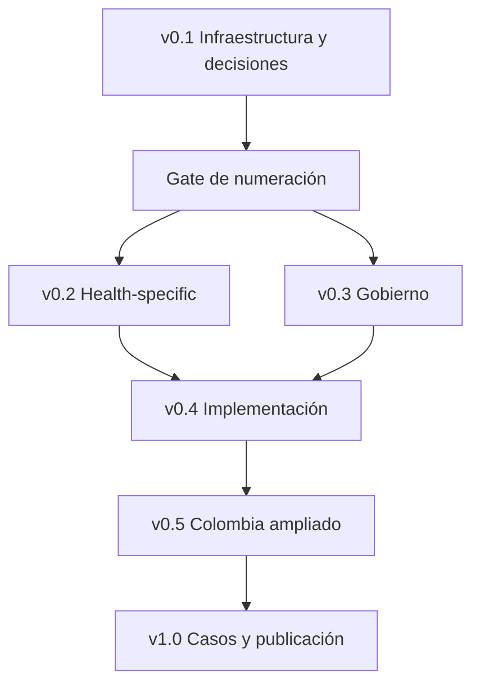

# Roadmap del Health Insurance Reserving Handbook

> Un plan gobernado por dependencias y criterios de calidad, no por acumulación de capítulos.

!!! abstract "Propósito del roadmap"
    Este documento define qué se construirá, en qué orden, bajo qué dependencias y con qué evidencia se considerará terminado. El roadmap no constituye un compromiso de fechas: los plazos requieren conocer capacidad editorial, disponibilidad de revisores, alcance regulatorio y profundidad de las implementaciones.

## 1. Visión

El objetivo es convertir la colección actual de capítulos en una referencia profesional que pueda funcionar simultáneamente como:

- manual actuarial sobre IBNR y reservas en salud;
- texto técnico de nivel avanzado;
- guía reproducible de implementación en Python, R y SQL;
- marco de selección, validación y gobierno de modelos;
- repositorio de datos sintéticos y casos de estudio;
- sitio de documentación navegable y mantenible;
- referencia aplicable tanto a seguros de salud como al contexto colombiano.

La versión 1.0 debe ser más que una suma de documentos. Debe ofrecer una arquitectura coherente de conceptos, notación, código, evidencia, navegación, pruebas y decisiones actuariales.

## 2. Resultados esperados

La hoja de ruta busca alcanzar seis resultados verificables:

1. **Navegabilidad:** el contenido puede localizarse por parte, método, problema y ruta de aprendizaje.
2. **Coherencia técnica:** notación, supuestos, definiciones y resultados no se contradicen entre capítulos.
3. **Reproducibilidad:** los ejemplos numéricos y el código producen resultados conciliables.
4. **Auditabilidad:** las decisiones, fuentes, excepciones, cambios y limitaciones tienen trazabilidad.
5. **Aplicabilidad:** cada método indica cuándo usarlo, cuándo no usarlo y qué información puede cambiar la selección.
6. **Mantenibilidad:** el repositorio puede actualizarse sin romper enlaces, navegación, pruebas o identidad documental.

## 3. Principios de ejecución

El desarrollo seguirá estas reglas:

- completar infraestructura y contenido específico de salud antes de añadir más modelos avanzados;
- preservar benchmarks actuariales para evaluar modelos estadísticos y de machine learning;
- separar metodología, regulación, contabilidad y obligaciones contractuales;
- verificar afirmaciones regulatorias contra fuentes oficiales vigentes;
- usar datos sintéticos salvo que exista autorización, licencia y gobierno explícitos;
- tratar el código no probado como ilustrativo, no como implementación validada;
- evitar renombrar archivos sin un plan de migración de referencias;
- cerrar cada release mediante criterios de salida, no solo mediante conteo de archivos;
- registrar incertidumbres y decisiones abiertas en lugar de ocultarlas.

## 4. Taxonomía de estados

Para evitar que “archivo existente” se confunda con “capítulo terminado”, se utilizarán los siguientes estados:

| Estado | Significado | Puede publicarse como estable |
|---|---|---:|
| `Planned` | Alcance identificado, archivo todavía no creado | No |
| `Draft` | Contenido inicial disponible, sin revisión completa | No |
| `Technical review` | Revisión actuarial, estadística o regulatoria en curso | No |
| `Implementation review` | Código, ejemplos, datos y pruebas en validación | No |
| `Editorial review` | Estructura, lenguaje, enlaces y consistencia en revisión | No |
| `Validated` | Cumple la definición de terminado y las pruebas aplicables | Sí |
| `Published` | Incluido en una release etiquetada y documentada | Sí |
| `Deprecated` | Conservado por trazabilidad, pero reemplazado explícitamente | No como referencia vigente |

El estado `Completed — content` utilizado durante la transferencia equivale a `Draft`: significa que el cuerpo del capítulo existe, no que haya superado todos los controles.

## 5. Estado actual

### 5.1 Resumen

Al 14 de julio de 2026, el proyecto cuenta con:

- 24 capítulos con contenido construido;
- cinco capítulos de fundamentos;
- seis capítulos de métodos clásicos;
- tres capítulos de reserving estocástico;
- tres capítulos de modelos estadísticos;
- dos capítulos de machine learning;
- cinco capítulos sobre Colombia;
- `README.md`, `mkdocs.yml` y [docs/index.md](index.md) producidos para la infraestructura inicial;
- este roadmap como cuarto entregable de infraestructura.

Todavía no se ha verificado, dentro del repositorio completo, que todos los capítulos:

- compilen con `mkdocs build --strict`;
- tengan enlaces válidos;
- ejecuten código reproducible;
- concilien todos sus ejemplos;
- usen una política bibliográfica uniforme;
- cumplan la definición de terminado.

Por tanto, la interpretación prudente es **alta cobertura temática inicial, pero madurez de publicación todavía limitada**.

### 5.2 Infraestructura

| Entregable | Estado | Evidencia disponible | Trabajo restante |
|---|---|---|---|
| `README.md` | Draft | Propósito, inventario, rutas y disclaimer | Integrar, revisar enlaces y actualizar después de renumeraciones |
| `mkdocs.yml` | Draft | Material, búsqueda, MathJax, Mermaid y navegación de 24 capítulos | Añadir páginas nuevas al `nav` y ejecutar build completo |
| `docs/index.md` | Draft | Portada, rutas de aprendizaje y 24 enlaces de capítulos | Añadir al `nav` y validar renderizado |
| `docs/roadmap.md` | Draft | Plan de releases, dependencias y riesgos | Aprobar decisiones de alcance y numeración |
| `docs/methodology-selection-guide.md` | Planned | Alcance definido | Crear árboles de decisión y criterios de evidencia |
| `docs/glossary.md` | Planned | Alcance definido | Consolidar términos y sinónimos controlados |
| `docs/bibliography.md` | Planned | Alcance definido | Establecer bibliografía comentada y política de referencias |
| `LICENSE` | Planned | Propuesta MIT para código y CC BY 4.0 para documentación | Decisión de titularidad y aprobación explícita |
| `CONTRIBUTING.md` | Planned | Reglas preliminares en README | Formalizar workflow, revisiones y criterios de aceptación |
| `CHANGELOG.md` | Planned | Versiones objetivo definidas | Adoptar formato y registrar cambios desde 0.1 |
| `CITATION.cff` | Planned | Citación provisional | Confirmar autoría, URL, licencia y versión |
| `.gitignore` | Planned | Estructura técnica definida | Incluir artefactos de Python, R, MkDocs, notebooks y datos |
| `.editorconfig` | Planned | Convenciones editoriales definidas | Formalizar codificación, finales de línea e indentación |
| `.pre-commit-config.yaml` | Planned | Controles requeridos identificados | Configurar formato, lint y validación de archivos |
| `requirements-docs.txt` | Planned | Dependencias funcionales identificadas | Fijar versiones reproducibles y probar instalación limpia |

## 6. Inventario de capítulos actuales

Todos los capítulos de esta tabla tienen contenido disponible, pero permanecen en estado `Draft` hasta completar QA.

| ID | Parte | Capítulo | Estado | Principal control pendiente |
|---:|---|---|---|---|
| 01 | I | [IBNR and Reserving](part-01-foundations/01-ibnr-and-reserving.md) | Draft | Consistencia de definiciones y referencias |
| 02 | I | [Triangle Construction](part-01-foundations/02-triangle-construction.md) | Draft | Reconciliación SQL/Python/R y controles de fechas |
| 03 | I | [Development Lags and Triangle Transformations](part-01-foundations/03-development-lags-and-triangle-transformations.md) | Draft | Notación APC y efectos calendario |
| 04 | I | [Incremental vs. Cumulative Triangles](part-01-foundations/04-incremental-vs-cumulative-triangles.md) | Draft | Derivaciones matriciales y ejemplos |
| 05 | I | [Age-to-Age Development Factors](part-01-foundations/05-age-to-age-development-factors.md) | Draft | Selección, sensibilidad y factor de cola |
| 06 | II | [Chain Ladder Method](part-02-classical-reserving/06-chain-ladder-method.md) | Draft | Reproducción numérica y supuestos |
| 07 | II | [Chain Ladder Diagnostics](part-02-classical-reserving/07-chain-ladder-diagnostics.md) | Draft | Cobertura de diagnósticos y criterios de decisión |
| 08 | III | [Mack Chain Ladder](part-03-stochastic-reserving/08-mack-chain-ladder.md) | Draft | MSEP, recursiones y pruebas numéricas |
| 09 | III | [Bootstrap Chain Ladder](part-03-stochastic-reserving/09-bootstrap-chain-ladder.md) | Draft | Residuos, proceso, semillas y calibración |
| 10 | III | [Comparing Mack vs. Bootstrap](part-03-stochastic-reserving/10-comparing-mack-vs-bootstrap.md) | Draft | Comparabilidad de supuestos y outputs |
| 11 | II | [Bornhuetter-Ferguson](part-02-classical-reserving/11-bornhuetter-ferguson.md) | Draft | Definición del prior y sensibilidad |
| 12 | II | [Benktander Method](part-02-classical-reserving/12-benktander-method.md) | Draft | Forma cerrada, iteración y convergencia |
| 13 | II | [Cape Cod Method](part-02-classical-reserving/13-cape-cod-method.md) | Draft | Exposición, ELR implícito y segmentación |
| 14 | II | [Classical Reserving Methods Comparison](part-02-classical-reserving/14-classical-reserving-methods-comparison.md) | Draft | Matriz de selección y coherencia transversal |
| 15 | IV | [GLM for Loss Reserving](part-04-statistical-models/15-glm-for-loss-reserving.md) | Draft | Distribuciones, IRLS, residuos y código |
| 16 | IV | [GAM for Loss Reserving](part-04-statistical-models/16-gam-for-loss-reserving.md) | Draft | Penalización, suavización y concurvity |
| 17 | IV | [Bayesian Loss Reserving](part-04-statistical-models/17-bayesian-loss-reserving.md) | Draft | Priors, convergencia y posterior predictivo |
| 18 | V | [Machine Learning for Loss Reserving](part-05-machine-learning/18-machine-learning-for-loss-reserving.md) | Draft | Leakage, benchmark y validación temporal |
| 19 | V | [Tree-Based Models for Loss Reserving](part-05-machine-learning/19-tree-based-models-for-loss-reserving.md) | Draft | Tuning, SHAP, estabilidad y monitoreo |
| 21 | VII | [Colombia Health Reserving Methodologies](part-07-colombia/29-colombia-health-reserving-methodologies.md) | Draft | Vigencia regulatoria y segmentación institucional |
| 22 | VII | [Colombia Paid vs. Incurred Triangles](part-07-colombia/30-colombia-paid-vs-incurred-triangles.md) | Draft | Definiciones operativas y reconciliación |
| 23 | VII | [Colombia Data and Multistate Models](part-07-colombia/31-colombia-data-and-multistate-models.md) | Draft | Modelo de datos, estados y código |
| 24 | VII | [Colombia Glosas and Disputes](part-07-colombia/32-colombia-glosas-and-disputes.md) | Draft | Fuentes regulatorias, eventos y pisos |
| 25 | VII | [Colombia Capitation and Prospective Payments](part-07-colombia/33-colombia-capitation-and-prospective-payments.md) | Draft | Contratos, devengo y pagos prospectivos |

## 7. Decisión de arquitectura: numeración

### 7.1 Problema

La numeración actual es única, pero no es secuencial por parte:

- los capítulos 08–10 están en la parte III;
- los capítulos 11–14 están en la parte II;
- los capítulos Colombia usan 21–25;
- el bloque health-specific necesita reservar 20–27.

El conflicto inmediato no está en la navegación, que puede ordenar archivos independientemente del número. El conflicto aparece al intentar crear los capítulos health-specific 21–25, porque esos identificadores ya existen en Colombia.

### 7.2 Alternativas

| Alternativa | Cambio requerido | Ventaja | Costo y riesgo |
|---|---:|---|---|
| A. Renumeración global completa | Renombrar métodos 08–14 y Colombia 21–25 | Secuencia totalmente limpia por parte | Mayor superficie de cambio; enlaces, historial y referencias afectadas |
| B. Migración mínima de Colombia | Renombrar solo Colombia 21–25 a 28–32 | Libera 21–25 y preserva la identidad de métodos existentes | Mantiene la secuencia irregular entre partes II y III |
| C. Prefijos por parte | Renombrar todos los capítulos | Escala sin colisiones futuras | Máximo costo de migración y pérdida de URLs estables |
| D. Mantener todo | Ningún cambio inmediato | Cero costo hoy | Bloquea el desarrollo health-specific y traslada el problema al futuro |

### 7.3 Recomendación provisional

Adoptar la **alternativa B — migración mínima de Colombia** antes de crear los capítulos health-specific 21–27.

Esta opción es potencialmente superior porque resuelve la colisión real con cinco renombramientos, conserva los identificadores de los métodos 01–19 y permite que la navegación organice las partes II y III sin una migración adicional de siete archivos.

El mejor contraargumento es que una secuencia irregular reduce la elegancia editorial y puede confundir a lectores que esperan orden numérico. Esa desventaja debe compararse con el riesgo operativo de romper referencias y URLs. Si pruebas de navegación muestran confusión material antes de 1.0, la renumeración global completa seguirá disponible como migración controlada.

!!! warning "Punto de control obligatorio"
    No crear `21-completion-factors-and-runout-curves.md` ni capítulos health-specific posteriores hasta aprobar una decisión de numeración, ejecutar la migración seleccionada y validar todos los enlaces. El capítulo 20 puede crearse sin colisión.

### 7.4 Mapa de migración recomendado para Colombia

| Ruta actual | Ruta objetivo |
|---|---|
| `29-colombia-health-reserving-methodologies.md` | `28-colombia-health-reserving-methodologies.md` |
| `30-colombia-paid-vs-incurred-triangles.md` | `29-colombia-paid-vs-incurred-triangles.md` |
| `31-colombia-data-and-multistate-models.md` | `30-colombia-data-and-multistate-models.md` |
| `32-colombia-glosas-and-disputes.md` | `31-colombia-glosas-and-disputes.md` |
| `33-colombia-capitation-and-prospective-payments.md` | `32-colombia-capitation-and-prospective-payments.md` |

La migración debe realizarse con `git mv`, actualización automatizada de enlaces, búsqueda global de rutas antiguas y build estricto. No debe ejecutarse como cinco cambios manuales independientes.

## 8. Arquitectura objetivo de capítulos

La siguiente estructura asume que se aprueba la migración mínima recomendada.

### Parte VI — Health-specific: 21–28

| ID | Archivo objetivo | Estado | Dependencia principal |
|---:|---|---|---|
| 20 | `21-health-insurance-reserving-specificities.md` | Next | Fundamentos 01–07 |
| 21 | `21-completion-factors-and-runout-curves.md` | Planned | Capítulo 20 y migración Colombia |
| 22 | `22-pmpm-exposure-and-membership.md` | Planned | Capítulo 20 y modelo de exposición |
| 23 | `23-medical-trend.md` | Planned | PMPM, calendario y GLM |
| 24 | `24-seasonality-and-calendar-effects.md` | Planned | Triángulos, APC, GLM/GAM |
| 25 | `25-large-claims-and-high-cost-claimants.md` | Planned | Segmentación y frecuencia-severidad |
| 26 | `26-frequency-severity-reserving.md` | Planned | GLM y exposición |
| 27 | `27-survival-models-for-claim-development.md` | Planned | Datos granulares y tiempos de evento |

### Parte VII — Colombia: 29–40

| ID | Archivo objetivo | Origen | Estado |
|---:|---|---|---|
| 28 | `28-colombia-health-reserving-methodologies.md` | Renombrar 21 | Draft after migration |
| 29 | `29-colombia-paid-vs-incurred-triangles.md` | Renombrar 22 | Draft after migration |
| 30 | `30-colombia-data-and-multistate-models.md` | Renombrar 23 | Draft after migration |
| 31 | `31-colombia-glosas-and-disputes.md` | Renombrar 24 | Draft after migration |
| 32 | `32-colombia-capitation-and-prospective-payments.md` | Renombrar 25 | Draft after migration |
| 33 | `33-colombia-high-cost-and-complex-cases.md` | Nuevo | Planned |
| 34 | `34-colombia-incapacity-reserving.md` | Nuevo | Planned |
| 35 | `35-colombia-direct-payments-and-adres.md` | Nuevo | Planned |
| 36 | `36-colombia-ips-revenue-and-receivables.md` | Nuevo | Planned |
| 37 | `37-colombia-prepaid-medicine-reserving.md` | Nuevo | Planned |
| 38 | `38-colombia-regulatory-crosswalk.md` | Nuevo | Planned |
| 39 | `39-colombia-end-to-end-case-study.md` | Nuevo | Planned |

### Parte VIII — Governance: 40–46

| ID | Archivo objetivo | Estado |
|---:|---|---|
| 40 | `40-asop-5-incurred-health-and-disability-claims.md` | Planned |
| 41 | `41-asop-23-data-quality.md` | Planned |
| 42 | `42-asop-41-actuarial-communications.md` | Planned |
| 43 | `43-asop-56-modeling.md` | Planned |
| 44 | `44-model-governance-and-validation.md` | Planned |
| 45 | `45-actuarial-documentation-and-peer-review.md` | Planned |
| 46 | `46-regulatory-and-accounting-crosswalk.md` | Planned |

Las versiones, fechas de vigencia y aplicabilidad de los estándares deben verificarse al redactar cada capítulo. La presencia de un PDF en las fuentes del proyecto no prueba que sea la versión vigente ni que aplique a todas las jurisdicciones.

### Parte IX — Implementation: 47–50

| ID | Archivo objetivo | Estado |
|---:|---|---|
| 47 | `47-sql-for-triangle-construction.md` | Planned |
| 48 | `48-python-reserving-implementation.md` | Planned |
| 49 | `49-r-reserving-implementation.md` | Planned |
| 50 | `50-reproducible-reserving-pipelines.md` | Planned |

### Parte X — Case studies: 51–57

| ID | Archivo objetivo | Estado |
|---:|---|---|
| 51 | `51-case-study-chain-ladder.md` | Planned |
| 52 | `52-case-study-stochastic-reserving.md` | Planned |
| 53 | `53-case-study-credibility-reserving.md` | Planned |
| 54 | `54-case-study-health-completion-factors.md` | Planned |
| 55 | `55-case-study-colombia-eps.md` | Planned |
| 56 | `56-case-study-colombia-glosas.md` | Planned |
| 57 | `57-end-to-end-health-reserving.md` | Planned |

Para evitar duplicaciones, el capítulo 38 se limitará al crosswalk regulatorio colombiano, mientras que el 46 tratará el marco general entre regulación, contabilidad y práctica actuarial. El capítulo 39 será una síntesis jurisdiccional de Colombia; los capítulos 55 y 56 desarrollarán casos computacionales focalizados, y el 57 integrará el proceso general de reserving de salud de extremo a extremo.

## 9. Prioridades

| Prioridad | Trabajo | Razón |
|---|---|---|
| P0 | Completar infraestructura 0.1 y ejecutar build estricto | Sin una base navegable no puede validarse el resto |
| P0 | Aprobar estrategia de numeración | Evita colisiones y retrabajo de enlaces |
| P1 | Crear guía de selección, glosario y bibliografía | Reduce inconsistencia antes de ampliar contenido |
| P1 | Crear capítulo 20 | Establece el puente entre modelos generales y salud |
| P1 | Completar Parte VI | Cierra la principal brecha conceptual del handbook |
| P2 | Construir governance y ASOP | Define controles antes de industrializar código |
| P2 | Validar y actualizar Colombia existente | Reduce riesgo regulatorio y conceptual |
| P3 | Separar implementaciones y crear tests | Convierte ejemplos en activos reproducibles |
| P3 | Ampliar Colombia 33–39 | Profundiza aplicaciones institucionales específicas |
| P4 | Construir casos end-to-end | Integra métodos, código, datos y juicio actuarial |
| P4 | Publicar versión 1.0 y artefactos derivados | Solo después de cerrar QA, licencias y citación |

## 10. Releases

### 10.1 Versión 0.1 — Repositorio navegable

**Objetivo:** convertir los documentos existentes en un sistema documental verificable.

**Entregables:**

- README, portada, roadmap y navegación MkDocs;
- methodology selection guide, glosario y bibliografía central;
- LICENSE, CONTRIBUTING, CHANGELOG y CITATION;
- archivos de entorno editorial y dependencias;
- decisión documentada sobre numeración;
- build local reproducible;
- comprobación de enlaces y estructura.

**Criterios de salida:**

- `mkdocs build --strict` finaliza sin errores;
- todas las páginas existentes están incluidas o excluidas de navegación de forma deliberada;
- no hay enlaces internos rotos;
- las dependencias se instalan desde un entorno limpio;
- la política de licencias está aprobada;
- existe una decisión de numeración y un plan de migración;
- los 24 capítulos tienen front matter y estado explícito.

### 10.2 Versión 0.2 — Health-specific

**Objetivo:** adaptar el reserving general a la economía y operación de reclamos de salud.

**Entregables:**

- capítulos 20–27;
- ejemplos sintéticos de completion factors, PMPM, tendencia y estacionalidad;
- tratamiento de farmacia, dental, visión, salud mental y coordinación de beneficios;
- reclamos de alto costo, frecuencia-severidad y supervivencia;
- migración de numeración necesaria para liberar 21–25;
- referencias cruzadas actualizadas.

**Criterios de salida:**

- cada capítulo identifica diferencias entre salud y P&C;
- exposición y fechas de servicio, presentación, adjudicación y pago están definidas de forma consistente;
- los ejemplos distinguen costo médico, obligación contractual y base contable;
- los modelos avanzados incluyen benchmark y validación;
- la migración de rutas no deja referencias antiguas.

### 10.3 Versión 0.3 — Gobierno y estándares profesionales

**Objetivo:** establecer los requisitos de datos, modelación, comunicación, documentación y revisión.

**Entregables:**

- capítulos 40–46;
- crosswalk entre riesgos, controles y evidencia;
- plantillas de validación, revisión independiente y comunicación;
- política de desviaciones, excepciones y control de versiones;
- fecha de verificación y alcance explícito para fuentes normativas.

**Criterios de salida:**

- las referencias profesionales se verifican contra fuentes primarias;
- cada requerimiento distingue obligación, recomendación y buena práctica;
- las desviaciones y limitaciones tienen disclosures definidos;
- existe un audit trail reproducible por modelo y valoración.

### 10.4 Versión 0.4 — Implementación reproducible

**Objetivo:** transformar ejemplos embebidos en componentes probados y reutilizables.

**Entregables:**

- capítulos 47–50;
- paquetes o módulos organizados en Python y R;
- consultas SQL reproducibles;
- schemas y datos sintéticos versionados;
- notebooks de referencia;
- pruebas unitarias, de integración y reconciliación;
- pipeline de CI para documentación y código.

**Criterios de salida:**

- instalación reproducible desde entorno limpio;
- semillas y configuración controladas;
- pruebas cubren fórmulas críticas, bordes y errores esperados;
- Python, R y SQL concilian para ejemplos equivalentes;
- outputs tienen schemas y unidades documentadas;
- los notebooks no contienen estado oculto necesario para reproducir resultados.

### 10.5 Versión 0.5 — Colombia ampliado

**Objetivo:** consolidar el bloque Colombia con alcance institucional y regulatorio explícito.

**Entregables:**

- capítulos 28–39 bajo numeración estabilizada;
- actualización técnica de los cinco capítulos existentes;
- alto costo, incapacidades, ADRES, IPS y medicina prepagada;
- crosswalk regulatorio con fecha de corte;
- caso integral Colombia con datos sintéticos.

**Criterios de salida:**

- EPS, IPS, medicina prepagada, ARL y aseguradoras no se tratan como equivalentes;
- cada afirmación regulatoria tiene fuente oficial y fecha de verificación;
- se distinguen reservas, provisiones, cuentas por pagar y cuentas por cobrar;
- los ejemplos separan flujo financiero, costo médico y obligación contractual;
- los cambios regulatorios posteriores a la fecha de corte están identificados como riesgo de mantenimiento.

### 10.6 Versión 1.0 — Handbook estable

**Objetivo:** publicar una referencia profesional integrada y citable.

**Entregables:**

- capítulos 51–57 y caso end-to-end;
- revisión transversal de todos los capítulos;
- código, datos y pruebas validados;
- sitio publicado y versionado;
- licencia, citación y changelog definitivos;
- mecanismo de mantenimiento regulatorio y bibliográfico;
- política de deprecación y compatibilidad de enlaces.

**Criterios de salida:**

- todos los capítulos publicados están en estado `Validated`;
- no existen issues críticos abiertos de exactitud, reproducibilidad o licencia;
- el sitio compila y despliega desde CI;
- los casos end-to-end reproducen los resultados documentados;
- una revisión independiente evalúa coherencia actuarial, estadística y regulatoria;
- existe un plan de mantenimiento posterior a 1.0.

## 11. Dependencias



### 11.1 Dependencias críticas

| Entregable | Depende de | Bloquea |
|---|---|---|
| `mkdocs.yml` definitivo | Índice completo de archivos | Build, publicación y link checking |
| Guía de selección | Capítulos 01–19 y taxonomía común | Comparaciones y rutas de decisión |
| Glosario | Terminología de capítulos existentes | Consistencia editorial y traducción |
| Bibliografía central | Política de referencias y fuentes | Revisión técnica y normativa |
| Capítulo 20 | Fundamentos 01–07 | Resto de Parte VI |
| Gate de numeración | Decisión del propietario y búsqueda de enlaces | Capítulos 21–27 y expansión Colombia |
| Governance | Fuentes profesionales verificadas | Implementación industrial y 1.0 |
| Implementación | Métodos estabilizados y datos sintéticos | Casos end-to-end |
| Colombia ampliado | Numeración, fuentes oficiales y modelo de datos | Caso Colombia y release 1.0 |
| Case studies | Código probado, schemas y capítulos base | Publicación 1.0 |

## 12. Definición de terminado por capítulo

Un capítulo alcanza estado `Validated` solamente cuando cumple todos los criterios aplicables.

### 12.1 Identidad y estructura

- [ ] Nombre y ruta cumplen la convención del repositorio.
- [ ] Front matter completo, válido y actualizado.
- [ ] Objetivos, prerrequisitos y capítulos relacionados identificados.
- [ ] Títulos, orden y terminología siguen la plantilla editorial.

### 12.2 Rigor técnico

- [ ] Definiciones y notación son consistentes con el glosario.
- [ ] Supuestos explícitos y vinculados con su interpretación económica.
- [ ] Derivaciones verificadas y unidades dimensionalmente coherentes.
- [ ] Ejemplo numérico completo y conciliable.
- [ ] Se explica qué evidencia apoya el método y dónde es insuficiente.
- [ ] Se presenta el mejor contraargumento o situación de falla relevante.
- [ ] Se identifica qué información cambiaría la recomendación.

### 12.3 Implementación

- [ ] Código reproducible, con versiones y semillas cuando corresponda.
- [ ] Python incluye type hints, docstrings y manejo de errores.
- [ ] R usa funciones reproducibles y evita estado implícito.
- [ ] SQL declara dialecto, claves, granularidad y validaciones.
- [ ] Pruebas cubren cálculos críticos y casos límite.
- [ ] Resultados de lenguajes alternativos concilian dentro de tolerancias definidas.

### 12.4 Validación y gobierno

- [ ] Diagnósticos y sensibilidad suficientes para los supuestos.
- [ ] Limitaciones y riesgos de primer y segundo orden documentados.
- [ ] Benchmark actuarial incluido para modelos avanzados.
- [ ] Backtesting o validación temporal cuando sea aplicable.
- [ ] Fuentes primarias verificadas para estándares y regulación.
- [ ] Fecha de vigencia o verificación incluida cuando corresponda.
- [ ] Revisión independiente registrada.

### 12.5 Calidad editorial y publicación

- [ ] Bibliografía comentada y citas completas.
- [ ] Enlaces relativos válidos y sin destinos obsoletos.
- [ ] Tablas, ecuaciones, Mermaid y código renderizan correctamente.
- [ ] `mkdocs build --strict` finaliza sin errores.
- [ ] Checklist práctico y conclusión incluidos.
- [ ] No existen placeholders, referencias huérfanas ni contenido duplicado.

## 13. Definición de terminado por release

Una release puede etiquetarse solamente cuando:

- todos sus entregables obligatorios alcanzan el estado requerido;
- se ejecutan pruebas y build desde un entorno limpio;
- el changelog describe adiciones, cambios, deprecaciones y migraciones;
- las decisiones abiertas de alto impacto están resueltas o documentadas como exclusiones;
- no existen defectos críticos conocidos;
- licencias y fuentes permiten publicar los artefactos incluidos;
- la versión puede reproducirse desde el commit etiquetado.

## 14. Registro de riesgos

| Riesgo | Probabilidad | Impacto | Efecto de segundo orden | Mitigación | Señal de activación |
|---|---|---|---|---|---|
| Scope creep | Alta | Alta | Ningún bloque alcanza madurez estable | Releases, prioridades y criterios de salida | Aumento del backlog sin cerrar QA |
| Colisión o renumeración tardía | Alta | Alta | Enlaces rotos y pérdida de trazabilidad | Gate de numeración y migración automatizada | Creación de un ID ya utilizado |
| Regulación desactualizada | Alta | Alta | Recomendaciones incorrectas o reputacionalmente riesgosas | Fuentes oficiales, fecha de corte y revisión periódica | Norma modificada o fuente retirada |
| Código ilustrativo tratado como producción | Alta | Alta | Decisiones basadas en resultados no validados | Etiquetas de madurez, tests y separación de módulos | Uso externo sin pasar implementación review |
| Dependencia de fuentes secundarias | Media | Alta | Propagación de interpretaciones erróneas | Priorizar estándares, normas y literatura primaria | Afirmación crítica sin fuente primaria |
| Inconsistencia entre capítulos | Alta | Media | El lector aplica definiciones incompatibles | Glosario, bibliografía y revisión transversal | Misma variable con dos definiciones |
| Complejidad metodológica innecesaria | Media | Alta | Falsa precisión y menor auditabilidad | Benchmarks, validación temporal y parsimonia | Modelo avanzado sin mejora material |
| Datos sintéticos poco representativos | Media | Media | Ejemplos enseñan comportamientos irreales | Generadores documentados y escenarios adversos | Resultados excesivamente limpios o estables |
| Licencias no resueltas | Media | Alta | Imposibilidad de redistribuir código o documentación | Decidir titularidad y licencias en 0.1 | Publicación pública sin LICENSE |
| Dependencias no fijadas | Media | Media | Builds no reproducibles | Archivos de requisitos y pruebas limpias | Resultado cambia tras actualización |
| Capacidad de mantenimiento insuficiente | Alta | Media | Regulación y bibliografía envejecen después de 1.0 | Alcance de mantenimiento y calendario de revisión | Capítulos críticos sin propietario |
| Estrategia bilingüe indefinida | Media | Media | Duplicación y divergencia de contenidos | Definir idioma canónico antes de traducir | Dos versiones con conclusiones distintas |

## 15. Decisiones pendientes

| ID | Decisión | Impacto | Momento límite |
|---|---|---|---|
| D-01 | Estrategia definitiva de numeración | URLs, navegación y nuevos capítulos | Antes del capítulo 21 health-specific |
| D-02 | Licencia del código | Redistribución y contribuciones | Antes de publicar 0.1 |
| D-03 | Licencia de documentación | Reutilización y citación | Antes de publicar 0.1 |
| D-04 | URL y propietario del repositorio | MkDocs, CITATION y enlaces | Antes del primer deploy |
| D-05 | Idioma canónico y estrategia bilingüe | Edición, traducción y mantenimiento | Antes de ampliar 0.2 |
| D-06 | Política bibliográfica | Citas y revisión técnica | Antes de `bibliography.md` |
| D-07 | Profundidad del código | Arquitectura y esfuerzo de pruebas | Antes de 0.4 |
| D-08 | MkDocs, Quarto o ambos | Pipeline y formatos de publicación | Antes de generar PDF o libro |
| D-09 | Política de actualización regulatoria | Vigencia del bloque Colombia | Antes de 0.5 |
| D-10 | Responsables de revisión | Independencia y criterios de aprobación | Antes de marcar capítulos `Validated` |

## 16. Información que puede cambiar el roadmap

La secuencia o el alcance deben revisarse si aparece nueva información sobre:

- diferencias entre el inventario y los archivos reales del repositorio;
- errores materiales en capítulos ya construidos;
- cambios regulatorios o profesionales relevantes;
- disponibilidad de datos reales autorizados para validación;
- audiencia prioritaria: formación, práctica actuarial, regulación o software;
- capacidad de revisión por actuarios, estadísticos y especialistas regulatorios;
- decisión de publicar libro, PDF, curso o paquete de software;
- evidencia de que la numeración irregular perjudica materialmente la navegación;
- restricciones de licencia en código, estándares o fuentes.

Una nueva metodología no debe desplazar las prioridades actuales salvo que resuelva una brecha crítica no cubierta por los métodos existentes.

## 17. Orden recomendado de desarrollo

### Fase inmediata

1. Integrar y revisar `README.md`, `mkdocs.yml`, [index.md](index.md) y este roadmap.
2. Crear `methodology-selection-guide.md`.
3. Crear `glossary.md`.
4. Crear `bibliography.md` y definir política de referencias.
5. Completar archivos raíz y dependencias de documentación.
6. Actualizar `nav` y ejecutar `mkdocs build --strict`.
7. Registrar y aprobar la decisión de numeración.

### Primer bloque de contenido nuevo

8. Crear `part-06-health-specific/21-health-insurance-reserving-specificities.md`.
9. Ejecutar la migración de Colombia si se aprueba la alternativa recomendada.
10. Crear capítulos health-specific 21–27 en orden conceptual.
11. Revisar transversalmente los capítulos 01–20 contra el glosario y la guía de selección.

### Gobierno e implementación

12. Crear capítulos 40–46 usando fuentes profesionales verificadas.
13. Definir schemas, datos sintéticos y contratos de outputs.
14. Crear implementaciones 47–50 y pruebas automatizadas.
15. Extraer código duplicado desde capítulos hacia módulos reutilizables.

### Colombia y casos integrales

16. Actualizar y validar los capítulos Colombia migrados 28–32.
17. Crear los capítulos Colombia 33–39.
18. Crear casos de estudio 51–57 con el mismo dataset sintético cuando sea razonable.
19. Ejecutar revisión independiente y cerrar defectos críticos.
20. Publicar versión 1.0, citación, licencias y plan de mantenimiento.

## 18. Próximo checkpoint

El siguiente checkpoint se alcanza cuando:

- este roadmap ha sido revisado;
- la taxonomía de estados ha sido aceptada;
- la alternativa de numeración ha sido seleccionada o programada como decisión formal;
- `methodology-selection-guide.md`, `glossary.md` y `bibliography.md` tienen alcance confirmado;
- `mkdocs.yml` incluye `index.md` y `roadmap.md` sin referencias rotas.

El próximo archivo recomendado es:

```text
docs/methodology-selection-guide.md
```

---

**Estado:** Draft  
**Versión del roadmap:** 1.0  
**Fecha de corte:** 2026-07-14
