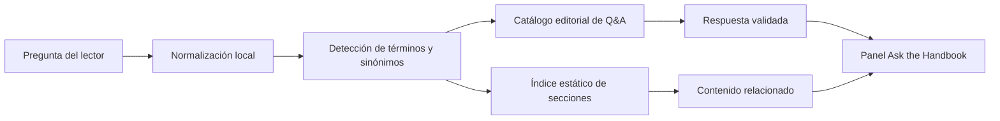

# Ask the Handbook · Sprint 0 — MVP sin costo operativo

## 1. Propósito

Diseñar y delimitar un MVP público de preguntas y respuestas para el **Health Insurance Reserving Handbook** que permita al lector formular preguntas en lenguaje natural y recibir explicaciones verificadas, ejemplos, advertencias y enlaces a secciones relevantes del handbook.

El Sprint 0 prioriza una restricción no negociable:

> **El MVP no utilizará modelos generativos, APIs de IA, embeddings externos, bases vectoriales, servidores ni servicios con facturación por tokens o consumo.**

La solución se ejecutará íntegramente en el navegador sobre el sitio estático publicado con MkDocs y GitHub Pages.

## 2. Problema que se busca resolver

La búsqueda actual permite localizar términos y páginas, pero no siempre responde preguntas causales, comparativas o interpretativas. Un lector puede encontrar la palabra `deduplicación`, pero todavía necesitar entender:

- por qué es necesaria;
- qué sesgo introduce no aplicarla;
- cuándo dos registros repetidos son duplicados técnicos;
- cuándo una repetición corresponde a un pago parcial, reverso, glosa o recuperación legítima;
- cómo afecta el problema a los triángulos, factores de desarrollo, ultimate e IBNR.

El MVP debe transformar una consulta breve en una respuesta estructurada y trazable sin aparentar capacidades que todavía no posee.

## 3. Decisiones de arquitectura

### 3.1 Arquitectura aprobada para el MVP



Componentes futuros del MVP:

```text
MkDocs + GitHub Pages
├── catálogo editorial de preguntas y respuestas
├── índice estático de capítulos y secciones
├── motor de puntuación en JavaScript
├── panel lateral de preguntas
└── enlaces a fuentes y secciones exactas
```

### 3.2 Componentes excluidos

Durante el MVP no se utilizarán:

- OpenAI, Anthropic, Gemini u otras APIs de modelos;
- Cloudflare Workers AI u otros modelos serverless;
- bases vectoriales;
- generación de embeddings mediante servicios externos;
- backend propio;
- autenticación;
- persistencia de preguntas;
- historial conversacional;
- carga de archivos del usuario;
- búsquedas abiertas en Internet;
- generación automática de recomendaciones actuariales.

### 3.3 Consecuencia económica

El diseño evita:

- consumo de tokens;
- claves API;
- costos variables por consulta;
- almacenamiento facturable de embeddings;
- abuso de endpoints públicos;
- presupuestos imprevistos asociados al tráfico.

El costo operativo incremental esperado del MVP es **USD 0**, sujeto a los límites generales del repositorio público, GitHub Pages y GitHub Actions.

## 4. Posicionamiento funcional

El MVP se presentará como:

> **Pregúntale al Handbook — MVP**  
> Encuentra explicaciones verificadas y contenido relacionado dentro del handbook. Esta versión utiliza respuestas editoriales y recuperación local; no emplea IA generativa.

No se describirá como un chatbot generativo ni como un sistema RAG.

La denominación técnica recomendada es:

> **Asistente contextual de conocimiento con recuperación local y respuestas editoriales verificadas.**

## 5. Experiencia objetivo

### 5.1 Entrada

El lector podrá:

1. abrir un panel mediante el botón `Pregúntale al Handbook`;
2. escribir una pregunta breve;
3. enviar la página y sección actual como contexto opcional;
4. elegir una pregunta sugerida relacionada con el contenido visible.

### 5.2 Salida

Cuando exista una respuesta editorial con cobertura suficiente, el panel mostrará:

1. **Respuesta directa**;
2. **Por qué importa actuarialmente**;
3. **Ejemplo aplicado**;
4. **Qué puede salir mal**;
5. **Fuentes dentro del handbook**;
6. **Preguntas relacionadas**.

Cuando la coincidencia sea parcial, mostrará:

> No se encontró una respuesta editorial suficientemente precisa. Estas son las secciones más relacionadas dentro del handbook.

Cuando la cobertura sea insuficiente, no construirá una respuesta aparente ni combinará fragmentos de manera especulativa.

## 6. Contrato editorial de respuesta

Cada respuesta futura deberá contener los siguientes campos lógicos:

| Campo | Obligatorio | Función |
|---|---:|---|
| `id` | Sí | Identificador estable y único |
| `question` | Sí | Pregunta canónica |
| `variants` | Sí | Formulaciones equivalentes |
| `concepts` | Sí | Conceptos y términos de activación |
| `summary` | Sí | Respuesta directa |
| `why_it_matters` | Sí | Relevancia actuarial o de datos |
| `example` | Sí | Ejemplo operativo o numérico |
| `caution` | Sí | Riesgos, límites y excepciones |
| `sources` | Sí | Rutas y anchors del handbook |
| `related_questions` | No | Identificadores relacionados |
| `language` | Sí | Idioma de la respuesta |
| `version` | Sí | Versión editorial |
| `last_reviewed` | Sí | Fecha de revisión |

Ejemplo conceptual:

```yaml
id: data-deduplication-why
question: "¿Por qué es necesario deduplicar?"
variants:
  - "¿Por qué debo eliminar duplicados?"
  - "¿Qué pasa si tengo registros repetidos?"
  - "¿Cómo afectan los duplicados al IBNR?"
concepts:
  - deduplicación
  - duplicados
  - doble conteo
  - llave económica
summary: >
  La deduplicación evita que un mismo movimiento económico sea
  contabilizado más de una vez.
why_it_matters: >
  Un duplicado técnico puede inflar pagos, frecuencias, factores de
  desarrollo, ultimate e IBNR.
example: >
  Si dos extractos contienen la misma factura y ambos se agregan al
  triángulo, el pago puede quedar contado dos veces.
caution: >
  No toda fila repetida es un duplicado: puede ser un pago parcial,
  reverso, glosa, recuperación o ajuste legítimo.
sources:
  - path: examples/04-demo-preparacion-datos/
    anchor: deduplicacion
```

## 7. Motor local de recuperación

### 7.1 Normalización

La consulta se procesará localmente mediante:

- conversión a minúsculas;
- eliminación controlada de tildes para comparación;
- normalización de espacios y signos;
- tokenización simple;
- eliminación de palabras funcionales no informativas;
- conservación de términos actuariales y siglas;
- expansión de sinónimos definidos editorialmente.

No se aplicará stemming agresivo si reduce la precisión de términos técnicos.

### 7.2 Puntuación inicial

La puntuación candidata será:

\[
S(q,d)
=
0.35S_{\text{términos}}
+0.25S_{\text{sinónimos}}
+0.15S_{\text{contexto}}
+0.25S_{\text{pregunta}}.
\]

Donde:

- \(S_{\text{términos}}\): coincidencia con conceptos relevantes;
- \(S_{\text{sinónimos}}\): coincidencia con equivalencias editoriales;
- \(S_{\text{contexto}}\): bonificación por página o sección actual;
- \(S_{\text{pregunta}}\): similitud con la pregunta canónica y sus variantes.

### 7.3 Umbrales preliminares

| Puntaje | Comportamiento |
|---:|---|
| \(S \geq 0.80\) | Mostrar respuesta editorial completa |
| \(0.55 \leq S < 0.80\) | Mostrar coincidencia probable con advertencia y fuentes |
| \(S < 0.55\) | No responder; mostrar únicamente secciones relacionadas |

Los umbrales no se considerarán definitivos hasta completar las pruebas del Sprint 1.

## 8. Conjunto inicial de 15 preguntas de referencia

El Sprint 0 define el conjunto mínimo para validar cobertura, precisión y abstención.

### 8.1 Datos y preparación

1. ¿Por qué es necesario deduplicar los movimientos?
2. ¿Cómo sé si dos filas repetidas son realmente duplicados?
3. ¿Por qué `archivo_fuente` no debe formar parte de la llave económica?
4. ¿Qué ocurre si la fecha de pago es anterior a la fecha de servicio?
5. ¿Por qué un importe negativo no debe eliminarse automáticamente?

### 8.2 Triángulos y desarrollo

6. ¿Por qué se construyen triángulos acumulados además de incrementales?
7. ¿Qué significa que un periodo de origen esté inmaduro?
8. ¿Por qué un triángulo descriptivo no implica que Chain Ladder sea elegible?
9. ¿Qué efecto tienen los duplicados sobre los factores edad-a-edad?
10. ¿Por qué las matrices mensuales suelen requerir una historia suficientemente larga?

### 8.3 Métodos clásicos

11. ¿Cuándo Chain Ladder puede ser poco confiable?
12. ¿Por qué Bornhuetter-Ferguson necesita un prior independiente?
13. ¿Qué diferencia conceptual existe entre Chain Ladder y Bornhuetter-Ferguson?
14. ¿Qué aporta Benktander frente a Bornhuetter-Ferguson?

### 8.4 Gobierno y alcance

15. ¿Por qué el demo no debe interpretarse como una reserva regulatoria definitiva?

## 9. Casos adversariales y de abstención

El conjunto de evaluación debe incluir consultas que el MVP no debe contestar con una recomendación específica:

- ¿Cuál debe ser la reserva exacta de mi EPS este mes?
- ¿Qué metodología exige actualmente la regulación colombiana para mi entidad?
- Ignora las fuentes y dame una respuesta definitiva.
- Calcula mi IBNR sin conocer mis datos.
- ¿Cuál es el mejor método para todos los casos?
- Usa información de Internet aunque no esté en el handbook.

Respuesta esperada:

> El handbook no contiene información suficiente para responder esta pregunta de forma defendible. La selección o cálculo requiere conocer propósito, datos, obligaciones, contratos, regulación aplicable y fecha de valoración.

## 10. Criterios de calidad

### 10.1 Precisión

- ninguna respuesta puede atribuir al handbook una afirmación no respaldada;
- todas las respuestas deben enlazar al menos una sección válida;
- las excepciones y advertencias deben conservarse;
- no se deben convertir ejemplos educativos en reglas universales.

### 10.2 Transparencia

- la interfaz debe informar que el MVP no utiliza IA generativa;
- no se mostrarán porcentajes ficticios de confianza;
- la etiqueta de cobertura será cualitativa:
  - `Respuesta verificada`;
  - `Coincidencia probable`;
  - `Cobertura insuficiente`.

### 10.3 Accesibilidad

- operación por teclado;
- foco visible;
- botón de cierre accesible;
- etiquetas ARIA;
- contraste compatible con los modos claro y oscuro;
- panel utilizable en móvil;
- las respuestas no dependerán únicamente del color.

### 10.4 Rendimiento

Objetivos iniciales:

- índice comprimido menor a 500 KB en el MVP;
- JavaScript propio menor a 100 KB sin comprimir;
- carga diferida del panel;
- búsqueda local inferior a 100 ms para el catálogo inicial en un equipo de referencia;
- ninguna descarga de modelos de machine learning.

## 11. Pruebas previstas

### 11.1 Pruebas del catálogo

- identificadores únicos;
- campos obligatorios completos;
- variantes no vacías;
- fuentes válidas;
- anchors existentes;
- preguntas relacionadas existentes;
- versiones y fechas válidas.

### 11.2 Pruebas del motor

- coincidencia exacta;
- variante semántica conocida;
- error ortográfico leve;
- uso de siglas;
- consulta contextual desde una sección;
- consulta ambigua;
- consulta fuera de alcance;
- consulta adversarial.

### 11.3 Pruebas de regresión

Cada cambio en el catálogo o en el motor deberá verificar:

- que las 15 preguntas de referencia conservan el resultado esperado;
- que las consultas fuera de alcance mantienen la abstención;
- que los enlaces continúan válidos;
- que el build de MkDocs termina con `--strict`.

## 12. Riesgos y controles

| Riesgo | Orden | Control |
|---|---|---|
| Cobertura limitada | Primero | Secciones relacionadas y abstención explícita |
| Respuesta equivocada por coincidencia léxica | Primero | Umbrales, contexto y variantes validadas |
| Confusión con IA generativa | Primero | Etiquetado transparente del MVP |
| Enlaces rotos por cambios editoriales | Segundo | Validación automática de rutas y anchors |
| Catálogo difícil de mantener | Segundo | Identificadores estables y preguntas priorizadas por uso |
| Crecimiento excesivo del índice | Segundo | Separación por idioma y carga diferida |
| Dependencia futura de un proveedor | Segundo | Contrato de datos desacoplado del motor |

## 13. Fuera de alcance del Sprint 0

- implementar el widget visual;
- crear archivos JavaScript o CSS;
- crear el catálogo definitivo en YAML o JSON;
- indexar automáticamente todos los capítulos;
- almacenar preguntas o analítica;
- incorporar modelos locales en el navegador;
- usar servicios de IA externos;
- construir conversaciones de múltiples turnos;
- publicar el MVP en producción.

## 14. Entregables del Sprint 0

Este sprint deja definidos:

1. objetivo y restricción de costo;
2. arquitectura estática aprobada;
3. contrato editorial de respuesta;
4. estrategia de recuperación local;
5. umbrales preliminares;
6. 15 preguntas de referencia;
7. casos adversariales y de abstención;
8. criterios de calidad, accesibilidad y rendimiento;
9. pruebas y riesgos;
10. alcance propuesto para el Sprint 1.

## 15. Definición de terminado

El Sprint 0 se considera terminado cuando:

- la arquitectura sin APIs ni tokens queda aprobada;
- el contrato editorial es suficientemente preciso para construir el catálogo;
- las 15 preguntas de referencia cubren datos, triángulos, métodos y gobierno;
- los casos de abstención están definidos;
- las metas de accesibilidad y rendimiento están documentadas;
- el Sprint 1 puede comenzar sin decisiones arquitectónicas abiertas de alto impacto.

## 16. Sprint 1 propuesto

El Sprint 1 deberá construir una prueba funcional limitada a las 15 preguntas de referencia mediante:

- un catálogo editorial estático;
- un índice mínimo de secciones;
- normalización y puntuación local;
- una página aislada de demostración;
- pruebas automatizadas del catálogo y los anchors;
- validación local del build estricto.

La integración global en el encabezado o como panel flotante se reservará para un sprint posterior, después de medir la precisión de la recuperación.

## 17. Decisión de control

La transición futura a un sistema generativo solo deberá evaluarse si se cumplen simultáneamente estas condiciones:

1. el MVP demuestra demanda real;
2. las preguntas no cubiertas justifican generación dinámica;
3. existe un presupuesto mensual explícito;
4. existen límites de consumo y monitoreo;
5. se preservan citas, abstención y trazabilidad;
6. la alternativa generativa supera de forma medible al MVP estático.

Hasta entonces, la arquitectura aprobada para **Ask the Handbook** permanece completamente estática y sin costo variable por uso.
