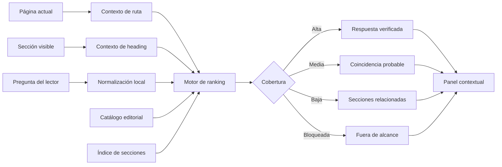

# Ask the Handbook · Sprint 2 — Integración contextual en todo el sitio

## Estado

- **Iniciativa:** Ask the Handbook
- **Sprint:** 2
- **Estado inicial:** propuesto para implementación
- **Dependencia:** Sprint 1 fusionado en `main`
- **Objetivo económico:** costo operativo incremental esperado de USD 0
- **Modelo de ejecución:** navegador del lector sobre MkDocs y GitHub Pages
- **Fecha de inicio:** 2026-07-18

## 1. Propósito

Extender el MVP aislado de **Pregúntale al Handbook** para que pueda utilizarse desde cualquier capítulo o demo sin abandonar la página que el lector está consultando.

El Sprint 2 no cambia la naturaleza del producto. Continúa siendo un:

> **Asistente contextual de conocimiento con recuperación local y respuestas editoriales verificadas.**

No se convertirá en chatbot generativo, no utilizará modelos de lenguaje y no enviará la pregunta del lector a servicios externos.

El avance funcional consiste en añadir contexto editorial y de navegación:

1. reconocer la página actual;
2. reconocer, cuando sea posible, la sección visible;
3. sugerir preguntas pertinentes al contenido consultado;
4. incorporar el contexto al ranking local;
5. abrir una respuesta dentro de un panel accesible;
6. permitir regresar al contenido sin perder la posición de lectura;
7. medir uso agregado sin registrar el texto de las preguntas.

## 2. Línea base recibida del Sprint 1

Sprint 1 dejó disponible:

- una página aislada de demostración;
- un catálogo editorial con preguntas, variantes, conceptos, respuestas y fuentes;
- un índice estático de secciones;
- un motor JavaScript local;
- etiquetas de cobertura:
  - `Respuesta verificada`;
  - `Coincidencia probable`;
  - `Cobertura insuficiente`;
  - `Fuera de alcance`;
- estilos responsive;
- pruebas Python y JavaScript;
- integración con el build estricto de MkDocs.

Sprint 2 debe reutilizar estos artefactos. No se debe crear un segundo catálogo, un segundo motor ni una experiencia paralela.

## 3. Restricciones no negociables

El Sprint 2 conservará las siguientes restricciones:

- sin OpenAI, Anthropic, Gemini u otras APIs de modelos;
- sin consumo de tokens;
- sin embeddings externos;
- sin base vectorial;
- sin backend;
- sin autenticación;
- sin persistencia de conversaciones;
- sin carga de archivos;
- sin búsquedas abiertas en Internet;
- sin recomendaciones regulatorias particulares;
- sin cálculo de reservas con datos del lector;
- sin transmisión del texto libre de la pregunta a Google Analytics;
- sin degradar el funcionamiento normal del sitio cuando el asistente falle.

La carga de archivos JSON locales desde el mismo dominio se considera parte del sitio estático, no una dependencia externa.

## 4. Experiencia de usuario objetivo

### 4.1 Punto de entrada global

Cada página elegible mostrará un botón flotante:

> **Pregúntale al Handbook**

El botón debe:

- permanecer visible sin cubrir contenido sustantivo;
- funcionar en escritorio y móvil;
- mostrar foco perceptible;
- tener nombre accesible;
- poder activarse con teclado;
- ocultarse cuando los recursos del asistente no puedan cargarse.

La página aislada de Sprint 1 se mantiene como experiencia de respaldo y espacio de demostración completa.

### 4.2 Apertura contextual

Al abrir el panel desde un capítulo, se mostrará:

1. título de la página actual;
2. sección visible, cuando pueda determinarse;
3. entre tres y cinco preguntas sugeridas;
4. campo para una pregunta libre;
5. nota transparente indicando que no se utiliza IA generativa.

Ejemplo:

```text
Estás consultando:
Demo 4 · Preparación de datos para reserving
Sección:
Deduplicación

Preguntas sugeridas:
- ¿Por qué es necesario deduplicar los movimientos?
- ¿Cómo sé si dos filas repetidas son realmente duplicados?
- ¿Por qué archivo_fuente no debe formar parte de la llave económica?
```

### 4.3 Respuesta dentro del panel

Una respuesta verificada mostrará:

- respuesta directa;
- relevancia actuarial;
- ejemplo aplicado;
- advertencia o excepción;
- fuentes exactas;
- preguntas relacionadas;
- etiqueta cualitativa de cobertura.

Al seguir una fuente:

- se abrirá la sección exacta;
- el panel se cerrará o minimizará;
- el navegador conservará navegación normal y accesible.

### 4.4 Cierre y retorno

El lector podrá cerrar el panel mediante:

- botón visible;
- tecla `Escape`;
- navegación por teclado;
- acción sobre el fondo, solamente si no interfiere con accesibilidad.

Al cerrar el panel, el foco regresará al control que lo abrió.

## 5. Arquitectura funcional



La solución seguirá siendo estática:

```text
MkDocs + GitHub Pages
├── handbook-qa-catalog.json
├── handbook-section-index.json
├── handbook-qa.js
├── handbook-qa.css
├── ask-the-handbook.md
└── integración contextual global
```

## 6. Modelo de contexto

### 6.1 Contexto de página

La ruta actual se normalizará eliminando:

- dominio;
- parámetros;
- fragmento;
- barras redundantes;
- `index.html`;
- diferencias entre ruta con y sin barra final.

Ejemplo:

```text
https://actuaria.javierforero.co/examples/04-demo-preparacion-datos/?x=1#deduplicacion
```

se normaliza a:

```text
/examples/04-demo-preparacion-datos/
```

### 6.2 Contexto de sección

La sección activa puede aproximarse mediante:

1. elemento objetivo del fragmento URL;
2. heading visible más cercano al inicio del viewport;
3. heading contenido en la tabla de contenidos activa;
4. ausencia explícita de sección cuando no exista evidencia suficiente.

No se inferirá una sección a partir de texto no visible o de coincidencias débiles.

### 6.3 Metadatos contextuales del catálogo

Cada pregunta podrá añadir:

```json
{
  "contexts": {
    "paths": [
      "/examples/04-demo-preparacion-datos/"
    ],
    "anchors": [
      "deduplicacion",
      "identificador-del-movimiento-economico"
    ],
    "parts": [
      "examples"
    ],
    "tags": [
      "calidad-de-datos",
      "deduplicacion"
    ]
  }
}
```

Los campos contextuales son señales de ranking; no sustituyen las fuentes de la respuesta.

## 7. Ranking contextual

El puntaje de Sprint 2 será:

\[
S(q,d,c)
=
0.30S_{\text{términos}}
+
0.20S_{\text{sinónimos}}
+
0.20S_{\text{pregunta}}
+
0.20S_{\text{página}}
+
0.10S_{\text{sección}}.
\]

Donde:

- \(q\): consulta;
- \(d\): respuesta candidata;
- \(c\): contexto de navegación;
- \(S_{\text{términos}}\): coincidencia con conceptos;
- \(S_{\text{sinónimos}}\): expansión editorial;
- \(S_{\text{pregunta}}\): similitud con pregunta canónica y variantes;
- \(S_{\text{página}}\): relación entre ruta actual y contextos de la respuesta;
- \(S_{\text{sección}}\): relación entre heading activo y anchors o tags.

### 7.1 Puntaje de página

Configuración inicial:

| Relación contextual | Puntaje |
|---|---:|
| Ruta exacta | 1.00 |
| Misma página canónica con variante de URL | 1.00 |
| Mismo capítulo o demo relacionado | 0.80 |
| Misma parte temática | 0.55 |
| Coincidencia únicamente por tag | 0.35 |
| Sin relación | 0.00 |

### 7.2 Puntaje de sección

| Relación contextual | Puntaje |
|---|---:|
| Anchor exacto | 1.00 |
| Heading normalizado equivalente | 0.90 |
| Tag editorial directamente relacionado | 0.60 |
| Relación general con la página | 0.30 |
| Sin evidencia | 0.00 |

### 7.3 Regla de seguridad

El contexto puede elevar una respuesta pertinente, pero no debe convertir por sí solo una consulta ambigua en una respuesta verificada.

Se requiere evidencia léxica o equivalencia editorial mínima. En particular:

\[
S_{\text{términos}} + S_{\text{sinónimos}} + S_{\text{pregunta}} > 0
\]

para mostrar una respuesta completa originada por texto libre.

Las preguntas sugeridas, al ser seleccionadas por identificador, pueden abrir directamente su respuesta editorial.

## 8. Preguntas sugeridas

### 8.1 Selección

Las sugerencias se elegirán por:

1. coincidencia exacta con ruta y anchor;
2. coincidencia con la ruta;
3. coincidencia con la parte temática;
4. prioridad editorial;
5. diversidad de conceptos.

### 8.2 Reglas

- máximo cinco sugerencias;
- mínimo tres cuando exista cobertura;
- sin duplicar preguntas relacionadas;
- no mostrar preguntas fuera de alcance;
- no presentar como sugerencia una respuesta sin fuente válida;
- priorizar contenido de la página antes que contenido general;
- conservar al menos una sugerencia introductoria en páginas complejas.

### 8.3 Páginas piloto

La primera integración se validará en:

1. Demo 4 · Preparación de datos;
2. Triángulos incrementales vs. acumulados;
3. Factores edad-a-edad;
4. Chain Ladder;
5. Bornhuetter-Ferguson;
6. Benktander;
7. Demo 3 · Triángulos mensuales;
8. un capítulo de gobierno;
9. un capítulo de Colombia.

Estas páginas cubren datos, fundamentos, métodos, demos, gobierno y contexto jurisdiccional.

## 9. Integración con MkDocs

### 9.1 Estrategia

La integración debe utilizar el motor existente y crear progresivamente el DOM necesario.

Opciones aceptables:

- insertar un partial desde `overrides/main.html`;
- crear el botón y panel desde `handbook-qa.js`.

La opción preferida es un partial semántico con comportamiento controlado por JavaScript, porque:

- el HTML base queda auditable;
- la accesibilidad no depende enteramente de construcción dinámica;
- la estructura visual puede probarse de forma aislada;
- el motor continúa separado de la presentación.

### 9.2 Degradación segura

Cuando ocurra cualquier error al cargar catálogo, índice o motor:

- el contenido del handbook debe seguir disponible;
- el botón global debe ocultarse;
- no debe aparecer un panel vacío;
- no deben generarse errores repetitivos;
- la búsqueda nativa de MkDocs debe continuar funcionando;
- la página aislada puede mostrar un mensaje de indisponibilidad.

## 10. Accesibilidad

El panel se comportará como diálogo:

- `role="dialog"`;
- `aria-modal="true"`;
- título asociado con `aria-labelledby`;
- descripción asociada con `aria-describedby`;
- foco inicial en el campo de pregunta o primera sugerencia;
- ciclo de foco dentro del diálogo;
- cierre con `Escape`;
- retorno de foco al botón de apertura;
- orden DOM lógico;
- mensajes de resultado anunciados mediante región viva;
- ausencia de información dependiente únicamente del color;
- tamaño táctil suficiente;
- compatibilidad con zoom;
- bloqueo controlado del scroll de fondo.

El panel debe respetar `prefers-reduced-motion`.

## 11. Analítica sin registrar preguntas

El sitio ya cuenta con una capa de analítica. Sprint 2 podrá emitir eventos únicamente cuando `gtag` esté disponible.

### 11.1 Eventos permitidos

- `handbook_qa_open`;
- `handbook_qa_suggestion_selected`;
- `handbook_qa_search_submitted`;
- `handbook_qa_result`;
- `handbook_qa_source_opened`;
- `handbook_qa_closed`;
- `handbook_qa_unresolved_report`.

### 11.2 Parámetros permitidos

- ruta de la página;
- anchor normalizado;
- identificador de respuesta;
- clase de cobertura;
- posición de sugerencia;
- tipo de interacción;
- idioma;
- versión del catálogo.

### 11.3 Datos prohibidos

No se enviarán:

- texto de la pregunta;
- nombres;
- correos;
- identificadores personales;
- fragmentos de archivos;
- resultados particulares;
- contenido escrito por el lector;
- hash reversible o representación equivalente de la pregunta.

El funcionamiento del asistente no dependerá de Analytics.

## 12. Retroalimentación sin backend

Para reportar una pregunta no resuelta se utilizará un enlace a un formulario o issue preconfigurado.

El reporte automático podrá incluir:

- ruta;
- sección;
- clase de cobertura;
- identificador de respuesta candidata;
- versión del catálogo.

El texto de la pregunta no se incluirá automáticamente. El lector decidirá si desea copiarlo manualmente.

El MVP no promete soporte, respuesta individual ni almacenamiento privado.

## 13. Archivos previstos

### 13.1 Archivo nuevo

```text
planning/09-sprint2-ask-handbook-contextual.md
overrides/partials/handbook-qa-panel.html
tests/test_handbook_qa_context.py
tests/js/test_handbook_qa_context.js
```

### 13.2 Archivos por modificar

```text
overrides/main.html
docs/assets/data/handbook-qa-catalog.json
docs/assets/data/handbook-section-index.json
docs/assets/javascripts/handbook-qa.js
docs/assets/stylesheets/handbook-qa.css
docs/ask-the-handbook.md
mkdocs.yml
```

`mkdocs.yml` solo deberá modificarse si la integración requiere declarar un recurso adicional o ajustar navegación. No se duplicarán entradas de JavaScript o CSS ya existentes.

## 14. Estrategia de implementación

### Entrega 2.1 — Contexto y sugerencias

- normalización de rutas;
- detección de heading;
- metadatos contextuales;
- selección de sugerencias;
- pruebas unitarias del ranking;
- sin botón global todavía.

### Entrega 2.2 — Panel global

- partial accesible;
- botón flotante;
- apertura y cierre;
- gestión de foco;
- vista responsive;
- carga tolerante a fallos.

### Entrega 2.3 — Navegación, analítica y feedback

- fuentes exactas;
- preguntas relacionadas;
- eventos sin texto libre;
- reporte de cobertura insuficiente;
- pruebas de privacidad.

### Entrega 2.4 — Validación y despliegue

- pruebas automáticas;
- auditoría documental;
- preflight;
- build estricto;
- prueba manual;
- revisión en GitHub Pages;
- decisión de cierre.

## 15. Pruebas automáticas

### 15.1 Catálogo e índice

- todos los `contexts.paths` corresponden a rutas válidas;
- todos los anchors declarados existen;
- identificadores únicos;
- preguntas relacionadas válidas;
- fuentes válidas;
- catálogo con versión;
- ninguna respuesta fuera de alcance aparece como sugerencia.

### 15.2 Motor contextual

- normalización de rutas;
- equivalencia con y sin barra final;
- eliminación de `index.html`;
- eliminación de query string y fragmento;
- selección por ruta exacta;
- selección por anchor;
- diversidad de sugerencias;
- ausencia de duplicados;
- el contexto no vence una consulta contradictoria;
- las preguntas seleccionadas por ID abren la respuesta correcta;
- las consultas adversariales permanecen bloqueadas.

### 15.3 Interfaz

- apertura con clic;
- apertura con teclado;
- cierre con `Escape`;
- retorno de foco;
- ciclo de foco;
- región viva;
- comportamiento móvil;
- modo claro y oscuro;
- `prefers-reduced-motion`;
- ocultamiento seguro ante error de carga.

### 15.4 Privacidad

Las pruebas deben verificar que:

- ninguna llamada de analítica contiene `query`, `question`, `text` o el texto libre;
- no existe almacenamiento en `localStorage`, `sessionStorage`, IndexedDB o cookies propias;
- no se realizan solicitudes a dominios de IA;
- el reporte de pregunta no resuelta no incluye el texto libre automáticamente.

### 15.5 Regresión

Se conservarán:

- las 15 preguntas de referencia;
- las consultas adversariales;
- los umbrales calibrados;
- la página aislada;
- la búsqueda nativa;
- todos los tests de Sprint 1.

## 16. Validación obligatoria

Antes de marcar el PR como listo:

```bash
python -m unittest discover -s tests -p "test_*.py"
node tests/js/test_handbook_qa_engine.js
node tests/js/test_handbook_qa_context.js
python scripts/audit_docs.py
python scripts/preflight_release.py
python -m mkdocs build --strict
git diff --check
```

También debe realizarse una prueba manual con:

```bash
python -m mkdocs serve
```

## 17. Casos de aceptación

### Caso A — Deduplicación contextual

**Página:** Demo 4  
**Sección:** Deduplicación

Resultado esperado:

- las tres primeras sugerencias se relacionan con duplicados o llave económica;
- la pregunta canónica abre una respuesta verificada;
- las fuentes apuntan a Demo 4;
- no se envía texto libre a Analytics.

### Caso B — Método Chain Ladder

**Página:** Método Chain Ladder

Resultado esperado:

- sugerencias sobre supuestos, confiabilidad y triángulos acumulados;
- una pregunta sobre prior independiente no domina el primer lugar salvo que el lector la escriba;
- una pregunta regulatoria particular se bloquea.

### Caso C — Bornhuetter-Ferguson

**Página:** Bornhuetter-Ferguson  
**Sección:** Construcción del prior

Resultado esperado:

- sugerencia prioritaria sobre independencia del prior;
- respuesta con advertencia sobre circularidad;
- enlace a la sección exacta.

### Caso D — Página sin cobertura

**Página:** capítulo sin preguntas contextuales suficientes

Resultado esperado:

- mostrar preguntas generales pertinentes o enlace a la página aislada;
- no inventar sugerencias específicas;
- permitir pregunta libre;
- abstenerse cuando no haya evidencia.

### Caso E — Falla de datos

**Condición:** catálogo no disponible

Resultado esperado:

- contenido del handbook intacto;
- botón oculto;
- sin errores repetitivos;
- búsqueda nativa funcional.

## 18. Criterios de aceptación

Sprint 2 se considera aprobado cuando:

- el asistente puede abrirse desde las páginas piloto;
- cada página piloto muestra sugerencias pertinentes;
- el contexto mejora el orden sin reducir la abstención;
- el panel cumple navegación por teclado;
- las fuentes abren anchors válidos;
- no se registra el texto de las preguntas;
- no existen llamadas a APIs de IA;
- el sitio sigue funcionando cuando el asistente falla;
- los tests de Sprint 1 continúan pasando;
- `audit_docs.py` termina correctamente;
- `preflight_release.py` termina correctamente;
- `mkdocs build --strict` termina correctamente;
- GitHub Actions termina en verde;
- la prueba pública en GitHub Pages es satisfactoria.

## 19. Métricas de evaluación

Sin almacenar preguntas, Sprint 2 podrá observar:

- aperturas del panel;
- porcentaje de aperturas con selección de sugerencia;
- porcentaje de preguntas libres;
- distribución de clases de cobertura;
- clics en fuentes;
- cierres sin interacción;
- reportes de cobertura insuficiente;
- páginas con mayor uso.

Estas métricas son señales de producto, no medidas automáticas de exactitud actuarial.

La exactitud se evaluará mediante el conjunto de pruebas editoriales y revisión humana.

## 20. Riesgos y controles

| Riesgo | Orden | Control |
|---|---|---|
| Sugerencias irrelevantes | Primero | Contextos explícitos y pruebas por página |
| Contexto que sobreescribe la consulta | Primero | Evidencia textual mínima obligatoria |
| Panel intrusivo | Primero | Diseño compacto, cierre claro y responsive |
| Pérdida de accesibilidad | Primero | Diálogo semántico, gestión de foco y pruebas |
| Registro accidental de preguntas | Primero | Lista cerrada de parámetros y pruebas de privacidad |
| Enlaces rotos | Primero | Validación de rutas y anchors |
| Fallo que afecta el sitio | Primero | Degradación segura y aislamiento |
| Catálogo difícil de mantener | Segundo | Contextos declarativos y revisión editorial |
| Crecimiento del JavaScript | Segundo | Presupuesto de tamaño y funciones puras |
| Confusión con chatbot | Segundo | Mensaje visible de no IA generativa |

## 21. Mejor contraargumento

Un botón global puede distraer del contenido y hacer que el lector dependa de respuestas breves en lugar de leer el capítulo.

Este riesgo es real. Por ello:

- las respuestas no reemplazan las fuentes;
- cada explicación enlaza al contenido;
- las sugerencias se limitan;
- el panel no se abre automáticamente;
- la página conserva su jerarquía;
- el producto se evalúa también por clics hacia fuentes, no solo por respuestas abiertas.

La alternativa superior no es eliminar el asistente, sino diseñarlo como una capa de navegación explicativa que devuelva al lector al handbook.

## 22. Fuera de alcance

Sprint 2 no incluirá:

- respuestas generadas;
- conversación de múltiples turnos;
- memoria de usuario;
- perfil personal;
- login;
- documentos cargados;
- cálculo actuarial interactivo;
- consulta de normativa vigente;
- búsqueda web;
- respuesta por correo;
- dashboard avanzado;
- expansión masiva del catálogo.

La ampliación editorial del catálogo se limitará a lo necesario para las páginas piloto y las pruebas contextuales.

## 23. Rollback

La integración global debe poder desactivarse mediante una modificación pequeña y reversible:

1. retirar el partial o punto de montaje;
2. conservar la página aislada;
3. conservar catálogo, índice y pruebas;
4. reconstruir MkDocs.

No se eliminarán los artefactos de Sprint 1 durante un rollback de Sprint 2.

## 24. Definición de terminado

- [ ] Rama creada desde `main` actualizado.
- [ ] Documento de Sprint 2 incorporado.
- [ ] Contexto de ruta implementado.
- [ ] Contexto de heading implementado.
- [ ] Metadatos contextuales incorporados.
- [ ] Sugerencias por página implementadas.
- [ ] Panel global accesible implementado.
- [ ] Gestión de foco verificada.
- [ ] Navegación a fuentes verificada.
- [ ] Analítica sin texto libre verificada.
- [ ] Reporte de cobertura insuficiente implementado.
- [ ] Degradación segura probada.
- [ ] Tests Python aprobados.
- [ ] Tests JavaScript aprobados.
- [ ] Auditoría documental aprobada.
- [ ] Preflight aprobado.
- [ ] Build estricto aprobado.
- [ ] Prueba móvil aprobada.
- [ ] Prueba de modo oscuro aprobada.
- [ ] Prueba pública aprobada.
- [ ] PR revisado y fusionado.

## 25. Referencias internas comentadas

- `planning/07-sprint0-ask-handbook-zero-cost.md`: fija la arquitectura sin costo, el contrato editorial, los umbrales y los principios de abstención.
- `planning/08-sprint1-ask-handbook-zero-cost.md`: documenta la construcción del catálogo, el índice, el motor local, la página aislada y las pruebas base.
- `docs/ask-the-handbook.md`: experiencia pública de respaldo y explicación transparente del MVP.
- `docs/assets/data/handbook-qa-catalog.json`: fuente canónica de respuestas editoriales.
- `docs/assets/data/handbook-section-index.json`: inventario navegable de secciones y anchors.
- `docs/assets/javascripts/handbook-qa.js`: motor que Sprint 2 debe ampliar, no duplicar.
- `docs/assets/stylesheets/handbook-qa.css`: sistema visual que debe extenderse para el panel global.
- `tests/test_handbook_qa.py`: controles estructurales que deben preservarse.
- `tests/js/test_handbook_qa_engine.js`: regresión del motor local que debe continuar pasando.

## 26. Checklist práctico de inicio

Antes de escribir código:

- [ ] confirmar que el merge de Sprint 1 está en `main`;
- [ ] actualizar el repositorio local con `git pull --ff-only`;
- [ ] crear `feature/ask-handbook-sprint2-contextual`;
- [ ] ejecutar todas las pruebas de Sprint 1 como línea base;
- [ ] revisar visualmente la página aislada;
- [ ] inventariar rutas y anchors de las páginas piloto;
- [ ] decidir el mecanismo exacto de partial;
- [ ] fijar el contrato de eventos de Analytics;
- [ ] confirmar que el texto libre nunca saldrá del navegador;
- [ ] implementar primero funciones puras de contexto antes del panel global.
