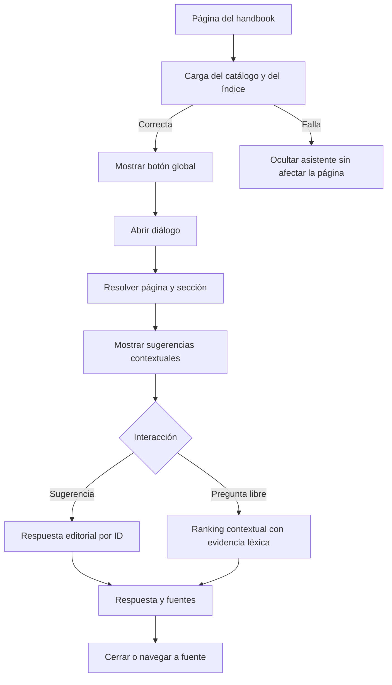

# Ask the Handbook · Sprint 2 — Entrega 2.2: panel global accesible

## Estado

- **Iniciativa:** Ask the Handbook
- **Sprint:** 2
- **Entrega:** 2.2
- **Dependencia:** Entrega 2.1 incorporada en la rama
- **PR de trabajo:** #20
- **Costo operativo incremental esperado:** USD 0
- **Fecha:** 2026-07-18

## 1. Objetivo

Habilitar el motor contextual desde cualquier página del handbook mediante un botón flotante y un diálogo accesible, sin duplicar el catálogo, sin alterar la lógica de abstención y sin enviar consultas a servicios externos.

La entrega integra la capa de presentación global. No incorpora todavía analítica ni mecanismo de feedback; esos componentes corresponden a la Entrega 2.3.

## 2. Componentes

```text
overrides/partials/handbook-qa-panel.html
    ↓
overrides/main.html
    ↓
docs/assets/javascripts/handbook-qa.js
    ↓
catálogo + índice estático del Sprint 2.1
```

El partial contiene HTML semántico auditable. El JavaScript administra carga local, contexto, apertura, cierre, foco y renderizado. El CSS mantiene compatibilidad con la identidad del sitio, modos claro y oscuro y pantallas móviles.

## 3. Flujo funcional



## 4. Accesibilidad

El diálogo implementa:

- `role="dialog"`;
- `aria-modal="true"`;
- título y descripción asociados;
- apertura mediante botón estándar;
- foco inicial en el campo de consulta;
- confinamiento del foco;
- cierre con `Escape`;
- botón de cierre con nombre accesible;
- retorno del foco al activador;
- región viva para resultados;
- contenido comprensible sin depender del color;
- respeto por `prefers-reduced-motion`;
- tamaños táctiles apropiados.

## 5. Privacidad y seguridad

La implementación:

- carga únicamente JSON del mismo sitio;
- no usa APIs de IA;
- no registra consultas;
- no utiliza almacenamiento local, cookies propias ni IndexedDB;
- no altera los umbrales de cobertura;
- conserva la condición de evidencia léxica mínima para preguntas libres;
- abre sugerencias por identificador editorial canónico.

## 6. Navegación instantánea

La inicialización se conecta al ciclo `document$` de Material for MkDocs. Cada contenedor queda marcado con `data-global-initialized` para impedir listeners duplicados.

El contexto se recalcula al abrir el panel, no solamente al cargar la página. Esto permite incorporar el heading visible después de desplazamientos o navegación instantánea.

## 7. Degradación segura

Ante una falla del catálogo o del índice:

- el botón permanece oculto;
- el diálogo permanece cerrado;
- se elimina cualquier bloqueo de scroll;
- el contenido del handbook continúa disponible;
- se emite una sola advertencia diagnóstica en consola;
- la búsqueda nativa no se modifica.

## 8. Responsive

En escritorio el panel funciona como drawer lateral. En móvil se presenta como hoja inferior con altura máxima del 92 % del viewport dinámico.

Se consideran:

- `safe-area-inset-*`;
- viewport dinámico `dvh`;
- overscroll contenido;
- ancho total en pantallas estrechas;
- restauración del scroll al cerrar.

## 9. Archivos

### Nuevos

```text
overrides/partials/handbook-qa-panel.html
planning/11-sprint2-delivery-2-2-global-panel.md
tests/js/test_handbook_qa_panel.js
tests/test_handbook_qa_panel.py
```

### Modificados

```text
overrides/main.html
docs/assets/javascripts/handbook-qa.js
docs/assets/stylesheets/handbook-qa.css
```

## 10. Pruebas

Las pruebas cubren:

- inclusión única del partial;
- contrato ARIA;
- controles de apertura y cierre;
- región viva;
- bloqueo y restauración del scroll;
- idempotencia;
- ocultamiento en la página aislada;
- funciones puras de ciclo de foco;
- estilos móviles y modo oscuro;
- `prefers-reduced-motion`;
- ausencia de almacenamiento o endpoints de IA;
- preservación de la regresión de Sprint 1 y Sprint 2.1.

## 11. Validación obligatoria

```bash
rm -rf site
python -m unittest discover -s tests -p "test_*.py"
node tests/js/test_handbook_qa_engine.js
node tests/js/test_handbook_qa_context.js
node tests/js/test_handbook_qa_panel.js
node --check docs/assets/javascripts/handbook-qa.js
python scripts/audit_docs.py
python scripts/preflight_release.py
python -m mkdocs build --strict
rm -rf site
git diff --check
```

## 12. Casos de aceptación

### Caso A — Demo 4

- el botón aparece;
- el diálogo identifica página y sección;
- las primeras sugerencias se relacionan con deduplicación;
- la selección abre una respuesta verificada;
- los enlaces apuntan a fuentes internas.

### Caso B — Chain Ladder

- las sugerencias priorizan confiabilidad y elegibilidad;
- una pregunta regulatoria particular se clasifica fuera de alcance;
- el contexto no reemplaza la evidencia textual.

### Caso C — Página aislada

En `/ask-the-handbook/` no aparece el botón global, evitando dos interfaces simultáneas.

### Caso D — Falla de carga

El botón no aparece y el sitio sigue operando sin bloqueo de scroll.

### Caso E — Teclado

- `Enter` abre mediante el botón;
- `Tab` permanece dentro del diálogo;
- `Shift+Tab` cicla en sentido inverso;
- `Escape` cierra;
- el foco vuelve al botón.

## 13. Riesgos y controles

| Riesgo | Control |
|---|---|
| Panel intrusivo | No se abre automáticamente y tiene cierre visible |
| Listeners duplicados | Inicialización idempotente por atributo de datos |
| Pérdida de scroll | Clase de `body` retirada en todas las rutas de cierre y error |
| Doble experiencia | Botón oculto en la página aislada |
| Contexto obsoleto | Resolución del contexto en cada apertura |
| Dependencia de red | Únicamente archivos estáticos del mismo dominio |
| Respuesta engañosa | Se mantienen abstención y evidencia léxica |

## 14. Fuera de alcance

- analítica de uso;
- reporte de preguntas no resueltas;
- persistencia de estado;
- conversación multivuelta;
- carga de documentos;
- IA generativa;
- búsquedas web;
- cálculos actuariales particulares.

## 15. Bibliografía y referencias internas comentadas

- `planning/09-sprint2-ask-handbook-contextual.md`: especificación integral del Sprint 2 y sus restricciones.
- `planning/10-sprint2-delivery-2-1-context-suggestions.md`: contrato del motor contextual utilizado por el panel.
- `docs/ask-the-handbook.md`: experiencia aislada que permanece como respaldo y demostración completa.
- WAI-ARIA Authoring Practices, patrón de diálogo modal: referencia conceptual para gestión de foco, nombres accesibles y cierre por teclado.
- Material for MkDocs, navegación instantánea: referencia para reinicialización mediante `document$`.

## 16. Checklist práctico

- [ ] Partial incorporado una sola vez.
- [ ] Botón oculto hasta cargar recursos.
- [ ] Botón oculto en la página aislada.
- [ ] Contexto actualizado al abrir.
- [ ] Sugerencias contextuales visibles.
- [ ] Pregunta libre funcional.
- [ ] Cierre con botón, backdrop y `Escape`.
- [ ] Confinamiento del foco probado.
- [ ] Retorno del foco probado.
- [ ] Scroll restaurado.
- [ ] Móvil probado.
- [ ] Modo oscuro probado.
- [ ] Navegación instantánea probada.
- [ ] Fallo de carga probado.
- [ ] Tests Python aprobados.
- [ ] Tests JavaScript aprobados.
- [ ] Auditoría aprobada.
- [ ] Preflight aprobado.
- [ ] Build estricto aprobado.
- [ ] PR #20 continúa como draft hasta completar la validación manual.
